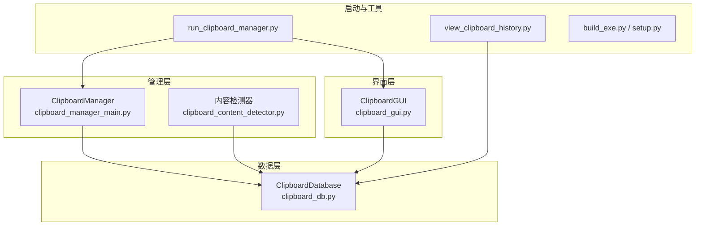
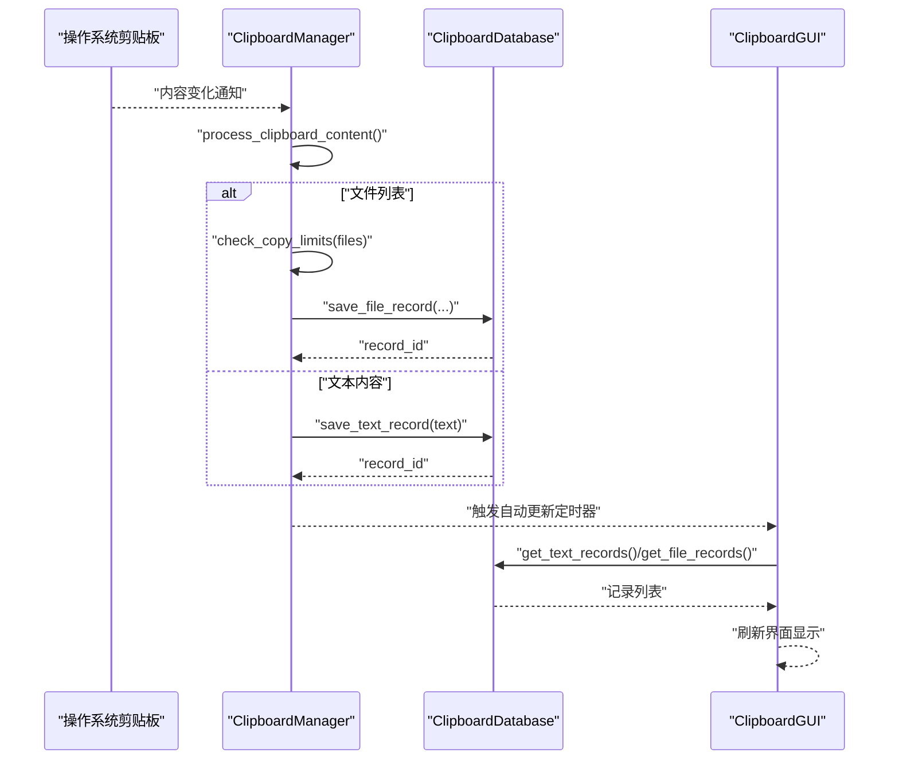
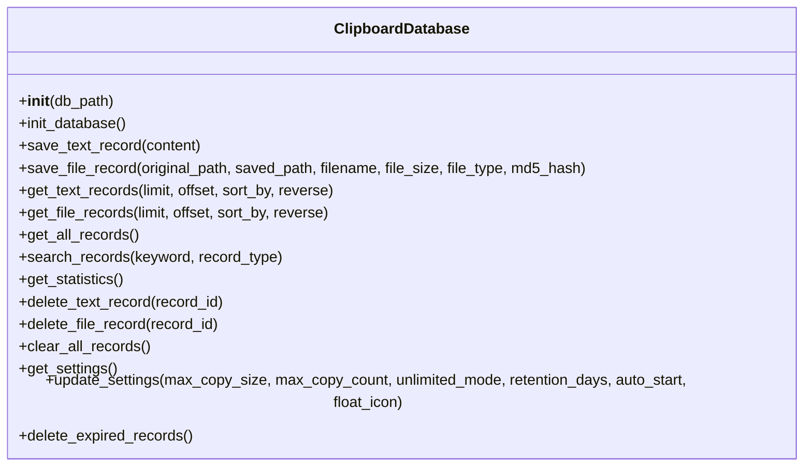
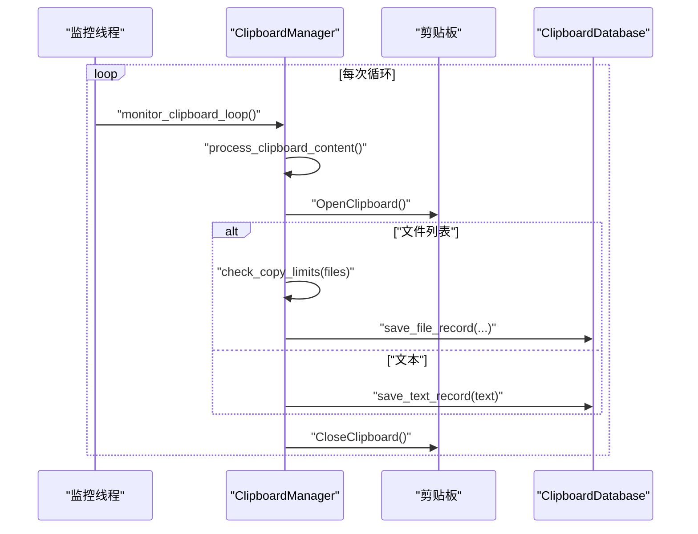
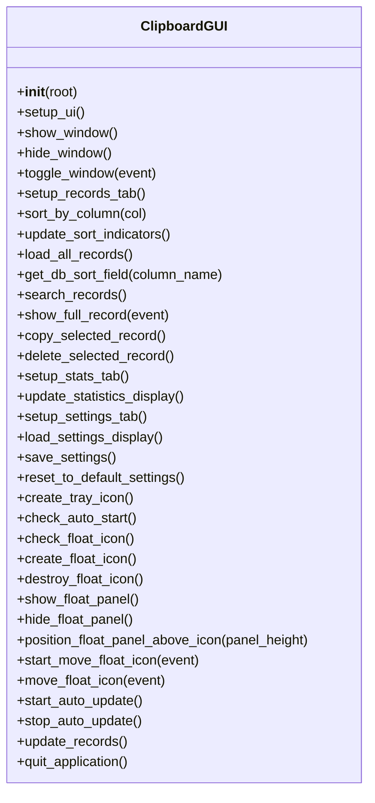
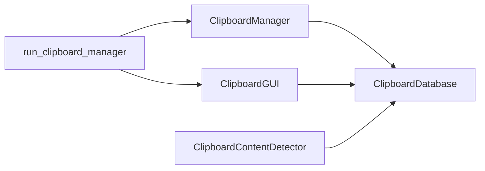

# API参考

<cite>
**本文档引用的文件**
- [clipboard_db.py](file://clipboard_db.py)
- [clipboard_manager_main.py](file://clipboard_manager_main.py)
- [clipboard_gui.py](file://clipboard_gui.py)
- [clipboard_content_detector.py](file://clipboard_content_detector.py)
- [run_clipboard_manager.py](file://run_clipboard_manager.py)
- [view_clipboard_history.py](file://view_clipboard_history.py)
- [build_exe.py](file://build_exe.py)
- [setup.py](file://setup.py)
</cite>

## 目录
1. [简介](#简介)
2. [项目结构](#项目结构)
3. [核心组件](#核心组件)
4. [架构总览](#架构总览)
5. [详细组件分析](#详细组件分析)
6. [依赖关系分析](#依赖关系分析)
7. [性能考量](#性能考量)
8. [故障排查指南](#故障排查指南)
9. [结论](#结论)
10. [附录](#附录)

## 简介
本文件为“剪贴板历史管理器”的完整API参考，覆盖数据库、管理器、GUI与内容检测等模块的公共接口，重点说明：
- ClipboardDatabase类：数据库初始化、文本/文件记录保存、查询、统计、设置与清理等方法
- ClipboardManager类：剪贴板监控、复制限制检查、内容处理等方法
- ClipboardGUI类：界面创建、窗口控制、记录展示、设置与悬浮图标等方法
- 事件与回调：剪贴板变化触发、GUI自动更新、悬浮面板交互等
- 线程安全与最佳实践：并发访问、异常处理、资源释放等

## 项目结构
项目采用模块化设计，核心模块如下：
- 数据层：clipboard_db.py（SQLite数据库封装）
- 管理层：clipboard_manager_main.py（剪贴板监控与处理）
- 界面层：clipboard_gui.py（GUI界面与悬浮图标）
- 工具与检测：clipboard_content_detector.py（剪贴板内容检测）
- 启动与打包：run_clipboard_manager.py、build_exe.py、setup.py
- 示例与查看：view_clipboard_history.py

图表来源
- [clipboard_db.py](file://clipboard_db.py#L1-L120)
- [clipboard_manager_main.py](file://clipboard_manager_main.py#L355-L761)
- [clipboard_gui.py](file://clipboard_gui.py#L1-L120)
- [clipboard_content_detector.py](file://clipboard_content_detector.py#L1-L120)
- [run_clipboard_manager.py](file://run_clipboard_manager.py#L1-L71)
- [view_clipboard_history.py](file://view_clipboard_history.py#L1-L75)
- [build_exe.py](file://build_exe.py#L1-L81)
- [setup.py](file://setup.py#L1-L84)

章节来源
- [clipboard_db.py](file://clipboard_db.py#L1-L120)
- [clipboard_manager_main.py](file://clipboard_manager_main.py#L355-L761)
- [clipboard_gui.py](file://clipboard_gui.py#L1-L120)
- [clipboard_content_detector.py](file://clipboard_content_detector.py#L1-L120)
- [run_clipboard_manager.py](file://run_clipboard_manager.py#L1-L71)
- [view_clipboard_history.py](file://view_clipboard_history.py#L1-L75)
- [build_exe.py](file://build_exe.py#L1-L81)
- [setup.py](file://setup.py#L1-L84)

## 核心组件
本节概述三大核心类及其职责：
- ClipboardDatabase：负责数据库初始化、文本/文件记录的增删改查、统计、设置与过期清理
- ClipboardManager：负责剪贴板监控、复制限制检查、文本/文件内容处理与入库
- ClipboardGUI：负责界面创建、记录展示、设置管理、悬浮图标与自动更新

章节来源
- [clipboard_db.py](file://clipboard_db.py#L1-L120)
- [clipboard_manager_main.py](file://clipboard_manager_main.py#L355-L761)
- [clipboard_gui.py](file://clipboard_gui.py#L1-L120)

## 架构总览
系统通过ClipboardManager持续监控剪贴板，识别文本或文件内容，依据设置进行复制限制检查，然后调用ClipboardDatabase保存记录；ClipboardGUI负责展示与交互，支持悬浮面板、自动更新与设置管理。

图表来源
- [clipboard_manager_main.py](file://clipboard_manager_main.py#L395-L496)
- [clipboard_db.py](file://clipboard_db.py#L116-L183)
- [clipboard_gui.py](file://clipboard_gui.py#L1676-L1696)

## 详细组件分析

### ClipboardDatabase 类 API
- 初始化与数据库准备
  - __init__(db_path="clipboard_history.db")
    - 参数：db_path（数据库文件路径）
    - 行为：初始化数据库，创建text_records、file_records、settings表，添加必要字段与索引
    - 返回：无
    - 异常：数据库连接/DDL异常（由SQLite驱动抛出）
    - 章节来源
      - [clipboard_db.py](file://clipboard_db.py#L13-L17)
      - [clipboard_db.py](file://clipboard_db.py#L18-L115)

- 文本记录
  - save_text_record(content)
    - 参数：content（UTF-8编码的文本）
    - 行为：计算MD5，写入text_records；若MD5冲突则更新时间戳与计数number
    - 返回：新增或更新记录的id
    - 异常：完整性约束冲突（MD5唯一性）导致更新分支
    - 章节来源
      - [clipboard_db.py](file://clipboard_db.py#L116-L151)

  - get_text_records(limit=None, offset=0, sort_by="timestamp", reverse=True)
    - 参数：limit/offset（分页），sort_by（排序字段：content/char_count/number/timestamp），reverse（升/降序）
    - 行为：按排序与分页返回文本记录（id, content, timestamp, char_count, md5_hash, number）
    - 返回：记录元组列表
    - 异常：无显式捕获，SQL异常由调用方处理
    - 章节来源
      - [clipboard_db.py](file://clipboard_db.py#L185-L221)

- 文件记录
  - save_file_record(original_path, saved_path, filename, file_size, file_type, md5_hash)
    - 参数：原始路径、保存路径、文件名、大小、类型、MD5
    - 行为：写入file_records；若MD5冲突则更新时间戳与计数number
    - 返回：新增或更新记录的id
    - 异常：MD5唯一性冲突导致更新分支
    - 章节来源
      - [clipboard_db.py](file://clipboard_db.py#L152-L183)

  - get_file_records(limit=None, offset=0, sort_by="timestamp", reverse=True)
    - 参数：limit/offset（分页），sort_by（排序字段：filename/file_size/file_type/number/timestamp），reverse（升/降序）
    - 行为：按排序与分页返回文件记录（id, original_path, saved_path, filename, file_size, file_type, md5_hash, timestamp, number）
    - 返回：记录元组列表
    - 章节来源
      - [clipboard_db.py](file://clipboard_db.py#L223-L261)

- 综合查询
  - get_all_records()
    - 行为：UNION ALL返回文本与文件记录，按timestamp倒序
    - 返回：记录元组列表（type, id, info, timestamp）
    - 章节来源
      - [clipboard_db.py](file://clipboard_db.py#L263-L279)

  - search_records(keyword="", record_type="all")
    - 参数：keyword（模糊搜索），record_type（all/text/file）
    - 行为：按类型组合LIKE查询，按timestamp倒序
    - 返回：记录元组列表（type, id, info, timestamp）
    - 章节来源
      - [clipboard_db.py](file://clipboard_db.py#L281-L314)

- 统计与清理
  - get_statistics()
    - 行为：返回文本数量、文件数量与文件总大小
    - 返回：(text_count, file_count, total_size)
    - 章节来源
      - [clipboard_db.py](file://clipboard_db.py#L316-L332)

  - delete_text_record(record_id)
  - delete_file_record(record_id)
  - clear_all_records()
    - 行为：删除对应记录或清空表
    - 返回：无
    - 章节来源
      - [clipboard_db.py](file://clipboard_db.py#L334-L358)

  - delete_expired_records()
    - 行为：根据settings.retention_days删除过期记录，并删除磁盘上的文件
    - 返回：无
    - 异常：删除文件时可能抛出异常（打印日志）
    - 章节来源
      - [clipboard_db.py](file://clipboard_db.py#L413-L455)

- 设置管理
  - get_settings()
    - 行为：返回max_copy_size、max_copy_count、unlimited_mode、retention_days、auto_start、float_icon
    - 返回：字典
    - 章节来源
      - [clipboard_db.py](file://clipboard_db.py#L359-L385)

  - update_settings(max_copy_size=None, max_copy_count=None, unlimited_mode=None, retention_days=None, auto_start=None, float_icon=None)
    - 行为：按传入参数更新settings表对应字段
    - 返回：无
    - 章节来源
      - [clipboard_db.py](file://clipboard_db.py#L387-L412)

- 数据库内部方法
  - init_database()
    - 行为：创建/迁移表结构，添加字段与索引
    - 返回：无
    - 章节来源
      - [clipboard_db.py](file://clipboard_db.py#L18-L115)

类图（基于源码）

图表来源
- [clipboard_db.py](file://clipboard_db.py#L13-L455)

章节来源
- [clipboard_db.py](file://clipboard_db.py#L13-L455)

### ClipboardManager 类 API
- 初始化
  - __init__()
    - 行为：创建数据库实例，初始化基础保存目录
    - 返回：无
    - 章节来源
      - [clipboard_manager_main.py](file://clipboard_manager_main.py#L355-L361)

- 复制限制检查
  - check_copy_limits(files)
    - 参数：files（文件路径列表）
    - 行为：读取设置，判断是否无限模式；检查数量与总大小/单文件大小限制
    - 返回：(allowed: bool, message: str)
    - 章节来源
      - [clipboard_manager_main.py](file://clipboard_manager_main.py#L362-L394)

- 剪贴板内容处理
  - process_clipboard_content()
    - 行为：打开剪贴板，检测CF_HDROP或CF_UNICODETEXT；对文件：计算MD5、分类、去重保存、入库；对文本：大小限制检查、入库
    - 返回：无
    - 异常：访问剪贴板异常、文件读取/复制异常、数据库异常（内部捕获并打印）
    - 章节来源
      - [clipboard_manager_main.py](file://clipboard_manager_main.py#L395-L496)

- 监控循环
  - monitor_clipboard_loop(manager, interval=1)
    - 行为：循环调用process_clipboard_content，sleep间隔秒
    - 返回：无
    - 章节来源
      - [clipboard_manager_main.py](file://clipboard_manager_main.py#L717-L730)

- 主入口
  - main()
    - 行为：创建manager，启动监控线程，运行GUI（主窗口隐藏，托盘图标）
    - 返回：无
    - 章节来源
      - [clipboard_manager_main.py](file://clipboard_manager_main.py#L731-L761)

序列图（监控循环）

图表来源
- [clipboard_manager_main.py](file://clipboard_manager_main.py#L395-L496)
- [clipboard_manager_main.py](file://clipboard_manager_main.py#L717-L730)

章节来源
- [clipboard_manager_main.py](file://clipboard_manager_main.py#L355-L761)

### ClipboardGUI 类 API
- 初始化与界面
  - __init__(root)
    - 行为：创建主窗口、居中、构建UI、加载记录、检查开机自启与悬浮图标、启动自动更新、绑定协议与焦点事件、创建托盘图标（可选）
    - 返回：无
    - 章节来源
      - [clipboard_gui.py](file://clipboard_gui.py#L37-L110)
      - [clipboard_gui.py](file://clipboard_gui.py#L111-L171)

- 界面控制
  - setup_ui()
    - 行为：创建搜索区、笔记本（记录/统计/设置）、快捷键绑定、焦点设置
    - 返回：无
    - 章节来源
      - [clipboard_gui.py](file://clipboard_gui.py#L172-L226)

  - show_window()/hide_window()/toggle_window(event=None)
    - 行为：显示/隐藏主窗口，切换显示状态
    - 返回：无
    - 章节来源
      - [clipboard_gui.py](file://clipboard_gui.py#L1697-L1722)

- 记录展示与排序
  - setup_records_tab()
    - 行为：创建记录树视图、排序指示器、按钮、事件绑定
    - 返回：无
    - 章节来源
      - [clipboard_gui.py](file://clipboard_gui.py#L227-L279)

  - sort_by_column(col)/update_sort_indicators()
    - 行为：根据列点击切换排序方向，更新列标题指示器
    - 返回：无
    - 章节来源
      - [clipboard_gui.py](file://clipboard_gui.py#L280-L308)

  - load_all_records()/get_db_sort_field(column_name)
    - 行为：从数据库获取文本/文件记录，合并排序，显示到树视图
    - 返回：无
    - 章节来源
      - [clipboard_gui.py](file://clipboard_gui.py#L581-L637)

  - search_records()
    - 行为：按关键词搜索，排序并显示
    - 返回：无
    - 章节来源
      - [clipboard_gui.py](file://clipboard_gui.py#L652-L700)

  - show_full_record(event)
    - 行为：双击显示文本完整内容或打开文件所在位置
    - 返回：无
    - 章节来源
      - [clipboard_gui.py](file://clipboard_gui.py#L749-L795)

  - copy_selected_record()/delete_selected_record()
    - 行为：复制选中记录内容到剪贴板；删除选中记录（文件记录还会尝试删除磁盘文件）
    - 返回：无
    - 章节来源
      - [clipboard_gui.py](file://clipboard_gui.py#L800-L878)

- 统计与设置
  - setup_stats_tab()/update_statistics_display()
    - 行为：显示统计信息（文本/文件数量与总大小）
    - 返回：无
    - 章节来源
      - [clipboard_gui.py](file://clipboard_gui.py#L309-L341)
      - [clipboard_gui.py](file://clipboard_gui.py#L555-L580)

  - setup_settings_tab()/load_settings_display()/save_settings()/reset_to_default_settings()
    - 行为：构建设置界面，加载/保存/重置设置；支持开机自启与悬浮图标；保存后可触发过期清理
    - 返回：无
    - 章节来源
      - [clipboard_gui.py](file://clipboard_gui.py#L328-L462)
      - [clipboard_gui.py](file://clipboard_gui.py#L477-L530)
      - [clipboard_gui.py](file://clipboard_gui.py#L534-L554)

- 系统托盘与悬浮图标
  - create_tray_icon()/check_auto_start()
    - 行为：创建托盘图标（可选），根据设置启用开机自启
    - 返回：无
    - 章节来源
      - [clipboard_gui.py](file://clipboard_gui.py#L144-L171)
      - [clipboard_gui.py](file://clipboard_gui.py#L80-L97)

  - check_float_icon()/create_float_icon()/destroy_float_icon()
    - 行为：根据设置创建/销毁悬浮图标
    - 返回：无
    - 章节来源
      - [clipboard_gui.py](file://clipboard_gui.py#L80-L97)
      - [clipboard_gui.py](file://clipboard_gui.py#L1164-L1172)
      - [clipboard_gui.py](file://clipboard_gui.py#L1633-L1638)

- 悬浮面板交互
  - show_float_panel()/hide_float_panel()/position_float_panel_above_icon()
    - 行为：显示/隐藏最近记录悬浮面板，定位在悬浮图标上方
    - 返回：无
    - 章节来源
      - [clipboard_gui.py](file://clipboard_gui.py#L1254-L1379)
      - [clipboard_gui.py](file://clipboard_gui.py#L1522-L1558)
      - [clipboard_gui.py](file://clipboard_gui.py#L1559-L1626)

  - start_move_float_icon()/move_float_icon()
    - 行为：拖动悬浮图标，边界检查
    - 返回：无
    - 章节来源
      - [clipboard_gui.py](file://clipboard_gui.py#L1639-L1669)

- 自动更新
  - start_auto_update()/stop_auto_update()/update_records()
    - 行为：每2秒刷新一次记录（窗口可见、无用户操作、无焦点时）
    - 返回：无
    - 章节来源
      - [clipboard_gui.py](file://clipboard_gui.py#L1676-L1696)

- 退出与托盘
  - quit_application()/toggle_window()
    - 行为：停止自动更新、停止托盘、退出应用
    - 返回：无
    - 章节来源
      - [clipboard_gui.py](file://clipboard_gui.py#L1709-L1722)

类图（基于源码）

图表来源
- [clipboard_gui.py](file://clipboard_gui.py#L37-L1730)

章节来源
- [clipboard_gui.py](file://clipboard_gui.py#L37-L1730)

### ClipboardContentDetector 模块 API
- get_clipboard_formats()/format_name(format_id)
  - 行为：枚举剪贴板格式，获取格式名称
  - 返回：格式列表/名称
  - 章节来源
    - [clipboard_content_detector.py](file://clipboard_content_detector.py#L15-L86)

- get_clipboard_content()
  - 行为：读取剪贴板文本与文件列表，返回内容信息
  - 返回：dict（text/files/formats/timestamp）
  - 章节来源
    - [clipboard_content_detector.py](file://clipboard_content_detector.py#L87-L138)

- calculate_text_md5(text)
  - 行为：计算文本MD5
  - 返回：MD5字符串
  - 章节来源
    - [clipboard_content_detector.py](file://clipboard_content_detector.py#L139-L142)

- check_copy_limits(files, db)
  - 行为：检查复制限制（数量/大小）
  - 返回：(allowed, message)
  - 章节来源
    - [clipboard_content_detector.py](file://clipboard_content_detector.py#L143-L180)

- format_file_size(size_bytes)
  - 行为：格式化文件大小
  - 返回：字符串
  - 章节来源
    - [clipboard_content_detector.py](file://clipboard_content_detector.py#L182-L191)

- format_content_display(content_info)
  - 行为：格式化输出内容摘要
  - 返回：无
  - 章节来源
    - [clipboard_content_detector.py](file://clipboard_content_detector.py#L193-L217)

- monitor_clipboard(interval=1, auto_save=False)
  - 行为：监控剪贴板变化，显示内容摘要，可选自动保存（预留）
  - 返回：无
  - 章节来源
    - [clipboard_content_detector.py](file://clipboard_content_detector.py#L218-L273)

章节来源
- [clipboard_content_detector.py](file://clipboard_content_detector.py#L1-L273)

### 运行与启动
- run_clipboard_manager.py
  - is_already_running()：互斥锁检查是否已运行
  - main()：启动监控线程，创建GUI（隐藏主窗口，托盘图标）
  - 章节来源
    - [run_clipboard_manager.py](file://run_clipboard_manager.py#L1-L71)

- view_clipboard_history.py
  - view_history()：控制台查看最近文本/文件记录与统计
  - 章节来源
    - [view_clipboard_history.py](file://view_clipboard_history.py#L1-L75)

- 打包脚本
  - build_exe.py / setup.py：配置cx_Freeze打包，生成exe与包含文件
  - 章节来源
    - [build_exe.py](file://build_exe.py#L1-L81)
    - [setup.py](file://setup.py#L1-L84)

章节来源
- [run_clipboard_manager.py](file://run_clipboard_manager.py#L1-L71)
- [view_clipboard_history.py](file://view_clipboard_history.py#L1-L75)
- [build_exe.py](file://build_exe.py#L1-L81)
- [setup.py](file://setup.py#L1-L84)

## 依赖关系分析
- 组件耦合
  - ClipboardManager 依赖 ClipboardDatabase
  - ClipboardGUI 依赖 ClipboardDatabase
  - ClipboardContentDetector 依赖 ClipboardDatabase
  - run_clipboard_manager.py 同时依赖 ClipboardManager 与 ClipboardGUI
- 外部依赖
  - win32clipboard/win32con（Windows剪贴板）
  - tkinter（GUI）
  - sqlite3（数据库）
  - PIL/pystray（可选，托盘与悬浮图标）
- 循环依赖
  - 未发现循环导入

图表来源
- [clipboard_manager_main.py](file://clipboard_manager_main.py#L355-L761)
- [clipboard_gui.py](file://clipboard_gui.py#L1-L120)
- [clipboard_content_detector.py](file://clipboard_content_detector.py#L1-L120)
- [run_clipboard_manager.py](file://run_clipboard_manager.py#L1-L71)

章节来源
- [clipboard_manager_main.py](file://clipboard_manager_main.py#L355-L761)
- [clipboard_gui.py](file://clipboard_gui.py#L1-L120)
- [clipboard_content_detector.py](file://clipboard_content_detector.py#L1-L120)
- [run_clipboard_manager.py](file://run_clipboard_manager.py#L1-L71)

## 性能考量
- 数据库访问
  - 查询使用LIMIT/OFFSET分页，避免一次性加载大量记录
  - 文本/文件记录均使用MD5去重，减少重复入库
- 剪贴板监控
  - 监控线程sleep固定间隔，避免高频轮询
  - 自动更新仅在窗口可见、无用户操作、无焦点时周期性刷新
- 文件处理
  - 文件保存前先计算MD5并去重，避免重复复制
  - 过期清理按设置retention_days执行，删除磁盘文件以节省空间

[本节为通用指导，不直接分析具体文件]

## 故障排查指南
- 剪贴板访问异常
  - 现象：读取剪贴板时报错
  - 处理：确保OpenClipboard/CloseClipboard成对调用；捕获异常并打印
  - 章节来源
    - [clipboard_manager_main.py](file://clipboard_manager_main.py#L395-L496)
    - [clipboard_content_detector.py](file://clipboard_content_detector.py#L87-L138)

- 数据库完整性冲突
  - 现象：MD5重复导致插入失败
  - 处理：捕获IntegrityError，转而更新时间戳与计数
  - 章节来源
    - [clipboard_db.py](file://clipboard_db.py#L137-L151)
    - [clipboard_db.py](file://clipboard_db.py#L170-L183)

- 过期清理失败
  - 现象：删除过期文件时异常
  - 处理：捕获异常并打印日志
  - 章节来源
    - [clipboard_db.py](file://clipboard_db.py#L447-L455)

- 界面卡顿
  - 现象：频繁刷新导致界面卡顿
  - 处理：调整自动更新频率；避免在用户操作期间刷新
  - 章节来源
    - [clipboard_gui.py](file://clipboard_gui.py#L1676-L1696)

章节来源
- [clipboard_manager_main.py](file://clipboard_manager_main.py#L395-L496)
- [clipboard_db.py](file://clipboard_db.py#L137-L183)
- [clipboard_db.py](file://clipboard_db.py#L447-L455)
- [clipboard_gui.py](file://clipboard_gui.py#L1676-L1696)

## 结论
本项目通过清晰的模块划分实现了剪贴板历史记录的采集、存储、展示与管理。ClipboardDatabase提供稳定的数据访问层，ClipboardManager负责实时监控与处理，ClipboardGUI提供友好的交互体验与悬浮面板。整体设计具备良好的扩展性与可维护性。

[本节为总结性内容，不直接分析具体文件]

## 附录

### 方法使用示例（外部脚本调用数据库查询）
- 从外部脚本查询最近文本记录
  - 步骤：导入ClipboardDatabase，创建实例，调用get_text_records(limit=20)，遍历结果
  - 章节来源
    - [view_clipboard_history.py](file://view_clipboard_history.py#L21-L41)
    - [clipboard_db.py](file://clipboard_db.py#L185-L221)

- 查询最近文件记录并统计类型分布
  - 步骤：调用get_file_records(limit=20)，汇总file_type计数
  - 章节来源
    - [view_clipboard_history.py](file://view_clipboard_history.py#L42-L73)
    - [clipboard_db.py](file://clipboard_db.py#L223-L261)

- 搜索记录
  - 步骤：调用search_records(keyword="关键字", record_type="all")
  - 章节来源
    - [clipboard_db.py](file://clipboard_db.py#L281-L314)

### 事件与回调机制
- 剪贴板变化触发
  - 触发条件：剪贴板内容变化（文本或文件列表）
  - 触发流程：ClipboardManager.process_clipboard_content -> 保存记录 -> ClipboardGUI自动更新
  - 章节来源
    - [clipboard_manager_main.py](file://clipboard_manager_main.py#L395-L496)
    - [clipboard_gui.py](file://clipboard_gui.py#L1676-L1696)

- GUI自动更新
  - 触发条件：定时器每2秒触发一次update_records
  - 触发时机：窗口可见、无用户操作、无焦点
  - 章节来源
    - [clipboard_gui.py](file://clipboard_gui.py#L1676-L1696)

- 悬浮面板交互
  - 触发条件：鼠标悬停/点击悬浮图标，显示最近记录面板
  - 章节来源
    - [clipboard_gui.py](file://clipboard_gui.py#L1242-L1279)

### 线程安全与注意事项
- 线程安全
  - 剪贴板访问需成对Open/Close，避免阻塞其他进程
  - 数据库连接在各方法内局部打开/关闭，避免跨线程共享连接
  - GUI自动更新在主线程中执行，避免与用户操作冲突
- 最佳实践
  - 设置合理监控间隔，避免CPU占用过高
  - 合理设置复制限制，防止大文件占用过多空间
  - 定期清理过期记录，控制数据库与磁盘占用
  - 使用MD5去重，避免重复入库

[本节为通用指导，不直接分析具体文件]