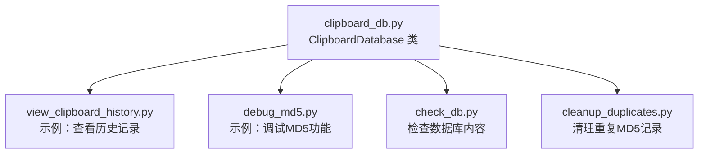
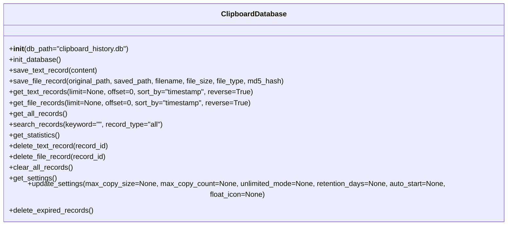
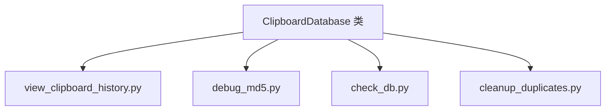

# ClipboardDatabase类

<cite>
**本文引用的文件**
- [clipboard_db.py](file://clipboard_db.py)
- [clipboard_manager_main.py](file://clipboard_manager_main.py)
- [view_clipboard_history.py](file://view_clipboard_history.py)
- [debug_md5.py](file://debug_md5.py)
- [check_db.py](file://check_db.py)
- [cleanup_duplicates.py](file://cleanup_duplicates.py)
</cite>

## 目录
1. [简介](#简介)
2. [项目结构](#项目结构)
3. [核心组件](#核心组件)
4. [架构概览](#架构概览)
5. [详细组件分析](#详细组件分析)
6. [依赖关系分析](#依赖关系分析)
7. [性能考量](#性能考量)
8. [故障排查指南](#故障排查指南)
9. [结论](#结论)
10. [附录](#附录)

## 简介
本文件为 ClipboardDatabase 类的完整API文档，覆盖数据库初始化、文本与文件记录的保存与查询、搜索、删除、设置管理、过期清理等全部公共接口，并对线程安全性、数据表结构进行说明。文档同时提供使用示例与最佳实践建议，帮助开发者快速上手并正确使用该类。

## 项目结构
- 本仓库包含多个脚本，其中 clipboard_db.py 提供 ClipboardDatabase 类；clipboard_manager_main.py 中也定义了一个同名类，但其方法签名与行为与 clipboard_db.py 的类略有差异，本文以 clipboard_db.py 的 ClipboardDatabase 类为主要依据进行文档化。
- view_clipboard_history.py 展示了如何使用 ClipboardDatabase 获取文本与文件记录并打印统计信息。
- debug_md5.py 展示了如何调用 save_text_record 并观察数据库中 MD5 去重效果。
- check_db.py 与 cleanup_duplicates.py 提供了验证与清理重复 MD5 记录的辅助工具。

图表来源
- [clipboard_db.py](file://clipboard_db.py#L1-L455)
- [view_clipboard_history.py](file://view_clipboard_history.py#L1-L75)
- [debug_md5.py](file://debug_md5.py#L1-L56)
- [check_db.py](file://check_db.py#L1-L31)
- [cleanup_duplicates.py](file://cleanup_duplicates.py#L1-L67)

章节来源
- [clipboard_db.py](file://clipboard_db.py#L1-L455)
- [view_clipboard_history.py](file://view_clipboard_history.py#L1-L75)
- [debug_md5.py](file://debug_md5.py#L1-L56)
- [check_db.py](file://check_db.py#L1-L31)
- [cleanup_duplicates.py](file://cleanup_duplicates.py#L1-L67)

## 核心组件
- ClipboardDatabase 类：封装 SQLite 数据库的初始化、增删改查、设置管理与过期清理等操作。
- 数据库文件：默认名为 clipboard_history.db，位于工作目录。
- 表结构：
  - text_records：存储文本剪贴板历史。
  - file_records：存储文件剪贴板历史。
  - settings：存储应用设置项。

章节来源
- [clipboard_db.py](file://clipboard_db.py#L13-L115)

## 架构概览
ClipboardDatabase 类通过独立连接执行每项操作，保证线程安全。类内部维护数据库初始化逻辑，自动创建并升级表结构，确保兼容不同版本的数据文件。

图表来源
- [clipboard_db.py](file://clipboard_db.py#L13-L455)

## 详细组件分析

### 初始化与数据库结构
- __init__(db_path="clipboard_history.db")
  - 参数：db_path，字符串，数据库文件路径，默认值为 "clipboard_history.db"。
  - 行为：构造函数会立即调用 init_database() 完成数据库初始化。
- init_database()
  - 行为：创建并升级以下表结构：
    - text_records：包含 id、content、timestamp、char_count、md5_hash、number 等字段；若旧版本缺少 md5_hash 或 number 字段，会尝试添加并建立唯一索引或默认值。
    - file_records：包含 id、original_path、saved_path、filename、file_size、file_type、md5_hash、timestamp、number 等字段；同样具备兼容性处理。
    - settings：包含 id（主键且校验为1）、max_copy_size、max_copy_count、unlimited_mode、retention_days、auto_start、float_icon 等字段；若旧版本缺少字段，会尝试添加默认值。
  - 异常：初始化过程中若遇到 SQLite 操作错误（例如字段已存在），会捕获并忽略，确保幂等性。

章节来源
- [clipboard_db.py](file://clipboard_db.py#L13-L115)

### 保存文本记录
- 方法：save_text_record(content)
  - 参数：content，字符串，要保存的文本内容。
  - MD5去重机制：
    - 计算 content 的 MD5 哈希值；
    - 插入时若 md5_hash 冲突（唯一约束），捕获 IntegrityError，转而更新该记录的时间戳与 number 计数。
  - 返回值：返回新插入记录的自增 id；若发生去重更新，则返回对应记录的 id。
  - 异常处理：当插入失败触发唯一约束冲突时，捕获异常并回退到更新逻辑。
  - 时间字段：使用本地时间字符串格式写入 timestamp。
  - 线程安全：每次调用均创建独立连接，因此是线程安全的。

使用示例（参考路径）
- 调用示例可参考 debug_md5.py 中的 save_text_record 调用与后续查询验证。

章节来源
- [clipboard_db.py](file://clipboard_db.py#L116-L151)
- [debug_md5.py](file://debug_md5.py#L1-L56)

### 保存文件记录
- 方法：save_file_record(original_path, saved_path, filename, file_size, file_type, md5_hash)
  - 参数：
    - original_path：原始文件路径（剪贴板提供的路径）。
    - saved_path：实际保存到的路径（含唯一后缀）。
    - filename：文件名。
    - file_size：文件大小（字节）。
    - file_type：文件类型分类（如 images、documents 等）。
    - md5_hash：文件的MD5哈希值，作为去重依据。
  - MD5去重机制：
    - 插入时若 md5_hash 冲突，捕获 IntegrityError，转而更新 original_path、timestamp 与 number 计数。
  - 返回值：返回新插入记录的自增 id；若发生去重更新，则返回对应记录的 id。
  - 异常处理：唯一约束冲突时捕获并回退到更新逻辑。
  - 时间字段：使用本地时间字符串格式写入 timestamp。
  - 线程安全：每次调用均创建独立连接，因此是线程安全的。

使用示例（参考路径）
- 可在 clipboard_manager_main.py 中的文件处理流程中看到 save_file_record 的调用方式。

章节来源
- [clipboard_db.py](file://clipboard_db.py#L152-L184)
- [clipboard_manager_main.py](file://clipboard_manager_main.py#L416-L458)

### 查询文本记录
- 方法：get_text_records(limit=None, offset=0, sort_by="timestamp", reverse=True)
  - 参数：
    - limit：整数，返回记录数量上限；None 表示不限制。
    - offset：整数，偏移量，默认 0。
    - sort_by：字符串，排序字段，支持 "content"、"char_count"、"number"、"timestamp"；默认 "timestamp"。
    - reverse：布尔值，True 表示降序，False 表示升序；默认 True。
  - 返回值：元组列表，每个元组包含 (id, content, timestamp, char_count, md5_hash, number)。
  - 线程安全：每次调用均创建独立连接，因此是线程安全的。

使用示例（参考路径）
- 可参考 view_clipboard_history.py 中的 get_text_records 调用与打印逻辑。

章节来源
- [clipboard_db.py](file://clipboard_db.py#L185-L221)
- [view_clipboard_history.py](file://view_clipboard_history.py#L21-L53)

### 查询文件记录
- 方法：get_file_records(limit=None, offset=0, sort_by="timestamp", reverse=True)
  - 参数：
    - limit：整数，返回记录数量上限；None 表示不限制。
    - offset：整数，偏移量，默认 0。
    - sort_by：字符串，排序字段，支持 "filename"、"file_size"、"file_type"、"number"、"timestamp"；默认 "timestamp"。
    - reverse：布尔值，True 表示降序，False 表示升序；默认 True。
  - 返回值：元组列表，每个元组包含 (id, original_path, saved_path, filename, file_size, file_type, md5_hash, timestamp, number)。
  - 线程安全：每次调用均创建独立连接，因此是线程安全的。

使用示例（参考路径）
- 可参考 view_clipboard_history.py 中的 get_file_records 调用与打印逻辑。

章节来源
- [clipboard_db.py](file://clipboard_db.py#L223-L261)
- [view_clipboard_history.py](file://view_clipboard_history.py#L42-L73)

### 搜索记录
- 方法：search_records(keyword="", record_type="all")
  - 参数：
    - keyword：字符串，搜索关键词，模糊匹配。
    - record_type：字符串，可选 "text"、"file"、"all"；默认 "all"。
  - 行为：
    - 当 record_type="text" 时，按 content 模糊匹配；
    - 当 record_type="file" 时，按 filename 模糊匹配；
    - 当 record_type="all" 时，联合 text_records 与 file_records 的结果。
  - 返回值：元组列表，每个元组包含 (type, id, info, timestamp)，其中 type 为 "text" 或 "file"，info 为 content 或 filename。
  - 线程安全：每次调用均创建独立连接，因此是线程安全的。

使用示例（参考路径）
- 可参考 clipboard_manager_main.py 中的 search_records 调用与 GUI 搜索逻辑。

章节来源
- [clipboard_db.py](file://clipboard_db.py#L281-L314)
- [clipboard_manager_main.py](file://clipboard_manager_main.py#L213-L260)

### 删除与清空
- delete_text_record(record_id)
  - 功能：删除指定 id 的文本记录。
  - 线程安全：每次调用均创建独立连接，因此是线程安全的。
- delete_file_record(record_id)
  - 功能：删除指定 id 的文件记录。
  - 线程安全：每次调用均创建独立连接，因此是线程安全的。
- clear_all_records()
  - 功能：清空 text_records 与 file_records 中的所有记录。
  - 线程安全：每次调用均创建独立连接，因此是线程安全的。

章节来源
- [clipboard_db.py](file://clipboard_db.py#L334-L358)

### 设置管理
- get_settings()
  - 功能：读取 settings 表中的配置项。
  - 返回值：字典，包含以下键：
    - max_copy_size：整数，最大复制大小（字节）。
    - max_copy_count：整数，最大复制数量。
    - unlimited_mode：布尔值，是否启用无限模式。
    - retention_days：整数，保留天数（0 表示永久保存）。
    - auto_start：布尔值，是否开机自启。
    - float_icon：布尔值，是否显示悬浮图标。
  - 若数据库中未找到记录，返回默认值。
- update_settings(max_copy_size=None, max_copy_count=None, unlimited_mode=None, retention_days=None, auto_start=None, float_icon=None)
  - 功能：按需更新 settings 表中的配置项；传入 None 则跳过该项。
  - 线程安全：每次调用均创建独立连接，因此是线程安全的。

章节来源
- [clipboard_db.py](file://clipboard_db.py#L359-L412)

### 过期清理
- delete_expired_records()
  - 功能：根据 settings.retention_days 删除过期记录。
  - 过期策略：
    - 读取 retention_days；
    - 若小于等于 0，则不删除任何记录；
    - 否则计算过期时间点，删除 text_records 与 file_records 中早于该时间点的记录；
    - 对 file_records 中被删除的记录，还会尝试删除对应的 saved_path 文件（若存在）。
  - 异常处理：删除文件时捕获异常并打印错误信息，不影响整体清理流程。
  - 线程安全：每次调用均创建独立连接，因此是线程安全的。

章节来源
- [clipboard_db.py](file://clipboard_db.py#L413-L455)

### 统计与聚合
- get_statistics()
  - 功能：返回文本记录数量、文件记录数量与文件总大小。
  - 返回值：三元组 (text_count, file_count, total_size)。

章节来源
- [clipboard_db.py](file://clipboard_db.py#L316-L333)

## 依赖关系分析
- ClipboardDatabase 类依赖 sqlite3、hashlib、os、datetime 等标准库。
- 与其他模块的关系：
  - view_clipboard_history.py 通过 ClipboardDatabase 实例展示历史记录与统计信息。
  - debug_md5.py 通过 ClipboardDatabase 实例演示文本 MD5 去重行为。
  - cleanup_duplicates.py 与 check_db.py 作为辅助工具，验证与清理重复 MD5 记录。

图表来源
- [clipboard_db.py](file://clipboard_db.py#L1-L455)
- [view_clipboard_history.py](file://view_clipboard_history.py#L1-L75)
- [debug_md5.py](file://debug_md5.py#L1-L56)
- [check_db.py](file://check_db.py#L1-L31)
- [cleanup_duplicates.py](file://cleanup_duplicates.py#L1-L67)

章节来源
- [clipboard_db.py](file://clipboard_db.py#L1-L455)
- [view_clipboard_history.py](file://view_clipboard_history.py#L1-L75)
- [debug_md5.py](file://debug_md5.py#L1-L56)
- [check_db.py](file://check_db.py#L1-L31)
- [cleanup_duplicates.py](file://cleanup_duplicates.py#L1-L67)

## 性能考量
- 索引与唯一性：
  - text_records 的 md5_hash 字段具备唯一索引，有助于去重与查询加速。
  - file_records 的 md5_hash 字段为 UNIQUE，避免重复文件记录。
- 排序与分页：
  - get_text_records 与 get_file_records 支持 limit/offset 与多字段排序，建议在大数据量场景下合理设置 limit 与 offset，避免一次性加载过多数据。
- 去重更新：
  - 保存时优先尝试插入，失败后回退到更新，减少重复数据的产生，提升查询效率。
- 文件清理：
  - delete_expired_records 会同步删除磁盘上的文件，降低存储占用，建议定期执行。

[本节为通用性能建议，不直接分析具体文件，故不附加章节来源]

## 故障排查指南
- MD5 去重无效或重复记录：
  - 使用 check_db.py 检查 text_records 中是否存在重复 md5_hash。
  - 使用 cleanup_duplicates.py 清理重复记录并合并计数。
- 无法连接数据库：
  - 确认 db_path 是否正确，文件权限是否允许读写。
- 保存时报唯一约束冲突：
  - 该行为属于正常去重逻辑，确认 content 或 file md5_hash 已存在。
- 过期清理未生效：
  - 检查 settings.retention_days 是否大于 0；确认 saved_path 文件存在且可删除。

章节来源
- [check_db.py](file://check_db.py#L1-L31)
- [cleanup_duplicates.py](file://cleanup_duplicates.py#L1-L67)

## 结论
ClipboardDatabase 类提供了完善的剪贴板历史记录管理能力，涵盖文本与文件两类记录的保存、查询、搜索、删除与设置管理，并内置过期清理与 MD5 去重机制。由于每次操作均使用独立连接，整体具备良好的线程安全性。配合 view_clipboard_history.py、debug_md5.py 等示例脚本，可快速验证与集成到上层应用中。

[本节为总结性内容，不直接分析具体文件，故不附加章节来源]

## 附录

### 数据库表结构说明
- text_records
  - 字段：id（主键自增）、content（文本内容）、timestamp（时间戳，默认当前时间）、char_count（字符数）、md5_hash（文本MD5，唯一索引）、number（出现次数，默认1）。
  - 约束：md5_hash 唯一索引（非空时）。
- file_records
  - 字段：id（主键自增）、original_path（原始路径）、saved_path（保存路径）、filename（文件名）、file_size（字节）、file_type（类型）、md5_hash（文件MD5，UNIQUE）、timestamp（时间戳，默认当前时间）、number（出现次数，默认1）。
  - 约束：md5_hash 唯一。
- settings
  - 字段：id（主键，CHECK(id=1)）、max_copy_size（最大复制大小，默认300MB）、max_copy_count（最大复制数量，默认100）、unlimited_mode（是否无限模式，默认0）、retention_days（保留天数，默认0，表示永久）、auto_start（开机自启，默认1）、float_icon（悬浮图标，默认1）。
  - 约束：id 必须为 1。

章节来源
- [clipboard_db.py](file://clipboard_db.py#L23-L115)

### 使用示例（参考路径）
- 保存文本记录并观察去重：
  - 参考 [debug_md5.py](file://debug_md5.py#L1-L56)
- 查看最近文本与文件记录：
  - 参考 [view_clipboard_history.py](file://view_clipboard_history.py#L21-L73)
- 搜索记录：
  - 参考 [clipboard_manager_main.py](file://clipboard_manager_main.py#L213-L260)
- 删除记录与清空：
  - 参考 [clipboard_db.py](file://clipboard_db.py#L334-L358)
- 设置与过期清理：
  - 参考 [clipboard_db.py](file://clipboard_db.py#L359-L412) 与 [clipboard_db.py](file://clipboard_db.py#L413-L455)