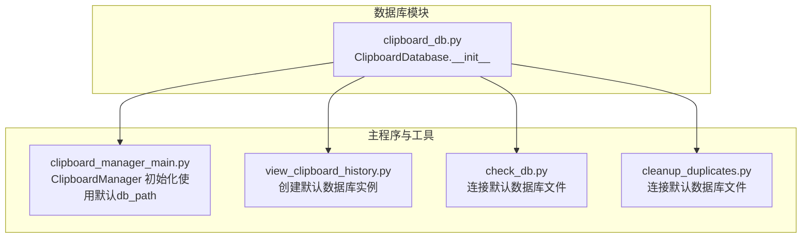
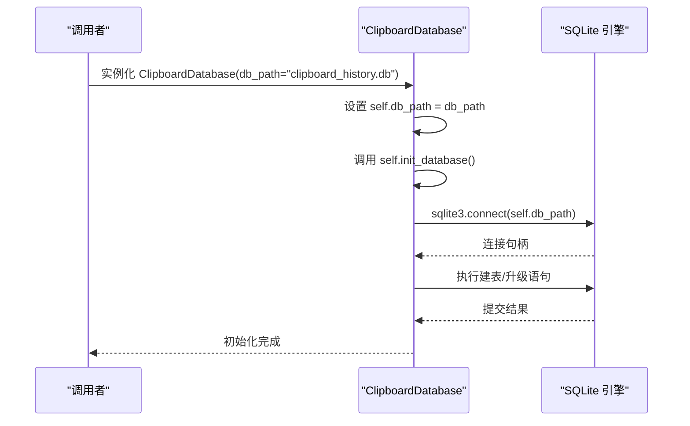
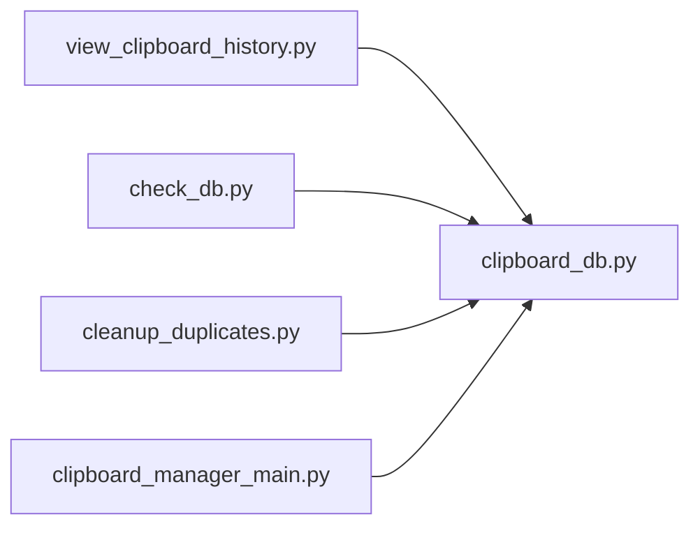

# __init__方法

<cite>
**本文引用的文件**
- [clipboard_db.py](file://clipboard_db.py)
- [clipboard_manager_main.py](file://clipboard_manager_main.py)
- [view_clipboard_history.py](file://view_clipboard_history.py)
- [check_db.py](file://check_db.py)
- [cleanup_duplicates.py](file://cleanup_duplicates.py)
</cite>

## 目录
1. [简介](#简介)
2. [项目结构](#项目结构)
3. [核心组件](#核心组件)
4. [架构总览](#架构总览)
5. [详细组件分析](#详细组件分析)
6. [依赖分析](#依赖分析)
7. [性能考虑](#性能考虑)
8. [故障排查指南](#故障排查指南)
9. [结论](#结论)

## 简介
本文档聚焦于 ClipboardDatabase 类的 __init__ 方法，系统性地说明其参数 db_path 的默认值、作用与行为，以及初始化流程中的关键步骤。文档还提供使用示例、常见异常与处理建议，并解释数据库文件的默认创建位置与工作目录的关系。

## 项目结构
本仓库包含多个脚本与模块，其中与数据库初始化密切相关的文件包括：
- 数据库核心模块：clipboard_db.py
- 主程序与 GUI：clipboard_manager_main.py
- 历史记录查看工具：view_clipboard_history.py
- 数据库检查与清理工具：check_db.py、cleanup_duplicates.py

图表来源
- [clipboard_db.py](file://clipboard_db.py#L12-L20)
- [clipboard_manager_main.py](file://clipboard_manager_main.py#L355-L360)
- [view_clipboard_history.py](file://view_clipboard_history.py#L26-L33)
- [check_db.py](file://check_db.py#L11-L16)
- [cleanup_duplicates.py](file://cleanup_duplicates.py#L11-L16)

章节来源
- [clipboard_db.py](file://clipboard_db.py#L12-L20)
- [clipboard_manager_main.py](file://clipboard_manager_main.py#L355-L360)
- [view_clipboard_history.py](file://view_clipboard_history.py#L26-L33)
- [check_db.py](file://check_db.py#L11-L16)
- [cleanup_duplicates.py](file://cleanup_duplicates.py#L11-L16)

## 核心组件
- ClipboardDatabase.__init__(db_path="clipboard_history.db")
  - 参数 db_path：字符串，用于指定 SQLite 数据库文件的存储路径。默认值为 "clipboard_history.db"。
  - 行为：将传入的 db_path 赋值给实例变量 self.db_path，随后立即调用 self.init_database() 完成数据库结构的创建与升级。
  - 影响：后续所有数据库操作（如保存记录、查询、统计等）均通过 self.db_path 连接数据库文件。

章节来源
- [clipboard_db.py](file://clipboard_db.py#L12-L20)

## 架构总览
ClipboardDatabase 的初始化流程如下：
- 接收 db_path 参数（默认 "clipboard_history.db"）
- 设置 self.db_path
- 调用 init_database() 创建/升级数据库结构（表、索引、默认设置）

图表来源
- [clipboard_db.py](file://clipboard_db.py#L12-L20)
- [clipboard_db.py](file://clipboard_db.py#L18-L114)

## 详细组件分析

### __init__ 方法详解
- 参数与默认值
  - db_path：默认值为 "clipboard_history.db"，表示数据库文件的默认名称。
- 实例变量
  - self.db_path：保存传入的 db_path，作为后续所有数据库操作的基础路径。
- 初始化流程
  - 设置 self.db_path
  - 调用 self.init_database()，在该方法中完成数据库结构的创建与升级（包括表、索引、默认设置等）。

使用示例
- 使用默认路径实例化
  - 在 view_clipboard_history.py 中，直接创建 ClipboardDatabase()，即使用默认路径 "clipboard_history.db"。
  - 参考路径：file://view_clipboard_history.py#L26-L33
- 自定义数据库路径实例化
  - 在 clipboard_manager_main.py 中，ClipboardManager.__init__ 会创建 ClipboardDatabase()，但未显式传参，因此仍使用默认路径。
  - 若需自定义路径，可在创建 ClipboardDatabase 实例时传入 db_path 参数，例如：
    - db = ClipboardDatabase("E:\\MyApp\\data\\clipboard.db")
    - db = ClipboardDatabase("/home/user/myapp/clipboard.db")
  - 注意：若传入绝对路径，请确保目标目录存在且具备写权限；若传入相对路径，请确认其相对于当前工作目录的含义。

数据库文件默认创建位置
- 当 db_path 为相对路径（如默认的 "clipboard_history.db"）时，数据库文件将创建在当前工作目录下。
- 当 db_path 为绝对路径时，数据库文件将创建在该绝对路径所指向的位置。

章节来源
- [clipboard_db.py](file://clipboard_db.py#L12-L20)
- [view_clipboard_history.py](file://view_clipboard_history.py#L26-L33)
- [clipboard_manager_main.py](file://clipboard_manager_main.py#L355-L360)

### 初始化过程中的数据库结构创建与升级
- init_database() 会在首次连接时执行一系列建表与升级逻辑，包括但不限于：
  - 创建文本记录表、文件记录表、设置表
  - 为已有表添加必要的列（如 md5_hash、number 等）
  - 为 md5_hash 字段建立唯一性索引（条件性创建）
  - 插入默认设置（如最大复制大小、最大复制数量、是否无限模式等）
- 这些步骤确保数据库结构满足当前版本需求，并兼容旧版本的迁移。

章节来源
- [clipboard_db.py](file://clipboard_db.py#L18-L114)

### 异常与处理建议
- 当 db_path 指向不存在的目录时可能引发的异常
  - sqlite3.OperationalError：当数据库文件所在目录不存在且无法自动创建时，sqlite3.connect() 可能抛出操作错误。
  - OSError：当目标路径不可写或权限不足时，也可能触发系统级异常。
- 处理建议
  - 显式创建目录：在实例化前，先确保 db_path 指向的目录存在且可写。
  - 使用绝对路径：避免相对路径导致的工作目录不确定性。
  - 权限检查：确保运行用户对目标目录拥有读写权限。
  - 错误捕获：在业务代码中对连接与建表过程进行 try-except 包裹，记录日志并提示用户修正路径或权限问题。

章节来源
- [clipboard_db.py](file://clipboard_db.py#L18-L20)

## 依赖分析
- ClipboardDatabase.__init__ 依赖 sqlite3.connect() 与后续的建表/升级逻辑。
- 其他脚本通过不同方式使用 ClipboardDatabase：
  - view_clipboard_history.py：直接创建默认实例，用于查看历史记录。
  - check_db.py、cleanup_duplicates.py：直接连接默认数据库文件，用于检查与清理。
  - clipboard_manager_main.py：在 ClipboardManager.__init__ 中创建默认实例，用于日常剪贴板监控与 GUI 展示。

图表来源
- [view_clipboard_history.py](file://view_clipboard_history.py#L26-L33)
- [check_db.py](file://check_db.py#L11-L16)
- [cleanup_duplicates.py](file://cleanup_duplicates.py#L11-L16)
- [clipboard_manager_main.py](file://clipboard_manager_main.py#L355-L360)

章节来源
- [view_clipboard_history.py](file://view_clipboard_history.py#L26-L33)
- [check_db.py](file://check_db.py#L11-L16)
- [cleanup_duplicates.py](file://cleanup_duplicates.py#L11-L16)
- [clipboard_manager_main.py](file://clipboard_manager_main.py#L355-L360)

## 性能考虑
- 数据库文件位于当前工作目录时，I/O 性能通常较稳定；若迁移到网络盘或低速存储，可能影响写入速度。
- 唯一性索引（md5_hash）有助于去重与加速查询，但也会带来插入时的额外开销。该策略由 init_database() 条件性创建，无需手动干预。
- 对于大量数据的查询与统计，建议结合分页与排序策略，避免一次性加载过多记录。

## 故障排查指南
- 无法连接数据库
  - 检查 db_path 是否正确（相对/绝对路径），确认目录存在且可写。
  - 检查是否存在并发进程占用数据库文件。
- 数据库结构异常
  - 使用 check_db.py 或 cleanup_duplicates.py 辅助检查与修复重复记录。
- GUI 或监控器无法读取历史
  - 确认 ClipboardDatabase 实例使用的 db_path 与 view_clipboard_history.py 一致，避免路径差异导致的数据不一致。

章节来源
- [check_db.py](file://check_db.py#L11-L16)
- [cleanup_duplicates.py](file://cleanup_duplicates.py#L11-L16)
- [view_clipboard_history.py](file://view_clipboard_history.py#L26-L33)

## 结论
ClipboardDatabase.__init__ 方法简洁明确：接收 db_path（默认 "clipboard_history.db"），设置实例变量并立即初始化数据库结构。通过统一的初始化流程，项目各模块能够稳定地共享同一份 SQLite 数据库。合理规划 db_path 的路径与权限，是确保系统稳定运行的关键。