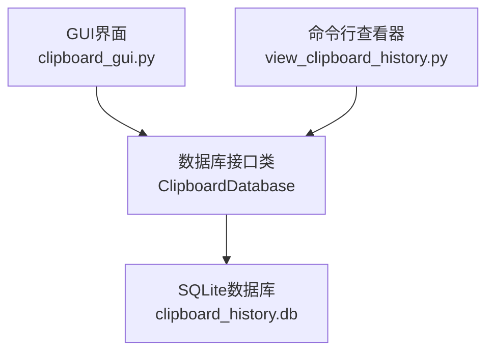
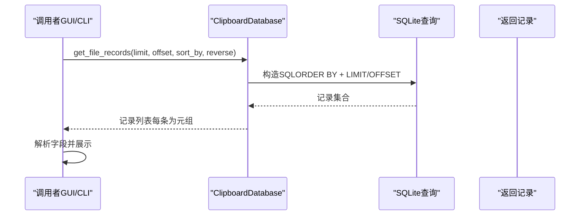
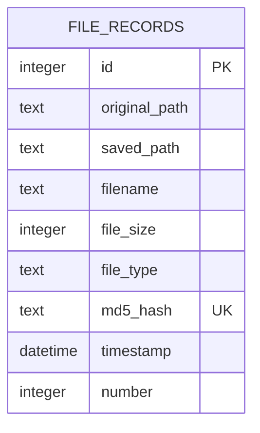
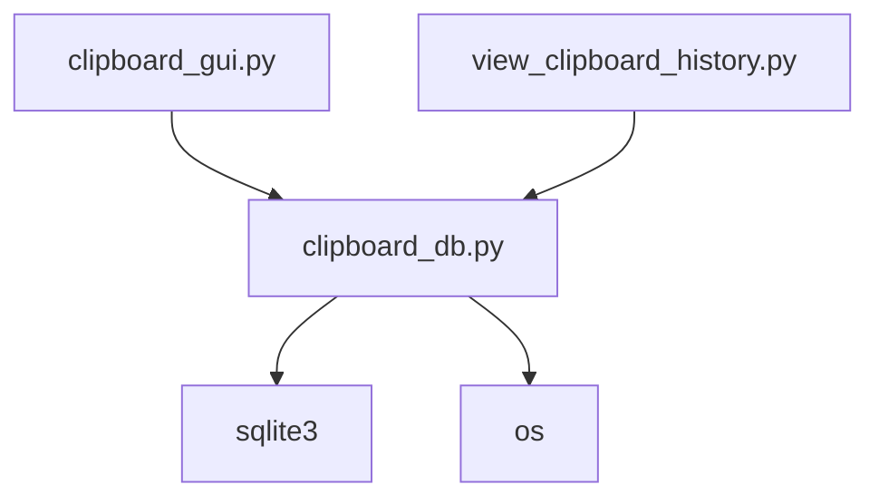

# get_file_records方法

<cite>
**本文引用的文件**
- [clipboard_db.py](file://clipboard_db.py)
- [clipboard_gui.py](file://clipboard_gui.py)
- [view_clipboard_history.py](file://view_clipboard_history.py)
</cite>

## 目录
1. [简介](#简介)
2. [项目结构](#项目结构)
3. [核心组件](#核心组件)
4. [架构概览](#架构概览)
5. [详细组件分析](#详细组件分析)
6. [依赖分析](#依赖分析)
7. [性能考虑](#性能考虑)
8. [故障排查指南](#故障排查指南)
9. [结论](#结论)
10. [附录](#附录)

## 简介
本文档系统化地文档化 get_file_records 方法，重点说明其参数（limit、offset、sort_by、reverse）的行为与返回值字段，解释分页机制与排序逻辑，并与 get_text_records 的一致性设计进行对比。同时提供实际使用示例，展示如何获取最近的文件记录或按文件大小排序的记录列表。

## 项目结构
本仓库围绕剪贴板历史记录管理展开，核心数据库操作集中在 clipboard_db.py 中，GUI 界面与命令行工具分别在 clipboard_gui.py 与 view_clipboard_history.py 中调用数据库接口。

图表来源
- [clipboard_gui.py](file://clipboard_gui.py#L581-L626)
- [view_clipboard_history.py](file://view_clipboard_history.py#L21-L53)
- [clipboard_db.py](file://clipboard_db.py#L12-L66)

章节来源
- [clipboard_gui.py](file://clipboard_gui.py#L581-L626)
- [view_clipboard_history.py](file://view_clipboard_history.py#L21-L53)
- [clipboard_db.py](file://clipboard_db.py#L12-L66)

## 核心组件
- ClipboardDatabase 类：封装数据库初始化、文件记录查询、文本记录查询、搜索、统计等能力。
- get_file_records 方法：面向文件记录的查询接口，支持 limit、offset、sort_by、reverse 参数与分页/排序。

章节来源
- [clipboard_db.py](file://clipboard_db.py#L12-L66)
- [clipboard_db.py](file://clipboard_db.py#L223-L261)

## 架构概览
get_file_records 的调用链路如下：
- GUI 或 CLI 调用 ClipboardDatabase.get_file_records(...)
- 数据库执行 SQL 查询，返回元组列表
- 调用方解析返回值，映射到显示字段

图表来源
- [clipboard_db.py](file://clipboard_db.py#L223-L261)
- [clipboard_gui.py](file://clipboard_gui.py#L581-L626)
- [view_clipboard_history.py](file://view_clipboard_history.py#L42-L53)

## 详细组件分析

### get_file_records 方法签名与行为
- 方法签名（来自源码）：
  - get_file_records(self, limit=None, offset=0, sort_by="timestamp", reverse=True)
- 功能概述：
  - 从 file_records 表中查询文件记录，支持排序与分页。
  - 支持的排序字段：timestamp、filename、file_size、file_type、number。
  - 排序方向由 reverse 控制：True 为降序（最新优先），False 为升序。
  - 分页通过 LIMIT 与 OFFSET 实现；当 limit 为 None 时返回全部记录。

章节来源
- [clipboard_db.py](file://clipboard_db.py#L223-L261)

### 参数详解
- limit
  - 类型：整数或 None
  - 作用：限制返回记录数量；None 表示不限制。
  - 影响：配合 OFFSET 使用实现分页；未设置时返回全量记录。
- offset
  - 类型：整数
  - 作用：分页偏移量，通常与 limit 搭配使用。
  - 影响：跳过前 offset 条记录后再取 limit 条。
- sort_by
  - 取值范围："timestamp"、"filename"、"file_size"、"file_type"、"number"
  - 作用：指定排序依据的字段。
  - 默认值："timestamp"
- reverse
  - 取值：布尔
  - 作用：控制排序方向。
  - True：降序（最新记录优先）
  - False：升序（最早记录优先）

章节来源
- [clipboard_db.py](file://clipboard_db.py#L223-L261)

### 返回值字段
get_file_records 返回的每条记录为一个元组，包含以下字段（按顺序）：
- id：记录标识
- original_path：原始路径
- saved_path：保存路径
- filename：文件名
- file_size：文件大小（字节）
- file_type：文件类型（如扩展名）
- md5_hash：内容哈希
- timestamp：时间戳
- number：出现次数

章节来源
- [clipboard_db.py](file://clipboard_db.py#L245-L257)

### 分页机制与排序逻辑
- 分页
  - 当 limit 为 None：查询全部记录。
  - 当 limit 为整数：使用 LIMIT ?，结合 OFFSET ? 实现分页。
- 排序
  - sort_by 决定 ORDER BY 字段。
  - reverse 决定排序方向（DESC/ASC）。
- 与 get_text_records 的一致性
  - 两者均支持 limit、offset、sort_by、reverse。
  - 两者均使用 LIMIT/OFFSET 进行分页。
  - 两者均使用 ORDER BY 字段进行排序，且 reverse 控制方向一致。
  - 两者返回的记录均为元组列表，便于上层统一处理。

章节来源
- [clipboard_db.py](file://clipboard_db.py#L185-L219)
- [clipboard_db.py](file://clipboard_db.py#L223-L261)

### 实际使用示例（路径引用）
- 获取最近的文件记录（默认按时间降序）
  - 示例路径：[clipboard_gui.py](file://clipboard_gui.py#L1261-L1263)
  - 示例路径：[view_clipboard_history.py](file://view_clipboard_history.py#L44-L53)
- 按文件大小排序的记录列表
  - GUI 中通过列排序触发 get_file_records(sort_by="file_size", reverse=True/False)
  - 示例路径：[clipboard_gui.py](file://clipboard_gui.py#L595-L596)
- 分页读取
  - 示例路径：[clipboard_db.py](file://clipboard_db.py#L251-L257)

章节来源
- [clipboard_gui.py](file://clipboard_gui.py#L595-L596)
- [clipboard_gui.py](file://clipboard_gui.py#L1261-L1263)
- [view_clipboard_history.py](file://view_clipboard_history.py#L44-L53)
- [clipboard_db.py](file://clipboard_db.py#L251-L257)

### 与 get_text_records 的一致性设计
- 相同点
  - 均支持 limit、offset、sort_by、reverse。
  - 均使用 LIMIT/OFFSET 实现分页。
  - 均使用 ORDER BY 字段进行排序，reverse 控制方向。
- 不同点
  - 字段差异：get_file_records 返回 id、original_path、saved_path、filename、file_size、file_type、md5_hash、timestamp、number；get_text_records 返回 id、content、timestamp、char_count、md5_hash、number。
  - 默认排序：两者默认排序字段不同（timestamp vs content/char_count/number），但都支持 reverse 控制方向。

章节来源
- [clipboard_db.py](file://clipboard_db.py#L185-L219)
- [clipboard_db.py](file://clipboard_db.py#L223-L261)

### 数据模型关系

图表来源
- [clipboard_db.py](file://clipboard_db.py#L54-L66)

## 依赖分析
- 调用关系
  - GUI 与 CLI 均依赖 ClipboardDatabase.get_file_records(...)。
  - GUI 还会调用 get_text_records(...) 并与之合并显示。
- 外部依赖
  - sqlite3：用于连接与查询数据库。
  - datetime：用于生成本地时间戳。
  - os：用于删除过期文件记录时删除对应文件。

图表来源
- [clipboard_gui.py](file://clipboard_gui.py#L581-L626)
- [view_clipboard_history.py](file://view_clipboard_history.py#L21-L53)
- [clipboard_db.py](file://clipboard_db.py#L12-L66)

章节来源
- [clipboard_gui.py](file://clipboard_gui.py#L581-L626)
- [view_clipboard_history.py](file://view_clipboard_history.py#L21-L53)
- [clipboard_db.py](file://clipboard_db.py#L12-L66)

## 性能考虑
- 索引建议
  - file_records 表已具备 md5_hash 唯一索引，有利于去重与快速查找。
  - 若频繁按 file_size、file_type、number 排序，可考虑为这些字段建立索引以提升查询性能。
- 分页策略
  - 使用 LIMIT/OFFSET 适合中小规模数据；大规模数据建议采用基于游标（基于上次记录的 timestamp 或 id）的增量分页，减少 OFFSET 的开销。
- 排序成本
  - ORDER BY 在大数据集上可能产生排序开销；建议仅在必要时进行排序，或在高频查询场景下引入合适的索引。

## 故障排查指南
- 无法获取记录
  - 检查数据库文件是否存在与可访问。
  - 确认表 file_records 是否已初始化。
- 排序无效
  - 确认 sort_by 取值是否在允许范围内："timestamp"、"filename"、"file_size"、"file_type"、"number"。
  - 确认 reverse 是否按预期设置。
- 分页异常
  - 确认 limit 与 offset 的组合是否合理。
  - 注意 limit=None 时不会使用 LIMIT/OFFSET。
- 性能问题
  - 大数据量排序或分页较慢时，考虑优化索引或调整分页策略。

章节来源
- [clipboard_db.py](file://clipboard_db.py#L12-L66)
- [clipboard_db.py](file://clipboard_db.py#L223-L261)

## 结论
get_file_records 提供了灵活的文件记录查询能力，支持分页与多字段排序，返回字段完整覆盖文件记录的核心信息。其分页与排序设计与 get_text_records 保持一致，便于上层统一处理两类记录。在实际使用中，应结合业务需求合理设置 limit/offset 与 sort_by/reverse，并关注索引与性能优化。

## 附录
- 关键实现参考路径
  - get_file_records 定义与实现：[clipboard_db.py](file://clipboard_db.py#L223-L261)
  - GUI 中的调用示例（最近记录、按大小排序）：[clipboard_gui.py](file://clipboard_gui.py#L595-L596)
  - 命令行工具中的调用示例：[view_clipboard_history.py](file://view_clipboard_history.py#L44-L53)