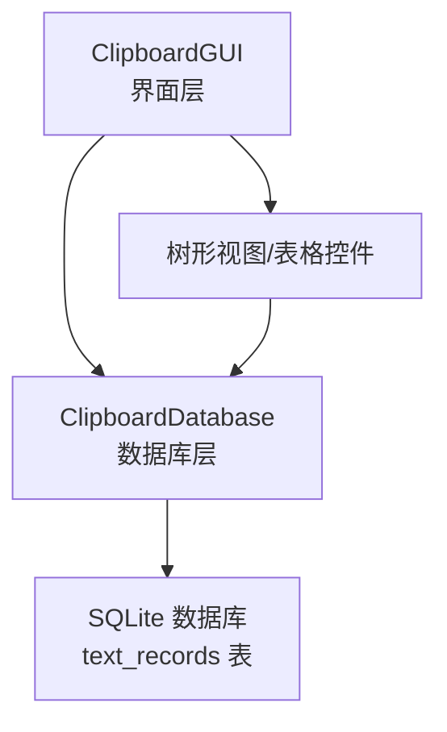
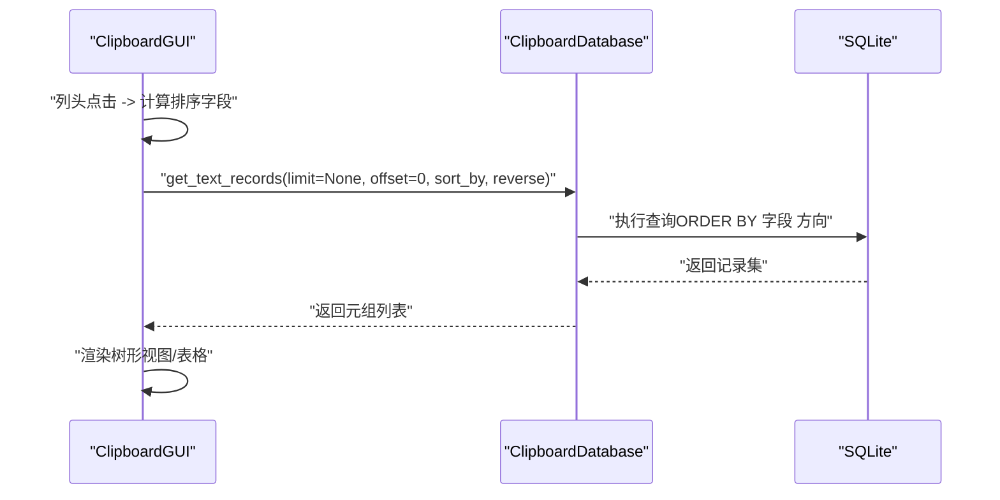
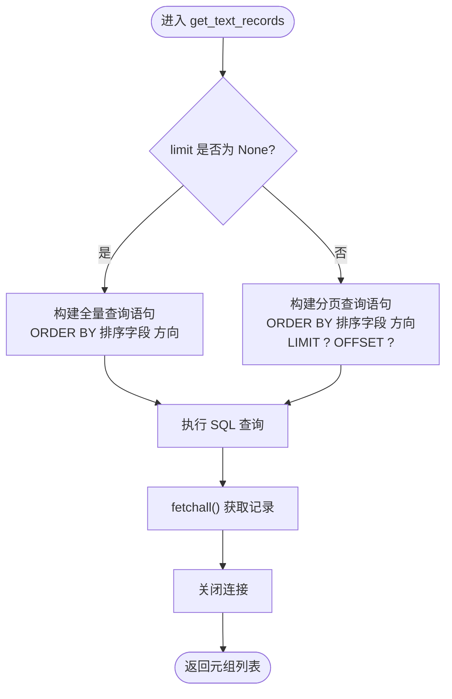
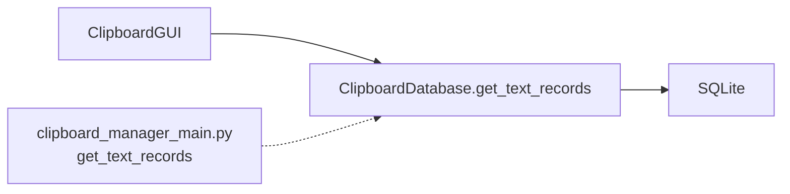

# get_text_records方法

<cite>
**本文引用的文件**
- [clipboard_db.py](file://clipboard_db.py)
- [clipboard_manager_main.py](file://clipboard_manager_main.py)
- [clipboard_gui.py](file://clipboard_gui.py)
</cite>

## 目录
1. [简介](#简介)
2. [项目结构](#项目结构)
3. [核心组件](#核心组件)
4. [架构总览](#架构总览)
5. [详细组件分析](#详细组件分析)
6. [依赖关系分析](#依赖关系分析)
7. [性能考量](#性能考量)
8. [故障排查指南](#故障排查指南)
9. [结论](#结论)

## 简介
本文档围绕 get_text_records 方法的查询功能进行系统化文档化，重点说明：
- limit 参数控制返回记录数量
- offset 参数用于分页偏移
- sort_by 参数支持 'timestamp'、'content'、'char_count' 和 'number' 四种排序方式
- reverse 参数决定升序或降序排列
- 方法返回元组列表，包含 id、content、timestamp、char_count、md5_hash 和 number 字段
- 当 limit 为 None 时返回所有记录的实现逻辑
- 分页查询与不同排序组合的使用示例，以及高效检索策略

## 项目结构
- 数据库层：ClipboardDatabase 类负责数据库初始化、数据存取与查询，其中 get_text_records 实现了文本记录的查询与排序。
- GUI 层：ClipboardGUI 负责界面交互，调用数据库层接口展示记录，并在界面列头点击时触发排序。
- 主程序层：clipboard_manager_main.py 中也定义了一个同名方法，但参数签名与数据库层不同，主要用于 GUI 的默认展示。

图表来源
- [clipboard_gui.py](file://clipboard_gui.py#L580-L779)
- [clipboard_db.py](file://clipboard_db.py#L184-L221)

章节来源
- [clipboard_db.py](file://clipboard_db.py#L184-L221)
- [clipboard_gui.py](file://clipboard_gui.py#L580-L779)

## 核心组件
- ClipboardDatabase.get_text_records
  - 支持 limit、offset、sort_by、reverse 参数
  - 返回字段顺序：id、content、timestamp、char_count、md5_hash、number
  - 当 limit 为 None 时返回全部记录；否则按 LIMIT/OFFSET 分页
- GUI 层调用
  - ClipboardGUI 在加载记录时调用 get_text_records，并将排序映射到数据库字段
- 主程序层方法
  - clipboard_manager_main.py 中的 get_text_records 仅支持 limit 参数，默认按 timestamp 降序返回固定数量记录

章节来源
- [clipboard_db.py](file://clipboard_db.py#L184-L221)
- [clipboard_gui.py](file://clipboard_gui.py#L580-L779)
- [clipboard_manager_main.py](file://clipboard_manager_main.py#L181-L195)

## 架构总览
get_text_records 的调用链路如下：
- GUI 层通过 ClipboardGUI 触发查询
- ClipboardGUI 将界面列名映射为数据库字段名，然后调用数据库层的 get_text_records
- 数据库层根据 sort_by 与 reverse 生成 SQL 排序，limit 为 None 则全量查询，否则带 LIMIT/OFFSET 分页

图表来源
- [clipboard_gui.py](file://clipboard_gui.py#L580-L779)
- [clipboard_db.py](file://clipboard_db.py#L184-L221)

## 详细组件分析

### 方法签名与行为
- 参数
  - limit：整数或 None。None 表示不限制数量，返回全部记录；否则返回指定数量记录
  - offset：整数，分页偏移量
  - sort_by：字符串，支持 'timestamp'、'content'、'char_count'、'number'
  - reverse：布尔值，True 为降序，False 为升序
- 返回
  - 元组列表，每个元组包含：id、content、timestamp、char_count、md5_hash、number
- 排序规则
  - sort_by 为 'content'、'char_count'、'number' 或 'timestamp' 时，按对应字段排序
  - reverse 为 True 时使用 DESC，否则使用 ASC
- 分页逻辑
  - 当 limit 为 None：不使用 LIMIT/OFFSET，直接 ORDER BY 排序后返回全部
  - 当 limit 为整数：使用 ORDER BY 排序后，LIMIT ? OFFSET ? 返回指定数量记录

章节来源
- [clipboard_db.py](file://clipboard_db.py#L184-L221)

### 数据库表结构与字段含义
- text_records 表包含以下字段（与查询返回字段一一对应）：
  - id：自增主键
  - content：文本内容
  - timestamp：时间戳
  - char_count：字符数
  - md5_hash：内容的MD5哈希
  - number：出现次数（去重计数）

章节来源
- [clipboard_db.py](file://clipboard_db.py#L24-L52)

### 与 GUI 的集成
- ClipboardGUI 在加载记录时：
  - 将界面列名映射为数据库字段名（如“名称或内容”映射为 content，“次数”映射为 number）
  - 调用 get_text_records 并传入 sort_by 与 reverse
  - 将返回的记录集渲染到树形视图中

章节来源
- [clipboard_gui.py](file://clipboard_gui.py#L580-L779)

### 与主程序层方法的区别
- clipboard_manager_main.py 中的 get_text_records 仅支持 limit 参数，默认按 timestamp 降序返回固定数量记录
- 数据库层的 get_text_records 提供更灵活的排序与分页能力

章节来源
- [clipboard_manager_main.py](file://clipboard_manager_main.py#L181-L195)
- [clipboard_db.py](file://clipboard_db.py#L184-L221)

### 查询流程与算法

图表来源
- [clipboard_db.py](file://clipboard_db.py#L184-L221)

## 依赖关系分析
- GUI 层依赖数据库层的查询接口
- 数据库层依赖 SQLite 引擎执行 SQL
- 主程序层的同名方法与数据库层方法职责不同，需注意区分使用场景

图表来源
- [clipboard_gui.py](file://clipboard_gui.py#L580-L779)
- [clipboard_db.py](file://clipboard_db.py#L184-L221)
- [clipboard_manager_main.py](file://clipboard_manager_main.py#L181-L195)

章节来源
- [clipboard_gui.py](file://clipboard_gui.py#L580-L779)
- [clipboard_db.py](file://clipboard_db.py#L184-L221)
- [clipboard_manager_main.py](file://clipboard_manager_main.py#L181-L195)

## 性能考量
- 全量查询（limit=None）
  - 适合一次性导出或统计场景，但可能产生大量内存占用
  - 建议配合 sort_by 与 reverse 控制排序方向，避免不必要的全量扫描
- 分页查询（limit 为整数）
  - 使用 LIMIT/OFFSET 可有效控制每次返回的数据量
  - 对大数据集建议结合索引优化（例如 timestamp、content、number 等常用排序字段）
- 排序成本
  - ORDER BY 会触发排序操作，字段越复杂（如 content）排序成本越高
  - 若频繁按 char_count 或 number 排序，可考虑在相应字段上建立索引（需评估写入开销）
- I/O 与连接
  - 每次查询都会建立/关闭连接，建议在批量查询时复用连接或减少查询频次

[本节为通用性能建议，不直接分析具体文件]

## 故障排查指南
- 返回记录为空
  - 检查数据库初始化是否成功，确认 text_records 表是否存在且有数据
  - 确认 sort_by 值是否为受支持的枚举值
- 排序异常或报错
  - 确保 reverse 为布尔值
  - 确认数据库字段存在且类型匹配（如 char_count、number 应为整数）
- 分页结果不正确
  - 确认 offset 与 limit 的组合是否符合预期
  - 注意不同排序字段的稳定性（如 timestamp 相同时的排序一致性）
- GUI 排序不生效
  - 检查 ClipboardGUI 的列名映射是否正确
  - 确认调用的是数据库层的 get_text_records（而非主程序层的同名方法）

章节来源
- [clipboard_gui.py](file://clipboard_gui.py#L580-L779)
- [clipboard_db.py](file://clipboard_db.py#L184-L221)
- [clipboard_manager_main.py](file://clipboard_manager_main.py#L181-L195)

## 结论
- get_text_records 提供了灵活的排序与分页能力，满足多样化的检索需求
- 当 limit 为 None 时返回全部记录，适合导出与统计；分页查询适合界面展示
- 通过合理选择 sort_by 与 reverse，可快速定位目标记录
- 建议在高频查询场景中关注排序字段的索引与连接复用，以提升整体性能