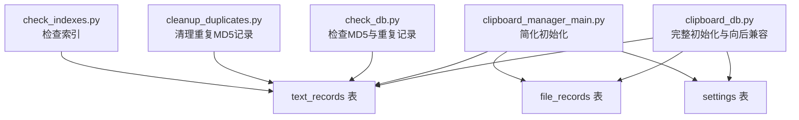
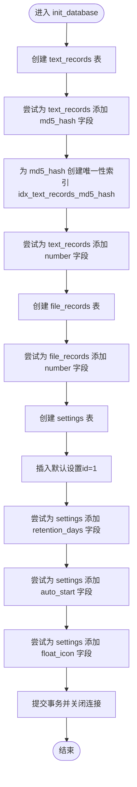
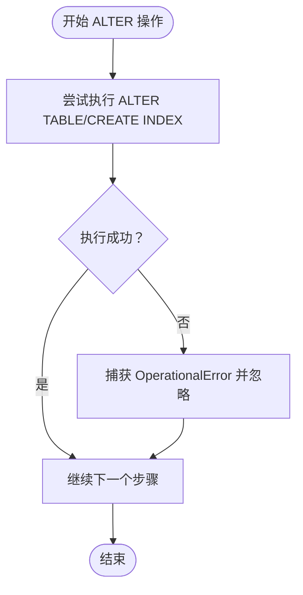
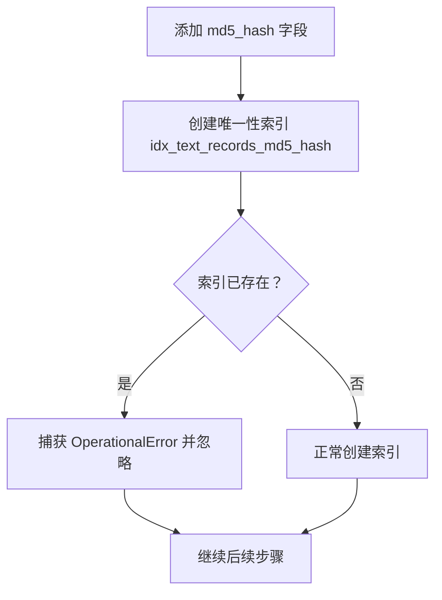
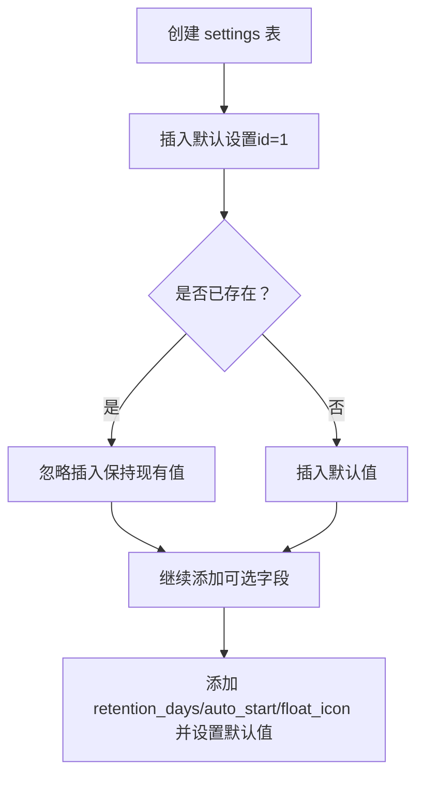
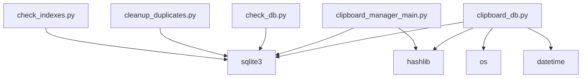
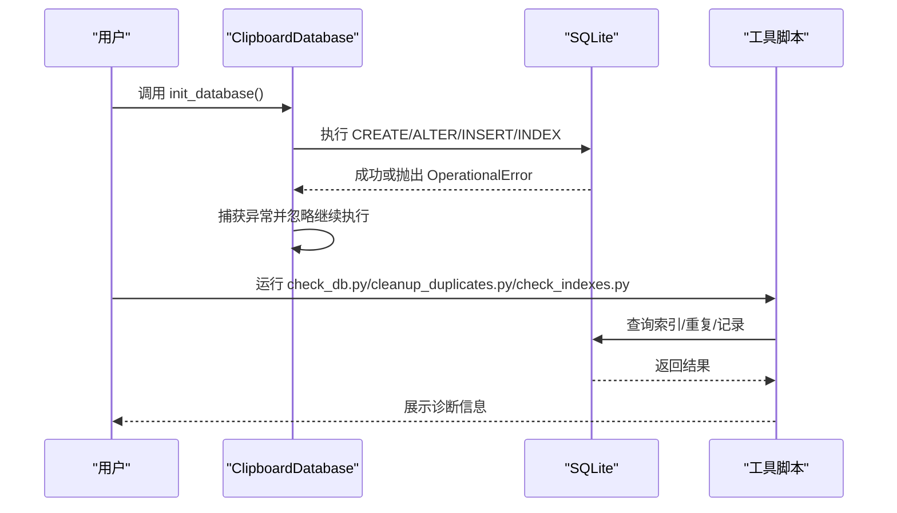

# init_database方法

<cite>
**本文引用的文件**
- [clipboard_db.py](file://clipboard_db.py)
- [clipboard_manager_main.py](file://clipboard_manager_main.py)
- [check_db.py](file://check_db.py)
- [cleanup_duplicates.py](file://cleanup_duplicates.py)
- [check_indexes.py](file://check_indexes.py)
</cite>

## 目录
1. [简介](#简介)
2. [项目结构](#项目结构)
3. [核心组件](#核心组件)
4. [架构总览](#架构总览)
5. [详细组件分析](#详细组件分析)
6. [依赖关系分析](#依赖关系分析)
7. [性能考量](#性能考量)
8. [故障排查指南](#故障排查指南)
9. [结论](#结论)
10. [附录](#附录)

## 简介
本文件系统性地文档化 init_database 方法的数据库初始化流程，重点覆盖以下方面：
- 三张核心表 text_records、file_records 和 settings 的创建与字段定义
- 对既有数据库的向后兼容性处理机制（通过 ALTER TABLE 添加字段并用异常捕获策略避免中断）
- text_records 表唯一性索引 idx_text_records_md5_hash 的实现细节
- settings 表单行主键约束（id=1）与默认值设置
- 数据库模式演进的版本控制思路，确保旧版用户数据的无缝迁移

## 项目结构
本仓库围绕剪贴板历史记录管理展开，数据库初始化逻辑主要集中在两个模块中：
- clipboard_db.py：提供完整的数据库初始化与维护能力，包含向后兼容性处理与索引创建
- clipboard_manager_main.py：提供简化版的数据库初始化（早期版本风格），便于对比理解演进

图表来源
- [clipboard_db.py](file://clipboard_db.py#L18-L114)
- [clipboard_manager_main.py](file://clipboard_manager_main.py#L61-L110)
- [check_db.py](file://check_db.py#L1-L31)
- [cleanup_duplicates.py](file://cleanup_duplicates.py#L1-L67)
- [check_indexes.py](file://check_indexes.py#L1-L27)

章节来源
- [clipboard_db.py](file://clipboard_db.py#L1-L114)
- [clipboard_manager_main.py](file://clipboard_manager_main.py#L1-L110)

## 核心组件
- ClipboardDatabase 类：封装数据库连接、初始化、增删改查等操作
- init_database 方法：负责创建核心表、添加可选字段、插入默认设置、创建索引
- 与之配套的工具脚本：check_db.py、cleanup_duplicates.py、check_indexes.py 用于验证与维护

章节来源
- [clipboard_db.py](file://clipboard_db.py#L1-L114)
- [clipboard_manager_main.py](file://clipboard_manager_main.py#L56-L110)

## 架构总览
下图展示 init_database 的整体执行顺序与关键步骤：

图表来源
- [clipboard_db.py](file://clipboard_db.py#L18-L114)

章节来源
- [clipboard_db.py](file://clipboard_db.py#L18-L114)

## 详细组件分析

### init_database 方法：数据库初始化流程
- 责任边界
  - 创建三张核心表：text_records、file_records、settings
  - 为已有表添加可选字段，确保向后兼容
  - 插入单行默认设置（id=1）
  - 创建唯一性索引以提升去重与查询效率
- 关键步骤
  - 创建 text_records 表（含 content、timestamp、char_count 等字段）
  - 尝试添加 md5_hash 字段；若失败（字段已存在）则忽略
  - 为 md5_hash 创建唯一性索引；若失败（索引已存在）则忽略
  - 尝试添加 number 字段；若失败则忽略
  - 创建 file_records 表（含 md5_hash 唯一约束）
  - 尝试添加 number 字段；若失败则忽略
  - 创建 settings 表（id=1 单行约束，含默认值）
  - 插入默认设置（INSERT OR IGNORE）
  - 尝试添加 retention_days、auto_start、float_icon 字段；若失败则忽略
  - 提交事务并关闭连接

章节来源
- [clipboard_db.py](file://clipboard_db.py#L18-L114)

### 三张核心表的SQL结构与字段说明
- text_records 表
  - 字段要点：id（自增主键）、content（文本内容）、timestamp（时间戳，默认当前时间）、char_count（字符数）
  - 可选增强：md5_hash（用于去重）、number（重复计数）
  - 约束与索引：md5_hash 唯一性索引（见下节）
- file_records 表
  - 字段要点：id（自增主键）、original_path（原始路径）、saved_path（保存路径）、filename（文件名）、file_size（大小）、file_type（类型）、md5_hash（唯一）
  - 可选增强：number（重复计数）
- settings 表
  - 字段要点：id（主键且约束为 1）、max_copy_size（默认值）、max_copy_count（默认值）、unlimited_mode（默认值）
  - 可选增强：retention_days（默认值 0，表示永久保存）、auto_start（默认值 1）、float_icon（默认值 1）

章节来源
- [clipboard_db.py](file://clipboard_db.py#L23-L114)
- [clipboard_manager_main.py](file://clipboard_manager_main.py#L66-L110)

### 向后兼容性处理机制与异常捕获策略
- 设计思想
  - 使用 ALTER TABLE 动态添加字段，避免强制重建表导致数据丢失
  - 对每个 ALTER 操作包裹异常捕获，当字段或索引已存在时静默忽略
- 具体策略
  - text_records：添加 md5_hash、number 字段
  - file_records：添加 number 字段
  - settings：添加 retention_days、auto_start、float_icon 字段
- 异常类型
  - 使用 sqlite3.OperationalError 捕获“对象已存在”类错误
  - 使用 sqlite3.IntegrityError 捕获“违反唯一性约束”类错误（在插入/更新时发生）

图表来源
- [clipboard_db.py](file://clipboard_db.py#L33-L114)

章节来源
- [clipboard_db.py](file://clipboard_db.py#L33-L114)

### 唯一性索引 idx_text_records_md5_hash 的实现细节
- 索引目标：text_records 表的 md5_hash 字段
- 索引类型：唯一性索引（UNIQUE）
- 条件过滤：WHERE md5_hash IS NOT NULL（允许部分记录为空，但非空值唯一）
- 创建时机：在添加 md5_hash 字段之后立即创建
- 异常处理：若索引已存在，则捕获 OperationalError 并忽略

图表来源
- [clipboard_db.py](file://clipboard_db.py#L33-L46)

章节来源
- [clipboard_db.py](file://clipboard_db.py#L33-L46)

### settings 表的单行主键约束与默认值
- 单行约束：id INTEGER PRIMARY KEY CHECK (id = 1)，保证只有一条记录存在
- 默认值：max_copy_size、max_copy_count、unlimited_mode 的默认值
- 新增字段默认值：retention_days（0，永久保存）、auto_start（1）、float_icon（1）
- 插入策略：INSERT OR IGNORE，避免重复插入导致冲突

图表来源
- [clipboard_db.py](file://clipboard_db.py#L76-L114)

章节来源
- [clipboard_db.py](file://clipboard_db.py#L76-L114)

### 数据库模式演进的版本控制思路
- 版本演进策略
  - 采用“增量演进 + 异常容忍”的方式：每次新增字段或索引前先尝试执行，失败即忽略
  - 通过 INSERT OR IGNORE 与 CHECK 约束确保默认值与单行约束的稳定性
- 旧版本用户数据迁移
  - 通过 ALTER TABLE 无损添加字段，避免重建表
  - 通过唯一性索引与去重逻辑（INSERT OR IGNORE + number 计数）保障历史数据一致性
- 可扩展建议
  - 引入显式版本号字段与迁移脚本，按版本号顺序执行升级
  - 对于破坏性变更（如删除列），应提供备份与回滚策略
  - 对关键表（text_records、file_records）建立定期校验与修复流程

章节来源
- [clipboard_db.py](file://clipboard_db.py#L18-L114)
- [clipboard_manager_main.py](file://clipboard_manager_main.py#L61-L110)

## 依赖关系分析
- 模块耦合
  - clipboard_db.py 提供完整初始化与维护能力，clipboard_manager_main.py 提供简化初始化，二者职责清晰
  - 工具脚本（check_db.py、cleanup_duplicates.py、check_indexes.py）独立于业务逻辑，仅用于诊断与维护
- 外部依赖
  - sqlite3：标准库，无需额外安装
  - hashlib：标准库，用于计算内容哈希
  - os、datetime：标准库，用于文件与时间处理

图表来源
- [clipboard_db.py](file://clipboard_db.py#L1-L114)
- [clipboard_manager_main.py](file://clipboard_manager_main.py#L1-L110)
- [check_db.py](file://check_db.py#L1-L31)
- [cleanup_duplicates.py](file://cleanup_duplicates.py#L1-L67)
- [check_indexes.py](file://check_indexes.py#L1-L27)

章节来源
- [clipboard_db.py](file://clipboard_db.py#L1-L114)
- [clipboard_manager_main.py](file://clipboard_manager_main.py#L1-L110)
- [check_db.py](file://check_db.py#L1-L31)
- [cleanup_duplicates.py](file://cleanup_duplicates.py#L1-L67)
- [check_indexes.py](file://check_indexes.py#L1-L27)

## 性能考量
- 唯一性索引
  - 为 md5_hash 建立唯一性索引可显著降低重复检测成本，但会带来写入时的索引维护开销
  - 建议在大量历史数据导入后再启用索引，或分批导入并延迟索引创建
- 去重策略
  - 使用 number 字段累加重复次数，减少重复存储，提高查询效率
  - 对高频重复场景，可考虑在应用层缓存 md5 到记录ID的映射
- 索引维护
  - 定期检查索引健康度（check_indexes.py），必要时重建索引以优化查询性能

[本节为通用指导，不直接分析具体文件]

## 故障排查指南
- 常见问题与定位
  - “对象已存在”错误：多由重复执行初始化引起，属预期行为，可通过异常捕获忽略
  - “违反唯一性约束”：多发生在 INSERT OR IGNORE 之外的场景，需检查数据源或索引状态
- 工具脚本辅助
  - check_db.py：检查最近带 MD5 的记录与重复 MD5 分组
  - cleanup_duplicates.py：合并重复 MD5 记录并重算 number
  - check_indexes.py：列出 text_records 与 file_records 的索引

图表来源
- [clipboard_db.py](file://clipboard_db.py#L18-L114)
- [check_db.py](file://check_db.py#L1-L31)
- [cleanup_duplicates.py](file://cleanup_duplicates.py#L1-L67)
- [check_indexes.py](file://check_indexes.py#L1-L27)

章节来源
- [clipboard_db.py](file://clipboard_db.py#L18-L114)
- [check_db.py](file://check_db.py#L1-L31)
- [cleanup_duplicates.py](file://cleanup_duplicates.py#L1-L67)
- [check_indexes.py](file://check_indexes.py#L1-L27)

## 结论
init_database 方法通过“增量演进 + 异常容忍”的设计，实现了对既有数据库的平滑升级与向后兼容。其核心贡献包括：
- 明确的核心表结构与字段定义
- 面向历史数据的无损迁移策略（ALTER TABLE + INSERT OR IGNORE）
- 唯一性索引与去重计数相结合的高效去重方案
- settings 表单行约束与默认值的稳定配置

对于未来演进，建议引入显式版本号与迁移脚本，以进一步规范破坏性变更的处理流程。

[本节为总结性内容，不直接分析具体文件]

## 附录
- 相关文件路径参考
  - [clipboard_db.py](file://clipboard_db.py#L18-L114)
  - [clipboard_manager_main.py](file://clipboard_manager_main.py#L61-L110)
  - [check_db.py](file://check_db.py#L1-L31)
  - [cleanup_duplicates.py](file://cleanup_duplicates.py#L1-L67)
  - [check_indexes.py](file://check_indexes.py#L1-L27)