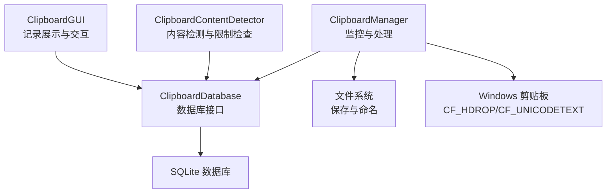
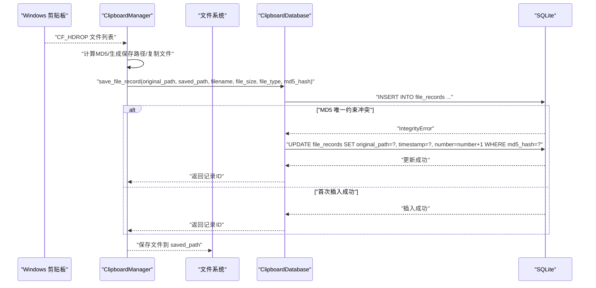
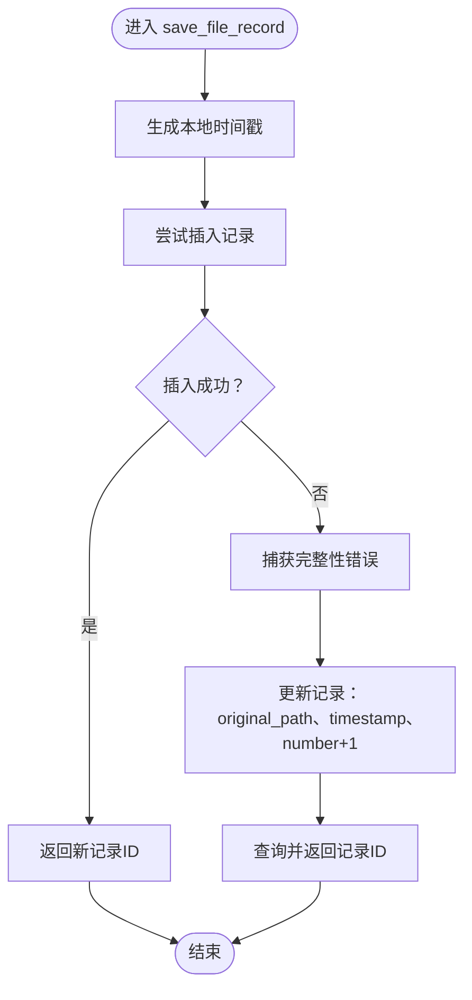
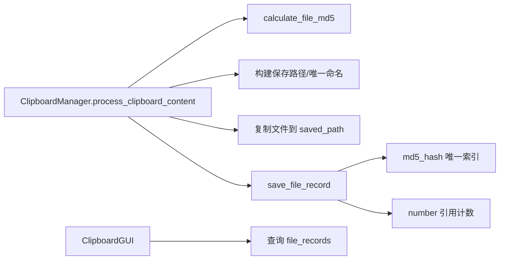

# save_file_record方法

<cite>
**本文引用的文件**
- [clipboard_db.py](file://clipboard_db.py)
- [clipboard_manager_main.py](file://clipboard_manager_main.py)
- [clipboard_content_detector.py](file://clipboard_content_detector.py)
- [clipboard_gui.py](file://clipboard_gui.py)
</cite>

## 目录
1. [简介](#简介)
2. [项目结构](#项目结构)
3. [核心组件](#核心组件)
4. [架构总览](#架构总览)
5. [详细组件分析](#详细组件分析)
6. [依赖关系分析](#依赖关系分析)
7. [性能考量](#性能考量)
8. [故障排查指南](#故障排查指南)
9. [结论](#结论)
10. [附录](#附录)

## 简介
本文件围绕 save_file_record 方法进行全面、系统化的文档化，重点说明以下六个参数的用途与行为：
- original_path（原始文件路径）
- saved_path（保存路径）
- filename（文件名）
- file_size（文件大小）
- file_type（文件类型）
- md5_hash（文件内容哈希）

文档还解释该方法如何使用 MD5 哈希作为唯一标识符，在检测到重复文件时更新原始路径与时间戳并递增引用计数；说明 file_type 字段通常存储文件扩展名或分类标签，用于后续分类显示；同时指出该方法会返回记录 ID，并在遇到完整性错误时执行更新操作。最后给出典型使用场景示例，帮助读者理解该方法在整个系统中的作用与调用流程。

## 项目结构
本仓库围绕“剪贴板历史记录管理”展开，核心文件包括：
- 数据库层：clipboard_db.py 定义数据库初始化、表结构、记录保存与查询等
- 主程序与监控：clipboard_manager_main.py 实现剪贴板监控、文件处理、MD5 计算与保存
- GUI 展示：clipboard_gui.py 负责记录展示、排序、搜索与交互
- 内容检测：clipboard_content_detector.py 提供剪贴板内容检测与格式识别辅助

图表来源
- [clipboard_manager_main.py](file://clipboard_manager_main.py#L355-L496)
- [clipboard_db.py](file://clipboard_db.py#L1-L115)
- [clipboard_gui.py](file://clipboard_gui.py#L600-L626)
- [clipboard_content_detector.py](file://clipboard_content_detector.py#L1-L120)

章节来源
- [clipboard_manager_main.py](file://clipboard_manager_main.py#L355-L496)
- [clipboard_db.py](file://clipboard_db.py#L1-L115)
- [clipboard_gui.py](file://clipboard_gui.py#L600-L626)
- [clipboard_content_detector.py](file://clipboard_content_detector.py#L1-L120)

## 核心组件
- ClipboardDatabase.save_file_record：负责将文件记录写入数据库，若 MD5 已存在则更新时间戳与引用计数并返回已有记录 ID
- ClipboardManager.process_clipboard_content：监控剪贴板，计算文件 MD5、构建保存路径、复制文件并调用 save_file_record
- ClipboardGUI：展示文件记录，其中 file_type 用于显示文件类型列
- ClipboardContentDetector：提供格式识别与复制限制检查能力

章节来源
- [clipboard_db.py](file://clipboard_db.py#L152-L183)
- [clipboard_manager_main.py](file://clipboard_manager_main.py#L416-L454)
- [clipboard_gui.py](file://clipboard_gui.py#L600-L626)
- [clipboard_content_detector.py](file://clipboard_content_detector.py#L1-L120)

## 架构总览
save_file_record 的调用链路如下：
- 剪贴板监控检测到文件列表
- 计算文件 MD5 并生成保存路径
- 复制文件到目标位置
- 调用 save_file_record 保存记录
- 数据库层通过 UNIQUE 约束与异常捕获实现去重与计数更新

图表来源
- [clipboard_manager_main.py](file://clipboard_manager_main.py#L416-L454)
- [clipboard_db.py](file://clipboard_db.py#L152-L183)

章节来源
- [clipboard_manager_main.py](file://clipboard_manager_main.py#L416-L454)
- [clipboard_db.py](file://clipboard_db.py#L152-L183)

## 详细组件分析

### save_file_record 方法详解
- 参数说明
  - original_path：原始文件路径，用于记录用户复制时的源路径
  - saved_path：最终保存到磁盘的目标路径，可能与原始路径不同（例如重名或唯一命名）
  - filename：文件名（不含路径）
  - file_size：文件大小（字节）
  - file_type：文件类型，通常为扩展名或分类标签（如 images、documents 等）
  - md5_hash：文件内容的 MD5 哈希，作为唯一标识符
- 行为特征
  - 首次保存：插入一条新记录，number 初始为 1
  - 重复检测：当 md5_hash 已存在于 file_records 表且受 UNIQUE 约束保护时，捕获完整性错误并执行更新
  - 更新内容：更新 original_path（可能指向最新来源）、timestamp（本地时间）与 number（引用计数 +1）
  - 返回值：始终返回记录 ID（新插入或已存在记录的 ID）

图表来源
- [clipboard_db.py](file://clipboard_db.py#L152-L183)

章节来源
- [clipboard_db.py](file://clipboard_db.py#L152-L183)

### 参数用途与数据模型
- original_path：记录原始来源路径，便于追溯与定位
- saved_path：记录最终落盘路径，可能因重名或唯一命名而与 original_path 不同
- filename：文件名，用于展示与检索
- file_size：文件大小，用于统计与排序
- file_type：文件类型，通常为扩展名或分类标签，用于后续分类显示与筛选
- md5_hash：内容指纹，确保去重与引用计数的正确性

章节来源
- [clipboard_db.py](file://clipboard_db.py#L54-L83)
- [clipboard_manager_main.py](file://clipboard_manager_main.py#L36-L55)
- [clipboard_gui.py](file://clipboard_gui.py#L609-L616)

### 重复检测与引用计数
- 去重机制：file_records 表的 md5_hash 字段具备 UNIQUE 约束，避免重复内容入库
- 引用计数：当检测到重复 MD5 时，通过 number 字段递增，表示同一内容被多次保存
- 时间戳更新：重复保存时更新 timestamp，反映最近一次出现的时间

章节来源
- [clipboard_db.py](file://clipboard_db.py#L54-L83)
- [clipboard_db.py](file://clipboard_db.py#L152-L183)
- [clipboard_manager_main.py](file://clipboard_manager_main.py#L416-L454)

### file_type 字段的分类与显示
- 分类来源：在保存文件时，根据文件扩展名推导 file_type（如 images、documents、videos 等）
- 展示用途：GUI 中将 file_type 用于显示文件类型列，便于用户快速识别文件类别

章节来源
- [clipboard_manager_main.py](file://clipboard_manager_main.py#L36-L55)
- [clipboard_gui.py](file://clipboard_gui.py#L609-L616)

### 典型使用场景示例
- 场景一：用户复制多个图片文件
  - 监控检测到 CF_HDROP，计算每张图片 MD5，生成带 MD5 前缀的唯一文件名，复制到分类目录
  - 调用 save_file_record 保存记录，若重复则更新时间戳与引用计数
- 场景二：用户复制同一文件的不同版本
  - 若内容相同（MD5 相同），数据库层自动去重并递增引用计数
- 场景三：GUI 展示与排序
  - file_type 用于“类型”列显示，支持按类型、大小、次数等字段排序

章节来源
- [clipboard_manager_main.py](file://clipboard_manager_main.py#L416-L454)
- [clipboard_gui.py](file://clipboard_gui.py#L609-L616)

## 依赖关系分析
- save_file_record 依赖 SQLite 的 UNIQUE 约束与异常处理
- 剪贴板监控依赖 Windows 剪贴板 API（CF_HDROP/CF_UNICODETEXT）
- GUI 依赖数据库查询结果进行展示与排序

图表来源
- [clipboard_manager_main.py](file://clipboard_manager_main.py#L24-L35)
- [clipboard_manager_main.py](file://clipboard_manager_main.py#L416-L454)
- [clipboard_db.py](file://clipboard_db.py#L54-L83)
- [clipboard_gui.py](file://clipboard_gui.py#L609-L616)

章节来源
- [clipboard_manager_main.py](file://clipboard_manager_main.py#L24-L35)
- [clipboard_manager_main.py](file://clipboard_manager_main.py#L416-L454)
- [clipboard_db.py](file://clipboard_db.py#L54-L83)
- [clipboard_gui.py](file://clipboard_gui.py#L609-L616)

## 性能考量
- MD5 计算：大文件逐块读取，避免一次性占用内存过高
- 唯一索引：md5_hash 唯一约束保证去重效率，但需注意 INSERT/UPDATE 的开销
- 引用计数：通过 number 字段减少重复内容的存储与索引压力
- I/O 优化：仅在文件不存在时复制，避免重复写入

章节来源
- [clipboard_manager_main.py](file://clipboard_manager_main.py#L24-L35)
- [clipboard_manager_main.py](file://clipboard_manager_main.py#L416-L454)
- [clipboard_db.py](file://clipboard_db.py#L54-L83)

## 故障排查指南
- 重复保存未生效
  - 检查 md5_hash 是否正确计算且一致
  - 确认 file_records 表是否存在 md5_hash 唯一约束
- 引用计数未递增
  - 确认 save_file_record 是否捕获到 IntegrityError 并执行 UPDATE
  - 检查 number 字段是否存在并默认为 1
- GUI 类型列显示异常
  - 确认 file_type 是否正确传入（扩展名或分类标签）
  - 检查 GUI 层是否使用 file_type 进行显示

章节来源
- [clipboard_db.py](file://clipboard_db.py#L54-L83)
- [clipboard_db.py](file://clipboard_db.py#L152-L183)
- [clipboard_gui.py](file://clipboard_gui.py#L609-L616)

## 结论
save_file_record 方法通过 md5_hash 实现内容级去重与引用计数，结合 original_path、saved_path、filename、file_size、file_type 等字段，形成完整的文件记录体系。其在数据库层利用 UNIQUE 约束与异常处理实现幂等保存，既保证了数据一致性，又提升了用户体验。配合剪贴板监控与 GUI 展示，该方法构成了“复制即保存、重复即计数”的核心能力。

## 附录
- 参数速查
  - original_path：原始来源路径
  - saved_path：最终保存路径
  - filename：文件名
  - file_size：文件大小（字节）
  - file_type：文件类型（扩展名或分类标签）
  - md5_hash：文件内容哈希（唯一标识符）