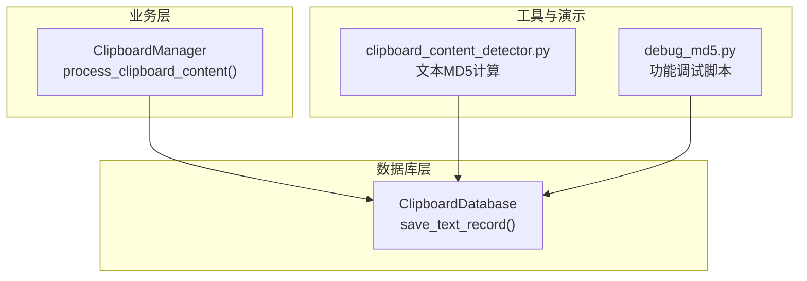
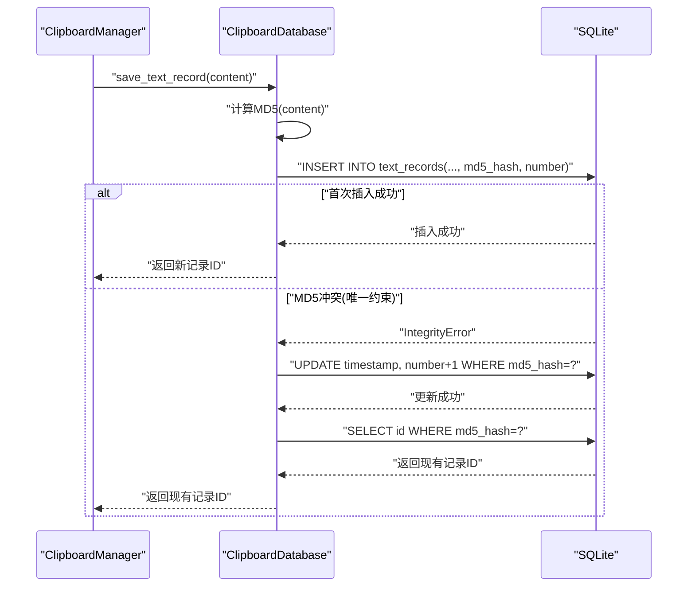
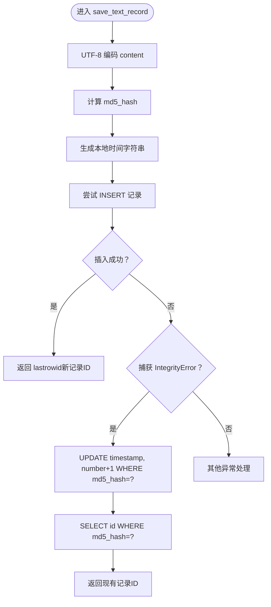
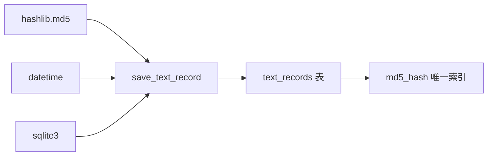

# save_text_record方法

<cite>
**本文引用的文件**
- [clipboard_db.py](file://clipboard_db.py)
- [clipboard_manager_main.py](file://clipboard_manager_main.py)
- [debug_md5.py](file://debug_md5.py)
- [clipboard_content_detector.py](file://clipboard_content_detector.py)
</cite>

## 目录
1. [简介](#简介)
2. [项目结构](#项目结构)
3. [核心组件](#核心组件)
4. [架构概览](#架构概览)
5. [详细组件分析](#详细组件分析)
6. [依赖关系分析](#依赖关系分析)
7. [性能考量](#性能考量)
8. [故障排查指南](#故障排查指南)
9. [结论](#结论)
10. [附录](#附录)

## 简介
本文件围绕 save_text_record 方法进行全面、深入且易于理解的文档化，重点覆盖以下方面：
- 参数 content 接收 UTF-8 编码的文本内容；
- 方法内部如何计算 MD5 哈希值用于去重；
- 插入新记录时同时存储字符数与本地时间戳的实现逻辑；
- 当遇到 sqlite3.IntegrityError 异常时的更新策略：对已存在的 MD5 哈希值记录更新时间戳并递增 number 计数器；
- 返回值说明：成功插入时返回新记录 ID，更新时返回现有记录 ID；
- 实际使用示例：展示如何保存普通文本和长文本内容。

## 项目结构
本仓库采用模块化设计，save_text_record 方法位于数据库层模块中，负责将剪贴板文本内容持久化到 SQLite 数据库，并通过 MD5 去重与计数机制避免重复存储。

图表来源
- [clipboard_db.py](file://clipboard_db.py#L116-L151)
- [clipboard_manager_main.py](file://clipboard_manager_main.py#L463-L487)
- [clipboard_content_detector.py](file://clipboard_content_detector.py#L139-L142)
- [debug_md5.py](file://debug_md5.py#L1-L56)

章节来源
- [clipboard_db.py](file://clipboard_db.py#L1-L151)
- [clipboard_manager_main.py](file://clipboard_manager_main.py#L395-L496)

## 核心组件
- ClipboardDatabase.save_text_record(content)
  - 功能：保存文本记录，基于 MD5 去重；首次插入时写入 content、timestamp、char_count、md5_hash、number；重复时更新 timestamp 并递增 number。
  - 参数：content（UTF-8 编码的字符串）
  - 返回：新插入记录的 ID 或已存在记录的 ID
  - 异常：当插入触发唯一约束冲突时捕获 sqlite3.IntegrityError 并执行更新逻辑

章节来源
- [clipboard_db.py](file://clipboard_db.py#L116-L151)

## 架构概览
save_text_record 的调用链路如下：业务层 ClipboardManager 在检测到剪贴板文本变化后，调用数据库层 ClipboardDatabase.save_text_record，后者完成 MD5 计算、插入或更新操作，并返回记录 ID。

图表来源
- [clipboard_manager_main.py](file://clipboard_manager_main.py#L463-L487)
- [clipboard_db.py](file://clipboard_db.py#L116-L151)

## 详细组件分析

### 方法签名与职责
- 方法：ClipboardDatabase.save_text_record(content)
- 输入：UTF-8 编码的字符串 content
- 输出：整数 ID（新插入或已存在记录）
- 关键行为：
  - 计算 content 的 MD5 哈希值，用于去重；
  - 使用本地时间字符串作为 timestamp；
  - 首次插入时写入 char_count=len(content)、number=1；
  - 若 MD5 已存在，则更新 timestamp 并递增 number，随后查询并返回现有记录 ID。

章节来源
- [clipboard_db.py](file://clipboard_db.py#L116-L151)

### 数据模型与字段说明
- 表：text_records
- 字段：
  - id：自增主键
  - content：TEXT，原始文本内容
  - timestamp：DATETIME，默认 CURRENT_TIMESTAMP（方法中使用本地时间字符串覆盖）
  - char_count：INTEGER，记录字符数
  - md5_hash：TEXT，唯一索引，用于去重
  - number：INTEGER，默认 1，用于统计重复次数

章节来源
- [clipboard_db.py](file://clipboard_db.py#L23-L45)
- [clipboard_manager_main.py](file://clipboard_manager_main.py#L66-L76)

### MD5 去重与计数逻辑
- MD5 计算：对 content 进行 UTF-8 编码后计算十六进制摘要；
- 唯一性约束：md5_hash 字段具有唯一索引；
- 冲突处理：若 IntegrityError 发生，执行 UPDATE timestamp 和 number+1，然后查询并返回现有记录 ID。

图表来源
- [clipboard_db.py](file://clipboard_db.py#L116-L151)

### 插入新记录时的字段填充
- 插入字段：content、timestamp（本地时间）、char_count（len(content)）、md5_hash、number（默认 1）
- 插入成功后立即 commit 并返回新记录 ID

章节来源
- [clipboard_db.py](file://clipboard_db.py#L127-L136)

### 冲突时的更新策略
- 更新字段：timestamp（本地时间）、number（自增 1）
- 查询现有记录 ID 并返回

章节来源
- [clipboard_db.py](file://clipboard_db.py#L137-L150)

### 与业务层的集成
- ClipboardManager 在检测到剪贴板文本变化时，会调用 save_text_record 并打印记录 ID 与字符数等信息，便于用户感知保存结果。

章节来源
- [clipboard_manager_main.py](file://clipboard_manager_main.py#L463-L487)

### 实际使用示例

- 保存普通文本
  - 场景：复制一段短文本到剪贴板，系统检测到变化后调用 save_text_record；
  - 结果：首次插入返回新记录 ID，后续相同内容重复保存时返回同一记录 ID 并递增 number。

- 保存长文本
  - 场景：复制一段较长文本（例如由调试脚本构造的长文本），系统检测到变化后调用 save_text_record；
  - 结果：首次插入返回新记录 ID；再次保存相同内容时，返回同一记录 ID 并递增 number。

章节来源
- [debug_md5.py](file://debug_md5.py#L1-L56)
- [clipboard_content_detector.py](file://clipboard_content_detector.py#L139-L142)

## 依赖关系分析
- save_text_record 依赖：
  - hashlib.md5：计算 content 的 MD5 哈希；
  - sqlite3：连接数据库、执行 INSERT/UPDATE/SELECT；
  - datetime：生成本地时间字符串；
  - text_records 表结构与唯一索引 md5_hash。

图表来源
- [clipboard_db.py](file://clipboard_db.py#L116-L151)

章节来源
- [clipboard_db.py](file://clipboard_db.py#L1-L151)

## 性能考量
- MD5 计算：对大文本进行哈希计算的时间复杂度为 O(n)，其中 n 为字符数；建议避免对超大文本频繁重复保存，以减少重复哈希开销。
- 唯一索引：md5_hash 唯一索引可快速判断重复，但 INSERT/UPDATE 仍需访问索引，建议在高并发场景下注意事务提交与锁竞争。
- 字符数统计：插入时一次性计算 len(content)，避免后续查询时重复计算。
- 本地时间：使用本地时间字符串而非 UTC，便于用户直观理解时间，但跨时区场景需注意一致性问题。

## 故障排查指南
- IntegrityError 异常
  - 现象：插入时触发唯一约束冲突；
  - 处理：方法内捕获异常并执行更新逻辑，随后查询返回现有记录 ID；
  - 建议：确认 md5_hash 是否正确生成（UTF-8 编码）以及数据库中是否存在重复数据。

- 返回值异常
  - 现象：返回 None；
  - 处理：检查 SELECT 查询是否能命中 md5_hash；确认数据库连接与事务提交流程正常。

- 字符数不一致
  - 现象：char_count 与实际长度不符；
  - 处理：确认传入 content 的编码方式为 UTF-8；检查 len(content) 的计算逻辑。

章节来源
- [clipboard_db.py](file://clipboard_db.py#L137-L150)

## 结论
save_text_record 方法通过 MD5 去重与 number 计数，实现了对重复文本内容的高效管理。其设计简洁、逻辑清晰：首次插入时写入必要字段并返回新 ID；重复时更新时间戳并递增计数，最终返回现有 ID。结合业务层 ClipboardManager 的剪贴板监控，该方法能够稳定地记录用户复制的历史文本，并支持后续查询与统计。

## 附录

### API 定义与行为说明
- 方法：save_text_record(content)
- 参数：
  - content：UTF-8 编码的字符串
- 返回：
  - 成功插入：新记录 ID（整数）
  - 更新现有：现有记录 ID（整数）
- 异常：
  - IntegrityError：触发时执行更新并返回现有 ID

章节来源
- [clipboard_db.py](file://clipboard_db.py#L116-L151)