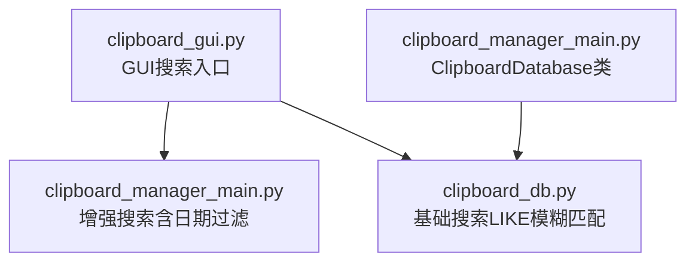
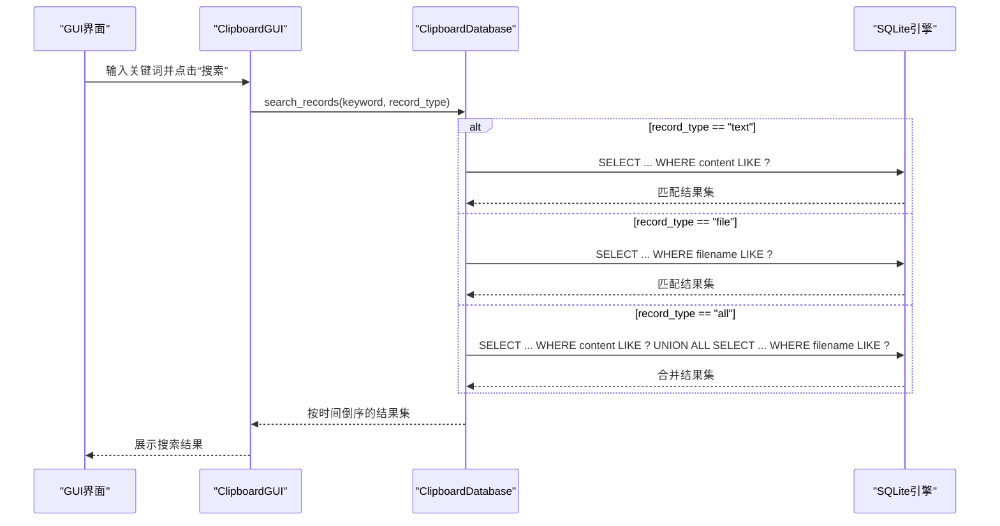
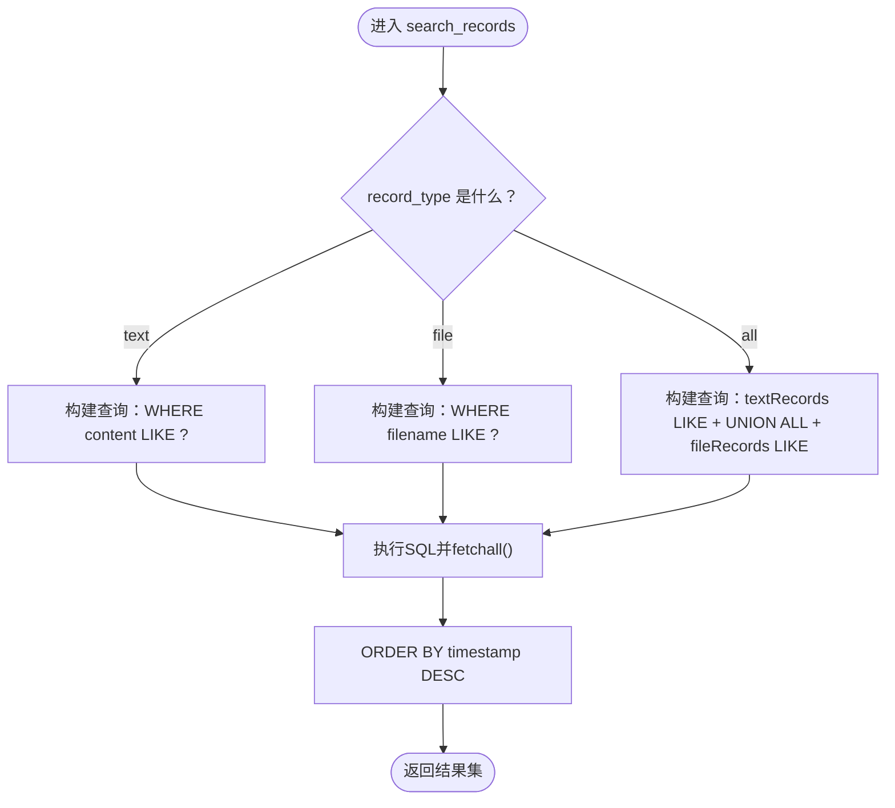
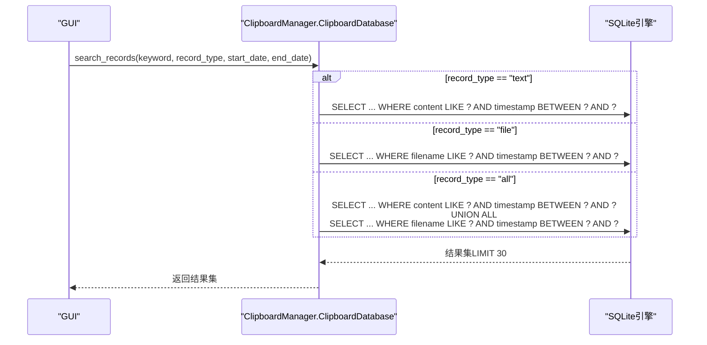
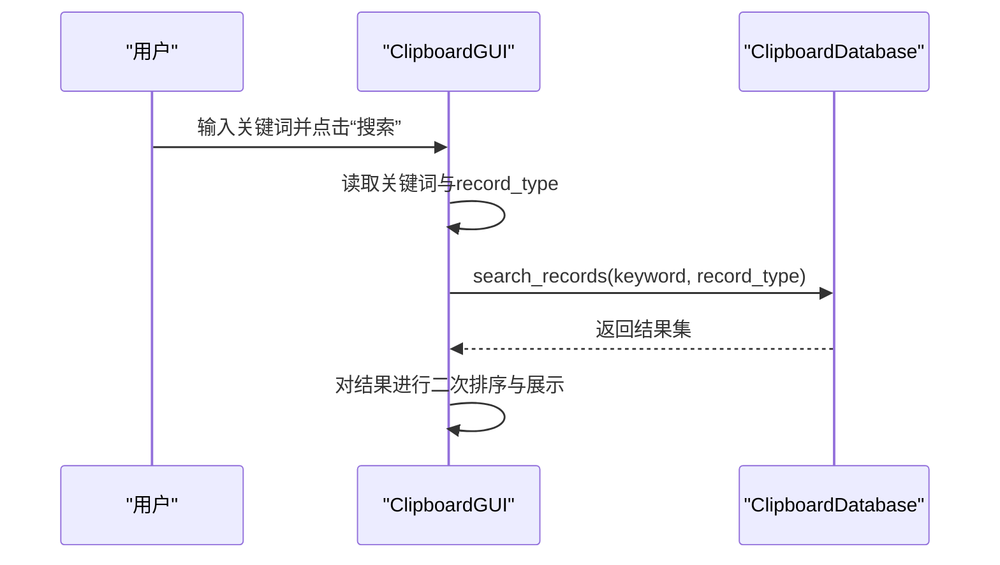

# search_records方法

<cite>
**本文引用的文件**
- [clipboard_db.py](file://clipboard_db.py)
- [clipboard_manager_main.py](file://clipboard_manager_main.py)
- [clipboard_gui.py](file://clipboard_gui.py)
</cite>

## 目录
1. [简介](#简介)
2. [项目结构](#项目结构)
3. [核心组件](#核心组件)
4. [架构总览](#架构总览)
5. [详细组件分析](#详细组件分析)
6. [依赖关系分析](#依赖关系分析)
7. [性能考量](#性能考量)
8. [故障排查指南](#故障排查指南)
9. [结论](#结论)
10. [附录](#附录)

## 简介
本文围绕 search_records 方法的搜索机制进行深入文档化，重点说明：
- keyword 参数如何实现模糊匹配（通配符匹配）
- record_type 参数支持 'text'、'file' 和 'all' 三种搜索范围
- SQL LIKE 操作符的使用及通配符策略
- 对文本记录搜索 content 字段，对文件记录搜索 filename 字段
- 当 record_type 为 'all' 时，通过 UNION ALL 合并两类记录并按时间倒序排列
- 提供搜索示例，包括关键词搜索、纯文本搜索和纯文件搜索的调用方法

## 项目结构
本仓库包含多个模块，其中与 search_records 直接相关的关键文件如下：
- 数据库层：clipboard_db.py，提供基础的数据库连接与查询能力
- 主程序与高级搜索：clipboard_manager_main.py，提供带日期过滤的增强搜索
- GUI 层：clipboard_gui.py，提供基于界面的搜索入口与展示

图表来源
- [clipboard_gui.py](file://clipboard_gui.py#L652-L716)
- [clipboard_manager_main.py](file://clipboard_manager_main.py#L213-L260)
- [clipboard_db.py](file://clipboard_db.py#L281-L314)

章节来源
- [clipboard_gui.py](file://clipboard_gui.py#L652-L716)
- [clipboard_manager_main.py](file://clipboard_manager_main.py#L213-L260)
- [clipboard_db.py](file://clipboard_db.py#L281-L314)

## 核心组件
- ClipboardDatabase.search_records（基础搜索）
  - 支持 keyword 模糊匹配与 record_type 三态筛选
  - 使用 SQL LIKE 实现通配符匹配
  - 文本记录搜索 content 字段，文件记录搜索 filename 字段
  - 'all' 情况下使用 UNION ALL 合并两类记录并按时间倒序
- ClipboardManager.ClipboardDatabase.search_records（增强搜索）
  - 在基础搜索基础上增加 start_date、end_date 日期过滤
  - 结果集默认限制 30 条，便于 GUI 展示
- GUI 层 ClipboardGUI.search_records
  - 从界面获取关键词，调用数据库搜索并展示结果

章节来源
- [clipboard_db.py](file://clipboard_db.py#L281-L314)
- [clipboard_manager_main.py](file://clipboard_manager_main.py#L213-L260)
- [clipboard_gui.py](file://clipboard_gui.py#L652-L716)

## 架构总览
search_records 的调用链路如下：
- GUI 层触发搜索（可选：record_type='all' 或由用户选择）
- 调用数据库层的 search_records
- 数据库层执行 LIKE 模糊匹配，必要时使用 UNION ALL 合并
- 返回结果集，GUI 层进行展示与二次排序

图表来源
- [clipboard_gui.py](file://clipboard_gui.py#L652-L716)
- [clipboard_db.py](file://clipboard_db.py#L281-L314)

## 详细组件分析

### 基础搜索：ClipboardDatabase.search_records
- 关键点
  - keyword 使用 SQL LIKE 的通配符策略：两端拼接百分号，实现任意位置模糊匹配
  - record_type 三态：
    - 'text'：仅搜索文本记录 content 字段
    - 'file'：仅搜索文件记录 filename 字段
    - 'all'：使用 UNION ALL 合并两类记录，并统一按 timestamp DESC 排序
  - 返回字段统一为：type、id、info（文本为 content，文件为 filename）、timestamp

图表来源
- [clipboard_db.py](file://clipboard_db.py#L281-L314)

章节来源
- [clipboard_db.py](file://clipboard_db.py#L281-L314)

### 增强搜索：ClipboardManager.ClipboardDatabase.search_records
- 关键点
  - 在基础 LIKE 模糊匹配之上，支持 start_date、end_date 日期过滤
  - 查询末尾追加 ORDER BY timestamp DESC LIMIT 30，便于 GUI 快速展示
  - 返回字段包含 size_md5（文本为 char_count，文件为 md5_hash），便于界面显示

图表来源
- [clipboard_manager_main.py](file://clipboard_manager_main.py#L213-L260)

章节来源
- [clipboard_manager_main.py](file://clipboard_manager_main.py#L213-L260)

### GUI 层搜索入口与展示
- 关键点
  - GUI 层提供搜索入口，从输入框获取关键词
  - 默认调用 record_type='all'
  - 调用数据库 search_records 并进行二次排序与展示

图表来源
- [clipboard_gui.py](file://clipboard_gui.py#L652-L716)

章节来源
- [clipboard_gui.py](file://clipboard_gui.py#L652-L716)

## 依赖关系分析
- GUI 层依赖数据库层接口
- 数据库层提供基础 LIKE 模糊匹配
- 增强搜索在基础搜索之上扩展了日期过滤与结果集限制
- 三者之间耦合度低，职责清晰：UI 负责交互，DB 负责数据访问，Manager 负责业务逻辑与增强能力

图表来源
- [clipboard_gui.py](file://clipboard_gui.py#L652-L716)
- [clipboard_manager_main.py](file://clipboard_manager_main.py#L213-L260)
- [clipboard_db.py](file://clipboard_db.py#L281-L314)

章节来源
- [clipboard_gui.py](file://clipboard_gui.py#L652-L716)
- [clipboard_manager_main.py](file://clipboard_manager_main.py#L213-L260)
- [clipboard_db.py](file://clipboard_db.py#L281-L314)

## 性能考量
- LIKE 模糊匹配的性能
  - 两端通配符（%keyword%）会导致全表扫描，无法利用索引，建议在大数据量场景下：
    - 优先使用精确匹配或前缀匹配（如 keyword%）
    - 或考虑建立合适的索引（如 content、filename 的索引）
- UNION ALL 合并
  - 'all' 模式会分别查询两类表并合并，注意避免重复扫描同一表
- 结果集限制
  - 增强搜索默认 LIMIT 30，有助于减少 UI 层渲染压力
- 日期过滤
  - 在增强搜索中加入 start_date/end_date 可显著缩小扫描范围，提升性能

[本节为通用性能建议，不直接分析具体文件]

## 故障排查指南
- 搜索无结果
  - 检查关键词是否过短或包含特殊字符导致匹配不到
  - 确认 record_type 是否正确（如仅搜索文本或文件）
- 性能缓慢
  - 大数据量下 LIKE 两端通配符可能导致全表扫描
  - 建议优化为前缀匹配或增加索引
- 日期过滤无效
  - 确认增强搜索接口是否传入了 start_date、end_date
- GUI 展示异常
  - 检查 GUI 层二次排序逻辑是否正常执行
  - 确认数据库连接与 fetchall 是否成功

章节来源
- [clipboard_db.py](file://clipboard_db.py#L281-L314)
- [clipboard_manager_main.py](file://clipboard_manager_main.py#L213-L260)
- [clipboard_gui.py](file://clipboard_gui.py#L652-L716)

## 结论
search_records 方法通过 SQL LIKE 实现灵活的模糊匹配，支持按记录类型细分搜索范围，并在 'all' 模式下使用 UNION ALL 合并两类记录，最终统一按时间倒序返回。GUI 层提供直观的搜索入口，增强搜索在基础能力上增加了日期过滤与结果集限制，兼顾易用性与性能。对于大规模数据，建议优化匹配策略与索引设计，以获得更佳的响应速度。

[本节为总结性内容，不直接分析具体文件]

## 附录

### 调用示例与最佳实践
- 关键词搜索（默认搜索全部类型）
  - GUI 层：在搜索框输入关键词并点击“搜索”，record_type 默认为 'all'
  - 参考路径：[clipboard_gui.py](file://clipboard_gui.py#L652-L716)
- 纯文本搜索
  - GUI 层：在类型下拉框选择 'text'，输入关键词后搜索
  - 参考路径：[clipboard_gui.py](file://clipboard_gui.py#L691-L716)
- 纯文件搜索
  - GUI 层：在类型下拉框选择 'file'，输入关键词后搜索
  - 参考路径：[clipboard_gui.py](file://clipboard_gui.py#L691-L716)
- 增强搜索（带日期过滤）
  - 使用增强搜索接口，传入 keyword、record_type、start_date、end_date
  - 参考路径：[clipboard_manager_main.py](file://clipboard_manager_main.py#L213-L260)

章节来源
- [clipboard_gui.py](file://clipboard_gui.py#L652-L716)
- [clipboard_manager_main.py](file://clipboard_manager_main.py#L213-L260)