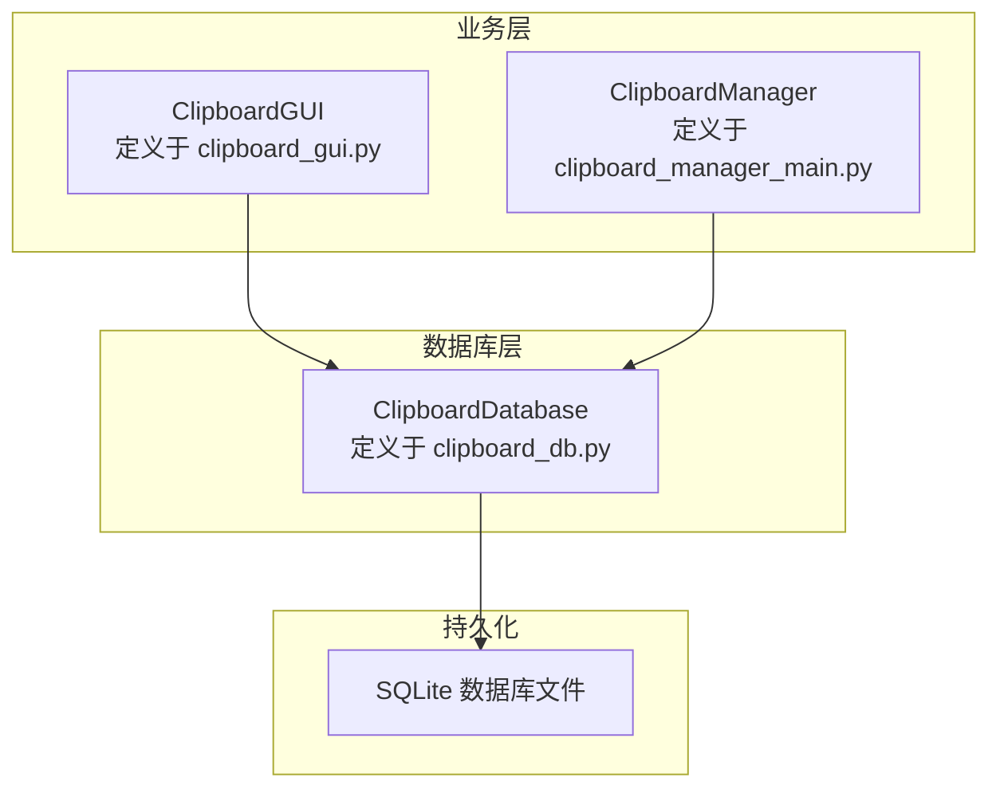
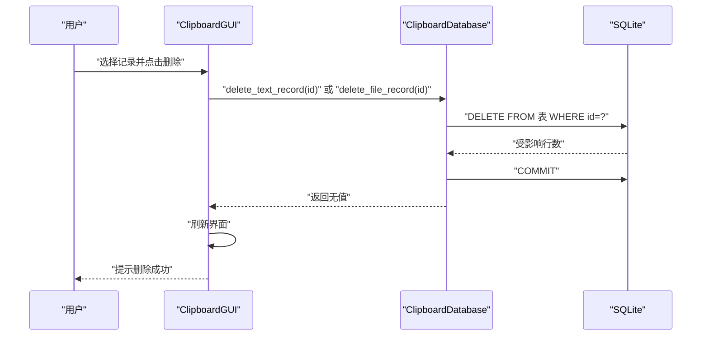
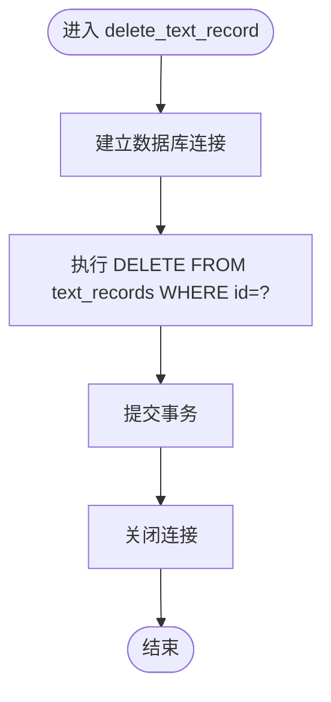
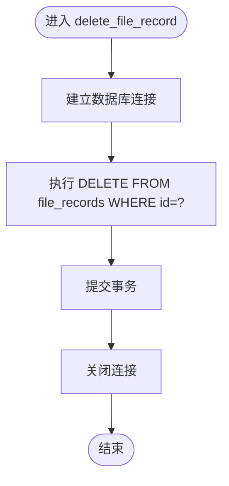
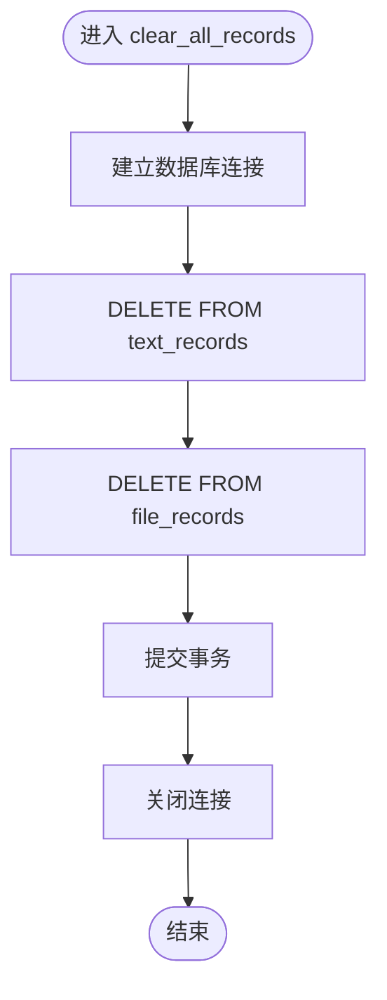

# 删除操作方法

<cite>
**本文引用的文件**
- [clipboard_db.py](file://clipboard_db.py)
- [clipboard_manager_main.py](file://clipboard_manager_main.py)
- [clipboard_gui.py](file://clipboard_gui.py)
</cite>

## 目录
1. [简介](#简介)
2. [项目结构](#项目结构)
3. [核心组件](#核心组件)
4. [架构总览](#架构总览)
5. [详细组件分析](#详细组件分析)
6. [依赖关系分析](#依赖关系分析)
7. [性能考量](#性能考量)
8. [故障排查指南](#故障排查指南)
9. [结论](#结论)
10. [附录](#附录)

## 简介
本文件围绕删除相关方法进行系统化文档化，重点说明：
- delete_text_record 与 delete_file_record 如何根据记录ID从对应表中删除单条记录
- clear_all_records 的实现与事务处理过程（同时清除 text_records 与 file_records 表）
- 方法不返回值，执行后自动提交事务
- 使用场景示例：删除单条错误记录、清除特定类型所有记录等
- 重要提醒：删除操作不可逆，建议执行前进行数据备份

## 项目结构
本项目采用“数据库类 + GUI/主程序”的分层设计。删除逻辑集中在数据库类中，GUI负责触发调用与用户交互。

图表来源
- [clipboard_db.py](file://clipboard_db.py#L1-L120)
- [clipboard_gui.py](file://clipboard_gui.py#L839-L943)
- [clipboard_manager_main.py](file://clipboard_manager_main.py#L355-L496)

章节来源
- [clipboard_db.py](file://clipboard_db.py#L1-L120)
- [clipboard_gui.py](file://clipboard_gui.py#L839-L943)
- [clipboard_manager_main.py](file://clipboard_manager_main.py#L355-L496)

## 核心组件
- ClipboardDatabase：封装数据库初始化、增删改查、统计、清理过期记录等能力。删除相关方法位于该类中。
- ClipboardGUI：提供图形界面，负责触发删除操作（单条与全部），并在操作后刷新界面。
- ClipboardManager：负责剪贴板监控与数据落库，不直接参与删除逻辑。

章节来源
- [clipboard_db.py](file://clipboard_db.py#L1-L120)
- [clipboard_gui.py](file://clipboard_gui.py#L839-L943)
- [clipboard_manager_main.py](file://clipboard_manager_main.py#L355-L496)

## 架构总览
删除流程在 GUI 中由用户触发，GUI 调用数据库类提供的删除方法；数据库类通过连接 SQLite 执行 DELETE 语句，并在每个方法内手动提交事务，随后关闭连接。

图表来源
- [clipboard_gui.py](file://clipboard_gui.py#L839-L943)
- [clipboard_db.py](file://clipboard_db.py#L334-L349)

## 详细组件分析

### delete_text_record 方法
- 功能：根据记录ID从 text_records 表中删除单条记录
- 实现要点：
  - 建立数据库连接
  - 执行 DELETE 语句（WHERE id=?）
  - 立即提交事务
  - 关闭连接
- 返回值：无（None）
- 错误处理：未显式捕获异常，若ID不存在则无影响（无行被删除）

图表来源
- [clipboard_db.py](file://clipboard_db.py#L334-L341)

章节来源
- [clipboard_db.py](file://clipboard_db.py#L334-L341)
- [clipboard_gui.py](file://clipboard_gui.py#L839-L943)

### delete_file_record 方法
- 功能：根据记录ID从 file_records 表中删除单条记录
- 实现要点：
  - 建立数据库连接
  - 执行 DELETE 语句（WHERE id=?）
  - 立即提交事务
  - 关闭连接
- 返回值：无（None）
- 错误处理：未显式捕获异常，若ID不存在则无影响（无行被删除）

图表来源
- [clipboard_db.py](file://clipboard_db.py#L342-L349)

章节来源
- [clipboard_db.py](file://clipboard_db.py#L342-L349)
- [clipboard_gui.py](file://clipboard_gui.py#L839-L943)

### clear_all_records 方法
- 功能：同时清除 text_records 与 file_records 表中的所有数据
- 实现要点：
  - 建立数据库连接
  - 先删除 text_records 表
  - 再删除 file_records 表
  - 立即提交事务
  - 关闭连接
- 返回值：无（None）
- 错误处理：未显式捕获异常，若表为空则无影响（无行被删除）

图表来源
- [clipboard_db.py](file://clipboard_db.py#L350-L358)

章节来源
- [clipboard_db.py](file://clipboard_db.py#L350-L358)
- [clipboard_gui.py](file://clipboard_gui.py#L913-L943)

### 事务处理与提交行为
- 单条删除方法（delete_text_record、delete_file_record）在各自方法内部完成：
  - 建立连接
  - 执行 DELETE
  - 立即 COMMIT
  - 关闭连接
- 全部删除方法（clear_all_records）同样在方法内部完成：
  - 建立连接
  - 依次执行两次 DELETE
  - 立即 COMMIT
  - 关闭连接
- 结论：这些删除方法均不返回值，且在执行后自动提交事务。

章节来源
- [clipboard_db.py](file://clipboard_db.py#L334-L358)

### 使用场景示例
- 删除单条错误记录
  - 用户在 GUI 中选中一条记录，点击删除
  - GUI 调用数据库类的 delete_text_record 或 delete_file_record
  - 刷新界面并提示成功
- 清除特定类型所有记录
  - 通过 GUI 的“重置所有记录”入口，确认后调用 clear_all_records
  - 同时清空 text_records 与 file_records 表
  - 可选地清理本地缓存目录（由 GUI 完成）

章节来源
- [clipboard_gui.py](file://clipboard_gui.py#L839-L943)

## 依赖关系分析
- GUI 依赖数据库类提供的删除方法
- 数据库类依赖 SQLite 存储引擎
- 删除方法之间无相互依赖，耦合度低，职责单一

图表来源
- [clipboard_gui.py](file://clipboard_gui.py#L839-L943)
- [clipboard_db.py](file://clipboard_db.py#L334-L358)

章节来源
- [clipboard_gui.py](file://clipboard_gui.py#L839-L943)
- [clipboard_db.py](file://clipboard_db.py#L334-L358)

## 性能考量
- 单条删除：DELETE 语句针对单一主键条件，性能稳定，开销极低
- 全量删除：两次 DELETE 顺序执行，提交一次事务，整体开销较小
- 事务粒度：每个方法内独立提交，避免长事务占用资源
- 建议：批量删除或频繁删除时，可考虑在上层合并多次调用为一次性 clear_all_records，减少连接与提交次数

## 故障排查指南
- 删除无效
  - 确认传入的记录ID是否存在
  - 确认数据库文件路径正确且可写
- 删除后未生效
  - 确认 GUI 已刷新界面（调用 load_records）
- 数据库异常
  - 若出现异常，方法未显式捕获，建议在调用方增加 try-except 并提示用户
- 文件残留（仅限文件记录）
  - 删除文件记录后，GUI 会尝试删除本地文件（若不再被引用），如失败需手动清理

章节来源
- [clipboard_gui.py](file://clipboard_gui.py#L839-L943)
- [clipboard_db.py](file://clipboard_db.py#L334-L358)

## 结论
- delete_text_record 与 delete_file_record 提供基于ID的单条删除能力，方法内自动提交事务，无返回值
- clear_all_records 提供全表清空能力，方法内自动提交事务，无返回值
- 删除操作不可逆，建议在执行前进行数据备份

## 附录
- 重要提醒：删除操作不可逆，建议在执行前进行数据备份
- 使用建议：
  - 对于单条错误记录，优先使用 delete_text_record/delete_file_record
  - 对于批量清理或迁移场景，使用 clear_all_records
  - 清理后如需恢复，可从备份数据库文件中还原