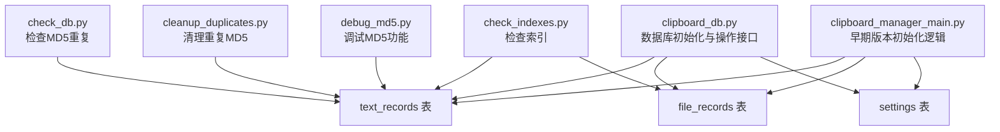
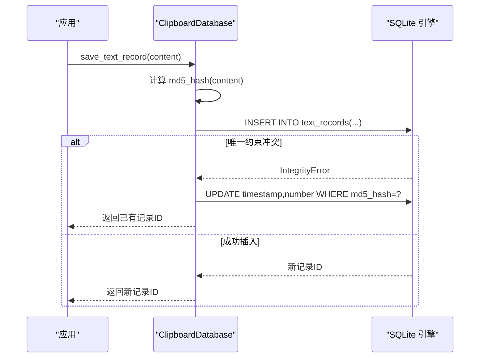
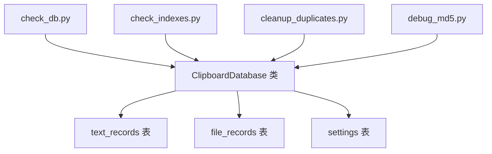

# 数据库模式与数据模型

<cite>
**本文引用的文件**
- [clipboard_db.py](file://clipboard_db.py)
- [clipboard_manager_main.py](file://clipboard_manager_main.py)
- [check_db.py](file://check_db.py)
- [check_indexes.py](file://check_indexes.py)
- [cleanup_duplicates.py](file://cleanup_duplicates.py)
- [debug_md5.py](file://debug_md5.py)
</cite>

## 目录
1. [简介](#简介)
2. [项目结构](#项目结构)
3. [核心组件](#核心组件)
4. [架构概览](#架构概览)
5. [详细组件分析](#详细组件分析)
6. [依赖分析](#依赖分析)
7. [性能考虑](#性能考虑)
8. [故障排查指南](#故障排查指南)
9. [结论](#结论)
10. [附录](#附录)

## 简介
本文件系统性地梳理并文档化本项目的数据库模式与数据模型，重点覆盖以下内容：
- 表结构定义：text_records、file_records、settings 的字段、约束与用途
- 唯一性与索引策略：MD5 哈希去重、唯一约束、索引设计
- 数据完整性约束：主键、唯一约束、CHECK 约束、外键缺失原因
- ER 关系图：三表之间的关系与去重机制
- 实际使用流程：插入、更新、查询、统计与过期清理

## 项目结构
数据库模式由两个模块共同定义：
- clipboard_db.py：当前版本的数据库初始化与操作接口，包含 text_records、file_records、settings 的创建与维护逻辑
- clipboard_manager_main.py：早期版本的数据库初始化逻辑（与 clipboard_db.py 存在差异）

此外，仓库还提供了若干辅助脚本用于检查数据库内容、索引与重复项清理。



图表来源
- [clipboard_db.py](file://clipboard_db.py#L24-L114)
- [clipboard_manager_main.py](file://clipboard_manager_main.py#L66-L110)
- [check_db.py](file://check_db.py#L9-L29)
- [check_indexes.py](file://check_indexes.py#L9-L26)
- [cleanup_duplicates.py](file://cleanup_duplicates.py#L9-L67)
- [debug_md5.py](file://debug_md5.py#L11-L56)

章节来源
- [clipboard_db.py](file://clipboard_db.py#L24-L114)
- [clipboard_manager_main.py](file://clipboard_manager_main.py#L66-L110)

## 核心组件
本项目数据库的核心由三张表构成：
- text_records：存储剪贴板文本记录，支持基于 MD5 的内容去重与引用计数
- file_records：存储剪贴板文件记录，支持基于 MD5 的文件去重与引用计数
- settings：单行配置表，用于控制复制限制、保留策略与界面行为

章节来源
- [clipboard_db.py](file://clipboard_db.py#L24-L114)
- [clipboard_manager_main.py](file://clipboard_manager_main.py#L66-L110)

## 架构概览
下图展示三表之间的关系与去重机制。MD5 哈希作为内容/文件的唯一标识，通过唯一约束或唯一索引实现去重；number 字段用于记录重复次数的累加。

```mermaid
erDiagram
TEXT_RECORDS {
integer id PK
text content
datetime timestamp
integer char_count
text md5_hash UK
integer number
}
FILE_RECORDS {
integer id PK
text original_path
text saved_path
text filename
integer file_size
text file_type
text md5_hash UK
datetime timestamp
integer number
}
SETTINGS {
integer id PK CK(id=1)
integer max_copy_size
integer max_copy_count
integer unlimited_mode
integer retention_days
integer auto_start
integer float_icon
}
TEXT_RECORDS ||--o{ FILE_RECORDS : "无外键关联"
SETTINGS ||--|| TEXT_RECORDS : "无外键关联"
SETTINGS ||--|| FILE_RECORDS : "无外键关联"
```

图表来源
- [clipboard_db.py](file://clipboard_db.py#L24-L114)
- [clipboard_manager_main.py](file://clipboard_manager_main.py#L66-L110)

## 详细组件分析

### 表：text_records（文本记录）
- 字段与含义
  - id：自增主键
  - content：文本内容
  - timestamp：时间戳（本地时间字符串）
  - char_count：字符数
  - md5_hash：MD5 哈希（唯一约束/唯一索引，用于内容去重）
  - number：引用计数（默认 1，重复时累加）
- 唯一性与索引
  - 唯一约束：md5_hash（确保相同内容仅存一条主记录）
  - 唯一索引：idx_text_records_md5_hash（仅对非空值生效，避免 NULL 值干扰唯一性）
- 插入与更新逻辑
  - 插入：当 md5_hash 不存在时写入新记录
  - 冲突处理：当 IntegrityError 发生时，更新 timestamp 并递增 number
- 查询与统计
  - 支持按 content、char_count、number、timestamp 排序
  - 提供统计接口统计文本记录数量

章节来源
- [clipboard_db.py](file://clipboard_db.py#L24-L66)
- [clipboard_db.py](file://clipboard_db.py#L116-L151)
- [clipboard_db.py](file://clipboard_db.py#L185-L219)
- [check_indexes.py](file://check_indexes.py#L9-L18)
- [check_db.py](file://check_db.py#L9-L29)
- [cleanup_duplicates.py](file://cleanup_duplicates.py#L9-L67)
- [debug_md5.py](file://debug_md5.py#L11-L56)

### 表：file_records（文件记录）
- 字段与含义
  - id：自增主键
  - original_path：原始文件路径
  - saved_path：保存后的文件路径
  - filename：文件名
  - file_size：文件大小（字节）
  - file_type：文件类型（如 images、documents 等）
  - md5_hash：MD5 哈希（唯一约束，用于文件去重）
  - timestamp：时间戳（本地时间字符串）
  - number：引用计数（默认 1，重复时累加）
- 唯一性与索引
  - 唯一约束：md5_hash（确保相同文件仅存一条主记录）
- 插入与更新逻辑
  - 插入：当 md5_hash 不存在时写入新记录
  - 冲突处理：当 IntegrityError 发生时，更新 original_path、timestamp，并递增 number
- 查询与统计
  - 支持按 filename、file_size、file_type、number、timestamp 排序
  - 提供统计接口统计文件记录数量与总大小

章节来源
- [clipboard_db.py](file://clipboard_db.py#L55-L66)
- [clipboard_db.py](file://clipboard_db.py#L152-L184)
- [clipboard_db.py](file://clipboard_db.py#L223-L259)
- [clipboard_manager_main.py](file://clipboard_manager_main.py#L79-L91)

### 表：settings（单行配置）
- 设计要点
  - 单行设计：id 为主键且通过 CHECK(id=1) 约束保证仅有一条记录
  - 配置字段
    - max_copy_size：最大复制大小（字节）
    - max_copy_count：最大复制文件数量
    - unlimited_mode：是否启用无限模式（0/1）
    - retention_days：保留天数（<=0 表示永久保留）
    - auto_start：开机自启（0/1）
    - float_icon：浮动图标（0/1）
- 初始化与更新
  - 初始化：INSERT OR IGNORE 插入默认值
  - 更新：按需更新对应字段

章节来源
- [clipboard_db.py](file://clipboard_db.py#L76-L114)
- [clipboard_manager_main.py](file://clipboard_manager_main.py#L93-L110)

### 去重与引用计数（MD5 哈希）
- 去重原理
  - 文本与文件均以内容/文件的 MD5 哈希作为唯一标识
  - 通过唯一约束或唯一索引阻止重复插入
- 引用计数
  - 当发生冲突时，不新增记录，而是更新 timestamp 并递增 number
  - number 字段用于反映该内容/文件被重复保存的次数
- 脚本验证
  - debug_md5.py：演示相同文本多次保存导致 number 递增
  - check_db.py：查询最近带 MD5 的记录与重复 MD5 组
  - cleanup_duplicates.py：合并重复 MD5 记录并重置 number



图表来源
- [clipboard_db.py](file://clipboard_db.py#L116-L151)
- [debug_md5.py](file://debug_md5.py#L11-L56)

章节来源
- [clipboard_db.py](file://clipboard_db.py#L116-L151)
- [clipboard_db.py](file://clipboard_db.py#L152-L184)
- [debug_md5.py](file://debug_md5.py#L11-L56)
- [check_db.py](file://check_db.py#L9-L29)
- [cleanup_duplicates.py](file://cleanup_duplicates.py#L9-L67)

### 索引策略与数据完整性约束
- 索引策略
  - text_records：md5_hash 唯一索引（仅对非空值生效），用于快速去重与查找
  - file_records：md5_hash 唯一约束，同样用于去重
  - 其他常用查询字段未显式建立索引，可通过业务需求评估是否添加
- 完整性约束
  - 主键：text_records、file_records 的 id
  - 唯一性：text_records、file_records 的 md5_hash
  - CHECK 约束：settings.id 必须等于 1，确保单行配置
  - 外键缺失：三表之间无外键约束，属于“无外键设计”，常见于轻量级应用或历史遗留场景
- 变更兼容性
  - 早期版本（clipboard_manager_main.py）中，text_records 的 md5_hash 字段为 UNIQUE，file_records 的 md5_hash 字段也为 UNIQUE
  - 当前版本（clipboard_db.py）在初始化时尝试添加 md5_hash 字段与唯一索引，若字段已存在则忽略错误，体现向后兼容

章节来源
- [clipboard_db.py](file://clipboard_db.py#L24-L66)
- [clipboard_db.py](file://clipboard_db.py#L40-L66)
- [clipboard_manager_main.py](file://clipboard_manager_main.py#L66-L110)
- [check_indexes.py](file://check_indexes.py#L9-L26)

## 依赖分析
- 组件耦合
  - ClipboardDatabase 是数据库操作的核心类，负责初始化、插入、查询、统计与清理
  - 各脚本（check_db.py、check_indexes.py、cleanup_duplicates.py、debug_md5.py）围绕 ClipboardDatabase 的能力进行验证与维护
- 外部依赖
  - sqlite3：标准库，提供数据库连接与 SQL 执行
  - hashlib：计算 MD5 哈希
  - os、datetime：文件与时间处理
- 可能的循环依赖
  - 未发现直接循环导入；脚本独立于主模块执行



图表来源
- [clipboard_db.py](file://clipboard_db.py#L24-L114)
- [check_db.py](file://check_db.py#L9-L29)
- [check_indexes.py](file://check_indexes.py#L9-L26)
- [cleanup_duplicates.py](file://cleanup_duplicates.py#L9-L67)
- [debug_md5.py](file://debug_md5.py#L11-L56)

章节来源
- [clipboard_db.py](file://clipboard_db.py#L24-L114)
- [check_db.py](file://check_db.py#L9-L29)
- [check_indexes.py](file://check_indexes.py#L9-L26)
- [cleanup_duplicates.py](file://cleanup_duplicates.py#L9-L67)
- [debug_md5.py](file://debug_md5.py#L11-L56)

## 性能考虑
- 去重效率
  - md5_hash 唯一约束/索引可显著降低重复插入的成本，避免全表扫描
- 查询优化建议
  - 若频繁按 timestamp 排序或按 filename/file_type 过滤，可考虑为相应字段建立索引
  - 分页查询时建议结合 LIMIT/OFFSET 或游标方式，避免一次性加载大量数据
- 存储与清理
  - retention_days 为 0 表示永久保留；实际部署中可根据磁盘空间与业务需求调整
  - delete_expired_records 会删除过期记录并同步删除文件，注意备份与异常处理

[本节为通用指导，不直接分析具体文件]

## 故障排查指南
- MD5 去重未生效
  - 检查 md5_hash 是否为空或重复值是否被过滤（唯一索引仅对非空值生效）
  - 使用 check_db.py 观察重复 MD5 组，确认 number 是否正确递增
- 插入失败（IntegrityError）
  - 通常由 md5_hash 冲突引起；确认是否期望触发“更新计数”而非新增
- 索引缺失
  - 使用 check_indexes.py 检查 text_records 与 file_records 的索引是否存在
- 重复数据清理
  - 使用 cleanup_duplicates.py 合并重复 MD5 记录并重置 number
- 文件删除异常
  - delete_expired_records 会在删除数据库记录后尝试删除文件，若失败会打印异常信息

章节来源
- [check_db.py](file://check_db.py#L9-L29)
- [check_indexes.py](file://check_indexes.py#L9-L26)
- [cleanup_duplicates.py](file://cleanup_duplicates.py#L9-L67)
- [clipboard_db.py](file://clipboard_db.py#L414-L455)

## 结论
本项目的数据库模式采用简洁高效的“内容/文件 MD5 去重 + 引用计数”策略，配合单行 settings 表实现配置管理。text_records 与 file_records 通过 md5_hash 实现去重，number 字段反映重复次数；settings 表通过 CHECK(id=1) 约束确保单行配置。当前实现未引入外键，简化了迁移与维护成本，但需在业务层保证数据一致性。后续可根据查询热点与数据规模进一步优化索引与清理策略。

[本节为总结性内容，不直接分析具体文件]

## 附录

### 字段与约束对照表
- text_records
  - id：主键（自增）
  - content：文本内容（NOT NULL）
  - timestamp：时间戳（默认 CURRENT_TIMESTAMP）
  - char_count：字符数
  - md5_hash：MD5 哈希（唯一约束/唯一索引）
  - number：引用计数（默认 1）
- file_records
  - id：主键（自增）
  - original_path：原始路径
  - saved_path：保存路径
  - filename：文件名
  - file_size：文件大小（字节）
  - file_type：文件类型
  - md5_hash：MD5 哈希（唯一约束）
  - timestamp：时间戳（默认 CURRENT_TIMESTAMP）
  - number：引用计数（默认 1）
- settings
  - id：主键（CHECK(id=1)）
  - max_copy_size：最大复制大小（字节）
  - max_copy_count：最大复制文件数量
  - unlimited_mode：无限模式（0/1）
  - retention_days：保留天数（<=0 表示永久）
  - auto_start：开机自启（0/1）
  - float_icon：浮动图标（0/1）

章节来源
- [clipboard_db.py](file://clipboard_db.py#L24-L114)
- [clipboard_manager_main.py](file://clipboard_manager_main.py#L66-L110)