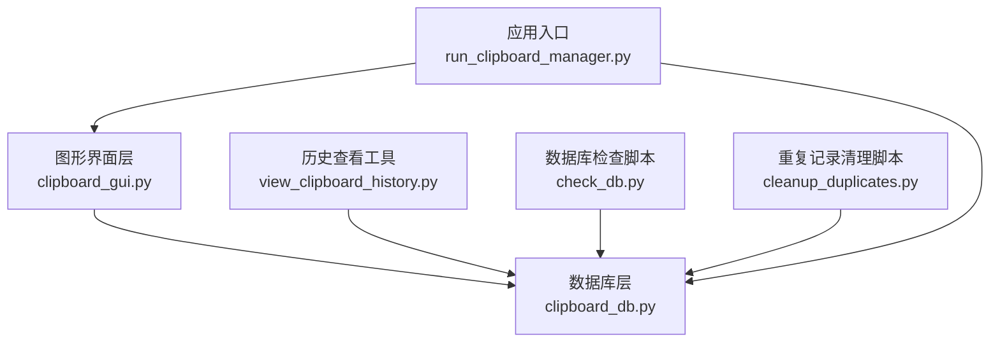
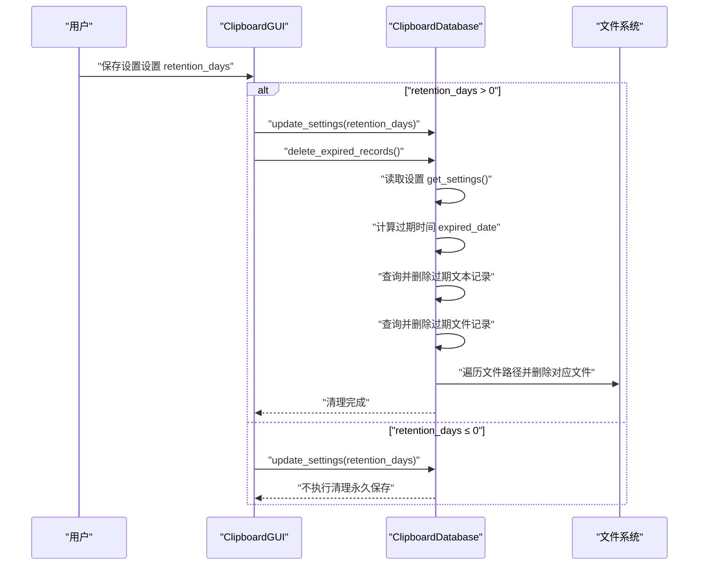
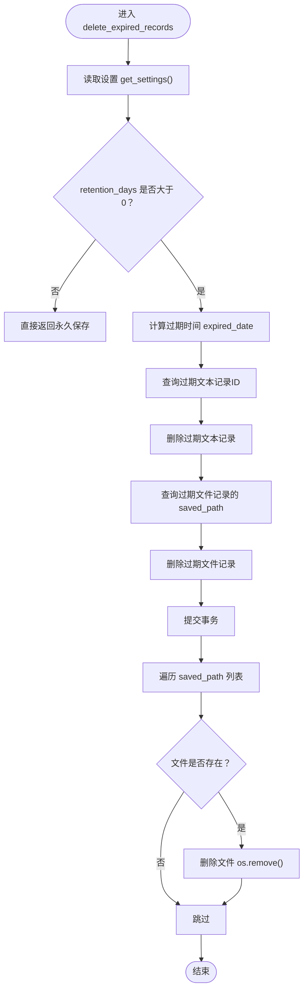
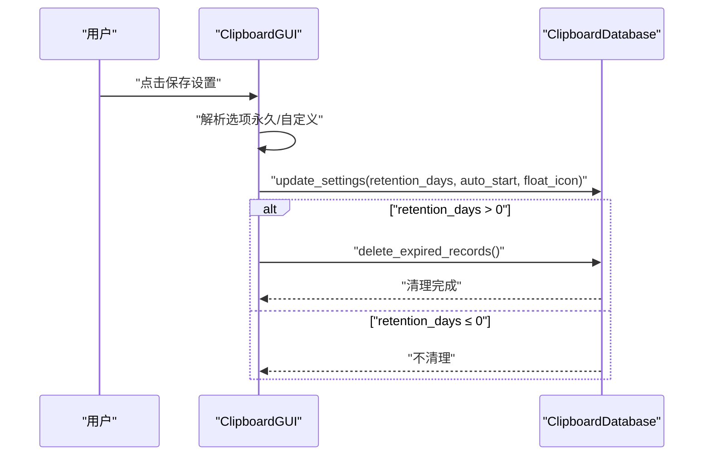
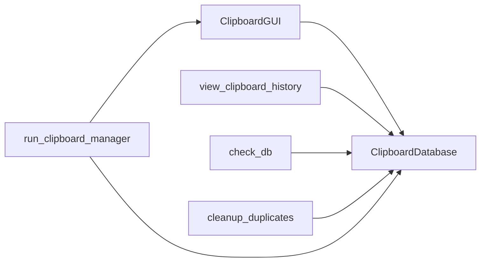

# 数据维护方法

<cite>
**本文引用的文件**
- [clipboard_db.py](file://clipboard_db.py)
- [clipboard_gui.py](file://clipboard_gui.py)
- [view_clipboard_history.py](file://view_clipboard_history.py)
- [check_db.py](file://check_db.py)
- [cleanup_duplicates.py](file://cleanup_duplicates.py)
- [run_clipboard_manager.py](file://run_clipboard_manager.py)
</cite>

## 目录
1. [简介](#简介)
2. [项目结构](#项目结构)
3. [核心组件](#核心组件)
4. [架构总览](#架构总览)
5. [详细组件分析](#详细组件分析)
6. [依赖关系分析](#依赖关系分析)
7. [性能考量](#性能考量)
8. [故障排查指南](#故障排查指南)
9. [结论](#结论)
10. [附录](#附录)

## 简介
本文件聚焦“数据维护”相关方法，尤其是 delete_expired_records 方法如何依据 retention_days 设置自动清理过期记录。文档将详细说明：
- 如何获取当前设置的保留天数
- 如何计算过期时间点
- 如何删除早于该时间的文本和文件记录
- 删除数据库记录后，如何进一步清理 saved_path 指向的实际文件，避免磁盘空间浪费
- 当 retention_days ≤ 0 时永久保存所有记录的特殊逻辑
- 定期执行数据清理的最佳实践建议
- 监控磁盘使用情况的指导

## 项目结构
围绕数据维护的关键文件与职责如下：
- clipboard_db.py：数据库层，负责初始化表结构、读写设置、增删查统计、以及核心的数据清理方法 delete_expired_records
- clipboard_gui.py：图形界面层，负责展示设置项、触发清理动作，并在保存设置时按需调用清理
- view_clipboard_history.py：历史记录查看工具，便于人工核对清理效果
- check_db.py：辅助检查脚本，用于验证数据库内容（如MD5去重）
- cleanup_duplicates.py：重复MD5记录的合并与清理脚本
- run_clipboard_manager.py：应用入口，负责启动监控与GUI

图表来源
- [clipboard_db.py](file://clipboard_db.py#L1-L120)
- [clipboard_gui.py](file://clipboard_gui.py#L328-L533)
- [view_clipboard_history.py](file://view_clipboard_history.py#L1-L75)
- [check_db.py](file://check_db.py#L1-L31)
- [cleanup_duplicates.py](file://cleanup_duplicates.py#L1-L67)
- [run_clipboard_manager.py](file://run_clipboard_manager.py#L1-L71)

章节来源
- [clipboard_db.py](file://clipboard_db.py#L1-L120)
- [clipboard_gui.py](file://clipboard_gui.py#L328-L533)
- [view_clipboard_history.py](file://view_clipboard_history.py#L1-L75)
- [check_db.py](file://check_db.py#L1-L31)
- [cleanup_duplicates.py](file://cleanup_duplicates.py#L1-L67)
- [run_clipboard_manager.py](file://run_clipboard_manager.py#L1-L71)

## 核心组件
- 数据库类 ClipboardDatabase
  - 提供 delete_expired_records 方法，按 retention_days 删除过期记录并清理对应文件
  - 提供 get_settings/update_settings，用于读取/更新设置（含 retention_days）
  - 提供 get_text_records/get_file_records/get_statistics 等常用查询与统计
- 图形界面 ClipboardGUI
  - 在设置界面中提供“永久保存/自定义天数”选项
  - 保存设置时，若自定义天数 > 0 则调用 delete_expired_records 执行清理
- 历史查看工具 view_clipboard_history.py
  - 用于人工核对清理前后记录数量与大小

章节来源
- [clipboard_db.py](file://clipboard_db.py#L387-L454)
- [clipboard_gui.py](file://clipboard_gui.py#L477-L533)
- [view_clipboard_history.py](file://view_clipboard_history.py#L1-L75)

## 架构总览
数据维护流程（以 delete_expired_records 为核心）：

图表来源
- [clipboard_gui.py](file://clipboard_gui.py#L477-L533)
- [clipboard_db.py](file://clipboard_db.py#L387-L454)

## 详细组件分析

### delete_expired_records 方法详解
该方法位于数据库层，负责根据 retention_days 自动清理过期记录，并同步删除磁盘上的实际文件，避免空间浪费。

- 获取保留天数
  - 通过 get_settings 读取 settings 表中的 retention_days
- 计算过期时间点
  - 使用当前时间减去 retention_days 天，得到过期时间点 expired_date
  - 将过期时间格式化为字符串用于SQL比较
- 删除过期记录
  - 先查询满足条件的文本记录ID，再执行删除
  - 查询满足条件的文件记录的 saved_path，再执行删除
- 清理磁盘文件
  - 遍历文件路径列表，逐个删除对应文件
  - 若删除异常，打印错误但不中断后续文件的删除
- 特殊逻辑：retention_days ≤ 0
  - 当设置为永久保存时，直接返回，不删除任何记录

图表来源
- [clipboard_db.py](file://clipboard_db.py#L413-L454)

章节来源
- [clipboard_db.py](file://clipboard_db.py#L413-L454)

### 设置界面与触发清理
图形界面层提供“永久保存/自定义天数”的设置项。当用户保存设置且自定义天数 > 0 时，会调用 delete_expired_records 执行清理。

- 设置界面
  - 提供“永久保存”和“自定义天数”两个选项
  - 自定义天数输入框在启用时可用
- 保存设置
  - 保存时根据选项计算 retention_days
  - 若 retention_days > 0，则调用 delete_expired_records
  - 同步更新 auto_start/float_icon 等其他设置

图表来源
- [clipboard_gui.py](file://clipboard_gui.py#L477-L533)
- [clipboard_db.py](file://clipboard_db.py#L387-L454)

章节来源
- [clipboard_gui.py](file://clipboard_gui.py#L328-L533)
- [clipboard_db.py](file://clipboard_db.py#L387-L454)

### 辅助工具与重复记录处理
- view_clipboard_history.py
  - 用于查看文本/文件记录及统计信息，便于核对清理效果
- check_db.py
  - 检查数据库中带MD5的记录，辅助验证去重策略
- cleanup_duplicates.py
  - 合并重复MD5记录并删除多余条目，减少冗余

章节来源
- [view_clipboard_history.py](file://view_clipboard_history.py#L1-L75)
- [check_db.py](file://check_db.py#L1-L31)
- [cleanup_duplicates.py](file://cleanup_duplicates.py#L1-L67)

## 依赖关系分析
- 数据库层 ClipboardDatabase
  - 依赖 SQLite 存储文本记录、文件记录与设置
  - 通过 get_settings/update_settings 与 GUI 层交互
  - 通过 delete_expired_records 与文件系统交互
- 图形界面层 ClipboardGUI
  - 依赖 ClipboardDatabase 进行数据读写与清理
  - 依赖 Tkinter 构建界面与事件处理
- 历史查看工具 view_clipboard_history.py
  - 依赖 ClipboardDatabase 进行查询与统计

图表来源
- [clipboard_gui.py](file://clipboard_gui.py#L328-L533)
- [clipboard_db.py](file://clipboard_db.py#L1-L120)
- [view_clipboard_history.py](file://view_clipboard_history.py#L1-L75)
- [check_db.py](file://check_db.py#L1-L31)
- [cleanup_duplicates.py](file://cleanup_duplicates.py#L1-L67)
- [run_clipboard_manager.py](file://run_clipboard_manager.py#L1-L71)

章节来源
- [clipboard_gui.py](file://clipboard_gui.py#L328-L533)
- [clipboard_db.py](file://clipboard_db.py#L1-L120)
- [view_clipboard_history.py](file://view_clipboard_history.py#L1-L75)
- [check_db.py](file://check_db.py#L1-L31)
- [cleanup_duplicates.py](file://cleanup_duplicates.py#L1-L67)
- [run_clipboard_manager.py](file://run_clipboard_manager.py#L1-L71)

## 性能考量
- 删除过期记录的复杂度
  - 查询与删除均基于 timestamp 字段，建议在 timestamp 上建立索引以提升查询效率（当前代码未显式创建索引，但可考虑在 init_database 中补充）
- 文件删除的开销
  - 遍历 saved_path 并逐一删除文件，I/O 成本与文件数量成正比
  - 建议在大量文件场景下分批处理或异步删除，避免阻塞
- 事务与一致性
  - delete_expired_records 中先删除记录再删除文件，若删除文件失败可能造成“记录缺失文件”的不一致
  - 建议采用“先删除文件再删除记录”的顺序，或在事务中统一回滚
- 设置变更与清理时机
  - GUI 层在保存设置时触发清理，适合即时生效
  - 若希望降低对用户操作的影响，可改为定时任务或延迟清理

[本节为通用性能建议，不直接分析具体文件]

## 故障排查指南
- 清理无效（retention_days ≤ 0）
  - 现象：设置为“永久保存”，未删除任何记录
  - 处理：确认设置界面选择了“自定义天数”并输入正值
  - 参考路径：[clipboard_gui.py](file://clipboard_gui.py#L477-L533)
- 删除文件失败
  - 现象：日志输出删除文件时的错误信息
  - 处理：检查文件权限、占用情况；必要时手动清理残留文件
  - 参考路径：[clipboard_db.py](file://clipboard_db.py#L447-L454)
- 记录未按预期清理
  - 现象：清理后仍有旧记录
  - 处理：确认 timestamp 字段是否正确；使用 view_clipboard_history.py 核对清理前后数量与大小
  - 参考路径：[view_clipboard_history.py](file://view_clipboard_history.py#L1-L75)
- 重复MD5导致记录膨胀
  - 现象：相同内容多次出现
  - 处理：运行 cleanup_duplicates.py 合并重复记录
  - 参考路径：[cleanup_duplicates.py](file://cleanup_duplicates.py#L1-L67)
- 数据库检查
  - 使用 check_db.py 检查最近带MD5的记录与重复MD5
  - 参考路径：[check_db.py](file://check_db.py#L1-L31)

章节来源
- [clipboard_gui.py](file://clipboard_gui.py#L477-L533)
- [clipboard_db.py](file://clipboard_db.py#L447-L454)
- [view_clipboard_history.py](file://view_clipboard_history.py#L1-L75)
- [cleanup_duplicates.py](file://cleanup_duplicates.py#L1-L67)
- [check_db.py](file://check_db.py#L1-L31)

## 结论
- delete_expired_records 通过读取 retention_days，计算过期时间点，删除过期文本与文件记录，并清理磁盘文件，有效控制存储增长
- 当 retention_days ≤ 0 时，系统永久保存所有记录，适合需要完整审计的场景
- 建议结合 GUI 的即时清理与独立脚本的批量清理，形成“即时+周期”的双重保障
- 为提升性能与一致性，可在 init_database 中补充 timestamp 索引，并优化文件删除顺序与事务处理

[本节为总结性内容，不直接分析具体文件]

## 附录

### 定期执行数据清理的最佳实践
- 方案一：GUI 触发
  - 在设置界面保存设置时自动清理，适合用户主动调整保留策略
  - 参考路径：[clipboard_gui.py](file://clipboard_gui.py#L477-L533)
- 方案二：独立脚本定时执行
  - 编写定时任务（Windows 任务计划、Linux cron）定期调用清理脚本
  - 参考路径：[clipboard_db.py](file://clipboard_db.py#L413-L454)
- 方案三：应用内定时器
  - 在 run_clipboard_manager.py 中引入定时器，在固定时间间隔调用清理
  - 参考路径：[run_clipboard_manager.py](file://run_clipboard_manager.py#L1-L71)

### 监控磁盘使用情况的指导
- 使用 view_clipboard_history.py 查看文件记录总数与总大小，评估清理效果
  - 参考路径：[view_clipboard_history.py](file://view_clipboard_history.py#L1-L75)
- 使用 check_db.py 检查重复MD5，减少冗余
  - 参考路径：[check_db.py](file://check_db.py#L1-L31)
- 使用 cleanup_duplicates.py 合并重复记录
  - 参考路径：[cleanup_duplicates.py](file://cleanup_duplicates.py#L1-L67)