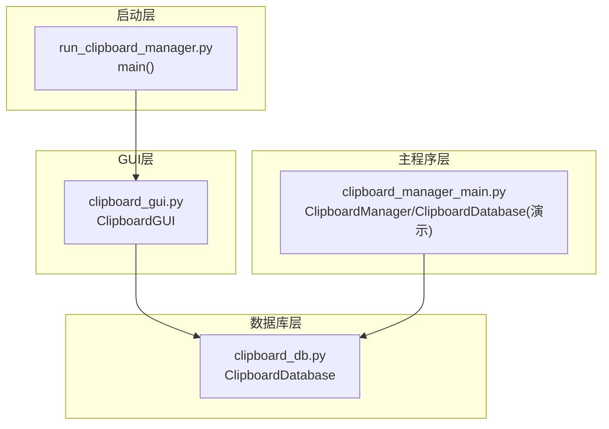
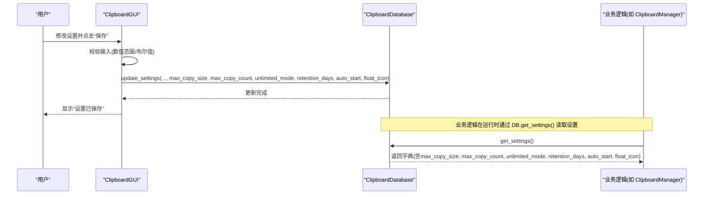
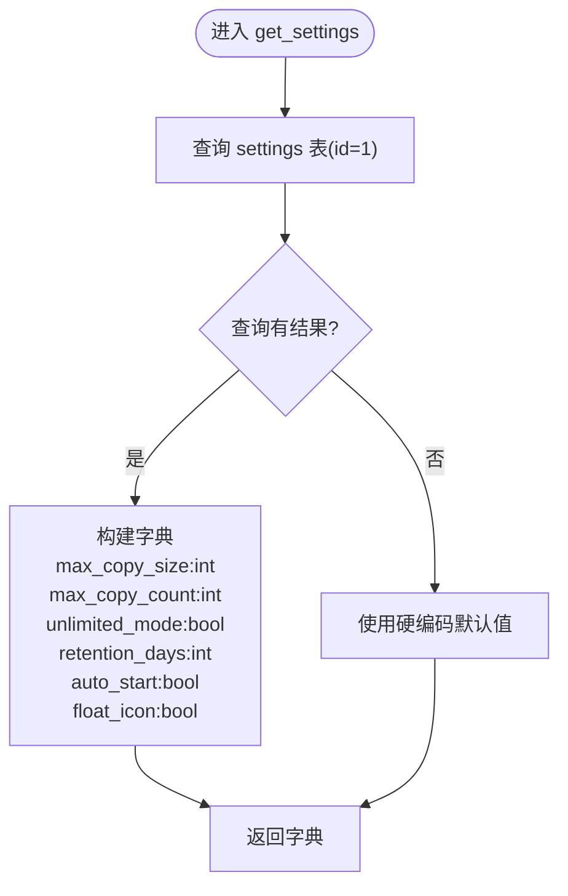
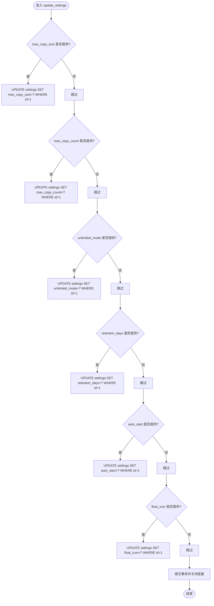
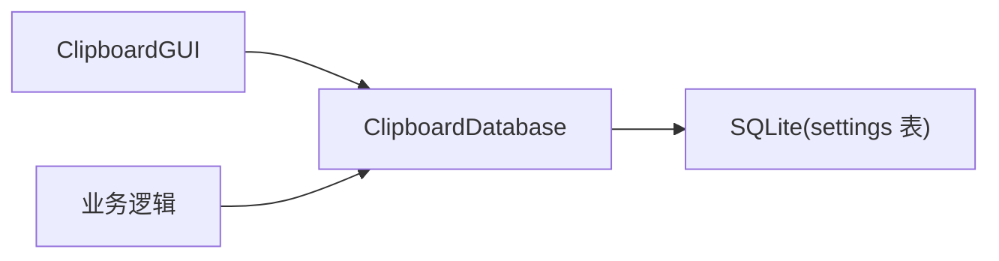

# 设置管理方法

<cite>
**本文引用的文件**
- [clipboard_db.py](file://clipboard_db.py)
- [clipboard_gui.py](file://clipboard_gui.py)
- [clipboard_manager_main.py](file://clipboard_manager_main.py)
- [run_clipboard_manager.py](file://run_clipboard_manager.py)
</cite>

## 目录
1. [简介](#简介)
2. [项目结构](#项目结构)
3. [核心组件](#核心组件)
4. [架构总览](#架构总览)
5. [详细组件分析](#详细组件分析)
6. [依赖关系分析](#依赖关系分析)
7. [性能考量](#性能考量)
8. [故障排查指南](#故障排查指南)
9. [结论](#结论)
10. [附录](#附录)

## 简介
本文件围绕设置管理功能进行全面文档化，重点说明以下内容：
- get_settings 方法如何从 settings 表读取 max_copy_size（最大复制大小）、max_copy_count（最大记录数）、unlimited_mode（无限制模式）、retention_days（保留天数）、auto_start（开机自启）、float_icon（悬浮图标）六个配置项，并转换为 Python 字典返回。
- update_settings 方法的参数化更新机制，支持单独或批量更新各项设置，布尔值自动转换为整数存储。
- 当 settings 表无数据时返回硬编码默认值的容错处理。
- 提供设置读取和更新的完整示例代码路径，便于快速集成与调试。

## 项目结构
本项目采用“功能模块化 + 数据库封装”的组织方式：
- 数据库层：集中于 clipboard_db.py，负责数据库初始化、表结构维护、设置读写等。
- 主程序层：clipboard_manager_main.py 提供剪贴板监控与业务逻辑，内部也包含一个简化的 ClipboardDatabase 类（用于演示与测试），但生产环境主要使用 clipboard_db.py 中的类。
- GUI 层：clipboard_gui.py 提供图形界面，负责设置项的展示与保存。
- 启动层：run_clipboard_manager.py 启动 GUI 并在后台运行剪贴板监控。

图表来源
- [clipboard_db.py](file://clipboard_db.py#L1-L120)
- [clipboard_gui.py](file://clipboard_gui.py#L1-L120)
- [clipboard_manager_main.py](file://clipboard_manager_main.py#L1-L120)
- [run_clipboard_manager.py](file://run_clipboard_manager.py#L1-L71)

章节来源
- [clipboard_db.py](file://clipboard_db.py#L1-L120)
- [clipboard_gui.py](file://clipboard_gui.py#L1-L120)
- [clipboard_manager_main.py](file://clipboard_manager_main.py#L1-L120)
- [run_clipboard_manager.py](file://run_clipboard_manager.py#L1-L71)

## 核心组件
- ClipboardDatabase（数据库封装）
  - 负责 settings 表的初始化、字段迁移、默认值插入以及设置的读取与更新。
  - 提供 get_settings 与 update_settings 两个关键方法，满足本节目标。
- ClipboardGUI（图形界面）
  - 负责设置项的展示、校验与保存，调用数据库层的 update_settings 实现持久化。
- ClipboardManager（业务逻辑）
  - 在业务流程中读取设置，如复制限制检查等，间接体现设置的作用域。

章节来源
- [clipboard_db.py](file://clipboard_db.py#L77-L114)
- [clipboard_db.py](file://clipboard_db.py#L359-L412)
- [clipboard_gui.py](file://clipboard_gui.py#L439-L533)
- [clipboard_manager_main.py](file://clipboard_manager_main.py#L305-L343)

## 架构总览
设置管理涉及三层交互：
- GUI 层负责用户输入与校验；
- 数据库层负责设置的持久化与默认值回退；
- 业务层在运行时读取设置以控制行为。

图表来源
- [clipboard_gui.py](file://clipboard_gui.py#L477-L533)
- [clipboard_db.py](file://clipboard_db.py#L359-L412)
- [clipboard_manager_main.py](file://clipboard_manager_main.py#L362-L394)

## 详细组件分析

### get_settings 方法
- 功能概述
  - 从 settings 表读取六项配置：max_copy_size、max_copy_count、unlimited_mode、retention_days、auto_start、float_icon。
  - 若表中存在记录，将布尔型字段转换为 Python 的 bool 类型，其余保持整型返回。
  - 若表中无记录，返回硬编码默认值（兼容旧版本或首次初始化场景）。
- 关键实现要点
  - 查询语句限定 id=1，确保单实例设置。
  - 布尔字段通过 bool(result[i]) 转换，保证上层逻辑一致性。
  - 未命中记录时返回默认字典，避免上层异常。
- 返回字典结构
  - 键集合：max_copy_size、max_copy_count、unlimited_mode、retention_days、auto_start、float_icon
  - 类型：前两项为整数（字节/个），unlimited_mode、retention_days、auto_start、float_icon 为布尔或整数（其中布尔字段在返回时统一转为 bool）

图表来源
- [clipboard_db.py](file://clipboard_db.py#L359-L385)

章节来源
- [clipboard_db.py](file://clipboard_db.py#L359-L385)

### update_settings 方法
- 功能概述
  - 支持按需更新任意组合的设置项，未传入的参数保持不变。
  - 布尔型参数会自动转换为整数（0/1）再写入数据库，确保与表结构一致。
- 参数化更新机制
  - 逐项判断参数是否为 None，非 None 则执行对应 UPDATE 语句。
  - 支持一次性更新多个字段，减少数据库往返。
- 存储约束
  - settings 表 id=1，所有更新均针对该行。
  - 布尔字段映射为整数，避免类型不匹配。

图表来源
- [clipboard_db.py](file://clipboard_db.py#L387-L412)

章节来源
- [clipboard_db.py](file://clipboard_db.py#L387-L412)

### 容错处理：settings 表无数据时的默认值
- 场景说明
  - 首次运行或数据库迁移后，settings 表可能尚未插入默认记录。
- 处理策略
  - 初始化阶段会插入默认值（包含 max_copy_size、max_copy_count、unlimited_mode）。
  - 读取阶段若查询不到记录，返回硬编码默认字典，确保系统稳定运行。
- 影响范围
  - 所有依赖设置的业务逻辑（如复制限制、过期清理、开机自启、悬浮图标）均可正常工作。

章节来源
- [clipboard_db.py](file://clipboard_db.py#L77-L114)
- [clipboard_db.py](file://clipboard_db.py#L359-L385)

### 设置读取与更新的完整示例代码路径
以下为可直接参考的代码片段路径，便于集成与调试：
- 读取设置
  - [clipboard_db.py get_settings](file://clipboard_db.py#L359-L385)
  - [clipboard_gui.py load_settings_display](file://clipboard_gui.py#L439-L462)
- 更新设置
  - [clipboard_db.py update_settings](file://clipboard_db.py#L387-L412)
  - [clipboard_gui.py save_settings](file://clipboard_gui.py#L477-L533)
- 业务侧使用设置
  - [clipboard_manager_main.py check_copy_limits](file://clipboard_manager_main.py#L362-L394)
  - [clipboard_db.py delete_expired_records](file://clipboard_db.py#L413-L455)

章节来源
- [clipboard_db.py](file://clipboard_db.py#L359-L412)
- [clipboard_gui.py](file://clipboard_gui.py#L439-L533)
- [clipboard_manager_main.py](file://clipboard_manager_main.py#L362-L394)

## 依赖关系分析
- 组件耦合
  - GUI 层依赖数据库层提供的 get_settings/update_settings。
  - 业务层在运行时通过数据库层读取设置，形成“读取-执行”闭环。
- 外部依赖
  - SQLite 作为本地存储，无需额外服务端依赖。
  - GUI 层依赖 tkinter、pystray（可选）等库，用于系统托盘与悬浮图标。
- 潜在风险
  - 若 settings 表字段缺失，初始化逻辑会尝试添加，但仍建议在部署前确认表结构。
  - 布尔字段在数据库中以整数存储，需确保上层转换一致。

图表来源
- [clipboard_gui.py](file://clipboard_gui.py#L1-L120)
- [clipboard_db.py](file://clipboard_db.py#L77-L114)

章节来源
- [clipboard_gui.py](file://clipboard_gui.py#L1-L120)
- [clipboard_db.py](file://clipboard_db.py#L77-L114)

## 性能考量
- 单次更新多字段
  - update_settings 通过多次条件分支更新不同字段，减少不必要的写操作，适合批量更新。
- 查询开销
  - get_settings 仅查询一行且字段较少，查询成本低。
- 布尔转换
  - 上层统一转换为 bool，避免重复转换带来的开销。
- 建议
  - 在高频更新场景下，尽量合并调用，减少数据库往返。
  - 对于频繁读取的设置，可在业务层做短期缓存（视需求而定）。

[本节为通用指导，不直接分析具体文件]

## 故障排查指南
- 现象：读取设置返回默认值
  - 可能原因：settings 表无记录或字段缺失。
  - 排查步骤：
    - 确认初始化是否成功（包含默认值插入）。
    - 检查是否存在字段迁移失败的情况。
  - 参考路径：
    - [clipboard_db.py 初始化与默认值插入](file://clipboard_db.py#L77-L114)
    - [clipboard_db.py get_settings 默认回退](file://clipboard_db.py#L359-L385)
- 现象：布尔设置未生效
  - 可能原因：上层仍以整数判断。
  - 排查步骤：
    - 确认 get_settings 返回值已转换为 bool。
    - 检查业务层是否正确使用返回值。
  - 参考路径：
    - [clipboard_db.py get_settings 布尔转换](file://clipboard_db.py#L359-L385)
- 现象：开机自启/悬浮图标未按预期工作
  - 可能原因：GUI 层在启动时读取设置并应用。
  - 排查步骤：
    - 检查 GUI 层是否调用设置读取与应用逻辑。
    - 确认 update_settings 是否成功写入数据库。
  - 参考路径：
    - [clipboard_gui.py check_auto_start/check_float_icon](file://clipboard_gui.py#L80-L97)
    - [clipboard_gui.py save_settings](file://clipboard_gui.py#L477-L533)

章节来源
- [clipboard_db.py](file://clipboard_db.py#L77-L114)
- [clipboard_db.py](file://clipboard_db.py#L359-L385)
- [clipboard_gui.py](file://clipboard_gui.py#L80-L97)
- [clipboard_gui.py](file://clipboard_gui.py#L477-L533)

## 结论
- get_settings 与 update_settings 构成了设置管理的核心能力，前者提供稳定的字典输出，后者支持灵活的参数化更新。
- 通过硬编码默认值与字段迁移机制，系统具备良好的容错与向前兼容性。
- GUI 与业务层通过数据库层解耦，既保证了易用性，又便于扩展新的设置项。

[本节为总结性内容，不直接分析具体文件]

## 附录

### settings 表结构与默认值
- 表结构要点
  - id 主键且固定为 1，确保全局唯一设置。
  - 字段：max_copy_size（字节）、max_copy_count（个）、unlimited_mode（整数 0/1）、retention_days（天）、auto_start（整数 0/1）、float_icon（整数 0/1）。
- 默认值
  - max_copy_size：300MB（字节）
  - max_copy_count：100
  - unlimited_mode：False（整数 0）
  - retention_days：0（永久保存）
  - auto_start：False（整数 0）
  - float_icon：False（整数 0）

章节来源
- [clipboard_db.py](file://clipboard_db.py#L77-L114)