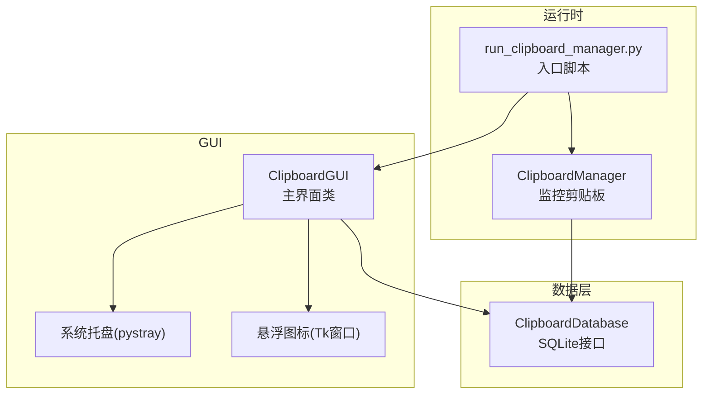
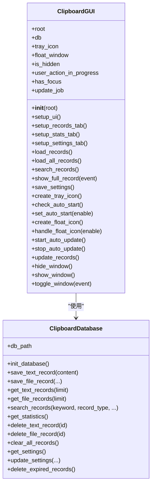
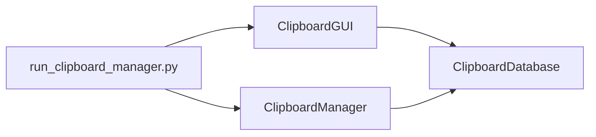

# ClipboardGUI类

<cite>
**本文引用的文件**
- [clipboard_gui.py](file://clipboard_gui.py)
- [clipboard_manager_main.py](file://clipboard_manager_main.py)
- [run_clipboard_manager.py](file://run_clipboard_manager.py)
</cite>

## 目录
1. [简介](#简介)
2. [项目结构](#项目结构)
3. [核心组件](#核心组件)
4. [架构总览](#架构总览)
5. [详细组件分析](#详细组件分析)
6. [依赖关系分析](#依赖关系分析)
7. [性能考量](#性能考量)
8. [故障排查指南](#故障排查指南)
9. [结论](#结论)
10. [附录](#附录)

## 简介
ClipboardGUI类负责提供剪贴板历史记录的图形界面，包含记录浏览、搜索、统计、设置管理、系统托盘集成、开机自启控制以及悬浮图标等特性。本文档面向开发者与使用者，系统性梳理类的初始化流程、UI布局、数据加载与排序、事件处理、状态管理与后台任务，帮助快速理解与使用。

## 项目结构
- GUI入口与运行：通过独立入口脚本启动GUI并默认隐藏主窗口，仅保留系统托盘图标。
- GUI核心：ClipboardGUI类封装了窗口创建、UI布局、数据加载、事件绑定、系统托盘与悬浮图标等。
- 数据层：ClipboardDatabase类提供数据库连接、记录查询、设置读写、统计信息等能力。
- 运行时：run_clipboard_manager.py在后台线程中持续监控剪贴板变化并将内容持久化至数据库。

图表来源
- [run_clipboard_manager.py](file://run_clipboard_manager.py#L32-L67)
- [clipboard_gui.py](file://clipboard_gui.py#L37-L79)
- [clipboard_manager_main.py](file://clipboard_manager_main.py#L355-L496)

章节来源
- [run_clipboard_manager.py](file://run_clipboard_manager.py#L32-L67)
- [clipboard_gui.py](file://clipboard_gui.py#L37-L79)
- [clipboard_manager_main.py](file://clipboard_manager_main.py#L355-L496)

## 核心组件
- ClipboardGUI：主界面类，负责窗口生命周期、UI布局、数据加载与排序、事件处理、系统托盘与悬浮图标、开机自启与自动更新。
- ClipboardDatabase：数据库访问层，提供记录查询、设置读写、统计信息、清理与过期记录删除等。
- ClipboardManager：剪贴板监控与持久化逻辑，负责将剪贴板内容写入数据库并避免重复保存。

章节来源
- [clipboard_gui.py](file://clipboard_gui.py#L37-L79)
- [clipboard_manager_main.py](file://clipboard_manager_main.py#L56-L111)
- [clipboard_manager_main.py](file://clipboard_manager_main.py#L355-L496)

## 架构总览
ClipboardGUI类采用“界面-数据-系统服务”三层协作：
- 界面层：基于ttk与tkinter构建，包含搜索区、标签页、按钮组、树形视图、文本显示等。
- 数据层：通过ClipboardDatabase访问SQLite数据库，提供记录查询、统计与设置管理。
- 系统服务：系统托盘与悬浮图标由第三方库实现，开机自启通过注册表控制，自动更新通过定时器驱动。

图表来源
- [clipboard_gui.py](file://clipboard_gui.py#L37-L79)
- [clipboard_gui.py](file://clipboard_gui.py#L227-L279)
- [clipboard_gui.py](file://clipboard_gui.py#L581-L626)
- [clipboard_gui.py](file://clipboard_gui.py#L652-L748)
- [clipboard_gui.py](file://clipboard_gui.py#L749-L795)
- [clipboard_gui.py](file://clipboard_gui.py#L1131-L1163)
- [clipboard_gui.py](file://clipboard_gui.py#L1164-L1172)
- [clipboard_gui.py](file://clipboard_gui.py#L1173-L1234)
- [clipboard_gui.py](file://clipboard_gui.py#L1676-L1696)
- [clipboard_manager_main.py](file://clipboard_manager_main.py#L56-L111)
- [clipboard_manager_main.py](file://clipboard_manager_main.py#L112-L180)
- [clipboard_manager_main.py](file://clipboard_manager_main.py#L181-L211)
- [clipboard_manager_main.py](file://clipboard_manager_main.py#L213-L261)
- [clipboard_manager_main.py](file://clipboard_manager_main.py#L262-L279)
- [clipboard_manager_main.py](file://clipboard_manager_main.py#L280-L304)
- [clipboard_manager_main.py](file://clipboard_manager_main.py#L305-L343)

## 详细组件分析

### 初始化流程（__init__）
- 窗口属性与居中：设置标题、尺寸并居中显示。
- UI创建：调用setup_ui构建搜索区、标签页与按钮框架。
- 初始数据加载：在UI创建后延时加载记录。
- 设置检查：检查开机自启与悬浮图标设置并应用。
- 后台任务：启动自动更新（每2秒），绑定窗口协议与焦点事件。
- 系统托盘：若可用则创建托盘图标，菜单包含“显示界面”和“退出”。

章节来源
- [clipboard_gui.py](file://clipboard_gui.py#L37-L79)

### UI布局（setup_ui）
- 主框架：使用ttk.Frame作为根容器，网格权重配置保证可伸缩。
- 搜索区：包含关键词输入、搜索与刷新按钮。
- 标签页：
  - 记录标签页：树形视图展示记录，支持排序、滚动与双击查看详情。
  - 统计标签页：文本控件显示统计信息，提供刷新按钮。
  - 设置标签页：集中管理复制限制、保存天数、开机自启、悬浮图标与重置记录等。
- 快捷键：绑定Alt+C切换窗口显示状态。

章节来源
- [clipboard_gui.py](file://clipboard_gui.py#L172-L226)
- [clipboard_gui.py](file://clipboard_gui.py#L227-L279)
- [clipboard_gui.py](file://clipboard_gui.py#L309-L327)
- [clipboard_gui.py](file://clipboard_gui.py#L328-L462)

### 记录标签页（setup_records_tab）
- 排序参数：默认按“时间”倒序，支持点击列头切换正/逆序。
- 列定义：名称或内容、类型、大小、时间、次数。
- 视图与滚动：Treeview + 垂直滚动条。
- 按钮：复制选中内容、删除选中记录。
- 事件绑定：双击显示完整内容；选择与滚轮事件预留处理。
- 网格权重：保证可伸缩布局。

章节来源
- [clipboard_gui.py](file://clipboard_gui.py#L227-L279)
- [clipboard_gui.py](file://clipboard_gui.py#L280-L308)

### 统计标签页（setup_stats_tab）
- 文本显示：Text控件配合滚动条。
- 刷新按钮：调用update_statistics_display更新统计信息。
- 统计内容：文本记录数、文件记录数、累计大小与数据库路径。

章节来源
- [clipboard_gui.py](file://clipboard_gui.py#L309-L327)
- [clipboard_gui.py](file://clipboard_gui.py#L555-L580)

### 设置标签页（setup_settings_tab）
- 复制限制：无限模式开关、最大复制大小（MB）、最大复制文件数量。
- 保存策略：永久保存或自定义天数（天）。
- 系统设置：开机自启开关。
- 悬浮图标：启用悬浮图标（含说明）。
- 数据管理：重置所有记录（含二次确认与缓存清理）。
- 按钮：保存设置、恢复默认。
- 初始化：load_settings_display加载当前设置并联动控件状态。

章节来源
- [clipboard_gui.py](file://clipboard_gui.py#L328-L462)
- [clipboard_gui.py](file://clipboard_gui.py#L439-L462)

### 数据加载与排序（load_records/load_all_records）
- 清空视图：删除现有所有记录。
- 排序映射：将界面列名映射到数据库字段名。
- 查询合并：分别查询文本与文件记录，统一格式化后插入视图。
- 格式化：
  - 文本：内容预览（长度截断），类型固定，大小“-”，次数来自number。
  - 文件：文件名、类型（扩展名）、大小格式化、时间、次数。
- 统计刷新：加载完成后更新统计信息。

章节来源
- [clipboard_gui.py](file://clipboard_gui.py#L581-L626)
- [clipboard_gui.py](file://clipboard_gui.py#L627-L637)

### 搜索流程（search_records/sort_search_results）
- 输入获取：从搜索框读取关键词，类型默认为“全部”。
- 清空视图：删除现有所有记录。
- 查询：调用数据库search_records执行模糊匹配。
- 结果排序：
  - 文本记录：从数据库查询number并拼接结果。
  - 文件记录：从数据库查询file_size与number并格式化。
  - 数值字段（大小、次数）优先按数值排序，否则按文本排序。
  - 异常回退：排序失败时按时间倒序。
- 插入视图：按排序结果插入Treeview。

章节来源
- [clipboard_gui.py](file://clipboard_gui.py#L652-L748)

### 双击事件（show_full_record）
- 文本记录：从数据库读取完整内容，弹出新窗口显示（ScrolledText）。
- 文件记录：定位保存路径，调用系统打开所在位置；若不存在提示警告。

章节来源
- [clipboard_gui.py](file://clipboard_gui.py#L749-L795)

### 设置保存（save_settings）
- 数值验证与转换：
  - 无限模式：直接更新unlimited_mode。
  - 非无限模式：校验最大复制大小（MB→字节）与最大数量（整数）。
- 保存策略：永久保存或自定义天数（天）。
- 系统设置：开机自启（注册表）。
- 悬浮图标：启用/禁用对应处理。
- 过期记录：自定义天数时删除过期记录。
- 用户反馈：成功提示，数值错误弹出错误对话框。

章节来源
- [clipboard_gui.py](file://clipboard_gui.py#L477-L533)

### 系统托盘集成（create_tray_icon）
- 图标加载：优先加载资源文件2.ico；不存在则生成简单图标。
- 菜单：包含“显示界面”（默认）与“退出”。
- 线程运行：托盘图标在独立线程中运行，避免阻塞主线程。
- 关闭流程：quit_application停止自动更新与托盘，退出主循环。

章节来源
- [clipboard_gui.py](file://clipboard_gui.py#L144-L171)
- [clipboard_gui.py](file://clipboard_gui.py#L1709-L1715)

### 开机自启（check_auto_start/set_auto_start）
- 检查：启动时读取设置并应用。
- 设置：通过注册表写入或删除当前可执行文件路径。
- 异常处理：捕获权限或注册表异常并打印日志。

章节来源
- [clipboard_gui.py](file://clipboard_gui.py#L89-L97)
- [clipboard_gui.py](file://clipboard_gui.py#L1131-L1163)

### 悬浮图标（create_float_icon/handle_float_icon）
- 创建：Toplevel窗口，去边框、置顶、半透明，支持拖动与双击显示主窗口。
- 图片加载：优先加载2.jpg并缩放至50×50；失败则使用背景色与文本。
- 交互：悬停显示最近记录面板，支持点击复制、查看更多记录。
- 位置与边界：根据屏幕尺寸与图标位置动态计算面板位置，确保在屏幕内。
- 销毁：destroy_float_icon负责释放资源。

章节来源
- [clipboard_gui.py](file://clipboard_gui.py#L1164-L1172)
- [clipboard_gui.py](file://clipboard_gui.py#L1173-L1234)
- [clipboard_gui.py](file://clipboard_gui.py#L1235-L1253)
- [clipboard_gui.py](file://clipboard_gui.py#L1254-L1379)
- [clipboard_gui.py](file://clipboard_gui.py#L1380-L1401)
- [clipboard_gui.py](file://clipboard_gui.py#L1412-L1447)
- [clipboard_gui.py](file://clipboard_gui.py#L1448-L1452)
- [clipboard_gui.py](file://clipboard_gui.py#L1453-L1521)
- [clipboard_gui.py](file://clipboard_gui.py#L1522-L1558)
- [clipboard_gui.py](file://clipboard_gui.py#L1559-L1632)
- [clipboard_gui.py](file://clipboard_gui.py#L1633-L1638)
- [clipboard_gui.py](file://clipboard_gui.py#L1639-L1669)

### 自动更新与窗口状态（start_auto_update/update_records）
- 定时器：每2秒触发一次update_records。
- 更新条件：窗口未隐藏、无用户操作进行、且无焦点时才刷新。
- 生命周期：stop_auto_update取消定时器；hide/show/toggle_window控制显示状态。

章节来源
- [clipboard_gui.py](file://clipboard_gui.py#L1676-L1696)
- [clipboard_gui.py](file://clipboard_gui.py#L1697-L1722)

### UI事件处理示例
- 排序点击：点击列头触发sort_by_column，切换reverse并重新加载。
- 焦点变化：FocusIn/FocusOut更新has_focus标志。
- 快捷键：Alt+C切换窗口显示状态。
- 滚轮/选择：预留on_mouse_wheel/on_tree_select事件处理。
- 复制/删除：复制选中记录内容或删除记录并尝试删除本地文件。
- 重置记录：二次确认对话框，删除数据库与缓存目录。

章节来源
- [clipboard_gui.py](file://clipboard_gui.py#L280-L308)
- [clipboard_gui.py](file://clipboard_gui.py#L134-L143)
- [clipboard_gui.py](file://clipboard_gui.py#L220-L226)
- [clipboard_gui.py](file://clipboard_gui.py#L800-L878)
- [clipboard_gui.py](file://clipboard_gui.py#L890-L949)

### 界面状态管理
- user_action_in_progress：标记用户操作进行中，避免自动更新干扰。
- has_focus：窗口焦点状态，自动更新时避免干扰。
- is_hidden：窗口隐藏状态，控制自动更新与显示逻辑。

章节来源
- [clipboard_gui.py](file://clipboard_gui.py#L37-L79)
- [clipboard_gui.py](file://clipboard_gui.py#L1676-L1696)

## 依赖关系分析
- ClipboardGUI依赖ClipboardDatabase进行数据访问。
- ClipboardManager在后台线程中监控剪贴板并写入数据库。
- run_clipboard_manager.py作为入口脚本，负责进程互斥、后台监控线程与GUI实例化。

图表来源
- [run_clipboard_manager.py](file://run_clipboard_manager.py#L32-L67)
- [clipboard_manager_main.py](file://clipboard_manager_main.py#L355-L496)
- [clipboard_gui.py](file://clipboard_gui.py#L37-L79)

章节来源
- [run_clipboard_manager.py](file://run_clipboard_manager.py#L32-L67)
- [clipboard_manager_main.py](file://clipboard_manager_main.py#L355-L496)
- [clipboard_gui.py](file://clipboard_gui.py#L37-L79)

## 性能考量
- 自动更新频率：每2秒一次，仅在窗口显示且无用户操作与焦点时刷新，降低CPU占用。
- 数据加载：一次性加载所有记录并插入视图，避免分页逻辑带来的复杂性。
- 搜索排序：对数值字段进行数值排序，异常时回退到时间排序，保证稳定性。
- 悬浮面板：最近记录面板按需创建，隐藏时销毁，减少内存占用。

[本节为通用建议，无需特定文件引用]

## 故障排查指南
- 托盘图标不可用：安装pystray与Pillow后重启应用。
- 开机自启无效：检查注册表权限与路径；确认set_auto_start异常处理日志。
- 悬浮图标图片加载失败：确认资源文件2.jpg存在；若不存在将回退到默认背景与文本。
- 搜索结果排序异常：检查数值字段解析逻辑，必要时回退到时间排序。
- 重置记录失败：确认缓存目录clipboard_files权限与磁盘空间。

章节来源
- [clipboard_gui.py](file://clipboard_gui.py#L144-L171)
- [clipboard_gui.py](file://clipboard_gui.py#L1131-L1163)
- [clipboard_gui.py](file://clipboard_gui.py#L1173-L1234)
- [clipboard_gui.py](file://clipboard_gui.py#L652-L748)
- [clipboard_gui.py](file://clipboard_gui.py#L890-L949)

## 结论
ClipboardGUI类提供了完整的剪贴板历史记录管理界面，涵盖记录浏览、搜索、统计、设置与系统服务集成。通过清晰的初始化流程、模块化的UI布局、稳健的数据加载与排序、完善的事件处理与状态管理，以及后台自动更新与托盘/悬浮图标支持，满足日常使用与扩展需求。建议在生产环境中关注托盘与悬浮图标的依赖安装、开机自启的注册表权限与异常处理，以及重置记录的二次确认与缓存清理。

[本节为总结性内容，无需特定文件引用]

## 附录

### API参考（方法清单与职责）
- __init__(root)：初始化窗口、UI、设置检查、后台任务与托盘图标。
- setup_ui()：构建搜索区、标签页与按钮框架。
- setup_records_tab()：配置记录树形视图、排序与按钮。
- setup_stats_tab()：配置统计文本显示与刷新按钮。
- setup_settings_tab()：配置设置表单与按钮。
- load_records()/load_all_records()：加载并显示记录，支持排序映射与格式化。
- search_records()/sort_search_results()：搜索并排序结果，插入视图。
- show_full_record(event)：双击显示完整内容或打开文件位置。
- save_settings()：保存设置，含数值验证、单位转换与系统设置应用。
- create_tray_icon()：创建系统托盘图标与菜单。
- check_auto_start()/set_auto_start(enable)：开机自启检查与设置。
- create_float_icon()/handle_float_icon(enable)：悬浮图标创建与启用/禁用。
- start_auto_update()/stop_auto_update()/update_records()：自动更新调度与条件刷新。
- hide_window()/show_window()/toggle_window(event)：窗口显示状态切换。
- 其他：焦点事件、复制/删除记录、重置记录、居中窗口、格式化文件大小等。

章节来源
- [clipboard_gui.py](file://clipboard_gui.py#L37-L79)
- [clipboard_gui.py](file://clipboard_gui.py#L172-L226)
- [clipboard_gui.py](file://clipboard_gui.py#L227-L279)
- [clipboard_gui.py](file://clipboard_gui.py#L309-L327)
- [clipboard_gui.py](file://clipboard_gui.py#L328-L462)
- [clipboard_gui.py](file://clipboard_gui.py#L581-L626)
- [clipboard_gui.py](file://clipboard_gui.py#L652-L748)
- [clipboard_gui.py](file://clipboard_gui.py#L749-L795)
- [clipboard_gui.py](file://clipboard_gui.py#L800-L878)
- [clipboard_gui.py](file://clipboard_gui.py#L890-L949)
- [clipboard_gui.py](file://clipboard_gui.py#L1131-L1163)
- [clipboard_gui.py](file://clipboard_gui.py#L1164-L1172)
- [clipboard_gui.py](file://clipboard_gui.py#L1173-L1234)
- [clipboard_gui.py](file://clipboard_gui.py#L1676-L1696)
- [clipboard_gui.py](file://clipboard_gui.py#L1697-L1722)