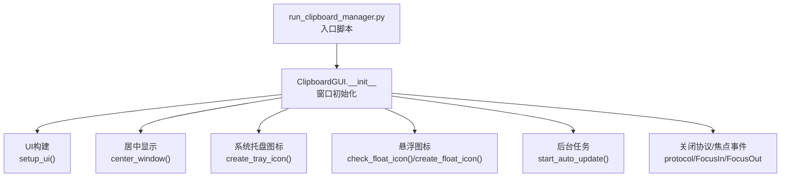
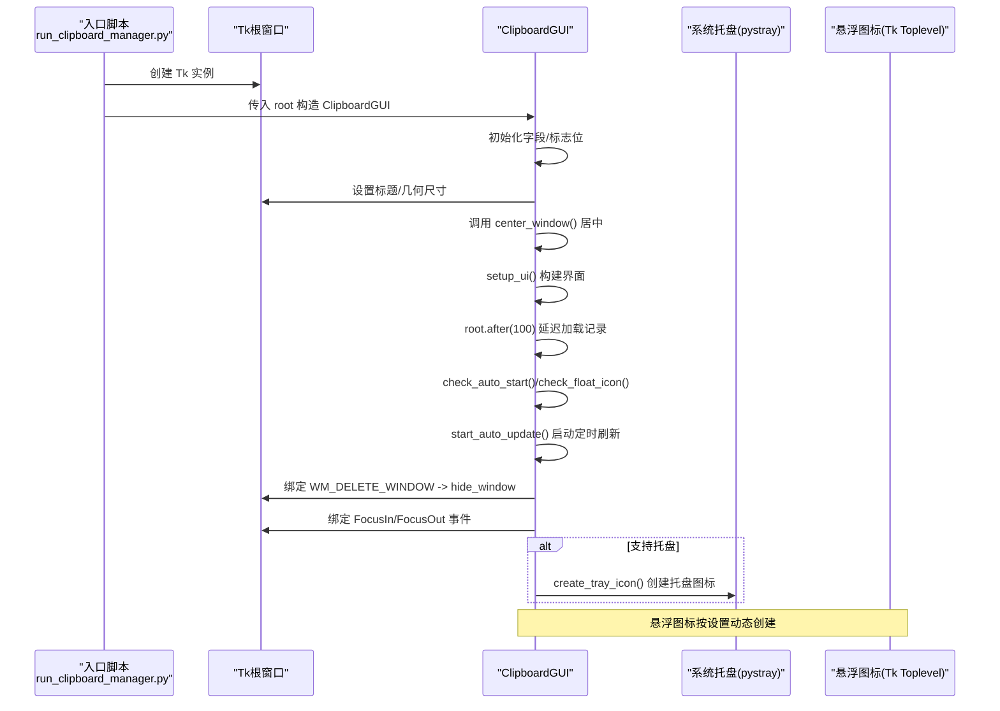
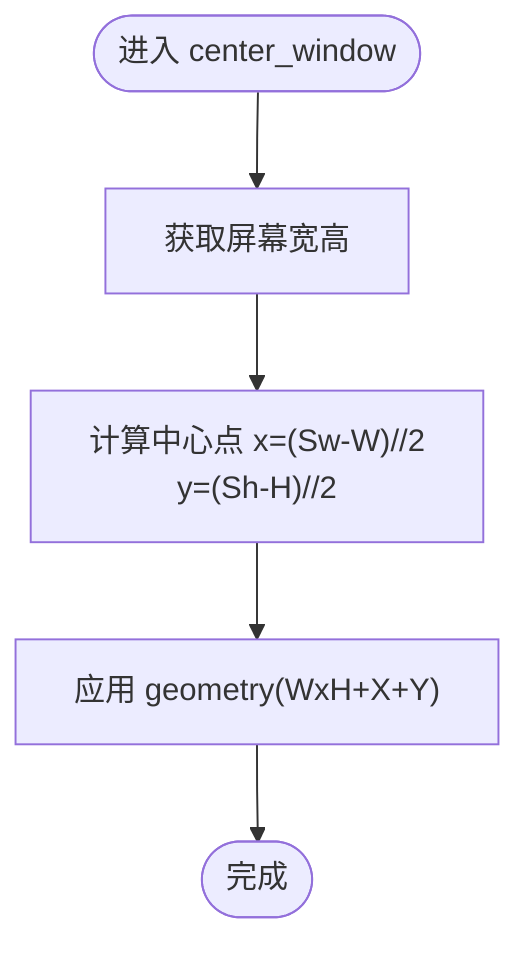
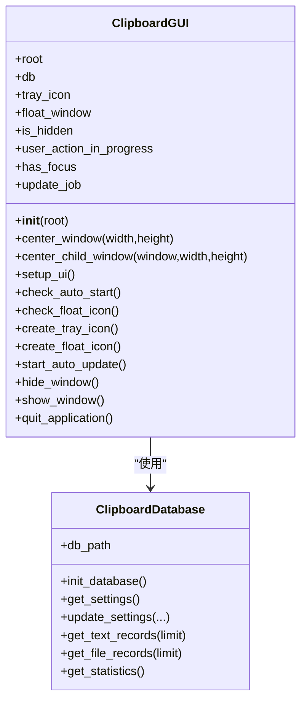
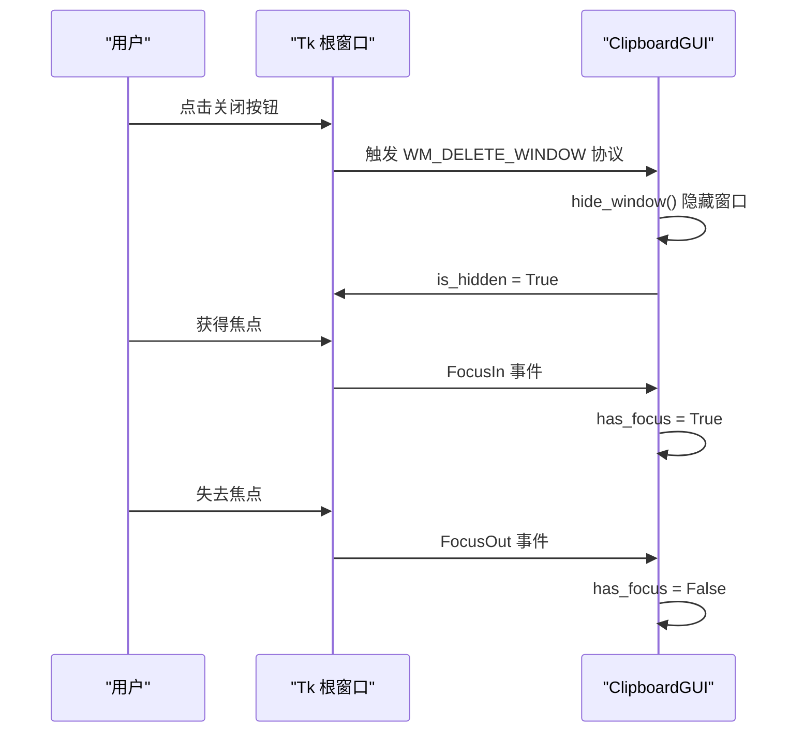
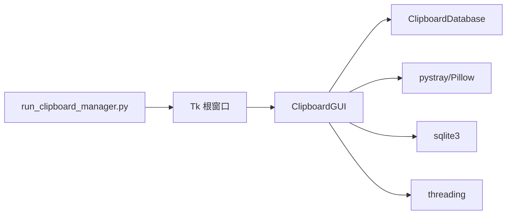

# GUI初始化流程

<cite>
**本文引用的文件**
- [clipboard_gui.py](file://clipboard_gui.py)
- [run_clipboard_manager.py](file://run_clipboard_manager.py)
- [clipboard_manager_main.py](file://clipboard_manager_main.py)
</cite>

## 目录
1. [简介](#简介)
2. [项目结构](#项目结构)
3. [核心组件](#核心组件)
4. [架构总览](#架构总览)
5. [详细组件分析](#详细组件分析)
6. [依赖分析](#依赖分析)
7. [性能考量](#性能考量)
8. [故障排查指南](#故障排查指南)
9. [结论](#结论)

## 简介
本文聚焦 ClipboardGUI 类的 __init__ 方法，系统梳理其窗口初始化的完整流程，包括：
- root 窗口标题、几何尺寸设置与居中显示机制
- 屏幕分辨率适配与跨屏环境下的位置计算
- 系统托盘图标、悬浮图标与后台任务的初始化顺序与依赖关系
- 窗口关闭协议 WM_DELETE_WINDOW 的绑定逻辑与焦点事件监听机制
- 异常处理最佳实践与资源加载失败时的降级策略

## 项目结构
本仓库围绕“剪贴板历史记录”功能组织，GUI 初始化主要由 ClipboardGUI 类承担，入口脚本负责创建 Tk 根窗口并传入构造函数，随后由 run_clipboard_manager.py 控制是否隐藏主窗口并启用托盘图标。

图表来源
- [clipboard_gui.py](file://clipboard_gui.py#L37-L110)
- [run_clipboard_manager.py](file://run_clipboard_manager.py#L55-L66)

章节来源
- [clipboard_gui.py](file://clipboard_gui.py#L37-L110)
- [run_clipboard_manager.py](file://run_clipboard_manager.py#L55-L66)

## 核心组件
- ClipboardGUI：负责 GUI 初始化、UI 构建、托盘与悬浮图标、后台任务调度、窗口关闭与焦点事件等。
- ClipboardDatabase：提供设置与历史记录的读写接口，被 ClipboardGUI 通过属性持有。
- run_clipboard_manager：创建 Tk 根窗口，实例化 ClipboardGUI，并默认隐藏主窗口，仅保留托盘图标。

章节来源
- [clipboard_gui.py](file://clipboard_gui.py#L37-L110)
- [clipboard_manager_main.py](file://clipboard_manager_main.py#L56-L111)
- [run_clipboard_manager.py](file://run_clipboard_manager.py#L55-L66)

## 架构总览
GUI 初始化的关键调用链如下所示：

图表来源
- [run_clipboard_manager.py](file://run_clipboard_manager.py#L55-L66)
- [clipboard_gui.py](file://clipboard_gui.py#L37-L110)
- [clipboard_gui.py](file://clipboard_gui.py#L144-L171)

章节来源
- [run_clipboard_manager.py](file://run_clipboard_manager.py#L55-L66)
- [clipboard_gui.py](file://clipboard_gui.py#L37-L110)
- [clipboard_gui.py](file://clipboard_gui.py#L144-L171)

## 详细组件分析

### 窗口初始化与居中显示机制
- 标题与尺寸设置
  - 在 __init__ 中设置 root 的标题与固定尺寸，随后调用 center_window(width, height) 完成居中。
- 居中算法
  - 通过 root.winfo_screenwidth()/winfo_screenheight() 获取屏幕宽高，计算 x=(Ww−W)/2、y=(Wh−H)/2，最终以 geometry(WxH+X+Y) 设置窗口位置与大小。
- 子窗口居中
  - 提供 center_child_window(window, W, H) 用于弹窗、确认框、设置窗口等，逻辑与上述一致。
- 分辨率适配
  - 由于采用屏幕宽高与窗口尺寸差值的一半进行计算，天然适配不同 DPI 与分辨率；若存在多屏，使用 winfo_screenwidth/height 获取当前窗口所在屏幕的尺寸，保证在当前屏幕内居中。

图表来源
- [clipboard_gui.py](file://clipboard_gui.py#L98-L109)
- [clipboard_gui.py](file://clipboard_gui.py#L111-L122)

章节来源
- [clipboard_gui.py](file://clipboard_gui.py#L98-L122)

### 系统托盘图标、悬浮图标与后台任务的初始化顺序与依赖
- 初始化顺序
  - __init__ 中依次执行：
    1) 设置标题与尺寸
    2) 居中显示
    3) setup_ui 构建 UI
    4) root.after 延迟加载记录
    5) check_auto_start 与 check_float_icon
    6) start_auto_update 启动定时刷新
    7) 绑定 WM_DELETE_WINDOW 与焦点事件
    8) 若可用，创建系统托盘图标
- 依赖关系
  - UI 构建依赖数据库连接对象 db（ClipboardDatabase 实例），用于加载记录与统计。
  - 悬浮图标依赖设置项（来自 db.get_settings()['float_icon']），并在创建时读取屏幕尺寸以定位。
  - 后台任务依赖定时器 root.after，受 is_hidden、user_action_in_progress、has_focus 等标志控制更新频率与时机。
  - 托盘图标依赖外部库 pystray 与 Pillow；若导入失败，会降级输出提示并跳过托盘创建。

图表来源
- [clipboard_gui.py](file://clipboard_gui.py#L37-L110)
- [clipboard_gui.py](file://clipboard_gui.py#L1164-L1234)
- [clipboard_gui.py](file://clipboard_gui.py#L1676-L1722)
- [clipboard_manager_main.py](file://clipboard_manager_main.py#L56-L111)

章节来源
- [clipboard_gui.py](file://clipboard_gui.py#L37-L110)
- [clipboard_gui.py](file://clipboard_gui.py#L1164-L1234)
- [clipboard_gui.py](file://clipboard_gui.py#L1676-L1722)
- [clipboard_manager_main.py](file://clipboard_manager_main.py#L56-L111)

### 关闭协议与焦点事件
- WM_DELETE_WINDOW
  - 绑定 protocol("WM_DELETE_WINDOW", hide_window)，点击关闭按钮时隐藏窗口而非退出，便于托盘常驻。
- 焦点事件
  - 绑定 <FocusIn>/<FocusOut>，分别设置 has_focus 标志，用于更新逻辑中避免在用户交互时频繁刷新。
- 切换显示
  - 提供 toggle_window 与 show_window/hide_window，配合 is_hidden 标志实现显隐切换。

图表来源
- [clipboard_gui.py](file://clipboard_gui.py#L69-L75)
- [clipboard_gui.py](file://clipboard_gui.py#L134-L143)
- [clipboard_gui.py](file://clipboard_gui.py#L1697-L1722)

章节来源
- [clipboard_gui.py](file://clipboard_gui.py#L69-L75)
- [clipboard_gui.py](file://clipboard_gui.py#L134-L143)
- [clipboard_gui.py](file://clipboard_gui.py#L1697-L1722)

### 异常处理与资源加载降级
- 托盘图标可用性检测
  - 通过 try/except 导入 pystray/Pillow，若失败则 TRAY_ICON_AVAILABLE 为 False，并打印提示信息，后续跳过托盘创建。
- 图标资源加载降级
  - 托盘图标优先尝试 2.ico；若不存在则创建简单 RGB 图像作为备选。
  - 悬浮图标优先尝试 2.jpg；若失败则使用纯色背景与文本“C”的降级方案。
- 设置与数据库异常
  - 检查开机自启与悬浮图标设置时均使用 try/except 包裹，捕获异常并打印日志，避免阻断主流程。
- UI 操作异常
  - 大多数用户操作（如复制、删除、重置等）均采用 try/finally 结构，确保 user_action_in_progress 标志在任何情况下都能正确复位，避免状态泄露。

章节来源
- [clipboard_gui.py](file://clipboard_gui.py#L17-L26)
- [clipboard_gui.py](file://clipboard_gui.py#L144-L171)
- [clipboard_gui.py](file://clipboard_gui.py#L1173-L1234)
- [clipboard_gui.py](file://clipboard_gui.py#L800-L878)
- [clipboard_gui.py](file://clipboard_gui.py#L890-L949)
- [clipboard_gui.py](file://clipboard_gui.py#L950-L1130)

## 依赖分析
- 外部依赖
  - tkinter：GUI 框架
  - pystray/Pillow：系统托盘与图标绘制
  - sqlite3：本地数据库
  - threading：后台任务与托盘线程
  - win32clipboard/win32con：Windows 剪贴板读取（在独立模块中使用）
- 内部依赖
  - ClipboardGUI 依赖 ClipboardDatabase 提供的设置与记录接口
  - run_clipboard_manager 负责创建 Tk 根窗口并隐藏主窗口，交由 ClipboardGUI 管理托盘与 UI

图表来源
- [run_clipboard_manager.py](file://run_clipboard_manager.py#L55-L66)
- [clipboard_gui.py](file://clipboard_gui.py#L37-L110)
- [clipboard_manager_main.py](file://clipboard_manager_main.py#L56-L111)

章节来源
- [run_clipboard_manager.py](file://run_clipboard_manager.py#L55-L66)
- [clipboard_gui.py](file://clipboard_gui.py#L37-L110)
- [clipboard_manager_main.py](file://clipboard_manager_main.py#L56-L111)

## 性能考量
- 定时更新策略
  - 通过 root.after(2000, update_records) 每 2 秒刷新一次，仅在窗口显示且无用户操作且无焦点时执行，降低 CPU 占用。
- 数据加载优化
  - UI 构建完成后，使用 root.after(100) 延迟加载记录，避免阻塞主线程响应。
- 资源占用控制
  - 悬浮图标与托盘图标均为可选特性，未安装依赖时自动降级，避免额外开销。

章节来源
- [clipboard_gui.py](file://clipboard_gui.py#L1676-L1722)
- [clipboard_gui.py](file://clipboard_gui.py#L55-L59)

## 故障排查指南
- 托盘图标不可用
  - 现象：启动后无托盘图标
  - 排查：确认已安装 pystray 与 Pillow；查看控制台提示信息；若导入失败，托盘功能将被跳过
  - 参考路径：[clipboard_gui.py](file://clipboard_gui.py#L17-L26)
- 图标资源缺失
  - 现象：托盘图标或悬浮图标显示异常
  - 排查：确认 2.ico/2.jpg 是否存在于资源目录；若缺失，将自动降级为内置图像或文本
  - 参考路径：[clipboard_gui.py](file://clipboard_gui.py#L144-L171), [clipboard_gui.py](file://clipboard_gui.py#L1173-L1234)
- 窗口无法居中
  - 现象：窗口出现在屏幕边缘或偏移
  - 排查：确认多屏环境下窗口所在屏幕的宽高计算；检查窗口尺寸与屏幕尺寸差异
  - 参考路径：[clipboard_gui.py](file://clipboard_gui.py#L98-L122)
- 焦点事件无效
  - 现象：更新仍频繁触发
  - 排查：确认 <FocusIn>/<FocusOut> 绑定是否成功；检查 has_focus 标志是否被正确设置
  - 参考路径：[clipboard_gui.py](file://clipboard_gui.py#L69-L75), [clipboard_gui.py](file://clipboard_gui.py#L134-L143)
- 后台任务未启动
  - 现象：历史记录不刷新
  - 排查：确认 start_auto_update 是否被调用；检查 update_job 是否存在；确认 is_hidden/user_action_in_progress/has_focus 状态
  - 参考路径：[clipboard_gui.py](file://clipboard_gui.py#L1676-L1722)

章节来源
- [clipboard_gui.py](file://clipboard_gui.py#L17-L26)
- [clipboard_gui.py](file://clipboard_gui.py#L98-L122)
- [clipboard_gui.py](file://clipboard_gui.py#L134-L143)
- [clipboard_gui.py](file://clipboard_gui.py#L1676-L1722)

## 结论
ClipboardGUI 的 __init__ 方法遵循“先基础、后高级”的初始化顺序：先设置窗口标题与尺寸并居中，再构建 UI、加载记录，随后按需创建托盘与悬浮图标，并启动后台定时刷新。通过 try/except 与降级策略，系统在缺少依赖或资源缺失时仍能稳定运行。WM_DELETE_WINDOW 与焦点事件的绑定确保了良好的用户体验与性能平衡。建议在生产环境中：
- 明确声明托盘与图标资源依赖
- 在多屏环境下测试居中与悬浮面板定位
- 保持 update_job 的状态一致性，避免误判导致频繁刷新