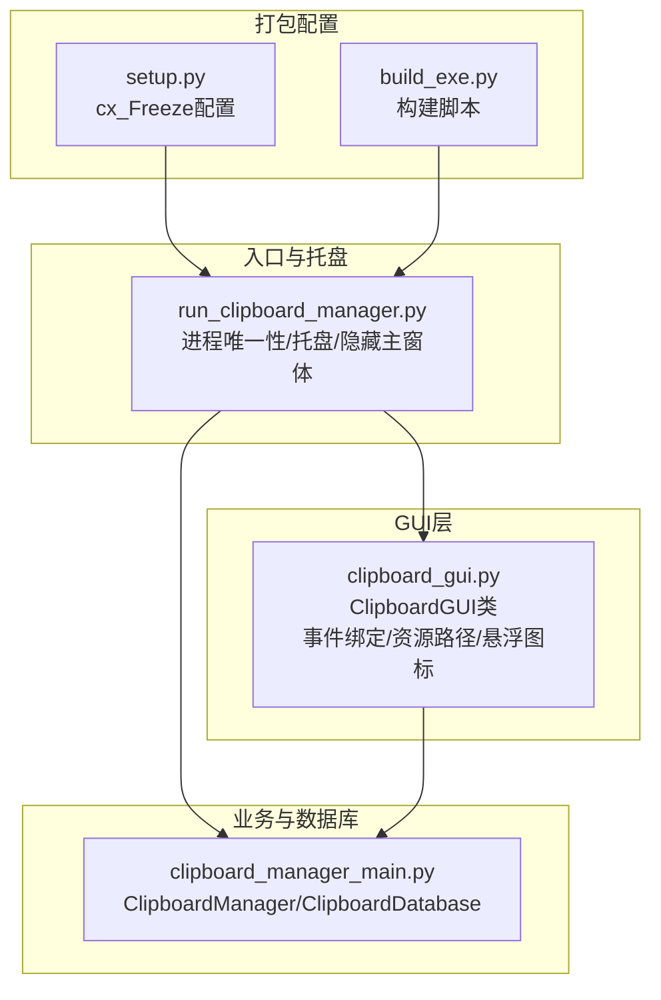
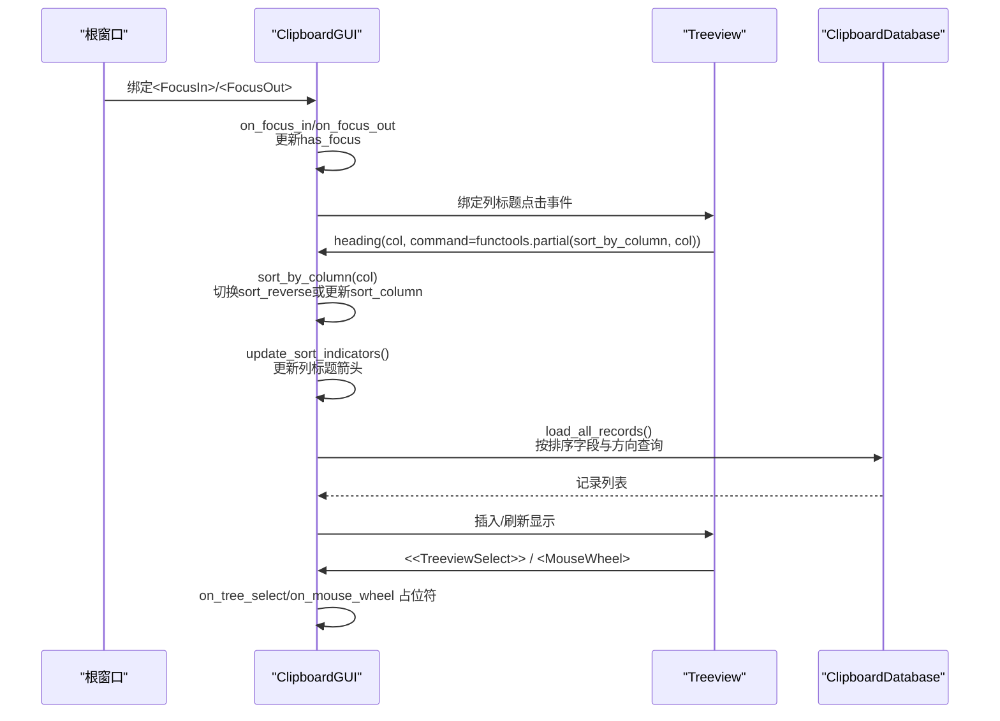
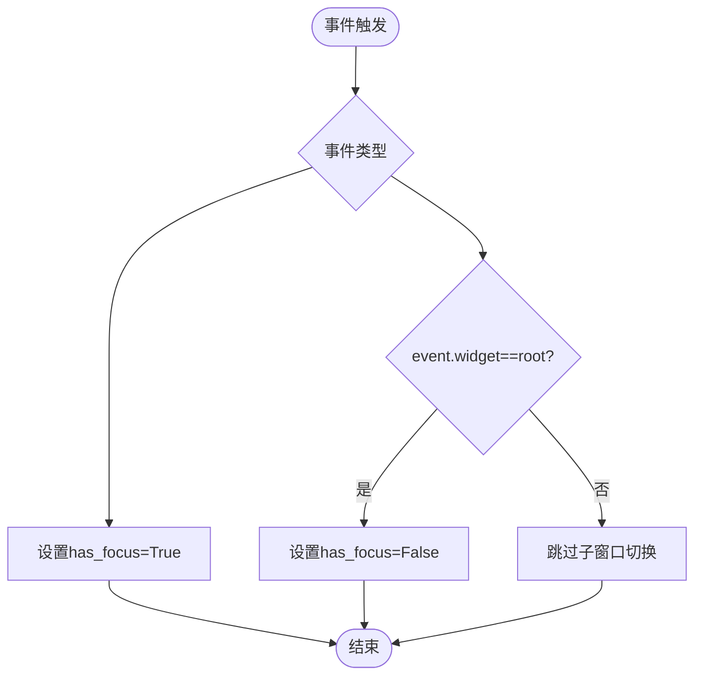
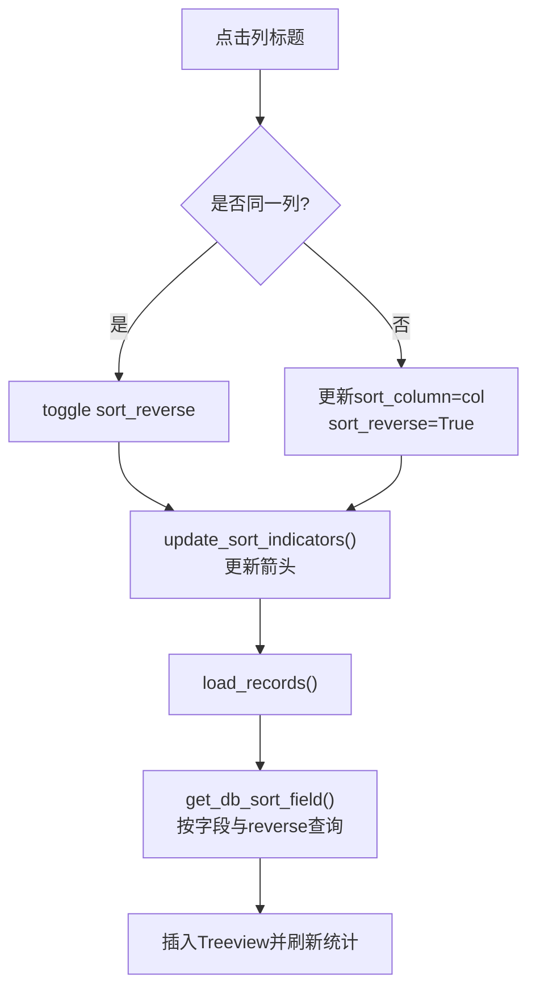
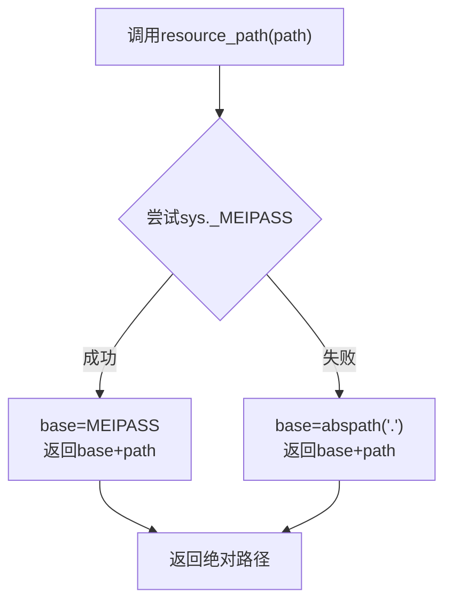
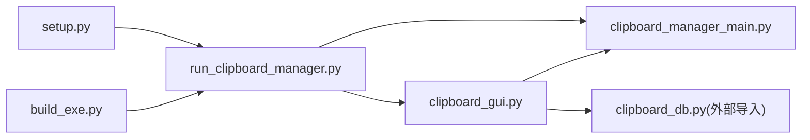

# UI事件处理

<cite>
**本文引用的文件**
- [clipboard_gui.py](file://clipboard_gui.py)
- [run_clipboard_manager.py](file://run_clipboard_manager.py)
- [clipboard_manager_main.py](file://clipboard_manager_main.py)
- [setup.py](file://setup.py)
- [build_exe.py](file://build_exe.py)
</cite>

## 目录
1. [简介](#简介)
2. [项目结构](#项目结构)
3. [核心组件](#核心组件)
4. [架构总览](#架构总览)
5. [详细组件分析](#详细组件分析)
6. [依赖关系分析](#依赖关系分析)
7. [性能考量](#性能考量)
8. [故障排查指南](#故障排查指南)
9. [结论](#结论)

## 简介
本文件聚焦于GUI中的事件处理机制，围绕以下主题展开：
- 窗口焦点事件（<FocusIn>/<FocusOut>）的绑定与has_focus标志的管理逻辑
- 列标题点击事件与sort_by_column方法的排序切换流程
- on_mouse_wheel与on_tree_select事件的占位符实现及其在分页加载中的潜在应用
- resource_path函数在PyInstaller打包后的资源访问（_MEIPASS）与开发模式下的相对路径处理
- functools.partial在解决lambda闭包问题中的实际应用示例

## 项目结构
本项目采用“主程序入口 + GUI界面 + 数据库与业务逻辑”的分层组织。GUI层负责事件绑定与交互，主程序入口负责进程唯一性与托盘/悬浮图标集成，打包配置负责资源打包与可执行文件生成。

图表来源
- [run_clipboard_manager.py](file://run_clipboard_manager.py#L1-L71)
- [clipboard_gui.py](file://clipboard_gui.py#L1-L120)
- [clipboard_manager_main.py](file://clipboard_manager_main.py#L1-L120)
- [setup.py](file://setup.py#L1-L84)
- [build_exe.py](file://build_exe.py#L1-L81)

章节来源
- [run_clipboard_manager.py](file://run_clipboard_manager.py#L1-L71)
- [clipboard_gui.py](file://clipboard_gui.py#L1-L120)
- [clipboard_manager_main.py](file://clipboard_manager_main.py#L1-L120)
- [setup.py](file://setup.py#L1-L84)
- [build_exe.py](file://build_exe.py#L1-L81)

## 核心组件
- ClipboardGUI：负责窗口生命周期、事件绑定、焦点管理、排序、悬浮图标、自动更新等。
- ClipboardManager/ClipboardDatabase：负责剪贴板监控、记录持久化与查询。
- 托盘与进程唯一性：通过run_clipboard_manager.py实现互斥锁与托盘图标。

章节来源
- [clipboard_gui.py](file://clipboard_gui.py#L37-L120)
- [clipboard_manager_main.py](file://clipboard_manager_main.py#L355-L496)
- [run_clipboard_manager.py](file://run_clipboard_manager.py#L1-L71)

## 架构总览
GUI事件处理的关键路径如下：
- 窗口焦点事件绑定与has_focus标志管理
- Treeview列标题点击事件与排序切换
- 鼠标滚轮与选择事件占位符
- 资源路径解析与打包兼容
- 自动更新与用户操作互斥

图表来源
- [clipboard_gui.py](file://clipboard_gui.py#L72-L79)
- [clipboard_gui.py](file://clipboard_gui.py#L238-L308)
- [clipboard_gui.py](file://clipboard_gui.py#L581-L637)
- [clipboard_gui.py](file://clipboard_gui.py#L642-L651)

章节来源
- [clipboard_gui.py](file://clipboard_gui.py#L72-L79)
- [clipboard_gui.py](file://clipboard_gui.py#L238-L308)
- [clipboard_gui.py](file://clipboard_gui.py#L581-L637)
- [clipboard_gui.py](file://clipboard_gui.py#L642-L651)

## 详细组件分析

### 窗口焦点事件与has_focus标志管理
- 绑定：在初始化阶段绑定<FocusIn>与<FocusOut>事件。
- 管理逻辑：
  - on_focus_in：将has_focus设为True。
  - on_focus_out：仅当事件目标为根窗口时，将has_focus设为False，避免子窗口切换导致误判。
- 用途：在自动更新中，若窗口有焦点则暂停更新，避免干扰用户操作。

图表来源
- [clipboard_gui.py](file://clipboard_gui.py#L134-L143)
- [clipboard_gui.py](file://clipboard_gui.py#L1686-L1696)

章节来源
- [clipboard_gui.py](file://clipboard_gui.py#L72-L79)
- [clipboard_gui.py](file://clipboard_gui.py#L134-L143)
- [clipboard_gui.py](file://clipboard_gui.py#L1686-L1696)

### 列标题点击与排序切换（sort_by_column）
- 绑定：为每个列标题绑定heading的command，使用functools.partial解决闭包捕获问题。
- 行为：
  - 若点击同一列：切换sort_reverse（True/False）。
  - 若点击不同列：更新sort_column为当前列，并默认倒序（与历史行为一致）。
- UI反馈：update_sort_indicators在列标题文本后追加箭头（↑/↓），并重新绑定命令。
- 数据加载：调用load_records，内部按get_db_sort_field映射数据库字段与方向进行查询。

图表来源
- [clipboard_gui.py](file://clipboard_gui.py#L238-L308)
- [clipboard_gui.py](file://clipboard_gui.py#L280-L294)
- [clipboard_gui.py](file://clipboard_gui.py#L581-L637)
- [clipboard_gui.py](file://clipboard_gui.py#L627-L637)

章节来源
- [clipboard_gui.py](file://clipboard_gui.py#L238-L308)
- [clipboard_gui.py](file://clipboard_gui.py#L280-L294)
- [clipboard_gui.py](file://clipboard_gui.py#L581-L637)
- [clipboard_gui.py](file://clipboard_gui.py#L627-L637)

### on_mouse_wheel 与 on_tree_select 的占位符实现
- on_mouse_wheel：当前实现为占位符，直接返回，未做分页加载逻辑。
- on_tree_select：当前实现为占位符，未做分页逻辑。
- 分页加载的潜在应用：
  - on_mouse_wheel：可监听滚动到底部时触发load_next_page（当前已废弃方法），或改为懒加载。
  - on_tree_select：可结合滚动位置判断是否接近底部，触发增量加载。
- 注意：当前项目中load_next_page已被注释为“已废弃”，且on_mouse_wheel/on_tree_select未实现分页逻辑。

章节来源
- [clipboard_gui.py](file://clipboard_gui.py#L638-L651)
- [clipboard_gui.py](file://clipboard_gui.py#L642-L651)

### resource_path 函数与PyInstaller打包兼容
- 功能：在开发模式下返回相对路径，在PyInstaller打包后返回基于sys._MEIPASS的绝对路径。
- 使用场景：
  - 托盘图标：create_tray_icon中使用resource_path("2.ico")。
  - 悬浮图标：create_float_icon中使用resource_path("2.jpg")。
- 打包配置：setup.py与build_exe.py均包含资源文件（如2.ico、2.jpg等）的打包清单，确保运行时可找到资源。

图表来源
- [clipboard_gui.py](file://clipboard_gui.py#L27-L36)
- [clipboard_gui.py](file://clipboard_gui.py#L140-L146)
- [clipboard_gui.py](file://clipboard_gui.py#L1195-L1204)
- [setup.py](file://setup.py#L14-L20)
- [build_exe.py](file://build_exe.py#L14-L20)

章节来源
- [clipboard_gui.py](file://clipboard_gui.py#L27-L36)
- [clipboard_gui.py](file://clipboard_gui.py#L140-L146)
- [clipboard_gui.py](file://clipboard_gui.py#L1195-L1204)
- [setup.py](file://setup.py#L14-L20)
- [build_exe.py](file://build_exe.py#L14-L20)

### functools.partial 解决lambda闭包问题的实际示例
- 问题背景：在循环中为Treeview列标题绑定回调时，若使用lambda直接捕获变量，会导致所有回调最终指向循环结束时的同一值。
- 解决方案：使用functools.partial将列名作为实参绑定到sort_by_column，确保每次绑定的回调都携带正确的列名。
- 示例位置：setup_records_tab中为每个列标题绑定heading(command=functools.partial(...))。

章节来源
- [clipboard_gui.py](file://clipboard_gui.py#L238-L243)

### 自动更新与用户操作互斥
- 自动更新：start_auto_update每2秒触发一次update_records。
- 互斥条件：仅当窗口未隐藏、无用户操作进行、且无焦点时才更新，避免干扰用户。
- 用户操作标记：复制/删除等操作开始时设置user_action_in_progress，结束后复位。

章节来源
- [clipboard_gui.py](file://clipboard_gui.py#L1676-L1696)
- [clipboard_gui.py](file://clipboard_gui.py#L800-L838)
- [clipboard_gui.py](file://clipboard_gui.py#L839-L878)

### 托盘与悬浮图标事件链路
- 托盘图标：create_tray_icon在可用时创建托盘图标，菜单项包含“显示界面”和“退出”。
- 悬浮图标：create_float_icon创建悬浮窗口，支持拖动、悬停显示面板、双击显示主窗口。
- 事件绑定：悬浮图标与面板均绑定Enter/Leave/FocusOut等事件，配合延时隐藏策略提升体验。

章节来源
- [clipboard_gui.py](file://clipboard_gui.py#L144-L171)
- [clipboard_gui.py](file://clipboard_gui.py#L1173-L1234)
- [clipboard_gui.py](file://clipboard_gui.py#L1254-L1379)
- [clipboard_gui.py](file://clipboard_gui.py#L1373-L1379)

## 依赖关系分析
- 进程唯一性：run_clipboard_manager通过Windows互斥量确保单实例运行，若已运行则激活已有窗口。
- GUI与业务：ClipboardGUI依赖ClipboardDatabase进行查询与统计；ClipboardManager负责剪贴板监控与记录写入。
- 打包与资源：setup.py/build_exe.py将图标与数据库文件打包进可执行文件，resource_path保证运行时资源定位。

图表来源
- [run_clipboard_manager.py](file://run_clipboard_manager.py#L1-L71)
- [clipboard_gui.py](file://clipboard_gui.py#L1-L40)
- [clipboard_manager_main.py](file://clipboard_manager_main.py#L1-L60)
- [setup.py](file://setup.py#L1-L84)
- [build_exe.py](file://build_exe.py#L1-L81)

章节来源
- [run_clipboard_manager.py](file://run_clipboard_manager.py#L1-L71)
- [clipboard_gui.py](file://clipboard_gui.py#L1-L40)
- [clipboard_manager_main.py](file://clipboard_manager_main.py#L1-L60)
- [setup.py](file://setup.py#L1-L84)
- [build_exe.py](file://build_exe.py#L1-L81)

## 性能考量
- 自动更新频率：每2秒一次，建议在高负载或大数据集时考虑降低频率或按需更新。
- 排序与渲染：排序在UI层进行，建议在数据量较大时考虑服务端排序或虚拟化列表。
- 资源访问：resource_path在每次使用前都会判断MEIPASS，建议在高频调用处缓存资源路径。
- 滚轮事件：当前占位符未实现分页，建议在滚动到底部时触发懒加载，避免一次性加载过多数据。

## 故障排查指南
- 焦点事件误判：若发现has_focus状态异常，检查on_focus_out中对event.widget的判断是否正确。
- 排序箭头不更新：确认update_sort_indicators是否被调用，以及heading的command是否重新绑定。
- 资源找不到：确认打包配置include_files是否包含所需资源，运行时是否位于MEIPASS环境。
- 滚轮与分页：当前on_mouse_wheel/on_tree_select为占位符，若需要分页加载，需实现load_next_page或懒加载逻辑。
- 托盘图标不可用：若缺少pystray/Pillow，TRAY_ICON_AVAILABLE为False，需安装对应依赖。

章节来源
- [clipboard_gui.py](file://clipboard_gui.py#L134-L143)
- [clipboard_gui.py](file://clipboard_gui.py#L295-L308)
- [clipboard_gui.py](file://clipboard_gui.py#L642-L651)
- [setup.py](file://setup.py#L14-L20)
- [build_exe.py](file://build_exe.py#L14-L20)

## 结论
本项目在GUI事件处理方面具备清晰的职责划分：焦点事件用于避免自动更新干扰用户操作；列标题点击通过functools.partial解决闭包问题，实现稳定的排序切换；资源路径函数保障了开发与打包两种运行环境的一致性。当前on_mouse_wheel与on_tree_select为占位符，未实现分页加载，可在后续版本中结合滚动位置与懒加载策略进行增强。