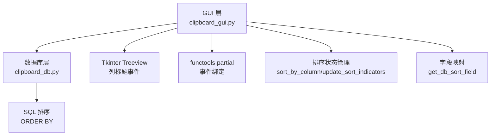
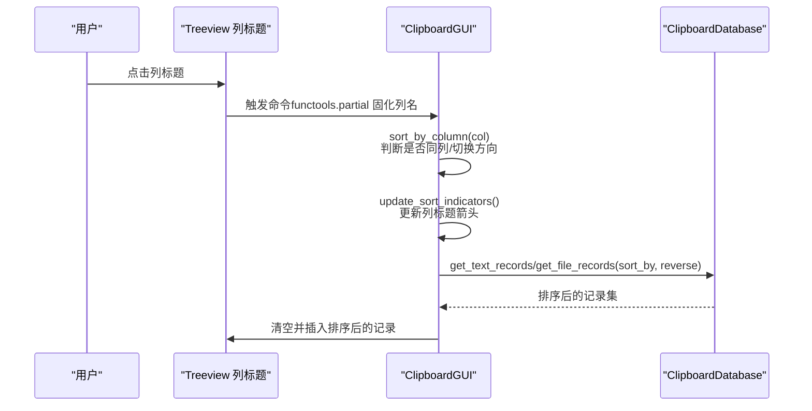
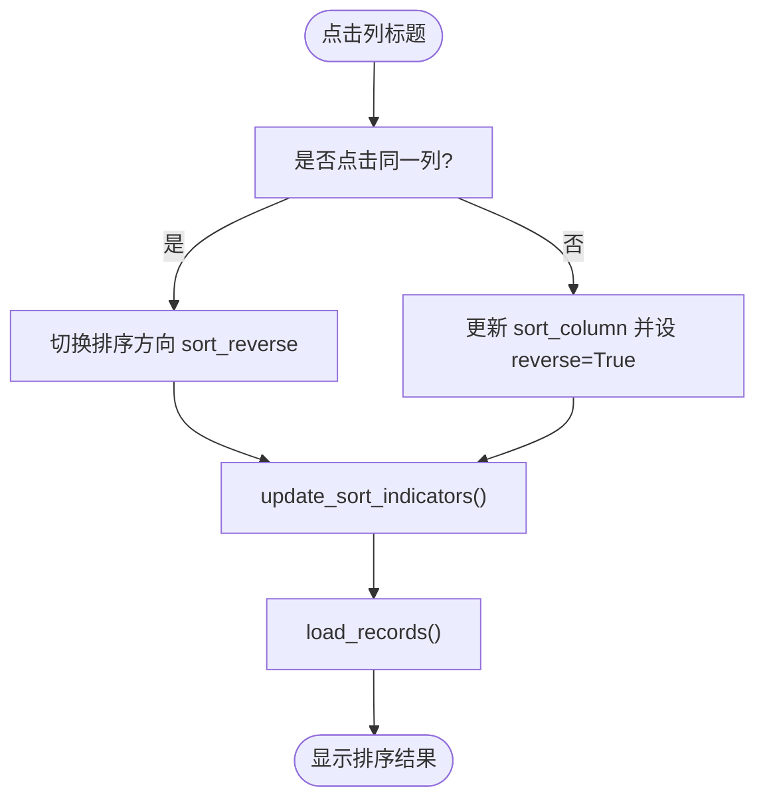
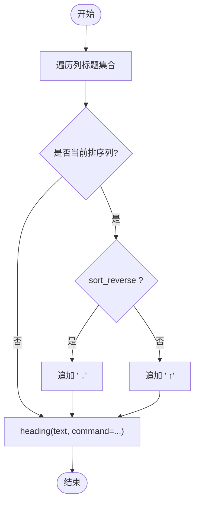
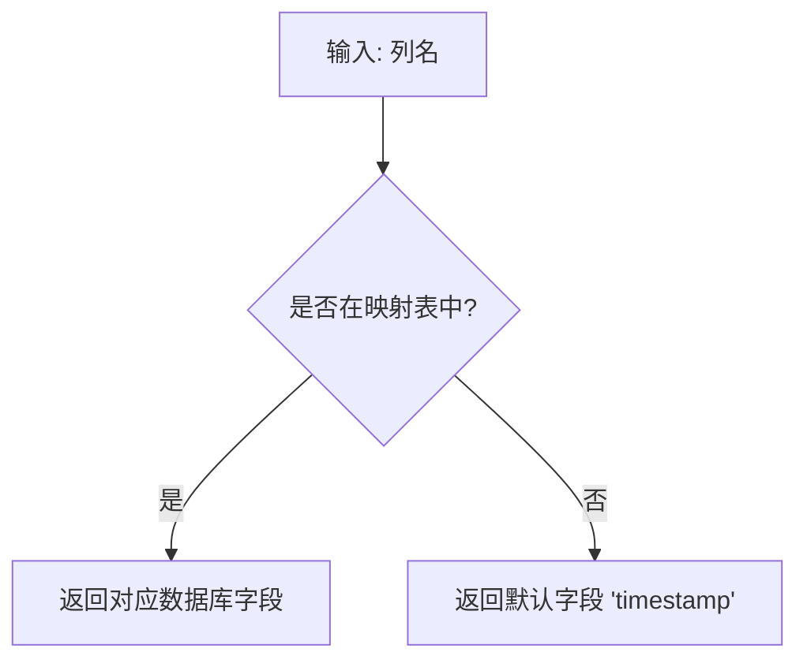
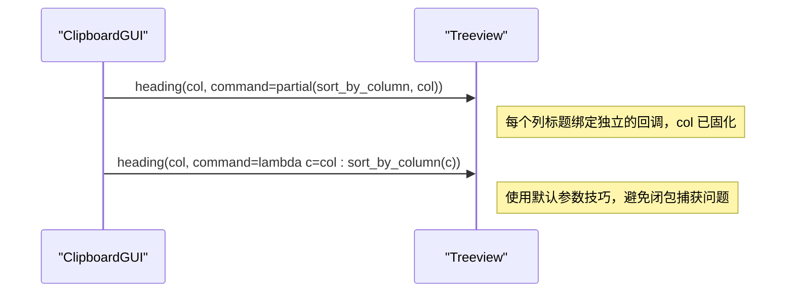
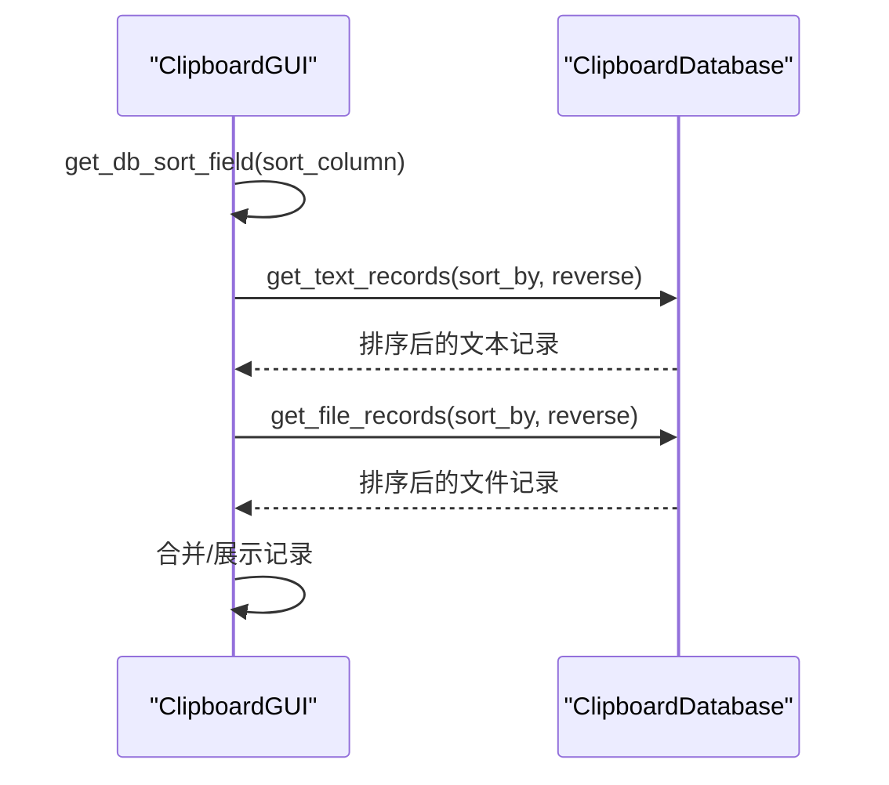
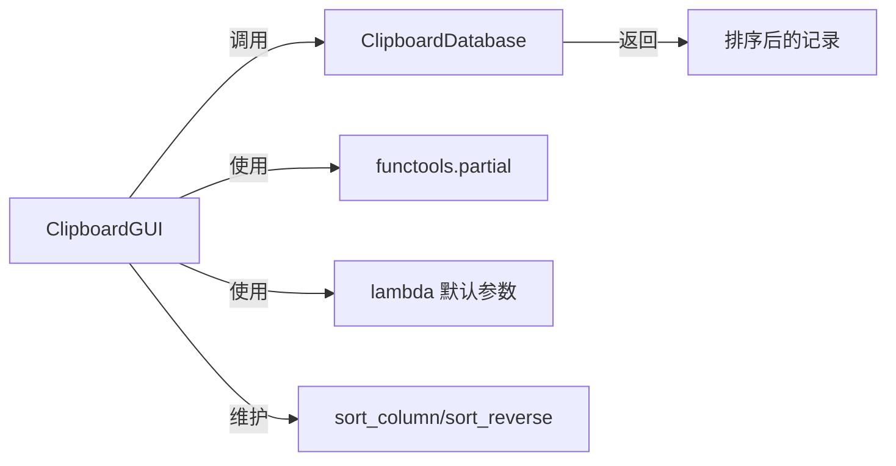

# 列排序机制

<cite>
**本文引用的文件**
- [clipboard_gui.py](file://clipboard_gui.py)
- [clipboard_db.py](file://clipboard_db.py)
</cite>

## 目录
1. [简介](#简介)
2. [项目结构](#项目结构)
3. [核心组件](#核心组件)
4. [架构总览](#架构总览)
5. [详细组件分析](#详细组件分析)
6. [依赖关系分析](#依赖关系分析)
7. [性能考量](#性能考量)
8. [故障排查指南](#故障排查指南)
9. [结论](#结论)

## 简介
本文件聚焦于“列排序机制”的实现细节，围绕树形视图（Treeview）列标题点击事件展开，系统性阐述如下关键点：
- sort_by_column 方法如何响应列标题点击，管理排序状态（相同列切换方向、不同列重置为默认倒序）
- update_sort_indicators 方法如何动态更新列标题的排序箭头指示器（↑/↓）
- get_db_sort_field 函数如何将界面列名映射到数据库字段名，支撑后端排序
- functools.partial 在事件绑定中如何解决 lambda 闭包捕获问题

## 项目结构
本项目采用“GUI + 数据库”分层设计：
- GUI 层负责界面交互、事件绑定、排序状态管理与 UI 更新
- 数据库层负责数据持久化、查询与排序

图表来源
- [clipboard_gui.py](file://clipboard_gui.py#L227-L308)
- [clipboard_db.py](file://clipboard_db.py#L185-L261)

章节来源
- [clipboard_gui.py](file://clipboard_gui.py#L227-L308)
- [clipboard_db.py](file://clipboard_db.py#L185-L261)

## 核心组件
- 列标题点击事件绑定：在记录标签页初始化时，为每个列标题绑定命令，使用 functools.partial 将列名固化到回调函数，避免 lambda 闭包捕获问题
- 排序状态管理：维护 sort_column 与 sort_reverse 两个状态变量，控制当前排序列与方向
- 排序指示器更新：根据当前排序列与方向，在列标题文本后追加箭头符号
- 数据库字段映射：将界面列名映射到数据库字段名，确保后端排序字段正确
- 后端排序执行：调用数据库接口传入排序字段与方向，返回排序后的记录

章节来源
- [clipboard_gui.py](file://clipboard_gui.py#L227-L308)
- [clipboard_gui.py](file://clipboard_gui.py#L581-L637)
- [clipboard_db.py](file://clipboard_db.py#L185-L261)

## 架构总览
下图展示了从用户点击列标题到最终显示排序结果的端到端流程。

图表来源
- [clipboard_gui.py](file://clipboard_gui.py#L227-L308)
- [clipboard_gui.py](file://clipboard_gui.py#L581-L637)
- [clipboard_db.py](file://clipboard_db.py#L185-L261)

## 详细组件分析

### sort_by_column：列点击排序状态管理
- 相同列点击：切换排序方向（sort_reverse）
- 不同列点击：更新当前排序列（sort_column）并默认倒序（reverse=True）
- 更新排序指示器：调用 update_sort_indicators 刷新 UI
- 重新加载记录：调用 load_records 触发后端排序与 UI 刷新

图表来源
- [clipboard_gui.py](file://clipboard_gui.py#L280-L294)
- [clipboard_gui.py](file://clipboard_gui.py#L295-L308)
- [clipboard_gui.py](file://clipboard_gui.py#L581-L637)

章节来源
- [clipboard_gui.py](file://clipboard_gui.py#L280-L294)
- [clipboard_gui.py](file://clipboard_gui.py#L295-L308)

### update_sort_indicators：动态更新排序箭头指示器
- 遍历所有列标题，若为当前排序列，则在标题文本后追加箭头
- 正序使用“↑”，倒序使用“↓”
- 重新设置每个列标题的命令，使用 lambda 的默认参数技巧（或 functools.partial）确保闭包捕获正确

图表来源
- [clipboard_gui.py](file://clipboard_gui.py#L295-L308)

章节来源
- [clipboard_gui.py](file://clipboard_gui.py#L295-L308)

### get_db_sort_field：界面列名到数据库字段名映射
- 将界面列名映射到数据库字段名，用于后端排序
- 默认回退到“timestamp”，保证排序可用性

图表来源
- [clipboard_gui.py](file://clipboard_gui.py#L627-L637)

章节来源
- [clipboard_gui.py](file://clipboard_gui.py#L627-L637)

### functools.partial 解决 lambda 闭包问题：事件绑定实践
- 在初始化列标题时，使用 functools.partial 将列名固化到回调函数，避免 lambda 闭包捕获同一变量导致的“全部指向最后一个列名”的问题
- 后续 update_sort_indicators 中也采用类似策略（lambda 的默认参数技巧）确保命令绑定正确

图表来源
- [clipboard_gui.py](file://clipboard_gui.py#L239-L243)
- [clipboard_gui.py](file://clipboard_gui.py#L306-L308)

章节来源
- [clipboard_gui.py](file://clipboard_gui.py#L239-L243)
- [clipboard_gui.py](file://clipboard_gui.py#L306-L308)

### 后端排序执行：数据库层配合
- GUI 层通过 get_db_sort_field 获取数据库字段名，并将 sort_reverse 传入数据库接口
- 数据库层根据 sort_by 与 reverse 生成 ORDER BY 子句，返回排序后的记录

图表来源
- [clipboard_gui.py](file://clipboard_gui.py#L581-L637)
- [clipboard_db.py](file://clipboard_db.py#L185-L261)

章节来源
- [clipboard_gui.py](file://clipboard_gui.py#L581-L637)
- [clipboard_db.py](file://clipboard_db.py#L185-L261)

## 依赖关系分析
- GUI 依赖数据库层提供的排序接口，传递排序字段与方向
- GUI 通过 functools.partial 与 lambda 默认参数技巧，确保事件回调正确绑定
- 排序状态由 GUI 内部变量维护，影响 UI 指示器与后端查询

图表来源
- [clipboard_gui.py](file://clipboard_gui.py#L227-L308)
- [clipboard_gui.py](file://clipboard_gui.py#L581-L637)
- [clipboard_db.py](file://clipboard_db.py#L185-L261)

章节来源
- [clipboard_gui.py](file://clipboard_gui.py#L227-L308)
- [clipboard_gui.py](file://clipboard_gui.py#L581-L637)
- [clipboard_db.py](file://clipboard_db.py#L185-L261)

## 性能考量
- 列表排序：数值型字段（大小、次数）采用专用解析与排序，非数值回退为 0，避免异常导致的排序失败
- 文本排序：对空值进行安全处理，确保排序稳定
- 后端排序：数据库层统一使用 ORDER BY，减少前端复杂排序逻辑
- UI 更新：每次排序后清空并重新插入记录，保证显示一致性

章节来源
- [clipboard_gui.py](file://clipboard_gui.py#L700-L744)
- [clipboard_db.py](file://clipboard_db.py#L185-L261)

## 故障排查指南
- 现象：点击列标题后所有箭头都指向同一方向
  - 排查：确认是否使用了正确的事件绑定方式（functools.partial 或 lambda 默认参数）
  - 参考：[clipboard_gui.py](file://clipboard_gui.py#L239-L243)、[clipboard_gui.py](file://clipboard_gui.py#L306-L308)
- 现象：排序方向未切换或始终倒序
  - 排查：检查 sort_by_column 的分支逻辑与 sort_reverse 的切换
  - 参考：[clipboard_gui.py](file://clipboard_gui.py#L280-L294)
- 现象：数值列排序异常
  - 排查：确认数值解析逻辑与异常回退（0）是否生效
  - 参考：[clipboard_gui.py](file://clipboard_gui.py#L714-L737)
- 现象：数据库排序字段不匹配
  - 排查：核对 get_db_sort_field 的映射表与数据库字段名
  - 参考：[clipboard_gui.py](file://clipboard_gui.py#L627-L637)、[clipboard_db.py](file://clipboard_db.py#L185-L261)

章节来源
- [clipboard_gui.py](file://clipboard_gui.py#L239-L243)
- [clipboard_gui.py](file://clipboard_gui.py#L280-L294)
- [clipboard_gui.py](file://clipboard_gui.py#L627-L637)
- [clipboard_gui.py](file://clipboard_gui.py#L714-L737)
- [clipboard_db.py](file://clipboard_db.py#L185-L261)

## 结论
本实现通过清晰的状态管理、可靠的事件绑定策略与稳健的数据库排序配合，实现了直观、稳定的列排序体验。其中：
- sort_by_column 提供明确的排序状态切换规则
- update_sort_indicators 实时反馈排序方向
- get_db_sort_field 保障前后端字段一致性
- functools.partial 与 lambda 默认参数技巧有效规避闭包陷阱