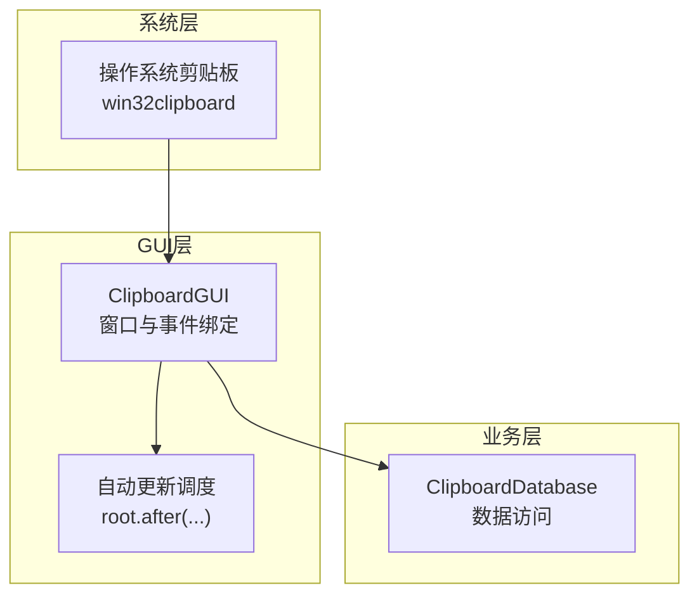
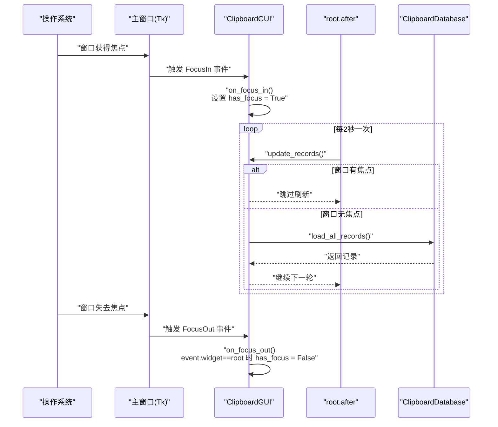
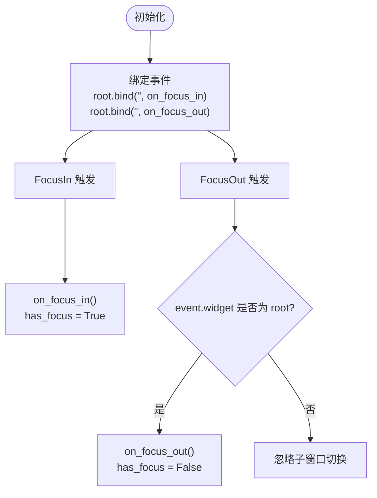
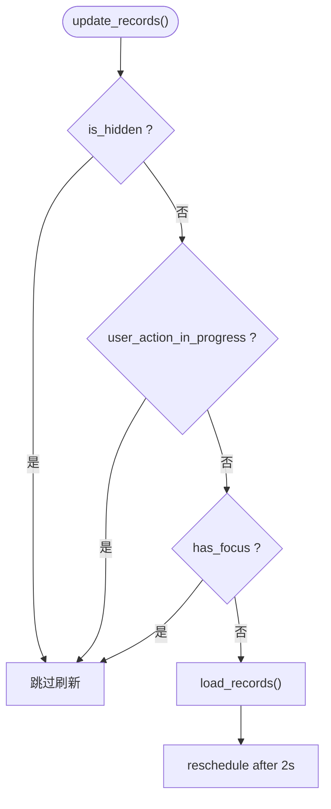
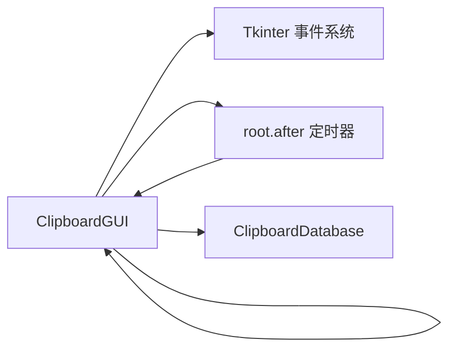

# 焦点管理

<cite>
**本文引用的文件**
- [clipboard_gui.py](file://clipboard_gui.py)
- [clipboard_manager_main.py](file://clipboard_manager_main.py)
</cite>

## 目录
1. [简介](#简介)
2. [项目结构](#项目结构)
3. [核心组件](#核心组件)
4. [架构总览](#架构总览)
5. [详细组件分析](#详细组件分析)
6. [依赖关系分析](#依赖关系分析)
7. [性能考量](#性能考量)
8. [故障排查指南](#故障排查指南)
9. [结论](#结论)
10. [附录](#附录)

## 简介
本章节聚焦于窗口焦点事件的处理机制，系统性阐述以下内容：
- FocusIn 与 FocusOut 事件的绑定方式与触发条件
- on_focus_in 与 on_focus_out 方法的行为与语义
- has_focus 标志位在自动更新逻辑中的作用与意义
- 如何通过事件绑定语法与 tkinter 事件系统实现用户交互控制
- 面向开发者的最佳实践建议

## 项目结构
本项目采用“GUI界面 + 数据库 + 剪贴板监控”的分层设计。焦点管理主要位于 GUI 层，通过 Tkinter 的事件绑定机制实现窗口焦点状态的感知与控制。

图表来源
- [clipboard_gui.py](file://clipboard_gui.py#L72-L75)
- [clipboard_gui.py](file://clipboard_gui.py#L1676-L1696)
- [clipboard_manager_main.py](file://clipboard_manager_main.py#L1-L120)

章节来源
- [clipboard_gui.py](file://clipboard_gui.py#L1-L120)
- [clipboard_manager_main.py](file://clipboard_manager_main.py#L1-L120)

## 核心组件
- ClipboardGUI：负责窗口生命周期、事件绑定、自动更新调度与 UI 交互。
- ClipboardDatabase：提供数据访问接口，被 GUI 层调用以加载/刷新记录。
- ClipboardManager：负责剪贴板监控与数据持久化（非本节重点，但与焦点无关）。

章节来源
- [clipboard_gui.py](file://clipboard_gui.py#L37-L120)
- [clipboard_manager_main.py](file://clipboard_manager_main.py#L56-L120)

## 架构总览
焦点事件处理在 GUI 层完成，核心流程如下：
- 初始化阶段绑定 FocusIn/FocusOut 事件
- 用户交互导致焦点变化时，回调方法设置 has_focus 标志
- 自动更新任务在每次周期中检查 has_focus，避免在窗口获得焦点时刷新，从而减少对用户的干扰

图表来源
- [clipboard_gui.py](file://clipboard_gui.py#L72-L75)
- [clipboard_gui.py](file://clipboard_gui.py#L134-L143)
- [clipboard_gui.py](file://clipboard_gui.py#L1676-L1696)

## 详细组件分析

### 焦点事件绑定与回调
- 绑定位置：在 GUI 初始化时，对根窗口绑定 FocusIn 与 FocusOut 事件。
- 回调方法：
  - on_focus_in：将 has_focus 设为 True，表示窗口获得焦点
  - on_focus_out：当事件源为根窗口时，将 has_focus 设为 False，避免子窗口切换导致的误判

图表来源
- [clipboard_gui.py](file://clipboard_gui.py#L72-L75)
- [clipboard_gui.py](file://clipboard_gui.py#L134-L143)

章节来源
- [clipboard_gui.py](file://clipboard_gui.py#L72-L75)
- [clipboard_gui.py](file://clipboard_gui.py#L134-L143)

### has_focus 标志在自动更新中的应用
- 自动更新策略：每 2 秒触发一次 update_records
- 刷新条件：仅当窗口未隐藏、无用户操作进行中、且无焦点时才刷新
- 目的：避免在用户操作期间频繁刷新，提升交互流畅性

图表来源
- [clipboard_gui.py](file://clipboard_gui.py#L1676-L1696)

章节来源
- [clipboard_gui.py](file://clipboard_gui.py#L1676-L1696)

### 事件绑定语法与最佳实践
- 绑定语法：使用 root.bind("<事件名>", 回调函数) 或控件.bind("<事件名>", 回调函数)
- 事件名规范：使用 "<事件名>" 形式，如 "<FocusIn>"、"<FocusOut>"
- 事件回调签名：通常接收 event 参数，可从中读取 widget、x、y 等属性
- 子窗口切换注意事项：在 FocusOut 中通过 event.widget 判断事件源是否为根窗口，避免因子窗口焦点切换导致 has_focus 被错误清零

章节来源
- [clipboard_gui.py](file://clipboard_gui.py#L72-L75)
- [clipboard_gui.py](file://clipboard_gui.py#L134-L143)
- [clipboard_gui.py](file://clipboard_gui.py#L1373-L1378)

### 与悬浮面板焦点事件的关系
- 悬浮面板（float_panel）同样绑定 <FocusOut> 与 <Leave> 事件，用于在焦点丢失或鼠标离开时隐藏面板
- 该模式与主窗口的 FocusIn/FocusOut 一致，体现统一的事件驱动交互风格

章节来源
- [clipboard_gui.py](file://clipboard_gui.py#L1373-L1378)

## 依赖关系分析
- GUI 层依赖 Tkinter 事件系统与 root.after 定时器
- 自动更新逻辑依赖 has_focus、is_hidden、user_action_in_progress 三个状态位
- 数据刷新依赖 ClipboardDatabase 的查询接口

图表来源
- [clipboard_gui.py](file://clipboard_gui.py#L72-L75)
- [clipboard_gui.py](file://clipboard_gui.py#L1676-L1696)
- [clipboard_manager_main.py](file://clipboard_manager_main.py#L181-L211)

章节来源
- [clipboard_gui.py](file://clipboard_gui.py#L72-L75)
- [clipboard_gui.py](file://clipboard_gui.py#L1676-L1696)
- [clipboard_manager_main.py](file://clipboard_manager_main.py#L181-L211)

## 性能考量
- 频繁刷新会带来 UI 与数据库 IO 的开销。通过 has_focus 与 is_hidden、user_action_in_progress 的组合判断，可在用户交互期间避免刷新，降低资源消耗。
- 定时器周期（2 秒）与刷新频率需权衡：过短可能影响交互体验，过长可能导致界面滞后。
- 对于悬浮面板等轻量级 UI，同样采用延迟隐藏与焦点事件，避免频繁创建/销毁带来的抖动。

## 故障排查指南
- 焦点状态异常
  - 现象：窗口明明无焦点却未刷新，或有焦点却被刷新
  - 排查：确认 FocusIn/FocusOut 是否正确绑定；检查 on_focus_out 中对 event.widget 的判断是否仅在根窗口失焦时清零 has_focus
- 自动更新未生效
  - 现象：定时刷新未触发
  - 排查：确认 start_auto_update 是否被调用；检查 update_job 是否被取消；核对 update_records 中的条件分支
- 子窗口切换导致焦点误判
  - 现象：弹窗/面板切换导致 has_focus 被清零
  - 排查：确保 on_focus_out 仅在 event.widget 为根窗口时清零 has_focus

章节来源
- [clipboard_gui.py](file://clipboard_gui.py#L72-L75)
- [clipboard_gui.py](file://clipboard_gui.py#L134-L143)
- [clipboard_gui.py](file://clipboard_gui.py#L1676-L1696)

## 结论
本项目的焦点管理通过简洁而稳健的事件绑定与状态位组合，实现了在用户交互期间抑制刷新、提升体验的目标。FocusIn/FocusOut 的正确使用与 has_focus 的合理传播，使得自动更新逻辑既能及时反映数据变化，又不会干扰用户操作。

## 附录
- 事件绑定语法要点
  - 使用 root.bind("<事件名>", 回调函数) 或控件.bind("<事件名>", 回调函数)
  - 回调函数签名通常包含 event 参数，可读取事件上下文
- 最佳实践清单
  - 在 FocusOut 中严格判断 event.widget 是否为根窗口，避免子窗口切换误判
  - 在用户操作进行期间（如弹窗、输入框编辑）避免刷新
  - 对高频 UI 更新采用节流/去抖策略（如定时器周期与条件判断）
  - 对子窗口（如悬浮面板）采用 <FocusOut>/<Leave> 组合，必要时加入延迟隐藏