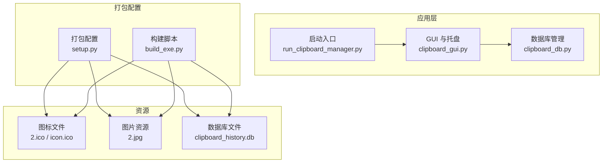
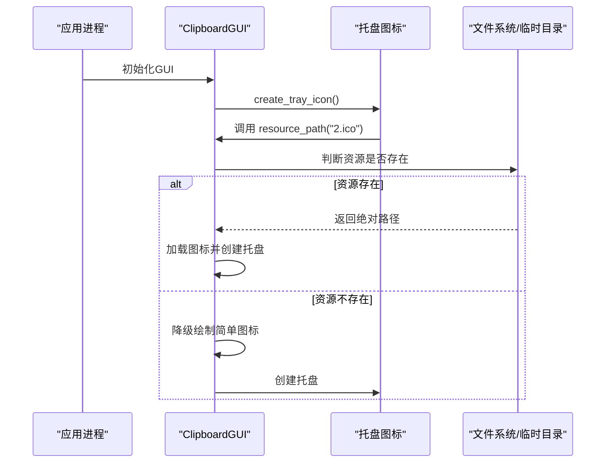
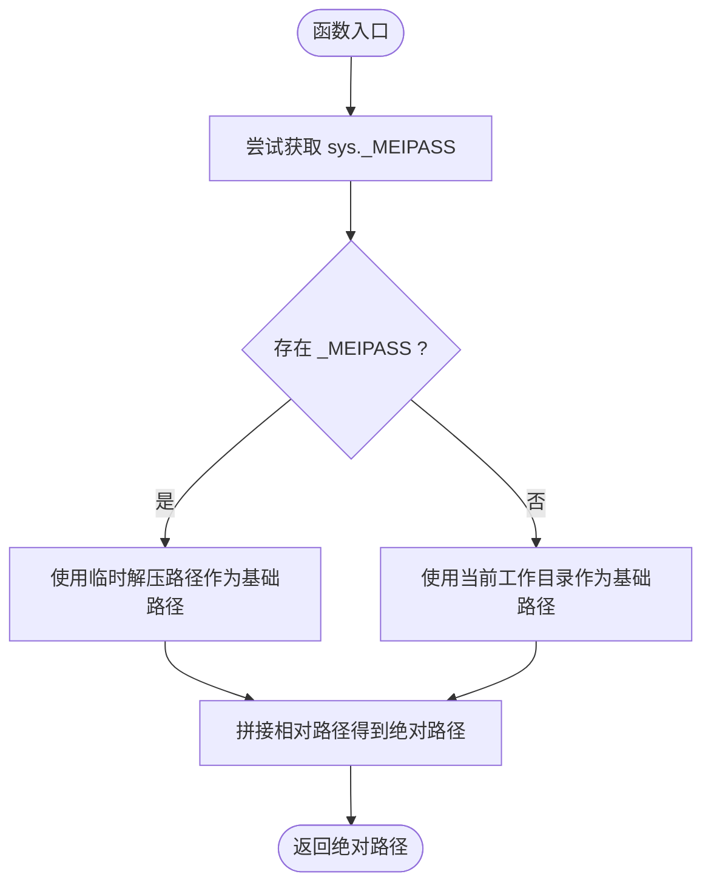
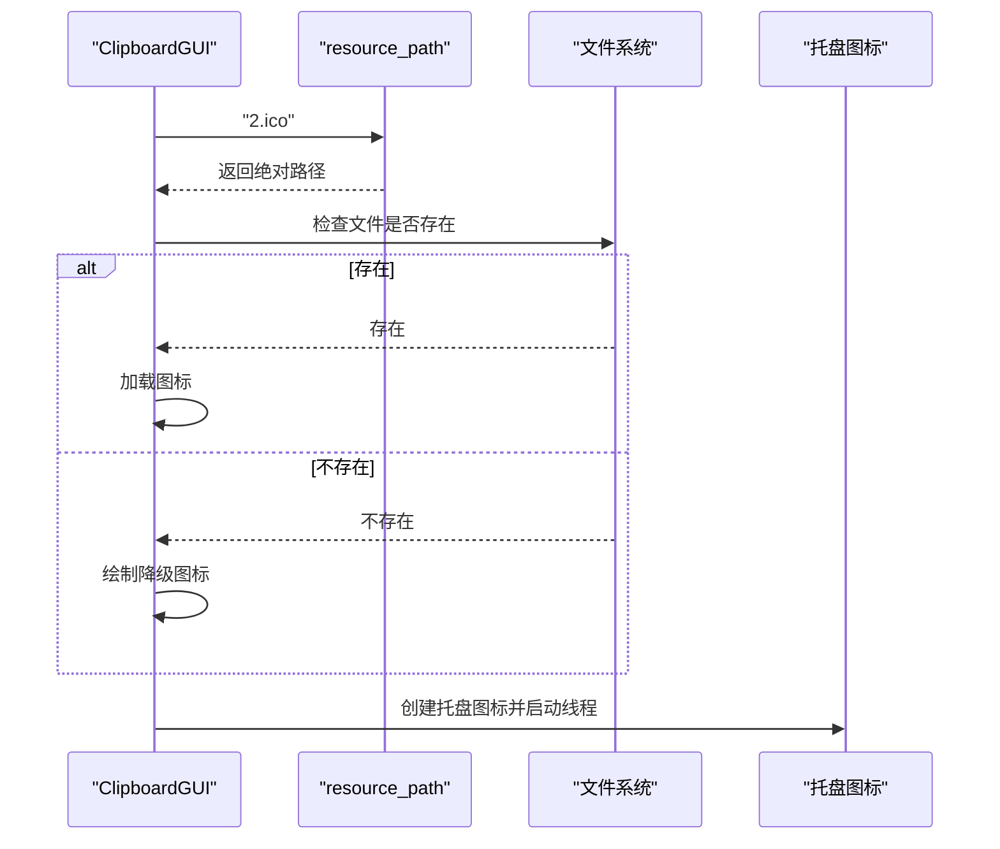
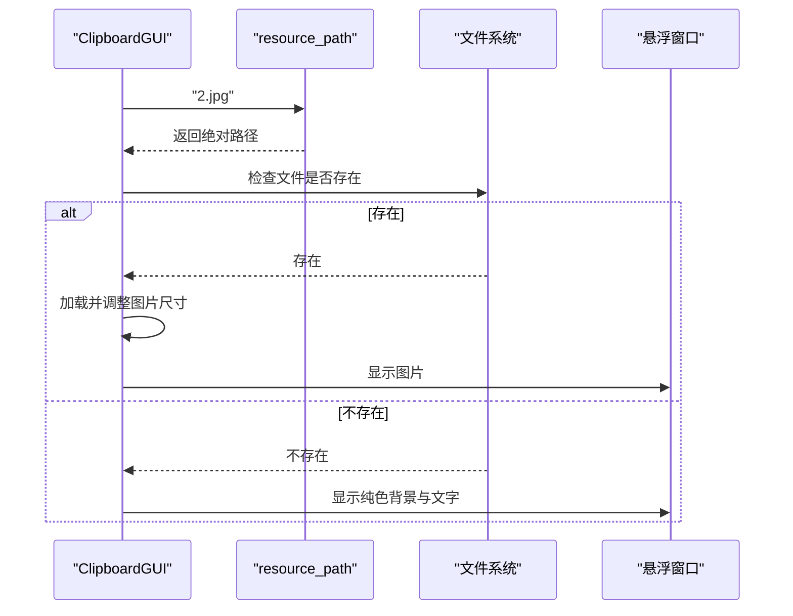
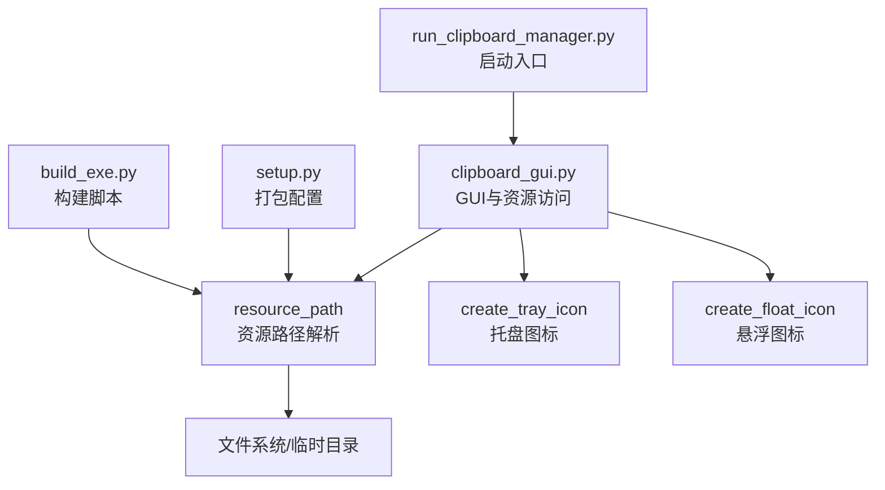

# 资源访问管理

<cite>
**本文引用的文件**
- [clipboard_gui.py](file://clipboard_gui.py)
- [run_clipboard_manager.py](file://run_clipboard_manager.py)
- [setup.py](file://setup.py)
- [build_exe.py](file://build_exe.py)
- [clipboard_db.py](file://clipboard_db.py)
- [convert_to_ico.py](file://convert_to_ico.py)
</cite>

## 目录
1. [简介](#简介)
2. [项目结构](#项目结构)
3. [核心组件](#核心组件)
4. [架构总览](#架构总览)
5. [详细组件分析](#详细组件分析)
6. [依赖关系分析](#依赖关系分析)
7. [性能考量](#性能考量)
8. [故障排查指南](#故障排查指南)
9. [结论](#结论)
10. [附录](#附录)

## 简介
本文件围绕资源访问机制展开，重点说明 resource_path 函数如何在 PyInstaller 打包后的可执行文件环境中正确解析静态资源（如图标、图片等）。该机制通过捕获 sys._MEIPASS 异常来区分开发模式与生产环境：在打包模式下使用临时解压路径，在开发模式下使用当前工作目录相对路径。文档还结合 create_tray_icon 方法加载 2.ico 图标的实际应用，说明该机制对应用程序可移植性的贡献，并给出图标与配置文件等静态资源访问的最佳实践。

## 项目结构
本仓库采用“功能模块化 + 打包配置”的组织方式：
- GUI 与托盘图标：clipboard_gui.py 提供 GUI 界面、托盘图标创建、悬浮图标等功能，并内置资源路径解析函数 resource_path。
- 启动入口：run_clipboard_manager.py 负责启动 GUI 并隐藏主窗口，仅保留托盘图标。
- 打包配置：setup.py 与 build_exe.py 定义了包含图标、数据库等静态资源的打包规则。
- 数据库：clipboard_db.py 管理 SQLite 数据库，负责记录与设置持久化。
- 图标转换：convert_to_ico.py 提供将 JPG 转换为 ICO 的工具，便于生成 2.ico 等图标文件。

图表来源
- [clipboard_gui.py](file://clipboard_gui.py#L1-L40)
- [run_clipboard_manager.py](file://run_clipboard_manager.py#L1-L71)
- [setup.py](file://setup.py#L1-L84)
- [build_exe.py](file://build_exe.py#L1-L59)
- [clipboard_db.py](file://clipboard_db.py#L1-L120)

章节来源
- [clipboard_gui.py](file://clipboard_gui.py#L1-L40)
- [run_clipboard_manager.py](file://run_clipboard_manager.py#L1-L71)
- [setup.py](file://setup.py#L1-L84)
- [build_exe.py](file://build_exe.py#L1-L59)
- [clipboard_db.py](file://clipboard_db.py#L1-L120)

## 核心组件
- 资源路径解析函数 resource_path：统一处理开发与打包两种环境下的资源定位，保证图标、图片等静态资源在不同环境下都能被正确加载。
- 托盘图标创建 create_tray_icon：通过 resource_path 解析 2.ico，若资源缺失则降级绘制简单图标，确保托盘可用性。
- 悬浮图标与图片资源：create_float_icon 中通过 resource_path 解析 2.jpg，若资源缺失则回退到纯色背景与文字提示，保障用户体验。
- 打包配置：setup.py 与 build_exe.py 将 2.ico、icon.ico、clipboard_history.db 等静态资源包含进最终可执行文件，确保运行时可直接访问。

章节来源
- [clipboard_gui.py](file://clipboard_gui.py#L27-L36)
- [clipboard_gui.py](file://clipboard_gui.py#L144-L171)
- [clipboard_gui.py](file://clipboard_gui.py#L1195-L1217)
- [setup.py](file://setup.py#L1-L84)
- [build_exe.py](file://build_exe.py#L1-L59)

## 架构总览
资源访问的整体流程如下：
- 应用启动后，GUI 初始化并尝试创建托盘图标。
- 托盘图标创建时调用 resource_path 解析 2.ico 的绝对路径。
- 若资源存在则加载；否则降级绘制简单图标。
- 悬浮图标创建时同样调用 resource_path 解析 2.jpg；若资源存在则加载图片；否则回退到纯色背景与文字提示。
- 打包阶段由 setup.py/build_exe.py 将静态资源打包进可执行文件，确保运行时可访问。

图表来源
- [clipboard_gui.py](file://clipboard_gui.py#L27-L36)
- [clipboard_gui.py](file://clipboard_gui.py#L144-L171)

章节来源
- [clipboard_gui.py](file://clipboard_gui.py#L27-L36)
- [clipboard_gui.py](file://clipboard_gui.py#L144-L171)

## 详细组件分析

### 资源路径解析函数 resource_path
- 设计目标：在开发模式（直接运行 Python 源码）与生产模式（PyInstaller 打包为可执行文件）之间无缝切换，统一静态资源的访问路径。
- 实现要点：
  - 开发模式：sys._MEIPASS 不存在，捕获异常后使用当前工作目录的绝对路径拼接相对路径。
  - 生产模式：PyInstaller 会在运行时设置 sys._MEIPASS，指向临时解压目录，resource_path 返回该目录下的资源绝对路径。
  - 适用范围：适用于图标、图片、数据库文件等静态资源的统一访问。

图表来源
- [clipboard_gui.py](file://clipboard_gui.py#L27-L36)

章节来源
- [clipboard_gui.py](file://clipboard_gui.py#L27-L36)

### 托盘图标创建 create_tray_icon
- 关键步骤：
  - 调用 resource_path("2.ico") 获取图标绝对路径。
  - 若文件存在则加载；否则绘制一个简单的 RGB 图像作为降级图标。
  - 创建菜单项（显示界面、退出），在独立线程中运行托盘图标。
- 重要性：托盘图标是用户交互的重要入口，必须保证在开发与打包两种环境下均可加载图标，避免因资源路径问题导致托盘不可用。

图表来源
- [clipboard_gui.py](file://clipboard_gui.py#L144-L171)

章节来源
- [clipboard_gui.py](file://clipboard_gui.py#L144-L171)

### 悬浮图标与图片资源 create_float_icon
- 关键步骤：
  - 调用 resource_path("2.jpg") 获取图片绝对路径。
  - 若文件存在则加载并调整尺寸；否则回退到纯色背景与文字提示。
  - 支持拖动、悬停显示面板、双击显示主窗口等交互。
- 重要性：悬浮图标提供便捷入口，图片资源加载失败不应影响主功能，因此需要完善的降级策略。

图表来源
- [clipboard_gui.py](file://clipboard_gui.py#L1195-L1217)

章节来源
- [clipboard_gui.py](file://clipboard_gui.py#L1195-L1217)

### 打包配置与静态资源包含
- setup.py 与 build_exe.py 将以下静态资源包含进最终可执行文件：
  - 图标文件：2.ico、icon.ico
  - 数据库文件：clipboard_history.db
- 这些资源在运行时可通过 resource_path 正确解析，确保托盘图标与悬浮图标等 UI 资源可用。

章节来源
- [setup.py](file://setup.py#L1-L84)
- [build_exe.py](file://build_exe.py#L1-L59)

### 数据库与设置持久化
- clipboard_db.py 负责数据库初始化、表结构维护与设置项持久化（如 float_icon、auto_start 等）。
- 虽不直接涉及资源路径，但与 GUI 的设置界面配合，确保用户偏好在不同环境下保持一致。

章节来源
- [clipboard_db.py](file://clipboard_db.py#L1-L120)

### 图标转换工具 convert_to_ico
- convert_to_ico.py 提供将 JPG 转换为 ICO 的能力，便于生成 2.ico、icon.ico 等图标文件，供打包与运行时使用。

章节来源
- [convert_to_ico.py](file://convert_to_ico.py#L1-L48)

## 依赖关系分析
- GUI 与资源访问：clipboard_gui.py 内部的 resource_path 是资源访问的核心依赖点，所有静态资源加载均通过它完成。
- 托盘与悬浮图标：create_tray_icon 与 create_float_icon 依赖 resource_path 的返回值，确保在打包与开发两种环境下均能加载到正确的资源。
- 打包配置：setup.py 与 build_exe.py 决定哪些静态资源被打包进可执行文件，直接影响 resource_path 的解析结果。
- 启动入口：run_clipboard_manager.py 负责启动 GUI 并隐藏主窗口，托盘图标成为主要交互入口，间接体现资源访问机制的重要性。

图表来源
- [clipboard_gui.py](file://clipboard_gui.py#L27-L36)
- [clipboard_gui.py](file://clipboard_gui.py#L144-L171)
- [clipboard_gui.py](file://clipboard_gui.py#L1195-L1217)
- [setup.py](file://setup.py#L1-L84)
- [build_exe.py](file://build_exe.py#L1-L59)
- [run_clipboard_manager.py](file://run_clipboard_manager.py#L1-L71)

章节来源
- [clipboard_gui.py](file://clipboard_gui.py#L27-L36)
- [clipboard_gui.py](file://clipboard_gui.py#L144-L171)
- [clipboard_gui.py](file://clipboard_gui.py#L1195-L1217)
- [setup.py](file://setup.py#L1-L84)
- [build_exe.py](file://build_exe.py#L1-L59)
- [run_clipboard_manager.py](file://run_clipboard_manager.py#L1-L71)

## 性能考量
- 资源访问成本：resource_path 仅做路径拼接与一次文件存在性检查，开销极低。
- 图片加载优化：悬浮图标图片尺寸固定且较小（50x50），加载后即缓存为 PhotoImage，避免重复 IO。
- 托盘线程：托盘图标在独立线程中运行，不影响 GUI 主循环的响应性。
- 打包体积：静态资源被打包进可执行文件，减少运行时查找与解压成本。

[本节为通用建议，不直接分析具体文件]

## 故障排查指南
- 托盘图标未显示或显示异常
  - 检查 2.ico 是否存在于打包产物中，或在开发模式下是否位于正确相对路径。
  - 若资源缺失，GUI 会降级绘制简单图标；确认降级逻辑是否触发。
  - 参考路径：[clipboard_gui.py](file://clipboard_gui.py#L144-L171)
- 悬浮图标未显示图片
  - 检查 2.jpg 是否存在于打包产物中，或在开发模式下是否位于正确相对路径。
  - 若资源缺失，将回退到纯色背景与文字提示；确认降级逻辑是否触发。
  - 参考路径：[clipboard_gui.py](file://clipboard_gui.py#L1195-L1217)
- 资源路径解析失败
  - 确认 resource_path 的实现是否被正确调用，以及相对路径是否与打包配置一致。
  - 参考路径：[clipboard_gui.py](file://clipboard_gui.py#L27-L36)
- 打包后资源缺失
  - 检查 setup.py 或 build_exe.py 的 include_files 配置，确保 2.ico、icon.ico、clipboard_history.db 等资源被包含。
  - 参考路径：[setup.py](file://setup.py#L1-L84)，[build_exe.py](file://build_exe.py#L1-L59)

章节来源
- [clipboard_gui.py](file://clipboard_gui.py#L27-L36)
- [clipboard_gui.py](file://clipboard_gui.py#L144-L171)
- [clipboard_gui.py](file://clipboard_gui.py#L1195-L1217)
- [setup.py](file://setup.py#L1-L84)
- [build_exe.py](file://build_exe.py#L1-L59)

## 结论
resource_path 函数通过捕获 sys._MEIPASS 异常，实现了开发与生产环境的统一资源访问，是本项目可移植性的关键。在 create_tray_icon 与 create_float_icon 中的应用证明了该机制对图标与图片等静态资源访问的重要性。配合 setup.py/build_exe.py 的打包配置，应用能够在不同环境下稳定加载托盘图标与悬浮图标，提升用户体验与可维护性。

[本节为总结性内容，不直接分析具体文件]

## 附录
- 最佳实践
  - 将所有静态资源（图标、图片、数据库文件）纳入打包配置，确保运行时可访问。
  - 使用 resource_path 统一解析相对路径，避免硬编码绝对路径。
  - 为关键资源提供降级方案（如托盘图标降级绘制），增强健壮性。
  - 使用 convert_to_ico.py 生成多尺寸 ICO 文件，满足不同场景需求。

[本节为通用建议，不直接分析具体文件]