# UI布局结构

<cite>
**本文引用的文件**
- [clipboard_gui.py](file://clipboard_gui.py)
- [clipboard_manager_main.py](file://clipboard_manager_main.py)
- [run_clipboard_manager.py](file://run_clipboard_manager.py)
- [clipboard_db.py](file://clipboard_db.py)
</cite>

## 目录
1. [简介](#简介)
2. [项目结构](#项目结构)
3. [核心组件](#核心组件)
4. [架构总览](#架构总览)
5. [详细组件分析](#详细组件分析)
6. [依赖分析](#依赖分析)
7. [性能考虑](#性能考虑)
8. [故障排查指南](#故障排查指南)
9. [结论](#结论)

## 简介
本文件聚焦于项目中setup_ui方法的界面组件布局结构，系统性解析主框架、搜索框、标签页容器与按钮区域的网格布局设计，阐明ttk.Frame、ttk.Notebook、ttk.LabelFrame之间的层级关系与padding配置策略；解释grid布局管理器如何实现响应式设计，列权重(columnconfigure)与行权重(rowconfigure)在窗口缩放时的作用机制；并详细说明快捷键Alt+C的绑定逻辑及其与界面焦点的交互关系。最后提供可视化图表帮助读者快速把握整体布局与交互流程。

## 项目结构
本项目采用“GUI界面 + 数据库 + 主进程”的分层组织：
- GUI界面入口与主窗口：clipboard_gui.py
- 管理器与数据库：clipboard_manager_main.py、clipboard_db.py
- 启动脚本与互斥控制：run_clipboard_manager.py

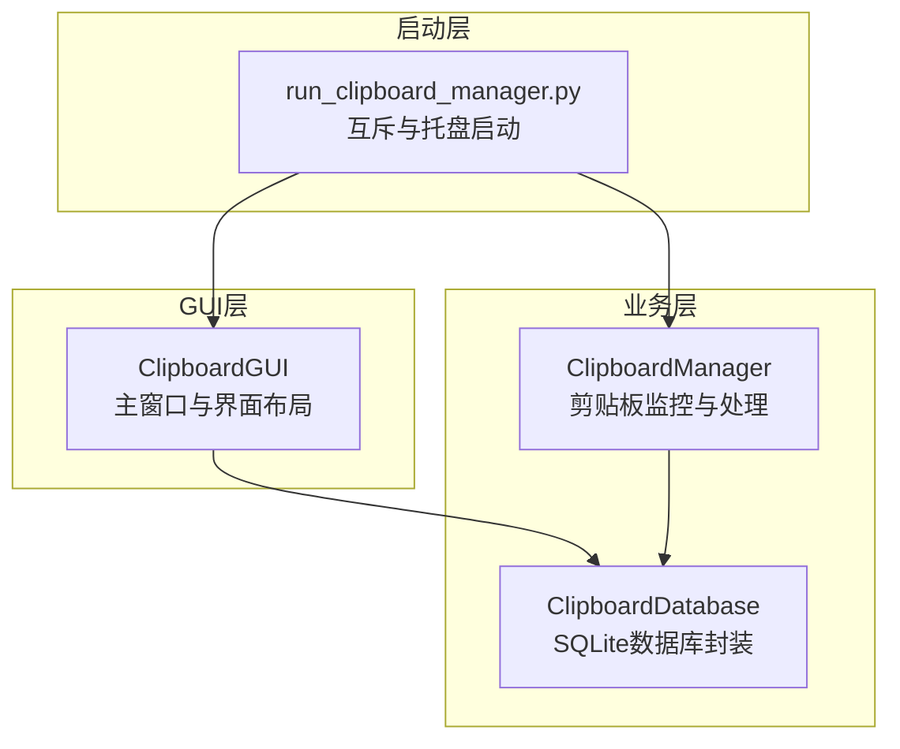

**图表来源**
- [clipboard_gui.py](file://clipboard_gui.py#L1-L120)
- [clipboard_manager_main.py](file://clipboard_manager_main.py#L1-L120)
- [run_clipboard_manager.py](file://run_clipboard_manager.py#L1-L71)

**章节来源**
- [clipboard_gui.py](file://clipboard_gui.py#L1-L120)
- [clipboard_manager_main.py](file://clipboard_manager_main.py#L1-L120)
- [run_clipboard_manager.py](file://run_clipboard_manager.py#L1-L71)

## 核心组件
- 主框架：ttk.Frame，作为根窗口的网格容器，承载搜索区、标签页容器与按钮区。
- 搜索区：ttk.LabelFrame，内含关键词输入、类型选择与操作按钮。
- 标签页容器：ttk.Notebook，包含“记录”、“统计”、“设置”三个子页。
- 记录页：ttk.Frame + Treeview + Scrollbar + 操作按钮。
- 统计页：ttk.Frame + Text + Scrollbar + 刷新按钮。
- 设置页：ttk.Frame + LabelFrame嵌套，包含多项设置项与按钮组。
- 快捷键：Alt+C，绑定至root窗口，切换窗口显示状态。

**章节来源**
- [clipboard_gui.py](file://clipboard_gui.py#L172-L226)
- [clipboard_gui.py](file://clipboard_gui.py#L227-L279)
- [clipboard_gui.py](file://clipboard_gui.py#L309-L435)

## 架构总览
下面的类图展示了setup_ui方法中主要组件的层级关系与职责划分。

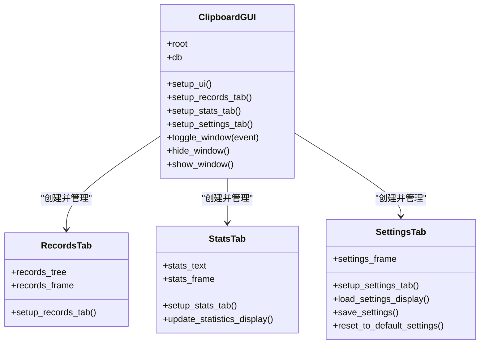

**图表来源**
- [clipboard_gui.py](file://clipboard_gui.py#L172-L226)
- [clipboard_gui.py](file://clipboard_gui.py#L227-L279)
- [clipboard_gui.py](file://clipboard_gui.py#L309-L435)

## 详细组件分析

### 主框架与网格布局
- 根容器：ttk.Frame(main_frame)，padding为10，网格定位在(0,0)，使用sticky拉伸填满可用空间。
- 行列权重：
  - root.columnconfigure(0, weight=1)、root.rowconfigure(0, weight=1)：使根窗口网格可随窗口缩放。
  - main_frame.columnconfigure(1, weight=1)、main_frame.rowconfigure(1, weight=1)：使主框架内的第二列/行可扩展。
- 子容器：
  - 搜索区：ttk.LabelFrame(search_frame)，padding为10，位于第0行，跨两列，使用sticky=(W,E)实现横向扩展。
  - 标签页容器：ttk.Notebook(notebook)，位于第1行，跨两列，sticky=(W,E,N,S)实现四向拉伸。

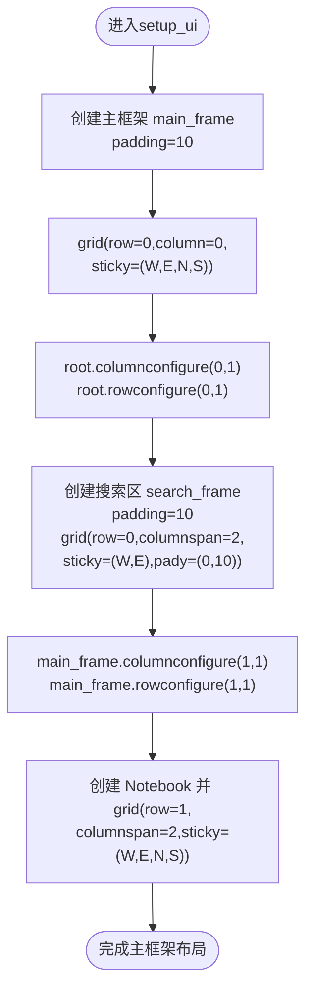

**图表来源**
- [clipboard_gui.py](file://clipboard_gui.py#L172-L219)

**章节来源**
- [clipboard_gui.py](file://clipboard_gui.py#L172-L219)

### 搜索框与按钮区域
- 搜索区内部采用网格布局：
  - 标签“关键词:”，ttk.Entry宽度30，紧邻其后放置“搜索”和“刷新”两个按钮。
  - 横向间距通过padx控制，垂直方向通过pady控制。
- 搜索区自身grid使用columnspan=2，sticky=(W,E)，使其在主框架内横向扩展。

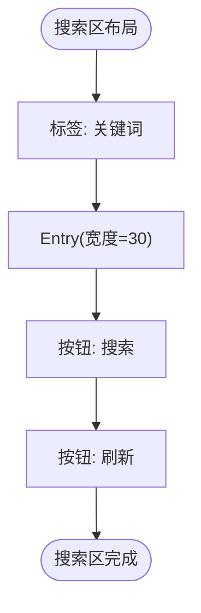

**图表来源**
- [clipboard_gui.py](file://clipboard_gui.py#L178-L188)

**章节来源**
- [clipboard_gui.py](file://clipboard_gui.py#L178-L188)

### 标签页容器与子页
- Notebook位于主框架第1行，跨两列，sticky=(W,E,N,S)，保证随窗口缩放。
- 三个子页：
  - 记录页：ttk.Frame，内部包含Treeview、垂直滚动条与操作按钮。
  - 统计页：ttk.Frame，内部包含Text、垂直滚动条与“刷新统计”按钮。
  - 设置页：ttk.Frame，内部使用LabelFrame嵌套，包含多项设置项与按钮组。
- 每个子页frame均配置columnconfigure(0, weight=1)与rowconfigure(0, weight=1)，使其内容随窗口缩放。

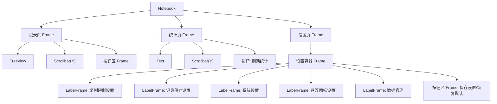

**图表来源**
- [clipboard_gui.py](file://clipboard_gui.py#L189-L207)
- [clipboard_gui.py](file://clipboard_gui.py#L227-L279)
- [clipboard_gui.py](file://clipboard_gui.py#L309-L435)

**章节来源**
- [clipboard_gui.py](file://clipboard_gui.py#L189-L207)
- [clipboard_gui.py](file://clipboard_gui.py#L227-L279)
- [clipboard_gui.py](file://clipboard_gui.py#L309-L435)

### 记录页：Treeview、滚动条与按钮区
- Treeview列定义与列宽、对齐方式在setup_records_tab中集中配置。
- 垂直滚动条与Treeview联动，grid布局中滚动条紧贴右侧。
- 按钮区位于Treeview下方，使用pack(side=LEFT)排列“复制选中内容”和“删除选中记录”。

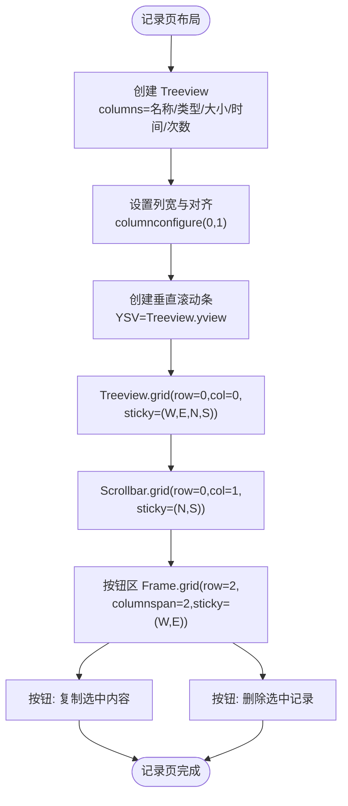

**图表来源**
- [clipboard_gui.py](file://clipboard_gui.py#L227-L279)

**章节来源**
- [clipboard_gui.py](file://clipboard_gui.py#L227-L279)

### 统计页：Text、滚动条与刷新按钮
- 使用ttk.Text作为内容显示区域，pack(fill=BOTH, expand=True)以填充可用空间。
- 垂直滚动条与Text联动，右侧显示。
- 刷新按钮位于底部按钮区Frame中，调用update_statistics_display()。

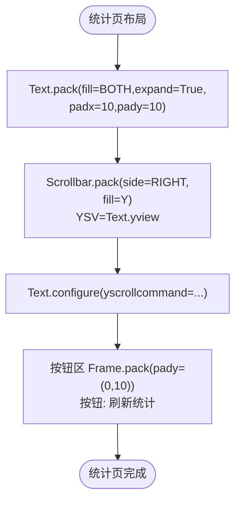

**图表来源**
- [clipboard_gui.py](file://clipboard_gui.py#L309-L327)

**章节来源**
- [clipboard_gui.py](file://clipboard_gui.py#L309-L327)

### 设置页：LabelFrame嵌套与网格权重
- 设置页采用两层容器：外层settings_frame，内层settings_container与settings_main_frame。
- settings_main_frame.columnconfigure(0, weight=1)，保证内容随窗口横向扩展。
- 复制限制设置、记录保存设置、系统设置、悬浮图标设置、数据管理等均使用ttk.LabelFrame分组，并在每组内部使用columnconfigure(1, weight=1)实现输入控件向右扩展。
- 按钮区Frame包含“保存设置”和“恢复默认”。

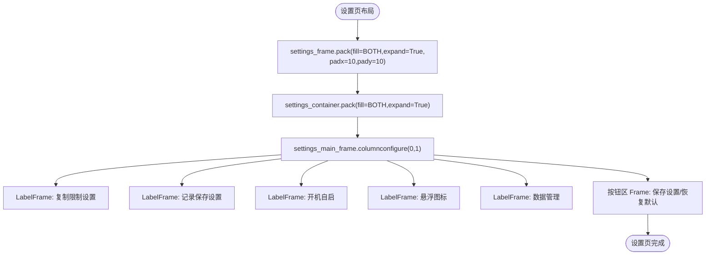

**图表来源**
- [clipboard_gui.py](file://clipboard_gui.py#L328-L435)

**章节来源**
- [clipboard_gui.py](file://clipboard_gui.py#L328-L435)

### 响应式设计与grid权重机制
- 根容器与主框架均设置weight=1，使窗口缩放时根网格与主框架能均匀分配多余空间。
- 每个子页frame都设置columnconfigure(0, weight=1)与rowconfigure(0, weight=1)，确保子页内容随窗口缩放而自适应。
- 搜索区使用sticky=(W,E)横向扩展，标签页容器使用sticky=(W,E,N,S)四向扩展，保证在不同分辨率下保持良好布局。
- 输入控件与LabelFrame内部通过columnconfigure(1, weight=1)实现输入框向右扩展，提升视觉一致性。

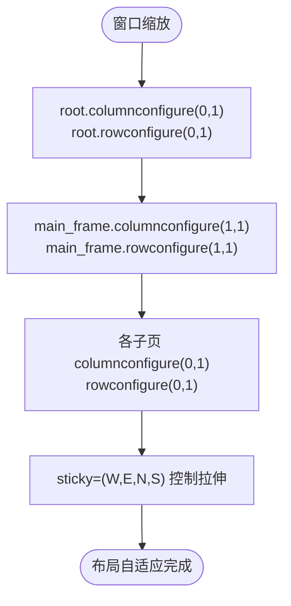

**图表来源**
- [clipboard_gui.py](file://clipboard_gui.py#L208-L218)

**章节来源**
- [clipboard_gui.py](file://clipboard_gui.py#L208-L218)

### 快捷键Alt+C绑定与焦点交互
- 绑定逻辑：
  - 在setup_ui末尾绑定Alt+c与Alt+C到toggle_window方法。
  - 绑定后立即调用root.focus_set()，确保快捷键在窗口获得焦点时生效。
- 焦点事件：
  - on_focus_in/on_focus_out分别标记has_focus，便于外部逻辑感知窗口焦点状态。
- 切换行为：
  - toggle_window根据is_hidden状态决定show_window或hide_window，实现托盘式显示/隐藏。

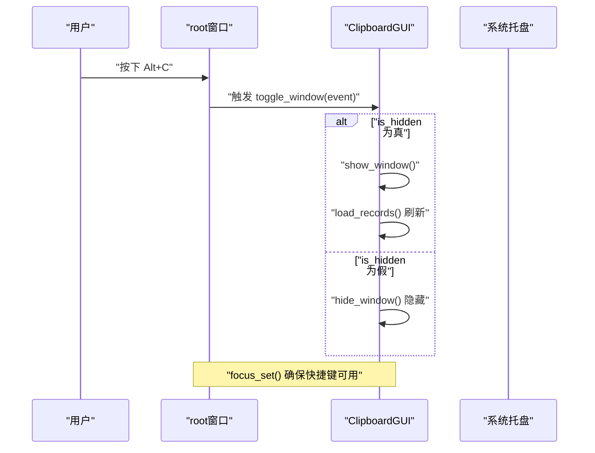

**图表来源**
- [clipboard_gui.py](file://clipboard_gui.py#L220-L226)
- [clipboard_gui.py](file://clipboard_gui.py#L134-L143)
- [clipboard_gui.py](file://clipboard_gui.py#L1698-L1722)

**章节来源**
- [clipboard_gui.py](file://clipboard_gui.py#L220-L226)
- [clipboard_gui.py](file://clipboard_gui.py#L134-L143)
- [clipboard_gui.py](file://clipboard_gui.py#L1698-L1722)

### 视觉层次构建过程（步骤说明）
- 第一步：创建主框架main_frame，设置padding，grid拉伸至窗口。
- 第二步：创建搜索区search_frame，设置padding，grid跨两列，sticky横向扩展。
- 第三步：创建Notebook，grid跨两列，sticky四向拉伸。
- 第四步：为每个子页frame设置columnconfigure(0,1)与rowconfigure(0,1)。
- 第五步：在子页内部使用LabelFrame分组，输入控件使用columnconfigure(1, weight=1)实现自适应扩展。
- 第六步：绑定Alt+C快捷键并设置焦点，确保交互可用。

**章节来源**
- [clipboard_gui.py](file://clipboard_gui.py#L172-L219)
- [clipboard_gui.py](file://clipboard_gui.py#L227-L279)
- [clipboard_gui.py](file://clipboard_gui.py#L309-L435)

## 依赖分析
- ClipboardGUI依赖ClipboardDatabase进行数据读写与统计。
- run_clipboard_manager.py负责互斥控制与托盘启动，间接驱动ClipboardGUI。
- clipboard_manager_main.py提供另一个GUI版本（文本/文件记录），与clipboard_gui.py并行存在但职责不同。

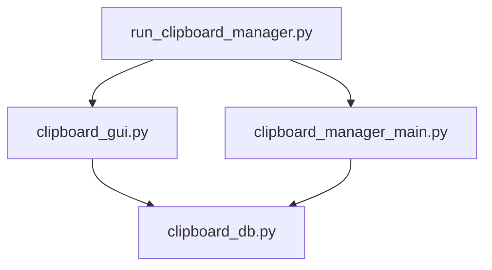

**图表来源**
- [run_clipboard_manager.py](file://run_clipboard_manager.py#L1-L71)
- [clipboard_gui.py](file://clipboard_gui.py#L1-L120)
- [clipboard_manager_main.py](file://clipboard_manager_main.py#L1-L120)
- [clipboard_db.py](file://clipboard_db.py#L1-L120)

**章节来源**
- [run_clipboard_manager.py](file://run_clipboard_manager.py#L1-L71)
- [clipboard_gui.py](file://clipboard_gui.py#L1-L120)
- [clipboard_manager_main.py](file://clipboard_manager_main.py#L1-L120)
- [clipboard_db.py](file://clipboard_db.py#L1-L120)

## 性能考虑
- Treeview与Text在大数据量场景下建议：
  - 使用虚拟化或分页加载（当前实现一次性加载，后续可优化为增量加载）。
  - 合理设置列宽与对齐，避免频繁重绘。
- 滚动条与内容联动使用yscrollcommand，减少额外计算。
- 快捷键绑定仅在窗口获得焦点时生效，避免全局热键冲突。

[本节为通用指导，不直接分析具体文件]

## 故障排查指南
- 快捷键无效：
  - 确认root已设置焦点（focus_set）。
  - 确认未被其他窗口抢占焦点（on_focus_in/on_focus_out）。
- 界面不随窗口缩放：
  - 检查root与主框架的columnconfigure/rowconfigure是否设置为weight=1。
  - 检查各子页frame是否设置columnconfigure(0,1)与rowconfigure(0,1)。
- 搜索区或输入框不扩展：
  - 确认LabelFrame内部使用columnconfigure(1, weight=1)使输入控件向右扩展。
- 托盘图标与窗口显示：
  - 通过toggle_window切换显示状态，确认is_hidden标志位正确更新。

**章节来源**
- [clipboard_gui.py](file://clipboard_gui.py#L208-L218)
- [clipboard_gui.py](file://clipboard_gui.py#L220-L226)
- [clipboard_gui.py](file://clipboard_gui.py#L134-L143)
- [clipboard_gui.py](file://clipboard_gui.py#L1698-L1722)

## 结论
本文件系统梳理了setup_ui方法中的界面布局结构，明确了主框架、搜索区、标签页容器与按钮区的网格布局设计，解释了ttk.Frame、ttk.Notebook、ttk.LabelFrame的层级关系与padding配置策略；阐述了grid权重在响应式设计中的作用机制；并详细说明了Alt+C快捷键的绑定逻辑与焦点交互。通过可视化图表与分层分析，读者可快速理解整体布局与交互流程，并据此进行进一步的定制与优化。