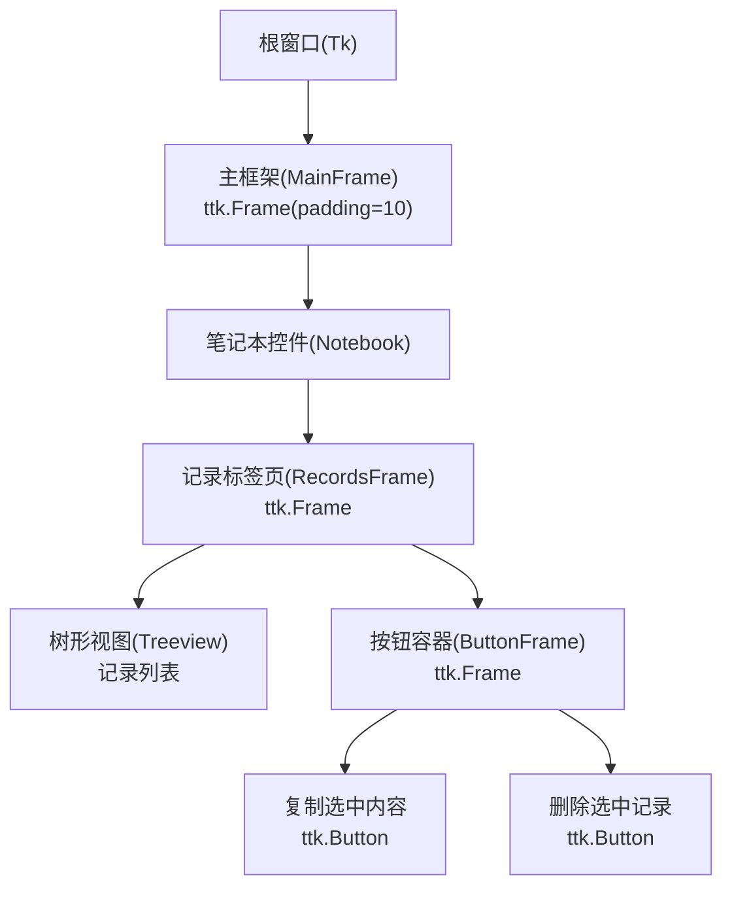
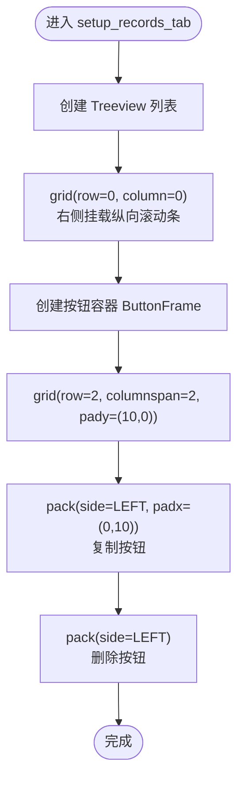
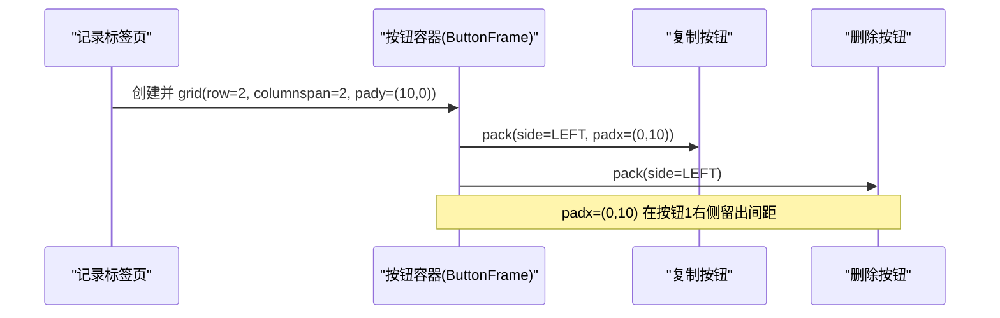
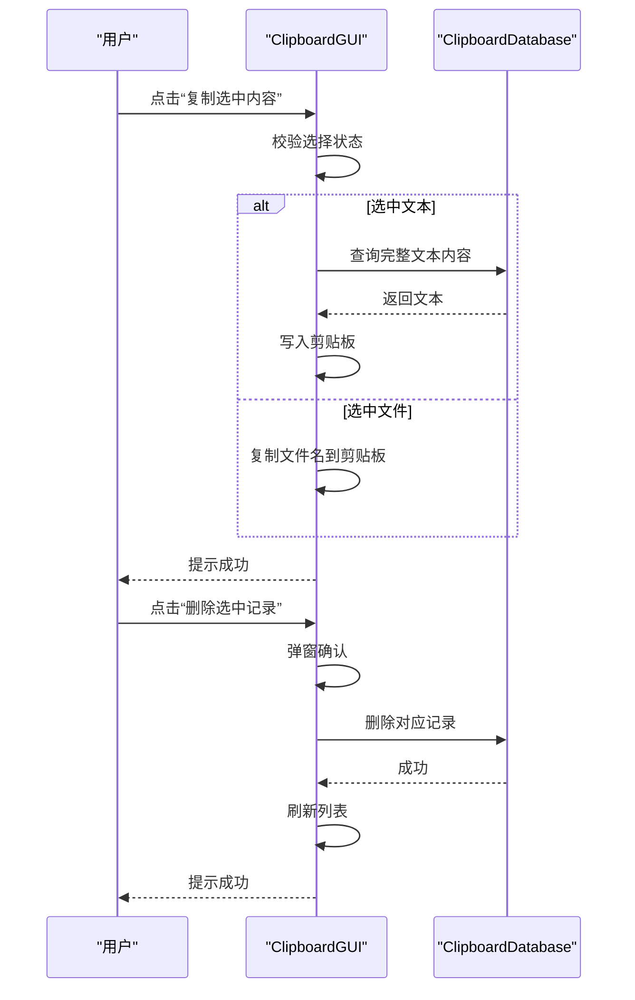
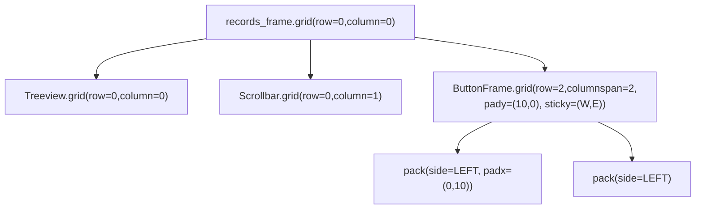

# 按钮区域布局

<cite>
**本文引用的文件**
- [clipboard_gui.py](file://clipboard_gui.py)
- [clipboard_manager_main.py](file://clipboard_manager_main.py)
</cite>

## 目录
1. [简介](#简介)
2. [项目结构](#项目结构)
3. [核心组件](#核心组件)
4. [架构总览](#架构总览)
5. [详细组件分析](#详细组件分析)
6. [依赖分析](#依赖分析)
7. [性能考虑](#性能考虑)
8. [故障排查指南](#故障排查指南)
9. [结论](#结论)

## 简介
本文件聚焦“记录标签页”中按钮区域的布局设计，具体说明：
- 复制选中内容与删除选中记录两个按钮的水平排列方式；
- ttk.Frame 作为按钮容器的 pack 布局管理器使用；
- padx 参数对按钮间距的控制；
- 按钮区域在主界面中的垂直定位，以及与树形视图的相对位置关系。

## 项目结构
本仓库为剪贴板历史记录管理器，GUI 主体位于 clipboard_gui.py，其中记录标签页负责展示与操作历史记录。按钮区域位于“记录”标签页的底部，采用 pack 的水平排列方式。

图表来源
- [clipboard_gui.py](file://clipboard_gui.py#L235-L279)

章节来源
- [clipboard_gui.py](file://clipboard_gui.py#L235-L279)

## 核心组件
- 记录标签页容器：ttk.Frame，作为按钮区域的父容器。
- 按钮容器：ttk.Frame，使用 pack 进行水平排列。
- 按钮：两个 ttk.Button，分别绑定“复制选中内容”和“删除选中记录”的命令。
- 树形视图：记录列表，位于按钮区域之上。

章节来源
- [clipboard_gui.py](file://clipboard_gui.py#L235-L279)

## 架构总览
记录标签页的布局由网格布局与 pack 布局共同构成：
- records_frame（记录标签页）采用网格布局，树形视图占第0行，按钮容器占第2行；
- 按钮容器内部使用 pack，两个按钮水平排列，通过 padx 控制间距。

图表来源
- [clipboard_gui.py](file://clipboard_gui.py#L235-L279)

章节来源
- [clipboard_gui.py](file://clipboard_gui.py#L235-L279)

## 详细组件分析

### 按钮容器与水平排列
- 容器：ttk.Frame，作为按钮的父容器，便于统一管理其布局与对齐。
- 排列：pack，两个按钮均以 side=tk.LEFT 水平排列。
- 间距控制：第一个按钮使用 padx=(0, 10)，第二个按钮未显式设置 padx，从而形成“按钮1右侧留白，按钮2紧贴按钮1左侧”的视觉间距效果。

图表来源
- [clipboard_gui.py](file://clipboard_gui.py#L262-L268)

章节来源
- [clipboard_gui.py](file://clipboard_gui.py#L262-L268)

### 按钮命令绑定
- 复制按钮：绑定到复制选中记录内容的方法，支持文本与文件名复制。
- 删除按钮：绑定到删除选中记录的方法，删除数据库记录并尝试删除本地文件（如适用）。

图表来源
- [clipboard_gui.py](file://clipboard_gui.py#L800-L878)

章节来源
- [clipboard_gui.py](file://clipboard_gui.py#L800-L878)

### 垂直定位与相对位置
- 树形视图：grid(row=0, column=0)，占据上方区域；
- 按钮容器：grid(row=2, columnspan=2, pady=(10,0))，位于树形视图下方，顶部留出 10px 间距；
- 整体采用网格布局，records_frame 的 columnconfigure(0, weight=1) 与 rowconfigure(0, weight=1) 保证列表区域可随窗口缩放；
- 按钮容器使用 sticky=(tk.W, tk.E) 使其横向铺满，pack 的按钮在容器内水平排列。

图表来源
- [clipboard_gui.py](file://clipboard_gui.py#L235-L279)

章节来源
- [clipboard_gui.py](file://clipboard_gui.py#L235-L279)

## 依赖分析
- 组件耦合
  - 按钮区域与树形视图通过 records_frame 的网格布局耦合，按钮容器位于树形视图下方；
  - 按钮命令依赖 ClipboardDatabase，实现对数据库的读写操作。
- 外部依赖
  - tkinter/ttk：提供 GUI 组件与布局管理；
  - sqlite3：持久化存储历史记录；
  - 其他系统级模块用于托盘图标、悬浮图标等扩展功能。

章节来源
- [clipboard_gui.py](file://clipboard_gui.py#L235-L279)
- [clipboard_manager_main.py](file://clipboard_manager_main.py#L56-L111)

## 性能考虑
- 按钮区域仅包含两个按钮，布局开销极低，无需特别优化；
- 复制与删除操作涉及数据库读写，建议在大量记录场景下注意批量操作与事务处理，但当前实现为逐条操作，性能瓶颈不在按钮布局。

## 故障排查指南
- 按钮不显示或位置异常
  - 检查 records_frame 的网格配置与权重设置；
  - 确认按钮容器 grid(row=2) 是否被其他控件占用。
- 按钮间距不符合预期
  - 确认第一个按钮的 padx=(0,10) 是否生效；
  - 第二个按钮未设置 padx，应紧贴第一个按钮左侧。
- 复制/删除无效
  - 确认是否正确选择了列表项；
  - 检查数据库连接与权限；
  - 查看弹窗提示与日志输出。

章节来源
- [clipboard_gui.py](file://clipboard_gui.py#L262-L268)
- [clipboard_gui.py](file://clipboard_gui.py#L800-L878)

## 结论
记录标签页的按钮区域采用简洁高效的布局策略：
- 使用 ttk.Frame 作为按钮容器，pack 实现水平排列；
- 通过 padx=(0,10) 控制按钮间距，形成清晰的左右分隔；
- 垂直上位于树形视图之下，顶部留白提升可读性；
- 命令绑定完善，支持复制与删除两类核心操作，满足日常使用需求。