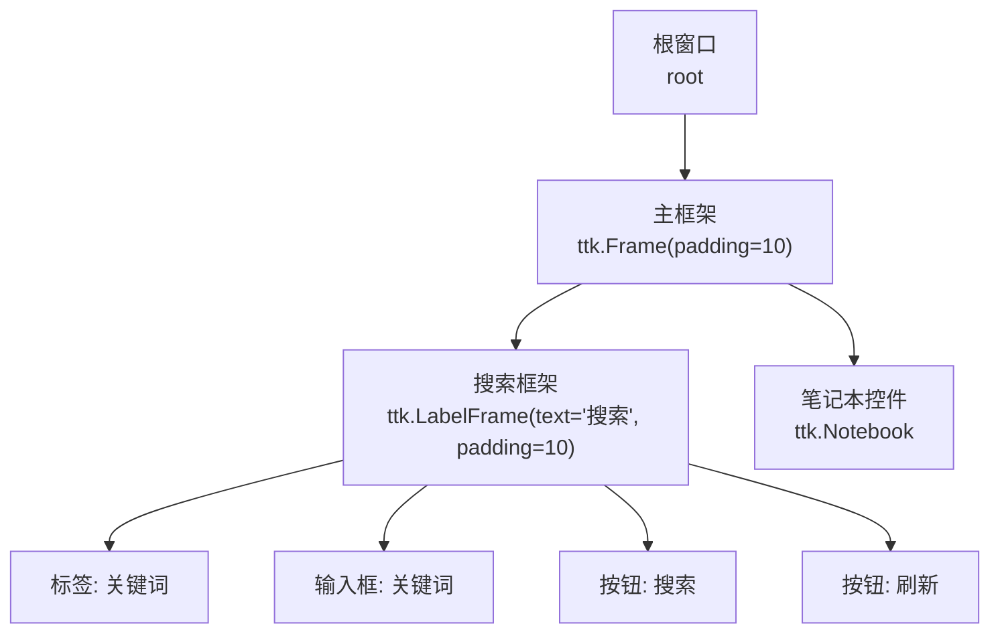
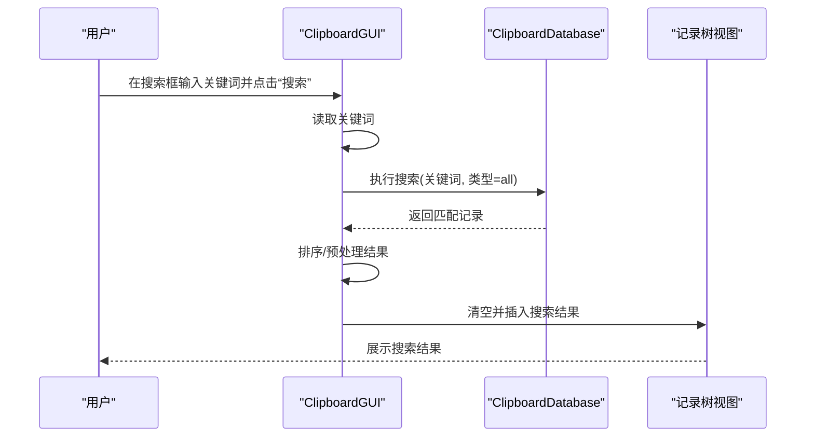
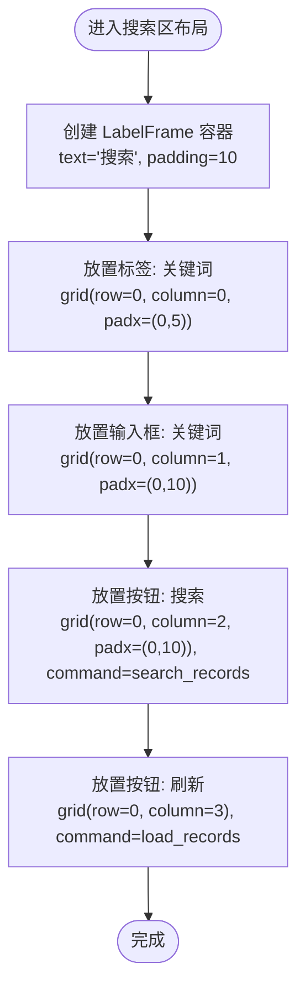
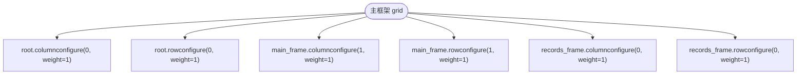
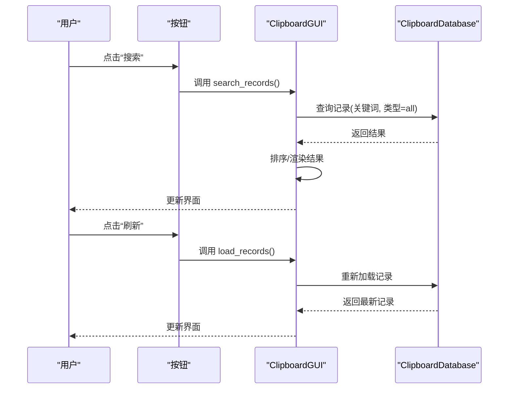
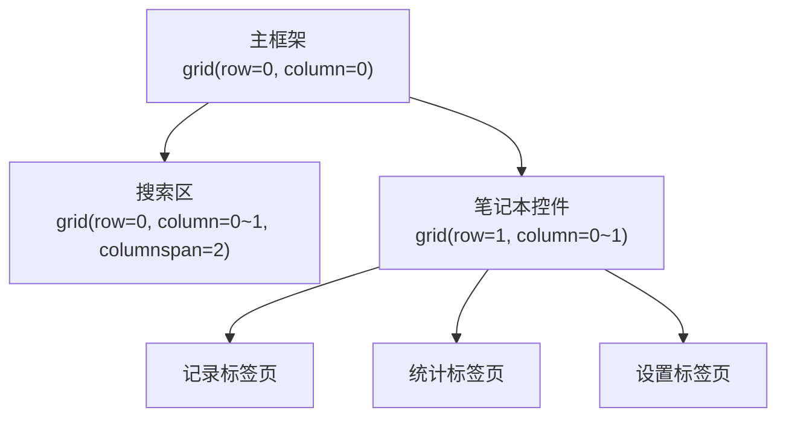
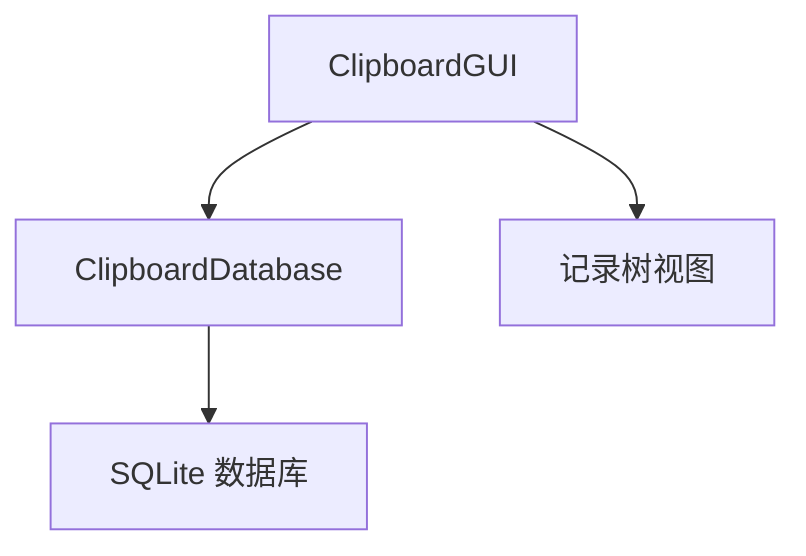

# 搜索区域布局

<cite>
**本文引用的文件**
- [clipboard_gui.py](file://clipboard_gui.py)
- [clipboard_manager_main.py](file://clipboard_manager_main.py)
- [clipboard_db.py](file://clipboard_db.py)
</cite>

## 目录
1. [简介](#简介)
2. [项目结构](#项目结构)
3. [核心组件](#核心组件)
4. [架构总览](#架构总览)
5. [详细组件分析](#详细组件分析)
6. [依赖关系分析](#依赖关系分析)
7. [性能考量](#性能考量)
8. [故障排查指南](#故障排查指南)
9. [结论](#结论)

## 简介
本文件聚焦于“搜索区域”的布局结构与交互机制，围绕以下目标展开：
- 关键词输入框、搜索按钮、刷新按钮的水平排列设计
- ttk.LabelFrame 作为容器的边框与内边距配置
- grid 布局中列权重分配对响应式设计的影响
- 各控件的 padx/pady 间距设置
- 按钮命令绑定机制
- 搜索区域与主框架的集成方式

## 项目结构
本次文档涉及的搜索区域主要位于 GUI 主界面中，采用 ttk.Frame 作为主容器，内部嵌套 ttk.LabelFrame 作为搜索区容器，使用 grid 布局进行控件排列。搜索区包含标签、输入框、搜索按钮、刷新按钮等元素。

图表来源
- [clipboard_gui.py](file://clipboard_gui.py#L172-L219)

章节来源
- [clipboard_gui.py](file://clipboard_gui.py#L172-L219)

## 核心组件
- 搜索容器：ttk.LabelFrame，提供标题“搜索”与内边距，作为搜索区的视觉与布局容器
- 输入控件：ttk.Entry，用于输入关键词
- 操作按钮：两个 ttk.Button，分别绑定搜索与刷新命令
- 主容器：ttk.Frame，承载搜索区与后续内容区域，统一进行网格权重配置

章节来源
- [clipboard_gui.py](file://clipboard_gui.py#L172-L219)

## 架构总览
搜索区域属于 GUI 界面的一部分，其职责是接收用户输入并触发数据层查询，随后将结果回显至主界面的其他区域（如记录列表）。整体流程如下：

图表来源
- [clipboard_gui.py](file://clipboard_gui.py#L652-L748)
- [clipboard_db.py](file://clipboard_db.py#L281-L314)

章节来源
- [clipboard_gui.py](file://clipboard_gui.py#L652-L748)
- [clipboard_db.py](file://clipboard_db.py#L281-L314)

## 详细组件分析

### 搜索容器与控件布局
- 搜索容器：ttk.LabelFrame，设置文本为“搜索”，内边距为 10，作为搜索区的独立容器
- 控件水平排列：在同一行（row=0），通过列索引（column=0/1/2/3）依次放置“关键词标签”、“关键词输入框”、“搜索按钮”、“刷新按钮”
- 间距设置：使用 padx/pady 实现控件间的水平与垂直间距，保证视觉层次清晰
- 命令绑定：搜索按钮绑定到搜索方法，刷新按钮绑定到加载记录方法

图表来源
- [clipboard_gui.py](file://clipboard_gui.py#L172-L188)

章节来源
- [clipboard_gui.py](file://clipboard_gui.py#L172-L188)

### grid 布局与列权重
- 搜索区所在行：固定高度，使用列权重控制剩余空间分配
- 主框架列权重：通过 columnconfigure/rowconfigure 设置权重，使搜索区与内容区随窗口大小变化而自适应
- 响应式影响：当窗口横向拉伸时，搜索区内的输入框与按钮会根据列权重合理分配空间；纵向拉伸时，内容区域（如记录列表）优先扩展

图表来源
- [clipboard_gui.py](file://clipboard_gui.py#L208-L218)

章节来源
- [clipboard_gui.py](file://clipboard_gui.py#L208-L218)

### 按钮命令绑定机制
- 搜索按钮：command 绑定到搜索方法，负责读取输入框关键词并执行搜索逻辑
- 刷新按钮：command 绑定到加载记录方法，用于重新加载或刷新数据
- 事件链路：按钮点击触发回调函数，回调函数调用数据库查询或数据刷新逻辑，最终更新界面控件

图表来源
- [clipboard_gui.py](file://clipboard_gui.py#L186-L187)
- [clipboard_gui.py](file://clipboard_gui.py#L652-L748)
- [clipboard_db.py](file://clipboard_db.py#L281-L314)

章节来源
- [clipboard_gui.py](file://clipboard_gui.py#L186-L187)
- [clipboard_gui.py](file://clipboard_gui.py#L652-L748)
- [clipboard_db.py](file://clipboard_db.py#L281-L314)

### 搜索区域与主框架的集成
- 搜索区位于主框架的第一行，使用 columnspan 跨越两列，确保在笔记本控件之上形成完整的搜索入口
- 主框架采用网格布局，搜索区下方为笔记本控件，内容区随窗口大小变化而自适应
- 通过设置权重，保证搜索区在窗口缩放时保持稳定，同时内容区优先扩展

图表来源
- [clipboard_gui.py](file://clipboard_gui.py#L172-L207)

章节来源
- [clipboard_gui.py](file://clipboard_gui.py#L172-L207)

## 依赖关系分析
- GUI 层依赖数据库层提供的查询接口，用于搜索与加载记录
- 搜索区的输入框与按钮均位于 GUI 层，命令回调指向 GUI 的业务方法
- 数据库层提供统一的搜索接口，支持不同类型的记录检索

图表来源
- [clipboard_gui.py](file://clipboard_gui.py#L652-L748)
- [clipboard_db.py](file://clipboard_db.py#L281-L314)

章节来源
- [clipboard_gui.py](file://clipboard_gui.py#L652-L748)
- [clipboard_db.py](file://clipboard_db.py#L281-L314)

## 性能考量
- 搜索区控件数量较少，布局开销可忽略
- 列权重设置合理，避免了不必要的重绘
- 搜索与刷新操作建议在后台线程执行，避免阻塞 UI（当前实现未见显式异步处理）

## 故障排查指南
- 搜索无结果：确认关键词输入正确，检查数据库中是否存在匹配记录
- 刷新无效：确认刷新按钮命令已绑定到正确的回调函数
- 布局异常：检查主框架与搜索区的网格权重配置是否正确

章节来源
- [clipboard_gui.py](file://clipboard_gui.py#L172-L219)
- [clipboard_db.py](file://clipboard_db.py#L281-L314)

## 结论
搜索区域采用简洁的水平排列设计，结合 ttk.LabelFrame 的容器特性与 grid 布局的列权重配置，实现了良好的响应式体验。通过明确的命令绑定机制，用户输入与界面更新得以顺畅衔接。若需进一步优化，可在搜索与刷新操作中引入异步处理，提升交互流畅度。