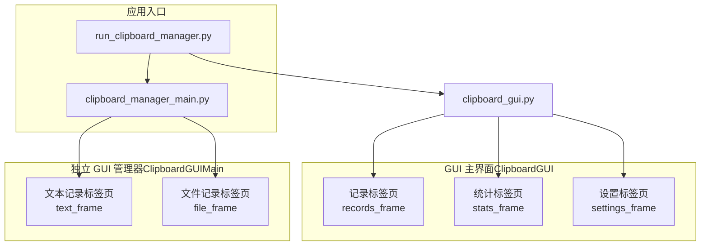
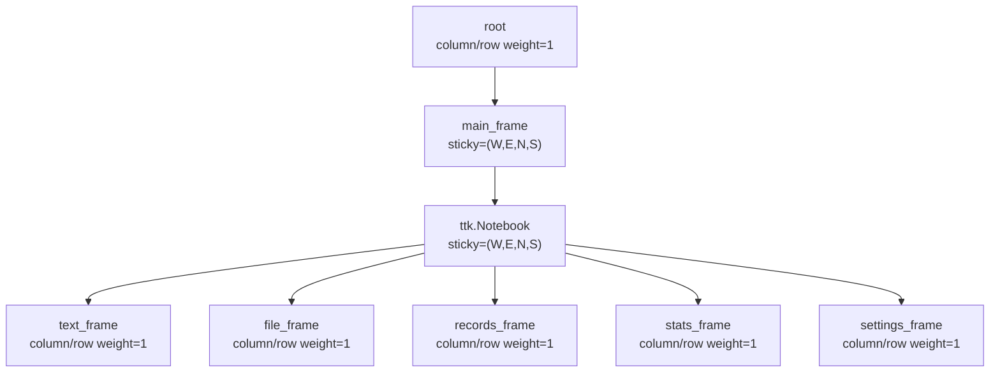
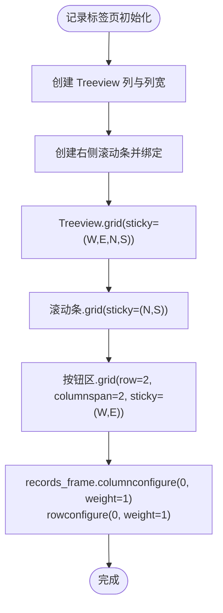
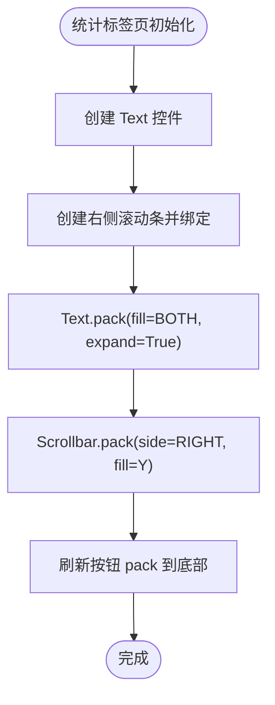
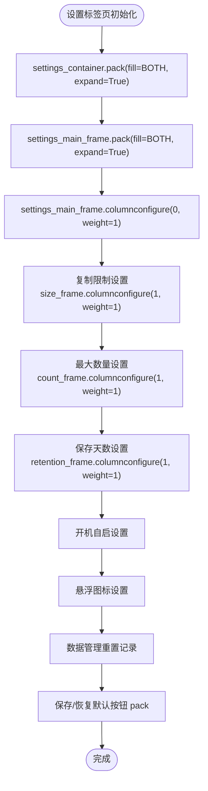
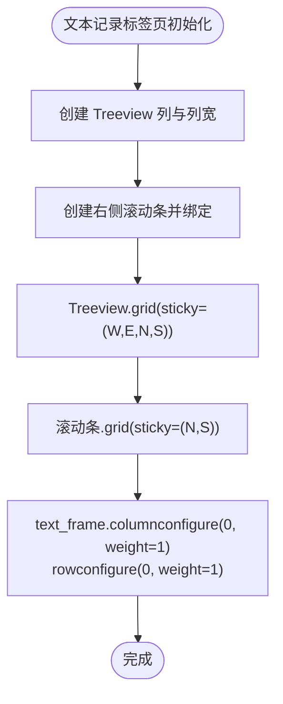
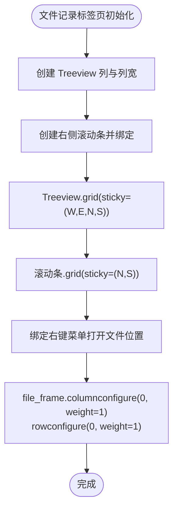
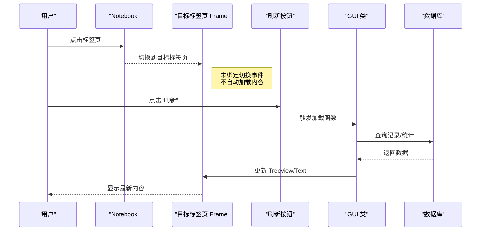
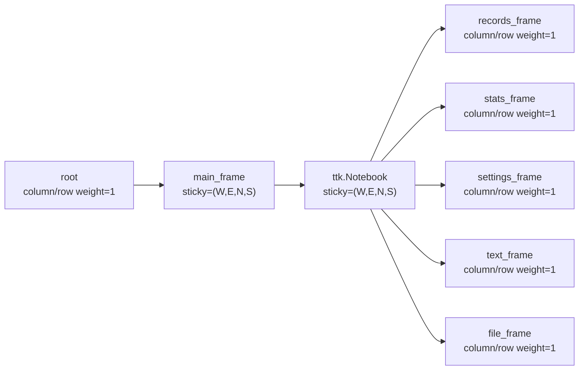

# 标签页容器布局

<cite>
**本文引用的文件**
- [clipboard_gui.py](file://clipboard_gui.py)
- [clipboard_manager_main.py](file://clipboard_manager_main.py)
- [run_clipboard_manager.py](file://run_clipboard_manager.py)
- [view_clipboard_history.py](file://view_clipboard_history.py)
</cite>

## 目录
1. [简介](#简介)
2. [项目结构](#项目结构)
3. [核心组件](#核心组件)
4. [架构总览](#架构总览)
5. [详细组件分析](#详细组件分析)
6. [依赖关系分析](#依赖关系分析)
7. [性能考量](#性能考量)
8. [故障排查指南](#故障排查指南)
9. [结论](#结论)
10. [附录](#附录)

## 简介
本文件聚焦 ttk.Notebook 组件在两个 GUI 实现中的布局与交互设计，重点解释：
- 主框架中 Notebook 的 sticky 属性如何影响整体自适应缩放
- 每个标签页 Frame 的网格权重设置如何实现内部自适应
- 标签页切换时的内容加载机制与各标签页的独立布局策略
- 统计与设置等标签页的容器框架配置

## 项目结构
本仓库包含多个入口与 GUI 实现：
- GUI 主界面（系统托盘+窗口）：由 ClipboardGUI 类负责，包含“记录”“统计”“设置”三个标签页
- 独立 GUI 管理器：由 ClipboardGUIMain 类负责，包含“文本记录”“文件记录”两个标签页
- 启动脚本：run_clipboard_manager.py 启动剪贴板监控线程并运行 GUI
- 历史查看工具：view_clipboard_history.py 提供命令行历史查看

图表来源
- [clipboard_gui.py](file://clipboard_gui.py#L172-L219)
- [clipboard_manager_main.py](file://clipboard_manager_main.py#L504-L553)
- [run_clipboard_manager.py](file://run_clipboard_manager.py#L55-L66)

章节来源
- [clipboard_gui.py](file://clipboard_gui.py#L172-L219)
- [clipboard_manager_main.py](file://clipboard_manager_main.py#L504-L553)
- [run_clipboard_manager.py](file://run_clipboard_manager.py#L55-L66)

## 核心组件
- Notebook 容器：承载各标签页 Frame，统一管理布局与自适应
- 记录标签页 Frame：内部网格权重配置，保证 Treeview 与滚动条随窗口缩放
- 统计标签页 Frame：Text + Scrollbar，支持刷新按钮
- 设置标签页 Frame：多组 LabelFrame + Entry/Radiobutton/Checkbutton，网格权重配置
- 独立 GUI 的文本/文件标签页：Treeview + Scrollbar，网格权重配置

章节来源
- [clipboard_gui.py](file://clipboard_gui.py#L172-L219)
- [clipboard_gui.py](file://clipboard_gui.py#L227-L339)
- [clipboard_gui.py](file://clipboard_gui.py#L310-L339)
- [clipboard_gui.py](file://clipboard_gui.py#L328-L435)
- [clipboard_manager_main.py](file://clipboard_manager_main.py#L504-L553)
- [clipboard_manager_main.py](file://clipboard_manager_main.py#L554-L614)

## 架构总览
Notebook 在两个 GUI 中均采用“主框架 grid + Notebook grid + 各标签页 Frame grid”的三层布局：
- 主框架（root/main_frame）：columnconfigure/rowconfigure 设置权重，使 Notebook 在窗口中可伸缩
- Notebook：grid(sticky=(W,E,N,S))，占满主框架的可用空间
- 各标签页 Frame：各自 columnconfigure/rowconfigure 设置权重，使内部控件随窗口缩放

图表来源
- [clipboard_manager_main.py](file://clipboard_manager_main.py#L504-L553)
- [clipboard_gui.py](file://clipboard_gui.py#L172-L219)

## 详细组件分析

### 记录标签页（ClipboardGUI）
- 容器：records_frame
- 内容：Treeview + 垂直滚动条，按钮区
- 关键布局点：
  - Notebook grid(sticky=(W,E,N,S))，使记录标签页随窗口缩放
  - records_frame.columnconfigure(0, weight=1) + rowconfigure(0, weight=1)，使 Treeview 与滚动条占满
  - Treeview.grid(sticky=(W,E,N,S))，滚动条.grid(sticky=(N,S))，按钮区.grid(sticky=(W,E))

图表来源
- [clipboard_gui.py](file://clipboard_gui.py#L227-L279)

章节来源
- [clipboard_gui.py](file://clipboard_gui.py#L227-L279)

### 统计标签页（ClipboardGUI）
- 容器：stats_frame
- 内容：Text + Scrollbar，刷新按钮
- 关键布局点：
  - stats_frame.pack(fill=BOTH, expand=True, padx=10, pady=10)
  - Text.pack(fill=BOTH, expand=True) + Scrollbar.pack(side=RIGHT, fill=Y)
  - 刷新按钮 pack 到底部

图表来源
- [clipboard_gui.py](file://clipboard_gui.py#L310-L327)

章节来源
- [clipboard_gui.py](file://clipboard_gui.py#L310-L327)

### 设置标签页（ClipboardGUI）
- 容器：settings_frame 内部嵌套 settings_container + settings_main_frame
- 内容：多组 LabelFrame（复制限制、保存天数、系统设置、悬浮图标、数据管理），Entry/Radiobutton/Checkbutton
- 关键布局点：
  - settings_container.pack(fill=BOTH, expand=True, padx=10, pady=10)
  - settings_main_frame.pack(fill=BOTH, expand=True)
  - settings_main_frame.columnconfigure(0, weight=1)
  - 各 LabelFrame.columnconfigure(1, weight=1) 以实现控件向右扩展

图表来源
- [clipboard_gui.py](file://clipboard_gui.py#L328-L435)

章节来源
- [clipboard_gui.py](file://clipboard_gui.py#L328-L435)

### 独立 GUI 的文本记录标签页（ClipboardGUIMain）
- 容器：text_frame
- 内容：Treeview（ID、内容、时间、字符数）+ 垂直滚动条
- 关键布局点：
  - Notebook grid(sticky=(W,E,N,S))
  - text_frame.columnconfigure(0, weight=1) + rowconfigure(0, weight=1)
  - Treeview.grid(sticky=(W,E,N,S)) + 滚动条.grid(sticky=(N,S))

图表来源
- [clipboard_manager_main.py](file://clipboard_manager_main.py#L554-L581)

章节来源
- [clipboard_manager_main.py](file://clipboard_manager_main.py#L554-L581)

### 独立 GUI 的文件记录标签页（ClipboardGUIMain）
- 容器：file_frame
- 内容：Treeview（ID、文件名、原路径、保存路径、大小、类型、MD5、时间）+ 垂直滚动条 + 右键菜单
- 关键布局点：
  - Notebook grid(sticky=(W,E,N,S))
  - file_frame.columnconfigure(0, weight=1) + rowconfigure(0, weight=1)
  - Treeview.grid(sticky=(W,E,N,S)) + 滚动条.grid(sticky=(N,S))
  - 右键菜单绑定到 Treeview

图表来源
- [clipboard_manager_main.py](file://clipboard_manager_main.py#L582-L614)

章节来源
- [clipboard_manager_main.py](file://clipboard_manager_main.py#L582-L614)

### 标签页切换与内容加载机制
- 两个 GUI 的 Notebook 均未显式绑定 <<NotebookTabChanged>> 或 tab 选择事件回调，因此标签页切换时不会自动触发内容加载
- 内容加载通常通过按钮（如“刷新”“刷新统计”）或初始化阶段（如 root.after(100, load_records)）触发
- 记录标签页的 Treeview 数据加载在 GUI 初始化后延时执行，确保 UI 创建完成后再加载数据

图表来源
- [clipboard_gui.py](file://clipboard_gui.py#L56-L71)
- [clipboard_gui.py](file://clipboard_gui.py#L555-L580)
- [clipboard_gui.py](file://clipboard_gui.py#L555-L580)

章节来源
- [clipboard_gui.py](file://clipboard_gui.py#L56-L71)
- [clipboard_gui.py](file://clipboard_gui.py#L555-L580)

## 依赖关系分析
- Notebook 依赖于其父容器（main_frame/root）的网格权重配置，才能在窗口缩放时正确拉伸
- 各标签页 Frame 依赖自身的网格权重，使内部控件（Treeview/Text/滚动条）随容器缩放
- 统计标签页依赖 Text 控件与 Scrollbar 的组合，刷新按钮驱动内容更新
- 设置标签页依赖多组 LabelFrame 的 columnconfigure，实现控件向右扩展

图表来源
- [clipboard_manager_main.py](file://clipboard_manager_main.py#L504-L553)
- [clipboard_gui.py](file://clipboard_gui.py#L172-L219)

章节来源
- [clipboard_manager_main.py](file://clipboard_manager_main.py#L504-L553)
- [clipboard_gui.py](file://clipboard_gui.py#L172-L219)

## 性能考量
- Treeview 数据量较大时，建议：
  - 分页加载或虚拟化（当前实现未分页，但 Treeview 支持虚拟化）
  - 滚动事件中按需加载，减少一次性渲染
- 统计标签页 Text 控件频繁刷新时，注意禁用/启用状态切换，避免不必要的重绘
- 设置标签页的 Entry/Radiobutton/Checkbutton 在切换状态时应避免全量重建，可通过 trace 或状态控制

## 故障排查指南
- Notebook 不随窗口缩放
  - 检查主框架与 Notebook 的 sticky 是否设置为 (W,E,N,S)
  - 检查 root/main_frame 的 column/row weight 是否为 1
- 标签页内部控件不随容器缩放
  - 检查对应标签页 Frame 的 column/row weight 是否为 1
  - 检查内部控件 grid(sticky) 是否包含 N/S/E/W
- 刷新按钮无效
  - 确认按钮绑定的回调函数存在且未被覆盖
  - 确认回调函数中对 Treeview/Text 的更新逻辑正常

章节来源
- [clipboard_manager_main.py](file://clipboard_manager_main.py#L504-L553)
- [clipboard_gui.py](file://clipboard_gui.py#L172-L219)
- [clipboard_gui.py](file://clipboard_gui.py#L555-L580)

## 结论
- 两个 GUI 的 Notebook 布局均遵循“主框架权重 + Notebook sticky + 标签页 Frame 权重”的通用模式
- 记录、统计、设置三标签页分别采用 Treeview/Text + Scrollbar 的组合布局，配合网格权重实现自适应缩放
- 标签页切换不自动加载内容，需通过按钮或初始化延时触发数据加载
- 设置标签页通过多层 LabelFrame 与 columnconfigure 实现控件向右扩展，提升可读性与一致性

## 附录
- 历史查看工具：提供命令行输出文本/文件记录与统计信息，便于离线核对
- 启动脚本：run_clipboard_manager.py 启动剪贴板监控线程并运行 GUI，默认隐藏主窗口，显示系统托盘图标

章节来源
- [view_clipboard_history.py](file://view_clipboard_history.py#L21-L75)
- [run_clipboard_manager.py](file://run_clipboard_manager.py#L55-L66)