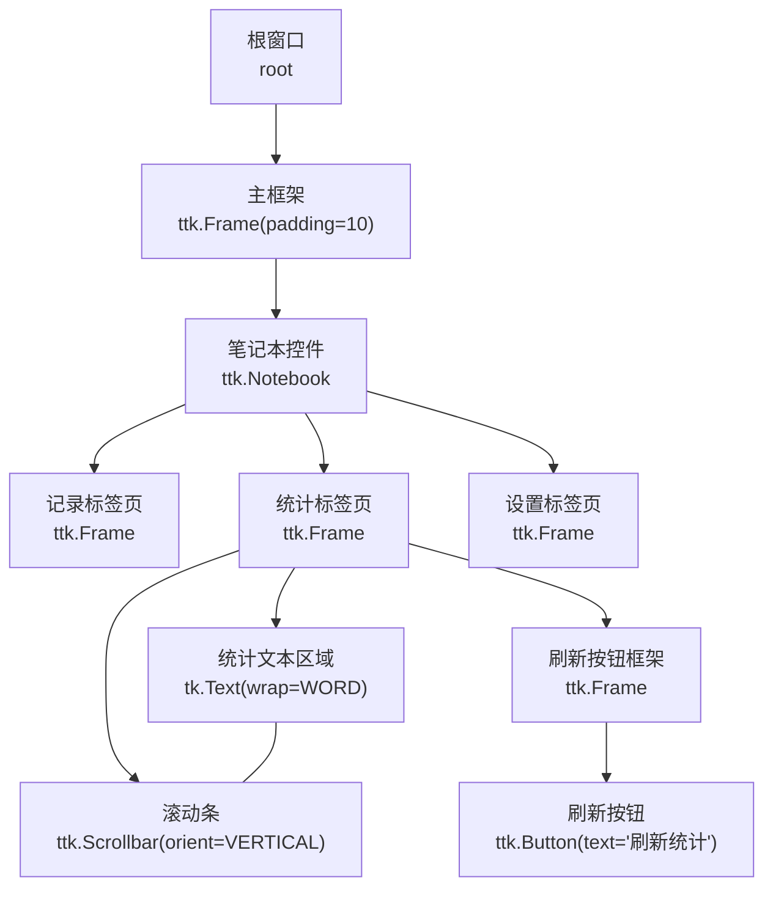
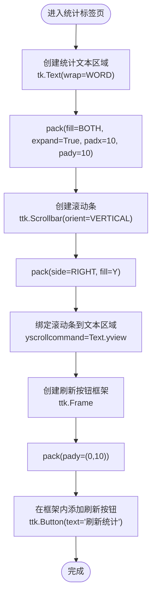
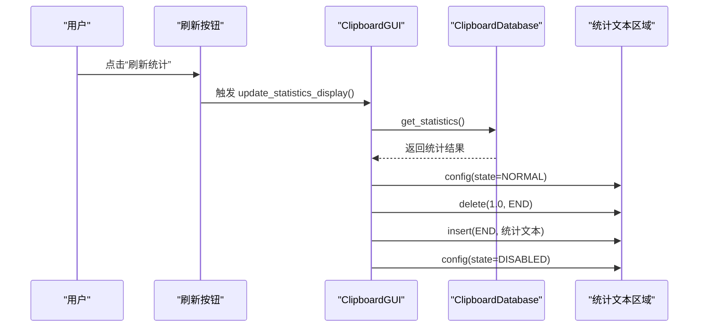
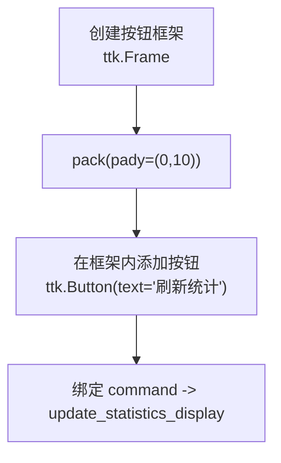
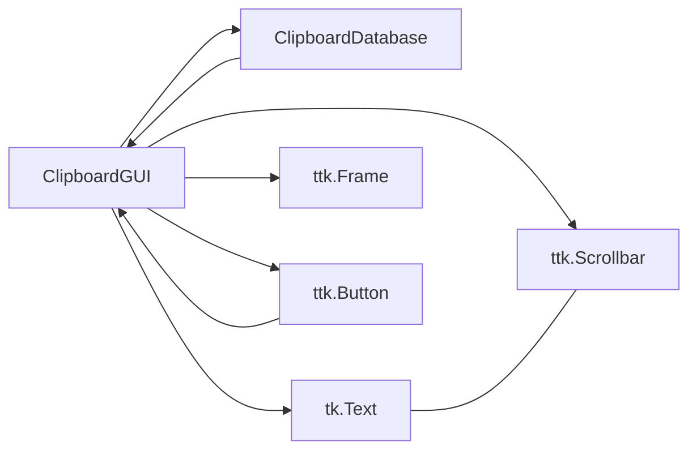

# 统计标签页布局

<cite>
**本文引用的文件**
- [clipboard_gui.py](file://clipboard_gui.py)
- [clipboard_manager_main.py](file://clipboard_manager_main.py)
</cite>

## 目录
1. [简介](#简介)
2. [项目结构](#项目结构)
3. [核心组件](#核心组件)
4. [架构总览](#架构总览)
5. [详细组件分析](#详细组件分析)
6. [依赖关系分析](#依赖关系分析)
7. [性能考量](#性能考量)
8. [故障排查指南](#故障排查指南)
9. [结论](#结论)

## 简介
本文件聚焦“统计标签页”的UI布局与交互设计，围绕以下目标展开：
- 统计文本区域与滚动条的组合使用方式
- 文本区域的填充策略与滚动条的垂直布局
- 刷新按钮的放置位置及其在按钮框架中的布局管理
- 统计信息显示区域的边距设置（padx=10, pady=10）
- 通过 expand=True 实现窗口缩放时的自适应布局

## 项目结构
统计标签页位于主GUI界面的笔记本控件中，采用tk.Text作为统计信息显示区域，并配合ttk.Scrollbar提供垂直滚动能力。刷新按钮置于独立的按钮框架中，整体采用pack布局实现垂直堆叠。

图表来源
- [clipboard_gui.py](file://clipboard_gui.py#L181-L218)
- [clipboard_gui.py](file://clipboard_gui.py#L309-L327)

章节来源
- [clipboard_gui.py](file://clipboard_gui.py#L181-L218)
- [clipboard_gui.py](file://clipboard_gui.py#L309-L327)

## 核心组件
- 统计文本区域：tk.Text，用于展示统计信息文本，支持自动换行。
- 垂直滚动条：ttk.Scrollbar，绑定到统计文本区域的垂直滚动。
- 刷新按钮框架：ttk.Frame，承载刷新按钮，采用pack进行垂直堆叠。
- 刷新按钮：ttk.Button，触发统计信息更新。

章节来源
- [clipboard_gui.py](file://clipboard_gui.py#L309-L327)

## 架构总览
统计标签页的布局由三部分组成：
- 上部：统计文本区域（tk.Text），占满可用空间
- 中部：垂直滚动条（ttk.Scrollbar），紧贴文本区域右侧
- 下部：刷新按钮框架（ttk.Frame），底部留有间距，内部包含刷新按钮（ttk.Button）

整体采用pack布局，先填充文本区域，再放置滚动条，最后放置按钮框架，形成垂直堆叠的视觉与交互顺序。

图表来源
- [clipboard_gui.py](file://clipboard_gui.py#L309-L327)

章节来源
- [clipboard_gui.py](file://clipboard_gui.py#L309-L327)

## 详细组件分析

### 组件A：统计文本区域与滚动条组合
- 文本区域创建与布局
  - 使用 tk.Text 并开启自动换行（wrap=WORD）
  - 通过 pack(fill=tk.BOTH, expand=True, padx=10, pady=10) 实现：
    - fill=tk.BOTH：在水平和垂直方向均填充剩余空间
    - expand=True：当父容器尺寸变化时，文本区域随窗口缩放而自适应
    - padx=10, pady=10：上下左右各留10像素边距，形成内边距
- 滚动条配置
  - 创建 ttk.Scrollbar，方向为垂直（orient=VERTICAL）
  - 将滚动条的 command 绑定到文本区域的 yview，实现滚动联动
  - 滚动条通过 pack(side=tk.RIGHT, fill=tk.Y) 放置在文本区域右侧，仅沿Y轴填充
- 数据更新流程
  - 点击“刷新统计”后，调用更新函数获取统计数据并写入文本区域
  - 更新前将文本区域设为可编辑状态，清空旧内容并插入新文本，再禁用文本区域以只读

图表来源
- [clipboard_gui.py](file://clipboard_gui.py#L309-L327)
- [clipboard_gui.py](file://clipboard_gui.py#L555-L580)

章节来源
- [clipboard_gui.py](file://clipboard_gui.py#L309-L327)
- [clipboard_gui.py](file://clipboard_gui.py#L555-L580)

### 组件B：刷新按钮的布局与管理
- 按钮框架
  - 在统计标签页内创建一个 ttk.Frame 作为按钮容器
  - 通过 pack(pady=(0,10)) 控制与上方文本区域的垂直间距，底部留10像素间距
- 刷新按钮
  - 在按钮框架内添加 ttk.Button，文本为“刷新统计”
  - 通过 pack() 方法默认向左堆叠，此处为单按钮，不需额外side参数
- 事件绑定
  - 刷新按钮的 command 绑定到 update_statistics_display，实现点击即更新

图表来源
- [clipboard_gui.py](file://clipboard_gui.py#L323-L327)

章节来源
- [clipboard_gui.py](file://clipboard_gui.py#L323-L327)

### 组件C：边距与垂直堆叠
- 边距设置
  - 文本区域：padx=10, pady=10，形成统一的内边距
  - 刷新按钮框架：pack(pady=(0,10))，与上方文本区域无缝衔接，底部留10像素间距
- 垂直堆叠
  - 文本区域先 pack，占据大部分空间
  - 滚动条紧邻文本区域右侧，不参与垂直堆叠
  - 刷新按钮框架位于文本区域下方，通过 pady=(0,10) 控制间距

章节来源
- [clipboard_gui.py](file://clipboard_gui.py#L309-L327)

### 组件D：expand=True 的自适应布局
- expand=True 的作用
  - 当父容器（统计标签页）尺寸变化时，文本区域会随窗口一起放大或缩小
  - 由于 fill=tk.BOTH，文本区域在X和Y方向均会填充剩余空间
- 父容器权重
  - 笔记本控件与主框架均配置了权重，保证统计标签页在窗口缩放时能正确响应
  - 统计标签页自身也配置了列权重，确保内部组件（文本区域、滚动条、按钮框架）按预期扩展

章节来源
- [clipboard_gui.py](file://clipboard_gui.py#L181-L218)
- [clipboard_gui.py](file://clipboard_gui.py#L309-L327)

## 依赖关系分析
- 统计标签页依赖于：
  - ClipboardDatabase：提供统计数据（文本记录数、文件记录数、累计大小）
  - Tkinter 组件：tk.Text、ttk.Scrollbar、ttk.Frame、ttk.Button
- 更新流程依赖：
  - update_statistics_display 调用数据库接口获取统计信息
  - 文本区域状态切换（NORMAL/DISABLED）以支持编辑与只读模式

图表来源
- [clipboard_gui.py](file://clipboard_gui.py#L555-L580)
- [clipboard_gui.py](file://clipboard_gui.py#L309-L327)

章节来源
- [clipboard_gui.py](file://clipboard_gui.py#L555-L580)
- [clipboard_gui.py](file://clipboard_gui.py#L309-L327)

## 性能考量
- 文本区域更新时的状态切换（NORMAL/DISABLED）避免了频繁的文本修改导致的重绘开销
- 滚动条与文本区域的双向绑定仅在垂直方向，减少不必要的布局计算
- pack布局简单直观，适合统计信息这种静态或低频更新的内容

## 故障排查指南
- 滚动条无效
  - 检查是否正确将滚动条的 command 绑定到文本区域的 yview
  - 确认文本区域的 configure(yscrollcommand=...) 是否设置
- 文本区域无法滚动
  - 确认文本区域未处于 DISABLED 状态（更新时会临时切换为 NORMAL）
  - 检查是否正确设置 wrap=WORD 以支持长文本换行
- 刷新按钮无响应
  - 确认按钮的 command 是否绑定到 update_statistics_display
  - 检查统计信息文本是否被成功写入并再次设置为 DISABLED

章节来源
- [clipboard_gui.py](file://clipboard_gui.py#L309-L327)
- [clipboard_gui.py](file://clipboard_gui.py#L555-L580)

## 结论
统计标签页采用简洁高效的pack布局：上部tk.Text占满空间并设置padx/pady边距，右侧ttk.Scrollbar提供垂直滚动，底部ttk.Frame内的刷新按钮实现一键更新。通过expand=True与fill=BOTH，实现了窗口缩放时的自适应布局；padx=10、pady=10的边距确保了良好的视觉层次与可读性。整体设计易于维护且符合用户习惯。