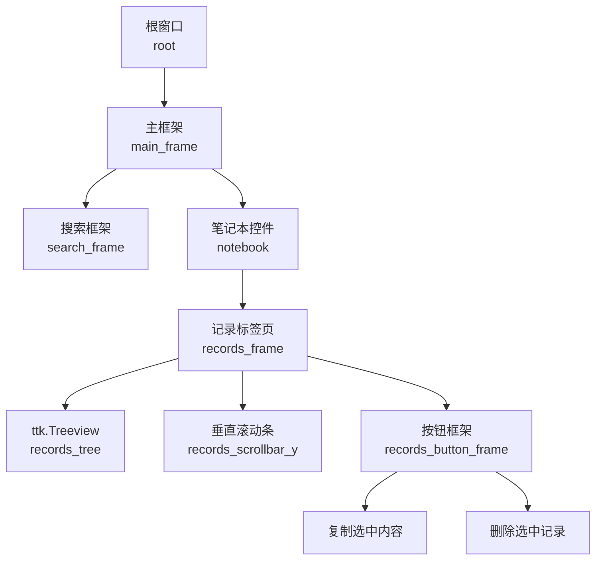
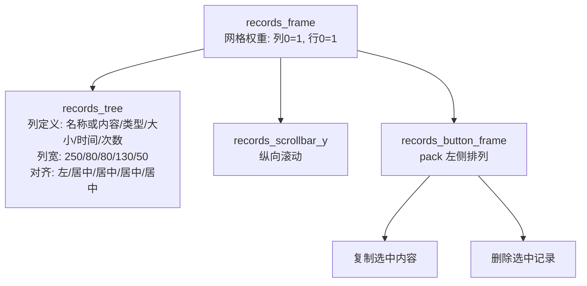
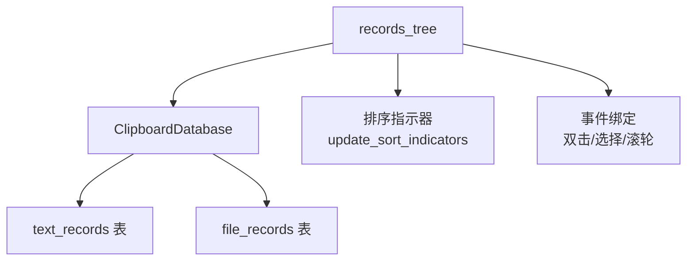

# 记录标签页布局

<cite>
**本文引用的文件**
- [clipboard_gui.py](file://clipboard_gui.py)
- [clipboard_manager_main.py](file://clipboard_manager_main.py)
</cite>

## 目录
1. [简介](#简介)
2. [项目结构](#项目结构)
3. [核心组件](#核心组件)
4. [架构总览](#架构总览)
5. [详细组件分析](#详细组件分析)
6. [依赖关系分析](#依赖关系分析)
7. [性能考量](#性能考量)
8. [故障排查指南](#故障排查指南)
9. [结论](#结论)

## 简介
本章节聚焦“记录标签页”的布局实现，围绕以下目标展开：
- ttk.Treeview 组件的配置与列定义（名称或内容、类型、大小、时间、次数），以及列宽与对齐方式
- 垂直滚动条的集成方式
- 按钮框架中“复制选中内容”和“删除选中记录”按钮的布局策略
- 双击事件绑定以显示完整内容的功能实现
- 鼠标滚轮与树形视图选择事件的绑定机制
- 网格权重配置如何实现自适应缩放

## 项目结构
记录标签页位于 GUI 主界面中，采用 Notebook 控件组织多个标签页，其中“记录”标签页承载了历史记录的展示与交互。整体布局采用网格（grid）管理器，通过权重配置实现随窗口大小变化的自适应缩放。

图表来源
- [clipboard_gui.py](file://clipboard_gui.py#L172-L219)
- [clipboard_gui.py](file://clipboard_gui.py#L227-L279)

章节来源
- [clipboard_gui.py](file://clipboard_gui.py#L172-L219)
- [clipboard_gui.py](file://clipboard_gui.py#L227-L279)

## 核心组件
- 记录标签页容器：records_frame，作为“记录”标签页的根容器，内部包含 Treeview、垂直滚动条与按钮框架
- Treeview：用于展示记录的多列数据，列名为“名称或内容”、“类型”、“大小”、“时间”、“次数”
- 垂直滚动条：与 Treeview 的 yview 绑定，提供纵向滚动能力
- 按钮框架：包含“复制选中内容”和“删除选中记录”两个按钮，采用 pack 方式水平排列
- 事件绑定：双击显示完整内容、选择事件与鼠标滚轮事件

章节来源
- [clipboard_gui.py](file://clipboard_gui.py#L227-L279)

## 架构总览
记录标签页的布局由三层构成：容器层（records_frame）、内容层（Treeview + 滚动条）、控制层（按钮框架）。通过网格权重配置，使内容层在窗口缩放时优先扩展，按钮层保持固定尺寸。

图表来源
- [clipboard_gui.py](file://clipboard_gui.py#L227-L279)

章节来源
- [clipboard_gui.py](file://clipboard_gui.py#L227-L279)

## 详细组件分析

### Treeview 列定义与列宽、对齐方式
- 列集合：("名称或内容", "类型", "大小", "时间", "次数")
- 列标题：通过 heading 设置，支持点击排序
- 列宽与对齐：
  - 名称或内容：宽度 250，左对齐
  - 类型：宽度 80，居中对齐
  - 大小：宽度 80，居中对齐
  - 时间：宽度 130，居中对齐
  - 次数：宽度 50，居中对齐
- 排序指示器：根据当前排序列与方向，在列标题后追加上下箭头符号
- 数据加载：按排序字段与方向从数据库加载文本与文件记录，插入 Treeview，并为每行设置标签（记录类型与 ID）

章节来源
- [clipboard_gui.py](file://clipboard_gui.py#L235-L253)
- [clipboard_gui.py](file://clipboard_gui.py#L280-L308)
- [clipboard_gui.py](file://clipboard_gui.py#L581-L626)
- [clipboard_gui.py](file://clipboard_gui.py#L627-L637)

### 垂直滚动条集成
- 创建垂直滚动条：orient=tk.VERTICAL，command 指向 records_tree.yview
- Treeview 通过 configure(yscrollcommand=...) 绑定滚动条
- 布局：Treeview 占据第 0 列，滚动条紧邻右侧，均处于 records_frame 的第 0 行

章节来源
- [clipboard_gui.py](file://clipboard_gui.py#L254-L261)

### 按钮框架布局策略
- 按钮框架：records_button_frame，位于 Treeview 下方，columnspan=2，横向占满
- 按钮排列：pack(side=tk.LEFT)，左侧依次放置“复制选中内容”和“删除选中记录”，中间留有间距
- 作用：
  - 复制选中内容：根据选中记录类型分别复制文本或文件名至剪贴板
  - 删除选中记录：弹出确认对话框，删除数据库记录并尝试删除本地文件（如适用）

章节来源
- [clipboard_gui.py](file://clipboard_gui.py#L263-L268)
- [clipboard_gui.py](file://clipboard_gui.py#L800-L838)
- [clipboard_gui.py](file://clipboard_gui.py#L839-L878)

### 双击事件绑定与完整内容显示
- 绑定：records_tree.bind("<Double-1>", ...)，在双击时触发
- 行为：
  - 文本记录：从数据库读取完整文本内容，弹出新窗口显示
  - 文件记录：定位保存路径并调用系统资源管理器打开所在位置
- 选择获取：通过 selection() 获取当前选中行，item("tags") 获取记录类型与 ID

章节来源
- [clipboard_gui.py](file://clipboard_gui.py#L269-L270)
- [clipboard_gui.py](file://clipboard_gui.py#L749-L795)

### 鼠标滚轮与选择事件绑定机制
- 鼠标滚轮：bind("<MouseWheel>", ...)，当前实现为透传给默认处理程序（不执行额外逻辑）
- 选择事件：bind("<<TreeviewSelect>>", ...)，当前实现为空（不执行分页逻辑）
- 设计意图：保留扩展点，未来可在此基础上实现自动加载更多或快捷操作

章节来源
- [clipboard_gui.py](file://clipboard_gui.py#L272-L275)
- [clipboard_gui.py](file://clipboard_gui.py#L638-L651)

### 网格权重配置与自适应缩放
- 根级权重：root.columnconfigure(0, weight=1)、root.rowconfigure(0, weight=1)
- main_frame 权重：columnconfigure(1, weight=1)、rowconfigure(1, weight=1)
- records_frame 权重：columnconfigure(0, weight=1)、rowconfigure(0, weight=1)
- 效果：当窗口尺寸变化时，records_frame 内的内容区（Treeview + 滚动条）优先扩展，按钮区保持固定高度

章节来源
- [clipboard_gui.py](file://clipboard_gui.py#L208-L219)
- [clipboard_gui.py](file://clipboard_gui.py#L276-L279)

## 依赖关系分析
- 数据来源：ClipboardDatabase 提供 get_text_records、get_file_records、search_records、delete_text_record、delete_file_record 等接口
- 数据库字段映射：界面列名与数据库字段名映射关系（时间列对应 timestamp，次数列对应 number 等）
- 排序策略：根据当前列名映射到数据库字段，结合 reverse 参数控制升/降序

图表来源
- [clipboard_gui.py](file://clipboard_gui.py#L581-L637)
- [clipboard_gui.py](file://clipboard_gui.py#L280-L308)
- [clipboard_gui.py](file://clipboard_gui.py#L269-L275)

章节来源
- [clipboard_gui.py](file://clipboard_gui.py#L581-L637)
- [clipboard_gui.py](file://clipboard_gui.py#L280-L308)

## 性能考量
- 列宽与对齐：合理的列宽分配减少渲染压力；居中对齐在大量数值列时可能带来轻微布局开销
- 滚动条：仅纵向滚动，避免横向滚动条带来的额外布局计算
- 事件绑定：当前滚轮与选择事件未执行复杂逻辑，避免阻塞主线程
- 自动更新：全局自动更新任务在非活动状态下会跳过，降低不必要的数据库访问

[本节为通用建议，不直接分析具体文件]

## 故障排查指南
- 双击无效或报错
  - 检查 selection 是否为空，确认 item("tags") 中包含记录类型与 ID
  - 文本记录需确保数据库中存在对应完整内容
- 复制失败
  - 确认已选择记录；检查剪贴板写入流程与消息提示
- 删除失败
  - 确认弹窗确认流程；检查文件删除权限与路径有效性
- 滚轮无响应
  - 当前实现为透传，默认处理程序负责滚动，若无滚动条或内容不足，可能无反馈

章节来源
- [clipboard_gui.py](file://clipboard_gui.py#L749-L795)
- [clipboard_gui.py](file://clipboard_gui.py#L800-L838)
- [clipboard_gui.py](file://clipboard_gui.py#L839-L878)
- [clipboard_gui.py](file://clipboard_gui.py#L638-L651)

## 结论
记录标签页通过清晰的网格布局与权重配置，实现了 Treeview 内容区的自适应缩放；通过垂直滚动条提升长列表的可浏览性；按钮框架简洁直观地提供了常用操作入口。事件绑定为后续扩展（如自动加载更多、快捷操作）预留了良好接口。整体设计兼顾可用性与可维护性。