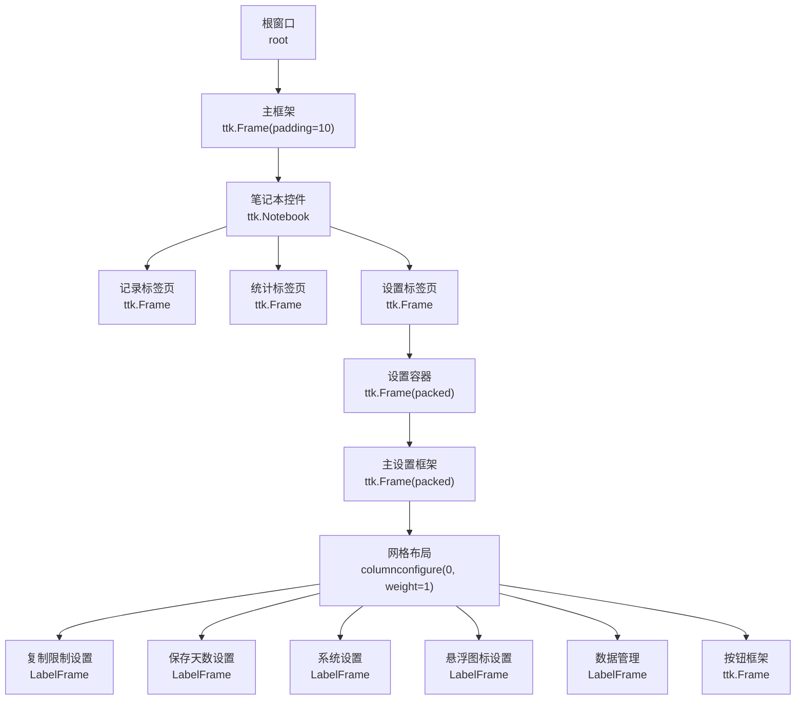
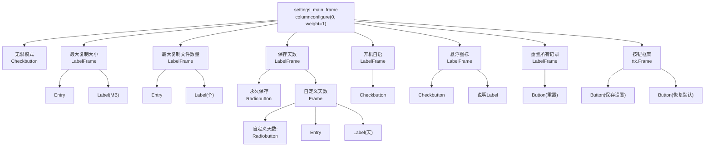
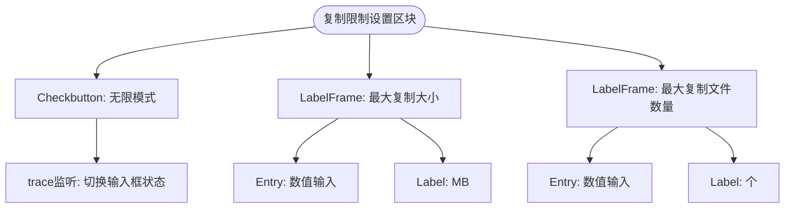
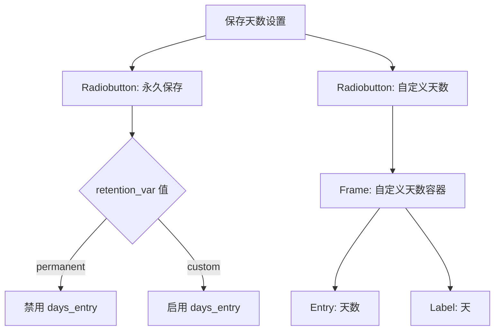
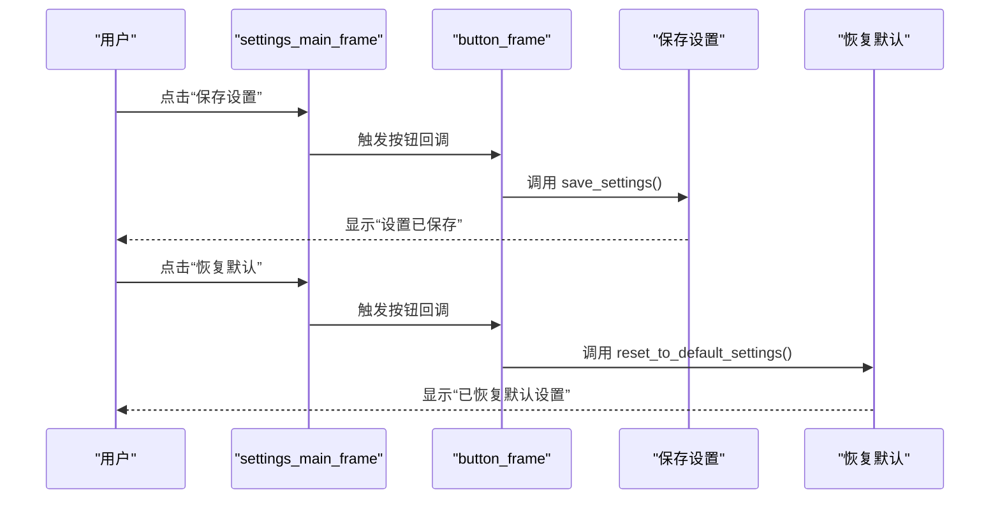
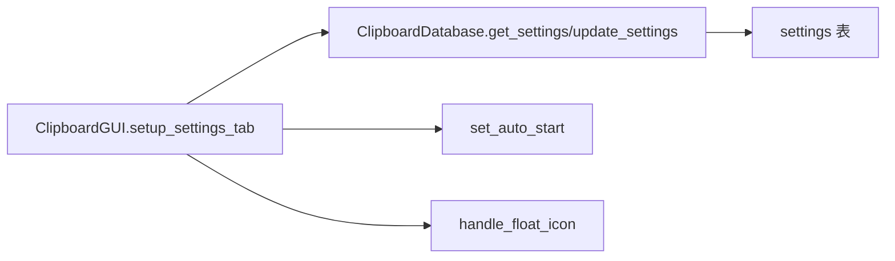

# 设置标签页布局

<cite>
**本文引用的文件**
- [clipboard_gui.py](file://clipboard_gui.py)
- [clipboard_manager_main.py](file://clipboard_manager_main.py)
</cite>

## 目录
1. [简介](#简介)
2. [项目结构](#项目结构)
3. [核心组件](#核心组件)
4. [架构总览](#架构总览)
5. [详细组件分析](#详细组件分析)
6. [依赖关系分析](#依赖关系分析)
7. [性能考量](#性能考量)
8. [故障排查指南](#故障排查指南)
9. [结论](#结论)

## 简介
本文件聚焦于“设置”标签页的容器布局策略，系统性解析以下要点：
- 主设置框架的网格布局配置及列权重设置（columnconfigure(0, weight=1)）
- 各设置区块（复制限制、保存天数、开机自启、悬浮图标等）的LabelFrame组织方式
- 各输入控件（Entry、Checkbutton、Radiobutton）在网格中的精确定位
- 按钮框架中“保存设置”和“恢复默认”的水平排列机制
- 各标签页内控件的内外边距设置如何提升用户体验

## 项目结构
设置标签页位于 GUI 主模块中，采用 Notebook 的多标签页组织，其中“设置”标签页通过网格布局承载多个设置区块，每个区块使用 LabelFrame 进行语义分组，内部嵌套 Entry、Checkbutton、Radiobutton 等控件。

图表来源
- [clipboard_gui.py](file://clipboard_gui.py#L172-L219)
- [clipboard_gui.py](file://clipboard_gui.py#L328-L438)

章节来源
- [clipboard_gui.py](file://clipboard_gui.py#L172-L219)
- [clipboard_gui.py](file://clipboard_gui.py#L328-L438)

## 核心组件
- 主设置框架：settings_main_frame，采用 pack 填充并使用 columnconfigure(0, weight=1) 实现横向扩展。
- 设置区块：每个区块以 LabelFrame 包裹，内部使用网格定位控件，部分区块对内部列配置了权重以实现响应式布局。
- 输入控件：Entry、Checkbutton、Radiobutton 在网格中通过 row/column 精确定位，并配合 padx/pady 实现间距控制。
- 按钮框架：button_frame 中两个按钮通过 pack(side=tk.LEFT) 水平排列，使用 padx 控制左右间距。

章节来源
- [clipboard_gui.py](file://clipboard_gui.py#L328-L438)

## 架构总览
设置标签页的布局遵循“容器-区块-控件”的层次化设计：
- 容器层：settings_container、settings_main_frame
- 区块层：多个 LabelFrame 分组（复制限制、保存天数、系统设置、悬浮图标、数据管理）
- 控件层：Entry、Checkbutton、Radiobutton、Label、Button

图表来源
- [clipboard_gui.py](file://clipboard_gui.py#L338-L438)

## 详细组件分析

### 主设置框架与网格权重
- settings_container：使用 pack(fill=tk.BOTH, expand=True, padx=10, pady=10) 充满设置标签页，提供统一的内外边距。
- settings_main_frame：同样 pack 填充，内部通过 columnconfigure(0, weight=1) 使主列可随窗口宽度扩展，保证区块标题与控件整体对齐。
- settings_frame：在 setup_ui 中为整个设置标签页配置了 columnconfigure(0, weight=1) 与 rowconfigure(0, weight=1)，确保 Notebook 内容可扩展。

章节来源
- [clipboard_gui.py](file://clipboard_gui.py#L328-L340)
- [clipboard_gui.py](file://clipboard_gui.py#L208-L219)

### 复制限制设置（LabelFrame 组织与控件定位）
- 标题：加粗标题“复制限制设置”
- 无限模式：Checkbutton，绑定变量 unlimited_var，用于切换其他输入框状态。
- 最大复制大小：LabelFrame 包裹，内部两列：Entry（数值输入）+ Label（单位“MB”），Entry 列权重为 1，右侧单位固定。
- 最大复制文件数量：LabelFrame 包裹，内部两列：Entry（数值输入）+ Label（单位“个”），Entry 列权重为 1。
- 行间距：各区块之间通过 pady 控制上下间距，确保视觉层次清晰。

图表来源
- [clipboard_gui.py](file://clipboard_gui.py#L341-L368)
- [clipboard_gui.py](file://clipboard_gui.py#L439-L462)

章节来源
- [clipboard_gui.py](file://clipboard_gui.py#L341-L368)
- [clipboard_gui.py](file://clipboard_gui.py#L439-L462)

### 保存天数设置（Radiobutton 与自定义输入）
- 标题：加粗标题“记录保存设置”
- 永久保存：Radiobutton，值为“permanent”，选中时 days_entry 禁用。
- 自定义天数：Radiobutton + Frame 容器，内部三列：Radiobutton + Entry + Label，Entry 列权重为 1，右侧单位固定。
- 变量：retention_var 控制选中项；days_var 与 days_entry 绑定，用于输入天数。

图表来源
- [clipboard_gui.py](file://clipboard_gui.py#L369-L393)
- [clipboard_gui.py](file://clipboard_gui.py#L439-L451)

章节来源
- [clipboard_gui.py](file://clipboard_gui.py#L369-L393)
- [clipboard_gui.py](file://clipboard_gui.py#L439-L451)

### 系统设置（开机自启）
- 标题：加粗标题“系统设置”
- 开机自启：LabelFrame 包裹 Checkbutton，变量 autostart_var 控制。
- 保存逻辑：保存设置时调用 set_auto_start，依据布尔值执行开机自启相关操作。

章节来源
- [clipboard_gui.py](file://clipboard_gui.py#L394-L403)
- [clipboard_gui.py](file://clipboard_gui.py#L507-L529)

### 悬浮图标设置
- 标题：加粗标题“悬浮图标设置”
- 悬浮图标：LabelFrame 包裹 Checkbutton，变量 float_icon_var 控制。
- 说明：Label 提示悬浮图标尺寸、透明度、可拖动与点击显示页面等特性。
- 保存逻辑：保存设置时调用 handle_float_icon，依据布尔值创建或销毁悬浮图标。

章节来源
- [clipboard_gui.py](file://clipboard_gui.py#L404-L416)
- [clipboard_gui.py](file://clipboard_gui.py#L507-L529)

### 数据管理（重置所有记录）
- 标题：加粗标题“数据管理”
- 重置所有记录：LabelFrame 包裹说明与 Button，点击后清空记录并删除本地缓存文件。

章节来源
- [clipboard_gui.py](file://clipboard_gui.py#L417-L425)

### 按钮框架与水平排列
- 按钮框架：ttk.Frame，grid(row=12, column=0, pady=(20, 0)) 定位在最后一行。
- “保存设置”和“恢复默认”：均通过 pack(side=tk.LEFT, padx=(0, 10)) 水平排列，左侧按钮无左间距，右侧按钮与左侧有 10 像素间距，形成紧凑而清晰的按钮组。

图表来源
- [clipboard_gui.py](file://clipboard_gui.py#L426-L432)
- [clipboard_gui.py](file://clipboard_gui.py#L477-L554)

章节来源
- [clipboard_gui.py](file://clipboard_gui.py#L426-L432)
- [clipboard_gui.py](file://clipboard_gui.py#L477-L554)

### 控件内外边距与用户体验
- 外边距（padx/pady）：
  - 各区块 LabelFrame 使用 pady=(0, 10) 或 pady=(10, 5) 控制上下间距，形成清晰的分区层次。
  - 各区块内部控件使用 padx/pady 控制元素间距，例如 Entry 与单位 Label 之间使用 padx=(10, 5)/(0, 10) 等，保证输入与单位对齐。
- 内边距（padding）：
  - settings_container 使用 padding=10，使设置内容与标签页边缘保持一定距离，避免贴边带来的拥挤感。
  - 按钮框架使用 pady=(20, 0) 与上一区块拉开距离，突出操作区。
- 响应式布局：
  - settings_main_frame 列权重为 1，使区块标题与控件整体随窗口宽度扩展，避免窄屏时内容拥挤。
  - LabelFrame 内部列权重为 1 的容器（如最大复制大小、最大复制文件数量、保存天数等），使输入框优先占用可用空间，单位标签保持固定宽度。

章节来源
- [clipboard_gui.py](file://clipboard_gui.py#L331-L340)
- [clipboard_gui.py](file://clipboard_gui.py#L341-L368)
- [clipboard_gui.py](file://clipboard_gui.py#L369-L393)
- [clipboard_gui.py](file://clipboard_gui.py#L394-L416)
- [clipboard_gui.py](file://clipboard_gui.py#L417-L432)

## 依赖关系分析
- 设置标签页依赖数据库模块提供的设置读写接口，用于加载默认值、保存修改与恢复默认。
- 保存设置流程会联动系统功能（开机自启、悬浮图标），并通过数据库清理过期记录。

图表来源
- [clipboard_gui.py](file://clipboard_gui.py#L439-L554)
- [clipboard_manager_main.py](file://clipboard_manager_main.py#L305-L343)

章节来源
- [clipboard_gui.py](file://clipboard_gui.py#L439-L554)
- [clipboard_manager_main.py](file://clipboard_manager_main.py#L305-L343)

## 性能考量
- 网格权重配置合理，避免过度嵌套导致布局计算开销。
- 控件定位采用网格与 pack 结合，减少复杂布局算法的使用。
- 按钮框架使用 pack(side=tk.LEFT) 简化水平排列，降低布局复杂度。

## 故障排查指南
- 保存设置报错“请输入有效的数字”：检查复制限制与最大数量输入框是否为有效数值，或确认“无限模式”开启时未强制校验数值。
- 自定义天数输入无效：确认“永久保存”未被选中，否则 days_entry 会被禁用。
- 开机自启或悬浮图标未生效：确认对应开关已勾选，且保存设置后执行了相应系统级操作。

章节来源
- [clipboard_gui.py](file://clipboard_gui.py#L531-L533)
- [clipboard_gui.py](file://clipboard_gui.py#L507-L529)

## 结论
设置标签页通过“容器-区块-控件”的层级化布局，结合网格与 pack 的组合使用，实现了清晰、易维护且具有良好响应性的设置界面。主设置框架的列权重配置确保了内容随窗口宽度扩展，各区块使用 LabelFrame 进行语义分组，输入控件在网格中精确定位，按钮框架采用水平 pack 排列，配合内外边距提升了整体的可读性与可用性。同时，保存设置流程与系统功能（开机自启、悬浮图标）紧密耦合，确保用户操作的一致性与完整性。