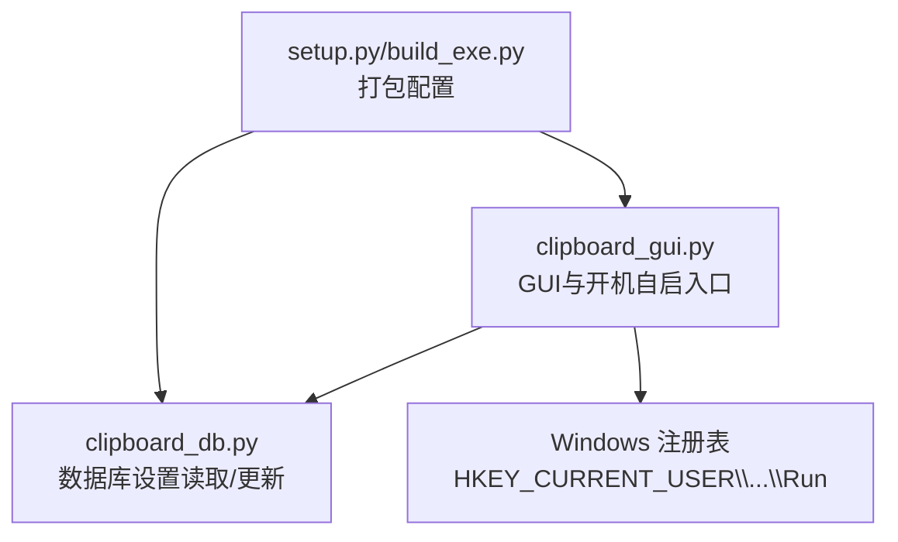
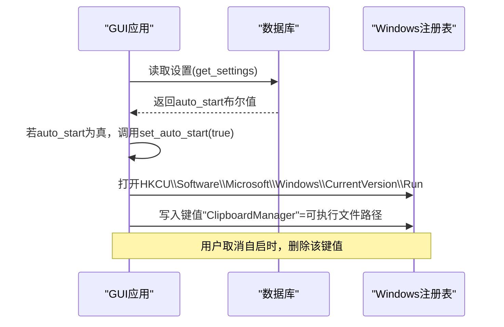
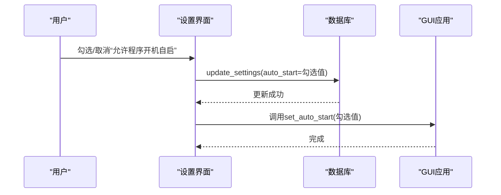
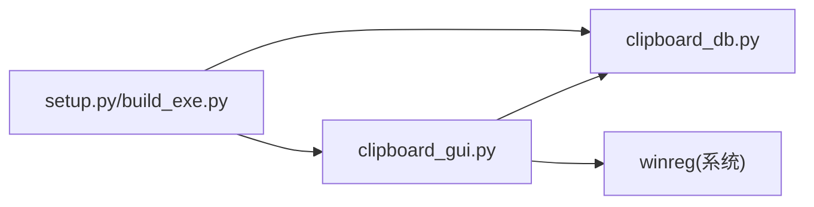

# 开机自启机制

<cite>
**本文引用的文件**
- [clipboard_gui.py](file://clipboard_gui.py)
- [clipboard_db.py](file://clipboard_db.py)
- [setup.py](file://setup.py)
- [build_exe.py](file://build_exe.py)
</cite>

## 目录
1. [简介](#简介)
2. [项目结构](#项目结构)
3. [核心组件](#核心组件)
4. [架构总览](#架构总览)
5. [详细组件分析](#详细组件分析)
6. [依赖关系分析](#依赖关系分析)
7. [性能考虑](#性能考虑)
8. [故障排查指南](#故障排查指南)
9. [结论](#结论)

## 简介
本文件系统化梳理并文档化“开机自启”功能的实现，重点覆盖以下方面：
- 初始化时如何从数据库读取 auto_start 设置，并调用 set_auto_start 进行配置
- Windows 系统中通过注册表 HKEY_CURRENT_USER\Software\Microsoft\Windows\CurrentVersion\Run 添加/删除启动项的实现机制
- 注册表键值命名规则与可执行文件路径来源（resource_path 与 sys.executable 的区分）
- 开机自启状态检查与错误处理流程，以及权限不足时的用户提示策略

## 项目结构
围绕开机自启功能的关键文件与职责如下：
- clipboard_gui.py：负责 GUI 初始化、设置界面、开机自启开关 UI、调用数据库读写与注册表配置
- clipboard_db.py：负责 settings 表的初始化、读取与更新，包含 auto_start 字段
- setup.py/build_exe.py：构建脚本，用于将项目打包为可执行文件，便于后续注册表路径定位



图表来源
- [clipboard_gui.py](file://clipboard_gui.py#L60-L62)
- [clipboard_db.py](file://clipboard_db.py#L98-L104)
- [setup.py](file://setup.py#L56-L84)
- [build_exe.py](file://build_exe.py#L56-L81)

章节来源
- [clipboard_gui.py](file://clipboard_gui.py#L60-L62)
- [clipboard_db.py](file://clipboard_db.py#L98-L104)
- [setup.py](file://setup.py#L56-L84)
- [build_exe.py](file://build_exe.py#L56-L81)

## 核心组件
- 初始化阶段的开机自启检查：在 GUI 初始化时调用 check_auto_start，从数据库读取 auto_start 并决定是否设置开机自启
- 设置界面的开机自启开关：用户勾选“允许程序开机自启”后，保存设置并调用 set_auto_start
- 注册表配置：set_auto_start 通过 winreg 在 HKEY_CURRENT_USER 下的 CurrentVersion\Run 键写入/删除启动项

章节来源
- [clipboard_gui.py](file://clipboard_gui.py#L60-L62)
- [clipboard_gui.py](file://clipboard_gui.py#L89-L97)
- [clipboard_gui.py](file://clipboard_gui.py#L1131-L1163)

## 架构总览
开机自启的端到端流程如下：
- GUI 初始化 -> 读取数据库 settings.auto_start -> 若为真则调用 set_auto_start(true)
- 用户在设置界面勾选/取消 -> 保存 settings.auto_start -> 调用 set_auto_start(真/假)
- set_auto_start 写入/删除注册表键值



图表来源
- [clipboard_gui.py](file://clipboard_gui.py#L89-L97)
- [clipboard_gui.py](file://clipboard_gui.py#L1131-L1163)
- [clipboard_db.py](file://clipboard_db.py#L360-L385)

## 详细组件分析

### 初始化阶段的开机自启检查
- 入口：GUI 初始化时立即调用 check_auto_start
- 逻辑：从数据库读取 settings.auto_start，若为真则调用 set_auto_start(true)
- 异常处理：捕获异常并打印错误信息，避免影响主流程


图表来源
- [clipboard_gui.py](file://clipboard_gui.py#L60-L62)
- [clipboard_gui.py](file://clipboard_gui.py#L89-L97)
- [clipboard_db.py](file://clipboard_db.py#L360-L385)

章节来源
- [clipboard_gui.py](file://clipboard_gui.py#L60-L62)
- [clipboard_gui.py](file://clipboard_gui.py#L89-L97)
- [clipboard_db.py](file://clipboard_db.py#L360-L385)

### 设置界面的开机自启开关
- UI：设置标签页中提供“允许程序开机自启”的复选框
- 保存逻辑：保存 settings.auto_start 到数据库，并调用 set_auto_start
- 默认值：未显式设置时，数据库默认 auto_start 为假（见 reset_to_default_settings）



图表来源
- [clipboard_gui.py](file://clipboard_gui.py#L477-L533)
- [clipboard_gui.py](file://clipboard_gui.py#L507-L525)
- [clipboard_db.py](file://clipboard_db.py#L387-L412)

章节来源
- [clipboard_gui.py](file://clipboard_gui.py#L477-L533)
- [clipboard_gui.py](file://clipboard_gui.py#L507-L525)
- [clipboard_db.py](file://clipboard_db.py#L387-L412)

### 注册表配置实现（set_auto_start）
- 注册表路径：HKEY_CURRENT_USER\Software\Microsoft\Windows\CurrentVersion\Run
- 键值命名：ClipboardManager（固定键名）
- 写入时机：enable=true 时写入
- 删除时机：enable=false 时删除对应键值
- 可执行文件路径来源：
  - 打包后：sys.executable（即当前exe路径）
  - 非打包（开发态）：os.path.abspath(__file__)（当前脚本绝对路径）
- 异常处理：捕获异常并打印错误信息

```mermaid
flowchart TD
S(["进入set_auto_start(enable)"]) --> GetPath["获取可执行文件路径"]
GetPath --> Enable{"enable为真？"}
Enable --> |是| OpenKey["打开HKCU\\...\\Run键"]
OpenKey --> WriteVal["SetValueEx(\"ClipboardManager\", 可执行文件路径)"]
WriteVal --> CloseKey["CloseKey()"]
Enable --> |否| TryDelete["尝试OpenKey并DeleteValue(\"ClipboardManager\")"]
TryDelete --> NotFound{"FileNotFoundError？"}
NotFound --> |是| Ignore["忽略错误并返回"]
NotFound --> |否| Done["完成"]
CloseKey --> Done
Ignore --> Done
```

图表来源
- [clipboard_gui.py](file://clipboard_gui.py#L1131-L1163)

章节来源
- [clipboard_gui.py](file://clipboard_gui.py#L1131-L1163)

### 可执行文件路径与资源路径的关系
- set_auto_start 中的路径来源：sys.executable 或 os.path.abspath(__file__)
- 资源路径函数 resource_path：用于在打包后定位资源文件（如图标），与注册表路径来源不同
- 关系说明：注册表中写入的是可执行文件路径；资源路径用于加载图标等资源，二者用途不同但都受打包影响

章节来源
- [clipboard_gui.py](file://clipboard_gui.py#L27-L36)
- [clipboard_gui.py](file://clipboard_gui.py#L1131-L1163)

### 键值命名规则与可执行文件路径
- 键值名称：ClipboardManager（固定键名）
- 路径来源：
  - 打包后：sys.executable（exe路径）
  - 非打包：os.path.abspath(__file__)（脚本绝对路径）
- 注册表键路径：HKEY_CURRENT_USER\Software\Microsoft\Windows\CurrentVersion\Run

章节来源
- [clipboard_gui.py](file://clipboard_gui.py#L1131-L1163)

### 权限不足与错误处理
- 当前实现：set_auto_start 对异常进行捕获并打印错误信息
- 用户提示：未在代码中直接弹出用户提示框
- 建议实践（通用指导，非仓库实现）：可在捕获异常时弹出提示，告知用户可能因权限不足导致无法写入注册表

章节来源
- [clipboard_gui.py](file://clipboard_gui.py#L1131-L1163)

## 依赖关系分析
- GUI 依赖数据库模块读取/更新设置
- GUI 依赖 winreg 模块进行注册表操作
- 构建脚本负责将 GUI 与数据库打包为可执行文件，影响 set_auto_start 中的路径来源



图表来源
- [clipboard_gui.py](file://clipboard_gui.py#L1131-L1163)
- [clipboard_db.py](file://clipboard_db.py#L360-L385)
- [setup.py](file://setup.py#L56-L84)
- [build_exe.py](file://build_exe.py#L56-L81)

章节来源
- [clipboard_gui.py](file://clipboard_gui.py#L1131-L1163)
- [clipboard_db.py](file://clipboard_db.py#L360-L385)
- [setup.py](file://setup.py#L56-L84)
- [build_exe.py](file://build_exe.py#L56-L81)

## 性能考虑
- 注册表操作为轻量级 I/O，调用频率低，对整体性能影响可忽略
- 初始化阶段仅在应用启动时执行一次 check_auto_start，成本极低
- 建议：避免频繁切换开机自启状态，减少不必要的注册表写入

## 故障排查指南
- 症状：开机自启无效
  - 检查数据库 settings.auto_start 是否为真
  - 检查注册表键值是否存在且路径正确
  - 检查是否以管理员权限运行（必要时以管理员身份运行）
- 症状：修改设置后未生效
  - 确认保存设置流程已调用 set_auto_start
  - 查看控制台输出的异常信息（当前实现会打印错误）
- 症状：打包后路径异常
  - 确认打包脚本包含必要的资源与模块
  - 确认 sys.executable 指向正确的可执行文件

章节来源
- [clipboard_gui.py](file://clipboard_gui.py#L89-L97)
- [clipboard_gui.py](file://clipboard_gui.py#L1131-L1163)
- [clipboard_db.py](file://clipboard_db.py#L360-L385)
- [setup.py](file://setup.py#L56-L84)
- [build_exe.py](file://build_exe.py#L56-L81)

## 结论
- 本项目通过数据库持久化 auto_start 设置，并在 GUI 初始化与用户设置变更时调用 set_auto_start 实现开机自启的动态配置
- Windows 注册表采用 HKEY_CURRENT_USER 下的 Run 键，键名为 ClipboardManager，值为可执行文件路径
- 路径来源区分打包与开发两种场景，分别使用 sys.executable 与 os.path.abspath(__file__)
- 当前实现对异常进行捕获并打印，建议在上层 UI 层补充用户提示以提升可用性