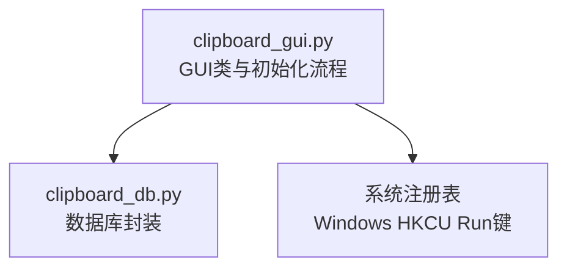
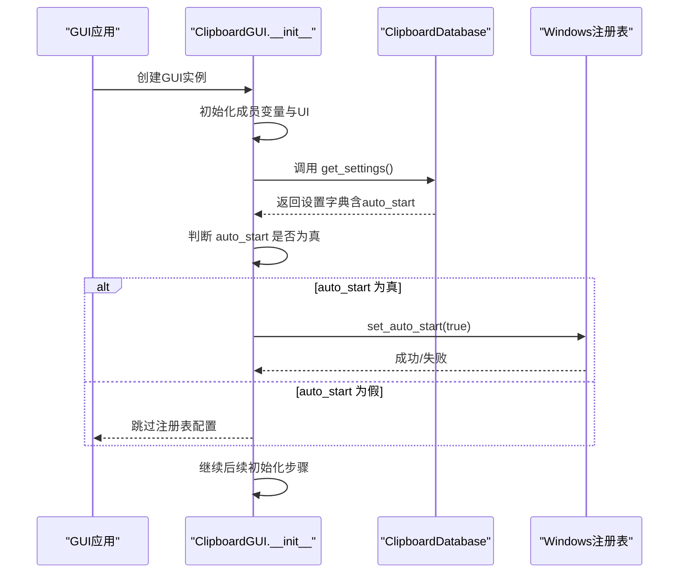
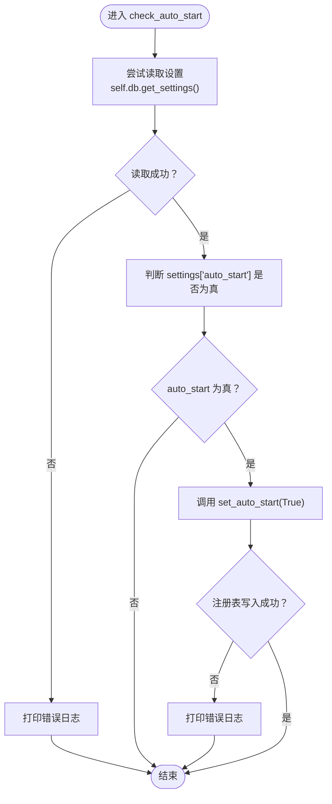
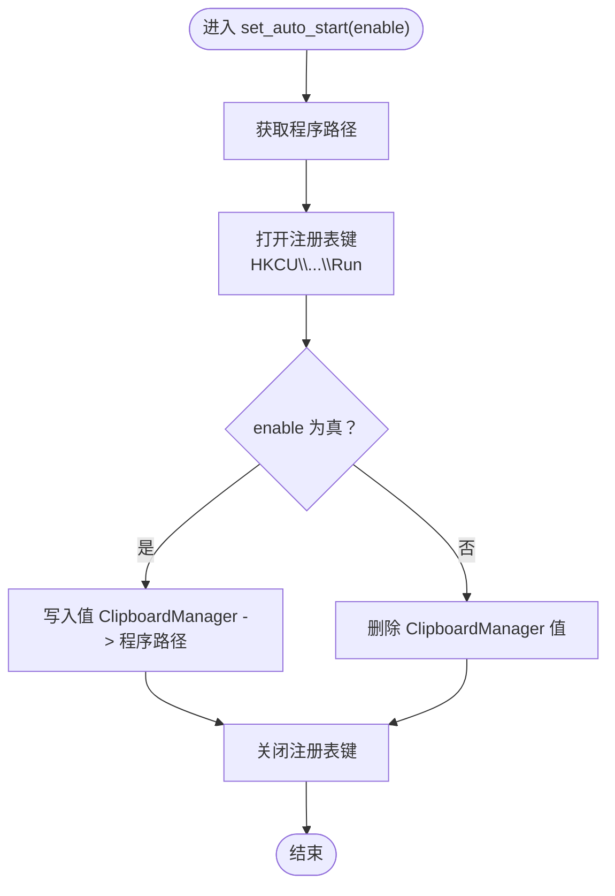
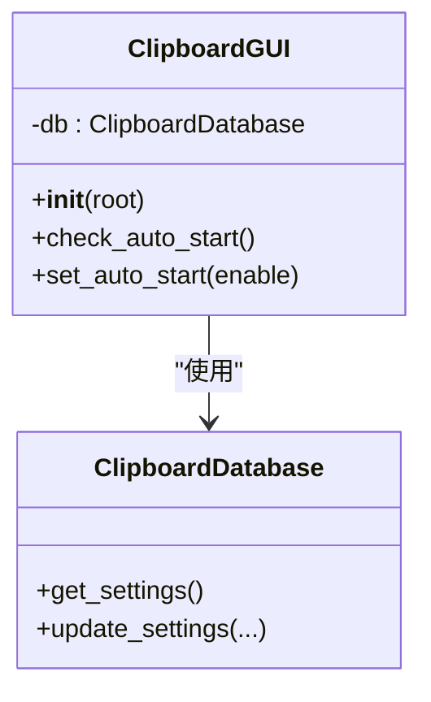
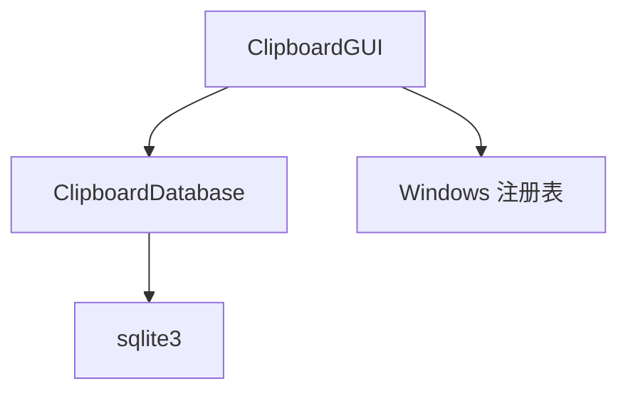

# 开机自启状态检查

<cite>
**本文引用的文件**
- [clipboard_gui.py](file://clipboard_gui.py)
- [clipboard_db.py](file://clipboard_db.py)
</cite>

## 目录
1. [简介](#简介)
2. [项目结构](#项目结构)
3. [核心组件](#核心组件)
4. [架构概览](#架构概览)
5. [详细组件分析](#详细组件分析)
6. [依赖分析](#依赖分析)
7. [性能考虑](#性能考虑)
8. [故障排查指南](#故障排查指南)
9. [结论](#结论)

## 简介
本文围绕 GUI 初始化流程中的“开机自启状态检查”展开，详细说明 check_auto_start 方法如何在 GUI 初始化时从数据库读取 auto_start 设置项，并根据其布尔值决定是否调用 set_auto_start 进行系统注册表配置。同时，本文解释该方法的异常处理机制（数据库访问失败时的日志输出与容错），并结合代码示例展示其在 __init__ 流程中的调用时机以及与数据库连接等组件的依赖关系。

## 项目结构
本仓库包含多个与剪贴板历史记录相关的模块，其中与“开机自启状态检查”直接相关的核心文件为：
- clipboard_gui.py：GUI 主体，负责初始化界面、读取设置、执行开机自启配置。
- clipboard_db.py：数据库封装，提供设置读取与更新能力。

图表来源
- [clipboard_gui.py](file://clipboard_gui.py#L37-L80)
- [clipboard_db.py](file://clipboard_db.py#L359-L412)

章节来源
- [clipboard_gui.py](file://clipboard_gui.py#L37-L80)
- [clipboard_db.py](file://clipboard_db.py#L359-L412)

## 核心组件
- ClipboardGUI：GUI 主类，负责初始化、界面构建、设置加载与开机自启配置。
- ClipboardDatabase：数据库封装，提供 get_settings/update_settings 等接口，内部维护 settings 表及 auto_start 字段。

章节来源
- [clipboard_gui.py](file://clipboard_gui.py#L37-L80)
- [clipboard_db.py](file://clipboard_db.py#L359-L412)

## 架构概览
GUI 初始化流程中，check_auto_start 在 __init__ 的早期阶段被调用，用于读取数据库中的 auto_start 设置并据此配置系统注册表。该流程与数据库连接、注册表操作紧密耦合，且通过 try-except 实现异常捕获与容错。

图表来源
- [clipboard_gui.py](file://clipboard_gui.py#L37-L80)
- [clipboard_gui.py](file://clipboard_gui.py#L89-L97)
- [clipboard_gui.py](file://clipboard_gui.py#L1131-L1163)
- [clipboard_db.py](file://clipboard_db.py#L359-L412)

## 详细组件分析

### check_auto_start 方法：从数据库读取 auto_start 并配置注册表
- 调用时机：在 GUI 初始化的早期阶段，位于 UI 构建之后、其他初始化步骤之前。
- 数据来源：通过 self.db.get_settings() 从 settings 表读取 auto_start 字段。
- 决策逻辑：当 settings['auto_start'] 为真时，调用 self.set_auto_start(True)。
- 异常处理：对数据库读取与注册表写入分别包裹 try-except，发生异常时打印错误信息并继续执行后续流程，保证 GUI 初始化的健壮性。

图表来源
- [clipboard_gui.py](file://clipboard_gui.py#L89-L97)
- [clipboard_gui.py](file://clipboard_gui.py#L1131-L1163)
- [clipboard_db.py](file://clipboard_db.py#L359-L412)

章节来源
- [clipboard_gui.py](file://clipboard_gui.py#L37-L80)
- [clipboard_gui.py](file://clipboard_gui.py#L89-L97)
- [clipboard_gui.py](file://clipboard_gui.py#L1131-L1163)
- [clipboard_db.py](file://clipboard_db.py#L359-L412)

### set_auto_start 方法：系统注册表配置
- 功能：根据 enable 参数向 Windows 注册表 HKCU\Software\Microsoft\Windows\CurrentVersion\Run 写入或删除程序路径，实现开机自启控制。
- 路径获取：优先使用可执行文件路径（打包后为 sys.executable，开发态为当前脚本绝对路径）。
- 异常处理：对注册表操作包裹 try-except；删除值时若键不存在会捕获 FileNotFoundError 并忽略，避免影响整体流程。

图表来源
- [clipboard_gui.py](file://clipboard_gui.py#L1131-L1163)

章节来源
- [clipboard_gui.py](file://clipboard_gui.py#L1131-L1163)

### GUI 初始化中的调用时机与依赖关系
- 调用时机：在 GUI.__init__ 中，UI 构建完成后立即调用 self.check_auto_start()，随后才进行悬浮图标检查、定时任务启动等后续步骤。
- 依赖关系：
  - 依赖 ClipboardDatabase 实例（self.db），用于读取 settings。
  - 依赖 Windows 注册表（通过 winreg 模块），用于实际配置开机自启。
  - 与 tkinter GUI 生命周期绑定，异常不影响主窗口显示。

图表来源
- [clipboard_gui.py](file://clipboard_gui.py#L37-L80)
- [clipboard_gui.py](file://clipboard_gui.py#L89-L97)
- [clipboard_gui.py](file://clipboard_gui.py#L1131-L1163)
- [clipboard_db.py](file://clipboard_db.py#L359-L412)

章节来源
- [clipboard_gui.py](file://clipboard_gui.py#L37-L80)
- [clipboard_gui.py](file://clipboard_gui.py#L89-L97)
- [clipboard_gui.py](file://clipboard_gui.py#L1131-L1163)
- [clipboard_db.py](file://clipboard_db.py#L359-L412)

## 依赖分析
- 组件耦合：
  - ClipboardGUI 与 ClipboardDatabase 通过 get_settings 接口耦合，读取 auto_start 字段。
  - ClipboardGUI 与 Windows 注册表通过 set_auto_start 直接耦合，实现开机自启配置。
- 外部依赖：
  - Python 标准库：sqlite3（数据库）、winreg（注册表）、os/sys（路径）。
  - 第三方库：PIL/pystray（可选，用于托盘图标，不影响开机自启逻辑）。

图表来源
- [clipboard_gui.py](file://clipboard_gui.py#L37-L80)
- [clipboard_gui.py](file://clipboard_gui.py#L89-L97)
- [clipboard_gui.py](file://clipboard_gui.py#L1131-L1163)
- [clipboard_db.py](file://clipboard_db.py#L359-L412)

章节来源
- [clipboard_gui.py](file://clipboard_gui.py#L37-L80)
- [clipboard_gui.py](file://clipboard_gui.py#L89-L97)
- [clipboard_gui.py](file://clipboard_gui.py#L1131-L1163)
- [clipboard_db.py](file://clipboard_db.py#L359-L412)

## 性能考虑
- 数据库访问：check_auto_start 仅在 GUI 初始化时进行一次轻量级查询，开销极低。
- 注册表操作：set_auto_start 为一次性写入/删除，对启动时延影响可忽略。
- 异常分支：异常处理采用快速失败与日志输出，避免阻塞 GUI 初始化主线程。

[本节为通用建议，不涉及具体文件分析]

## 故障排查指南
- 数据库访问失败：
  - 现象：check_auto_start 抛出异常并打印错误日志，但 GUI 仍可正常显示。
  - 排查：确认数据库文件是否存在、权限是否足够、SQLite 连接是否可用。
- 注册表写入失败：
  - 现象：set_auto_start 抛出异常并打印错误日志，开机自启未生效。
  - 排查：确认运行权限（需 HKCU 写权限）、键路径正确、目标值未被策略禁用。
- 设置项缺失：
  - 现象：首次运行或旧版本数据库缺少 auto_start 字段。
  - 排查：确认数据库初始化逻辑已添加 auto_start 字段；若缺失，可手动迁移或重新初始化。

章节来源
- [clipboard_gui.py](file://clipboard_gui.py#L89-L97)
- [clipboard_gui.py](file://clipboard_gui.py#L1131-L1163)
- [clipboard_db.py](file://clipboard_db.py#L359-L412)

## 结论
check_auto_start 方法在 GUI 初始化早期读取数据库中的 auto_start 设置，并依据布尔值调用 set_auto_start 完成系统注册表配置。其异常处理机制通过 try-except 捕获数据库与注册表操作中的错误，打印日志并继续执行后续初始化步骤，确保 GUI 的稳定性与可用性。该流程体现了清晰的职责分离与良好的容错设计，适合在生产环境中稳定运行。