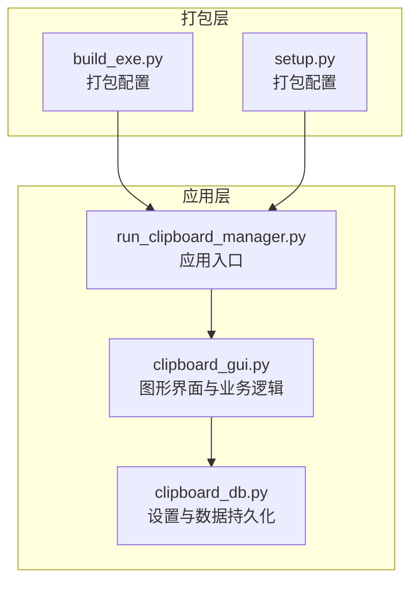
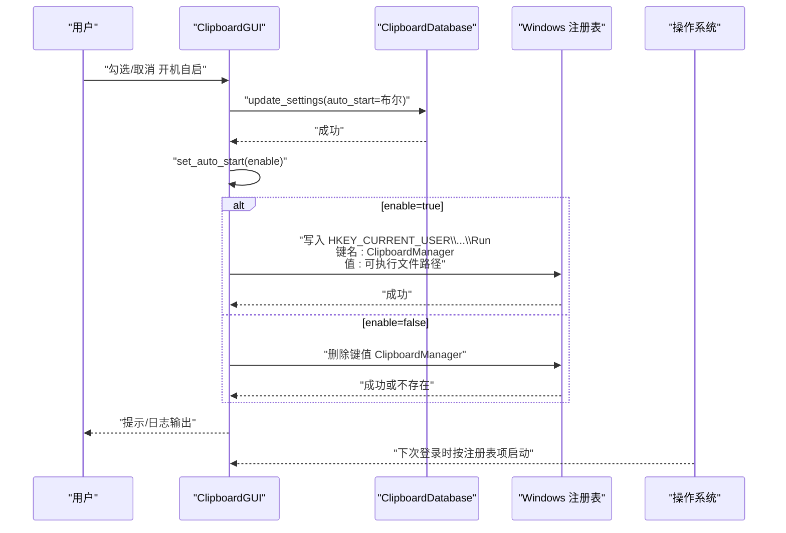
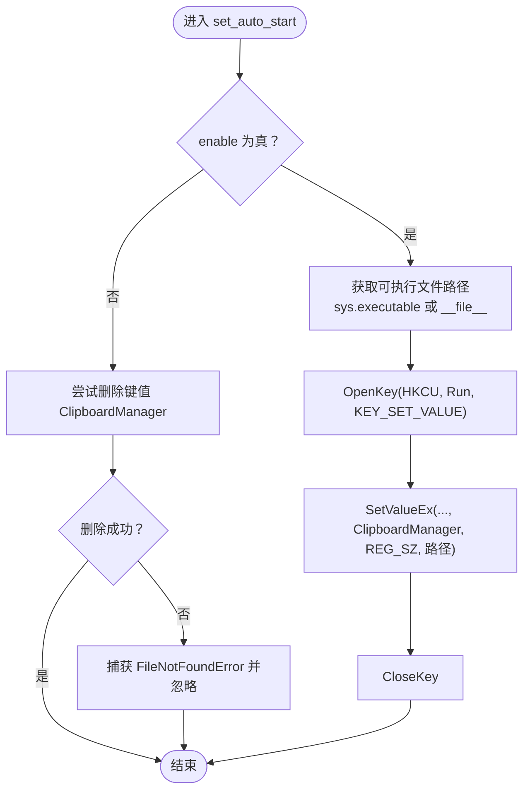
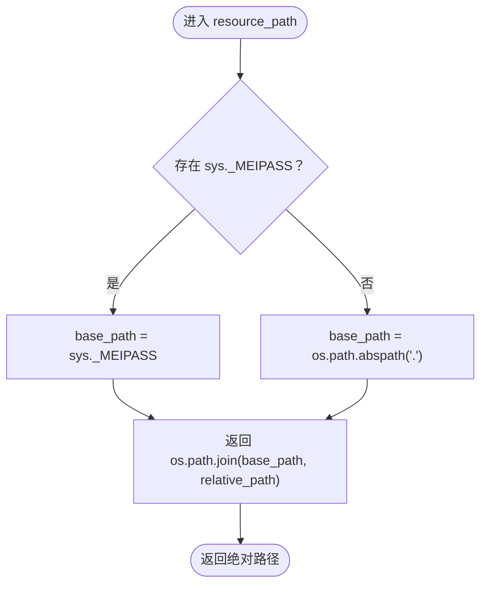
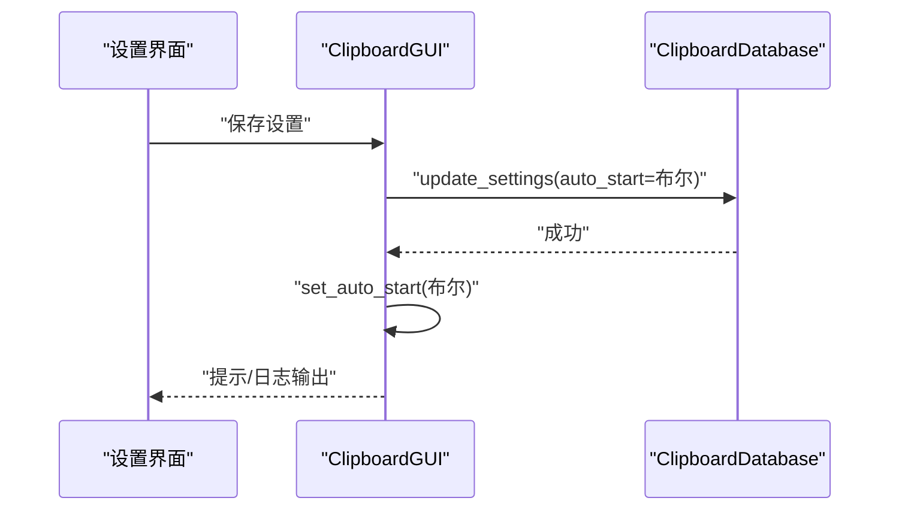
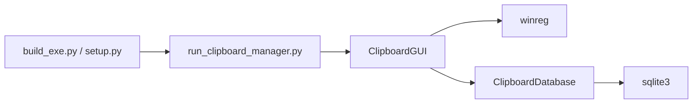

# 注册表操作实现

<cite>
**本文引用的文件**
- [clipboard_gui.py](file://clipboard_gui.py)
- [clipboard_db.py](file://clipboard_db.py)
- [run_clipboard_manager.py](file://run_clipboard_manager.py)
- [build_exe.py](file://build_exe.py)
- [setup.py](file://setup.py)
</cite>

## 目录
1. [简介](#简介)
2. [项目结构](#项目结构)
3. [核心组件](#核心组件)
4. [架构总览](#架构总览)
5. [详细组件分析](#详细组件分析)
6. [依赖关系分析](#依赖关系分析)
7. [性能考量](#性能考量)
8. [故障排查指南](#故障排查指南)
9. [结论](#结论)

## 简介
本文件围绕 Windows 系统中通过 Python 的 winreg 模块操作 HKEY_CURRENT_USER 下的“开机自启”注册表项进行深入解析，重点说明：
- 如何在打包前后正确获取可执行文件路径；
- 如何构造注册表键值实现开机自启；
- 添加与删除启动项的完整流程；
- 权限检查与异常处理策略；
- 用户提示与交互机制。

同时补充说明 resource_path 函数在打包后定位资源文件的作用，以及与注册表自启实现的关系。

## 项目结构
本仓库包含多个脚本文件，其中与注册表自启直接相关的核心文件如下：
- clipboard_gui.py：图形界面与业务逻辑，包含 set_auto_start 方法与 resource_path 辅助函数；
- clipboard_db.py：数据库设置表，提供 auto_start 字段的持久化；
- run_clipboard_manager.py：应用入口，负责进程互斥与 GUI 启动；
- build_exe.py / setup.py：打包配置，决定最终可执行文件的产物与图标等资源。

图表来源
- [clipboard_gui.py](file://clipboard_gui.py#L1131-L1163)
- [clipboard_db.py](file://clipboard_db.py#L359-L412)
- [run_clipboard_manager.py](file://run_clipboard_manager.py#L32-L66)
- [build_exe.py](file://build_exe.py#L51-L81)
- [setup.py](file://setup.py#L56-L84)

章节来源
- [clipboard_gui.py](file://clipboard_gui.py#L1131-L1163)
- [clipboard_db.py](file://clipboard_db.py#L359-L412)
- [run_clipboard_manager.py](file://run_clipboard_manager.py#L32-L66)
- [build_exe.py](file://build_exe.py#L51-L81)
- [setup.py](file://setup.py#L56-L84)

## 核心组件
- 注册表自启实现（set_auto_start）：在 Windows 中向 HKEY_CURRENT_USER\Software\Microsoft\Windows\CurrentVersion\Run 写入或删除名为“ClipboardManager”的字符串值，值为当前可执行文件路径。
- 资源路径解析（resource_path）：在打包后通过 sys._MEIPASS 获取临时解压目录，拼接相对路径返回绝对路径，用于加载打包内的资源文件（如图标、图片）。
- 设置持久化（settings 表）：通过 SQLite 的 settings 表存储 auto_start 等配置，应用启动时读取并应用。

章节来源
- [clipboard_gui.py](file://clipboard_gui.py#L1131-L1163)
- [clipboard_gui.py](file://clipboard_gui.py#L27-L36)
- [clipboard_db.py](file://clipboard_db.py#L359-L412)

## 架构总览
下图展示“开机自启”功能在应用生命周期中的调用链路与关键节点。

图表来源
- [clipboard_gui.py](file://clipboard_gui.py#L507-L530)
- [clipboard_gui.py](file://clipboard_gui.py#L1131-L1163)
- [clipboard_db.py](file://clipboard_db.py#L387-L412)

## 详细组件分析

### 组件A：注册表自启实现（set_auto_start）
- 功能概述
  - 添加开机自启：向 HKEY_CURRENT_USER 下的 CurrentVersion\Run 写入键值 ClipboardManager，值为当前可执行文件路径。
  - 删除开机自启：尝试删除该键值，若不存在则忽略异常。
- 关键点
  - 使用 winreg 模块进行注册表操作；
  - 通过 sys.executable 或 __file__ 获取当前可执行文件路径；
  - 异常捕获：外层 try-except 捕获通用异常，内部对键值不存在的情况进行 FileNotFoundError 捕获并忽略；
  - 未显式检查管理员权限，但 Windows 当前用户下的注册表项通常无需管理员权限即可写入。

图表来源
- [clipboard_gui.py](file://clipboard_gui.py#L1131-L1163)

章节来源
- [clipboard_gui.py](file://clipboard_gui.py#L1131-L1163)

### 组件B：资源路径解析（resource_path）
- 功能概述
  - 在打包后通过 sys._MEIPASS 获取临时解压目录，拼接相对路径返回绝对路径；
  - 若非打包环境（开发态），则基于当前工作目录拼接。
- 与自启的关系
  - 虽然 resource_path 主要用于加载图标、图片等资源，但在打包后，可执行文件路径同样由 sys.executable 提供，二者都依赖打包工具的运行时机制；
  - 两者共同保证了在不同运行环境下都能正确找到目标可执行文件或资源文件。

图表来源
- [clipboard_gui.py](file://clipboard_gui.py#L27-L36)

章节来源
- [clipboard_gui.py](file://clipboard_gui.py#L27-L36)

### 组件C：设置持久化与应用（settings 表）
- 功能概述
  - settings 表包含 auto_start 字段，应用启动时读取该字段并调用 set_auto_start；
  - 用户在设置界面勾选后，保存设置会更新数据库并立即应用注册表变更。
- 关键点
  - 保存设置时调用 update_settings 更新 auto_start；
  - 保存后立即调用 set_auto_start 应用变更；
  - 若用户取消勾选，保存后同样调用 set_auto_start(false) 删除注册表项。

图表来源
- [clipboard_gui.py](file://clipboard_gui.py#L507-L530)
- [clipboard_db.py](file://clipboard_db.py#L387-L412)

章节来源
- [clipboard_gui.py](file://clipboard_gui.py#L507-L530)
- [clipboard_db.py](file://clipboard_db.py#L359-L412)

### 组件D：应用入口与进程互斥
- 功能概述
  - run_clipboard_manager.py 负责进程互斥（避免重复运行）、启动 GUI、隐藏主窗口并显示系统托盘；
  - 与自启配合：当用户勾选开机自启后，系统会在登录时按注册表项启动该可执行文件，随后由入口脚本负责互斥与 GUI 初始化。
- 与自启的关系
  - 自启项指向的可执行文件即为打包后的目标程序；
  - 入口脚本确保同一时刻只有一个实例运行。

章节来源
- [run_clipboard_manager.py](file://run_clipboard_manager.py#L17-L46)
- [run_clipboard_manager.py](file://run_clipboard_manager.py#L55-L66)

### 组件E：打包配置与产物
- 功能概述
  - build_exe.py 与 setup.py 定义了可执行文件的构建规则、包含的模块与资源文件；
  - 产物包括“剪贴板管理器.exe”等，这些可执行文件将作为注册表自启项的目标。
- 与自启的关系
  - 注册表项写入的值为可执行文件路径，打包配置决定了最终产物的名称与图标等；
  - 通过 base="Win32GUI"（在 Windows 上）确保 GUI 应用的外观与行为。

章节来源
- [build_exe.py](file://build_exe.py#L51-L81)
- [setup.py](file://setup.py#L56-L84)

## 依赖关系分析
- 组件耦合
  - ClipboardGUI 依赖 ClipboardDatabase 进行设置读写；
  - ClipboardGUI 直接依赖 winreg 模块进行注册表操作；
  - run_clipboard_manager.py 依赖 ClipboardGUI 进行 GUI 初始化；
  - 打包配置影响最终可执行文件路径，间接影响注册表项的值。
- 外部依赖
  - winreg：Windows 注册表访问；
  - sys、os：运行时路径与环境判断；
  - sqlite3：settings 表持久化。

图表来源
- [clipboard_gui.py](file://clipboard_gui.py#L1131-L1163)
- [clipboard_db.py](file://clipboard_db.py#L359-L412)
- [run_clipboard_manager.py](file://run_clipboard_manager.py#L32-L66)
- [build_exe.py](file://build_exe.py#L51-L81)
- [setup.py](file://setup.py#L56-L84)

章节来源
- [clipboard_gui.py](file://clipboard_gui.py#L1131-L1163)
- [clipboard_db.py](file://clipboard_db.py#L359-L412)
- [run_clipboard_manager.py](file://run_clipboard_manager.py#L32-L66)
- [build_exe.py](file://build_exe.py#L51-L81)
- [setup.py](file://setup.py#L56-L84)

## 性能考量
- 注册表操作开销极小，属于一次性写入/删除，对启动性能影响可忽略；
- resource_path 在打包后通过 sys._MEIPASS 快速定位资源，避免磁盘扫描；
- settings 表读写为轻量级 SQLite 操作，不会成为瓶颈。

## 故障排查指南
- 权限不足
  - 现状：未显式检查管理员权限，但写入 HKEY_CURRENT_USER 通常无需管理员权限；
  - 建议：若遇到写入失败，可在外层捕获异常并提示用户以管理员身份运行或检查 UAC 设置。
- 键值不存在
  - 现状：删除时捕获 FileNotFoundError 并忽略；
  - 建议：可在日志中记录“键值不存在”情况，便于诊断。
- 路径不正确
  - 现状：通过 sys.executable 或 __file__ 获取路径；
  - 建议：在调试模式下打印路径，确认打包后路径是否正确。
- 用户提示
  - 现状：set_auto_start 内部使用 print 输出错误信息；
  - 建议：结合 GUI 的消息框（如 messagebox）向用户反馈成功或失败原因。

章节来源
- [clipboard_gui.py](file://clipboard_gui.py#L1131-L1163)

## 结论
- 本项目通过 winreg 模块在 HKEY_CURRENT_USER 下的 Run 项写入/删除键值，实现了开机自启功能；
- 通过 resource_path 与 sys.executable 的配合，确保在打包前后均能正确解析目标可执行文件路径；
- 设置持久化与即时应用的流程清晰，用户在设置界面勾选后即可立即生效；
- 建议在生产环境中增强异常提示与权限检查，提升用户体验与稳定性。