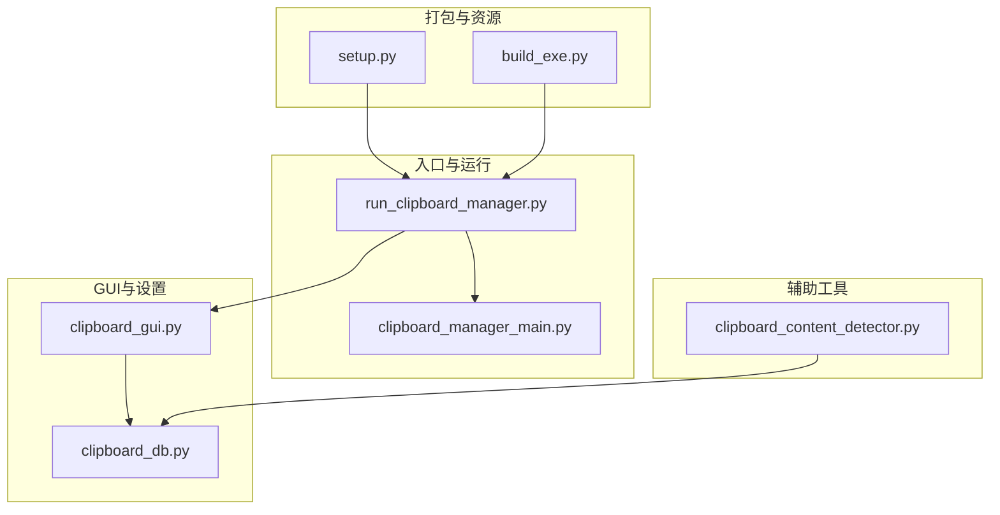
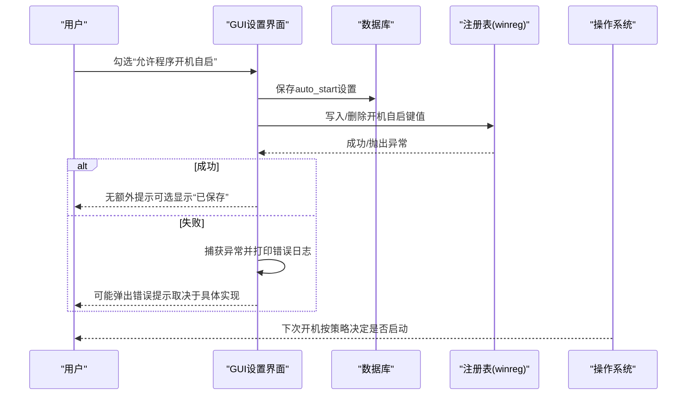
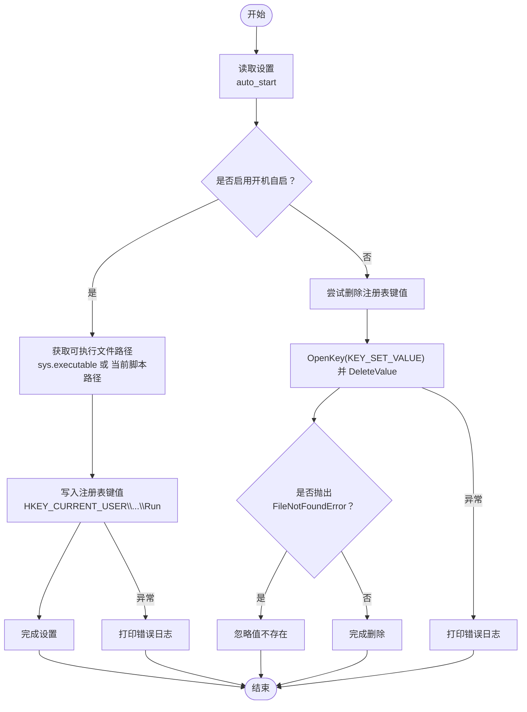
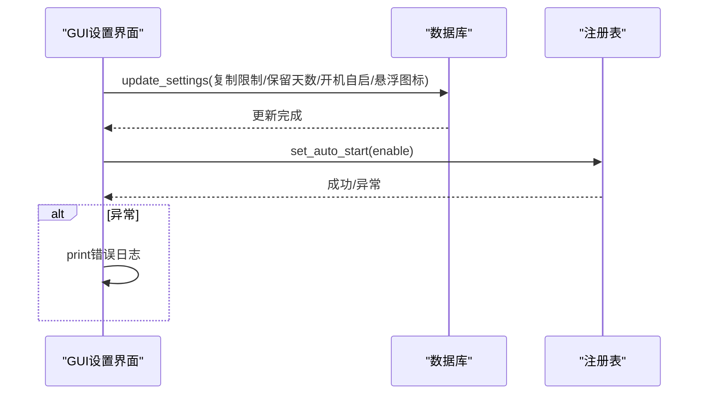
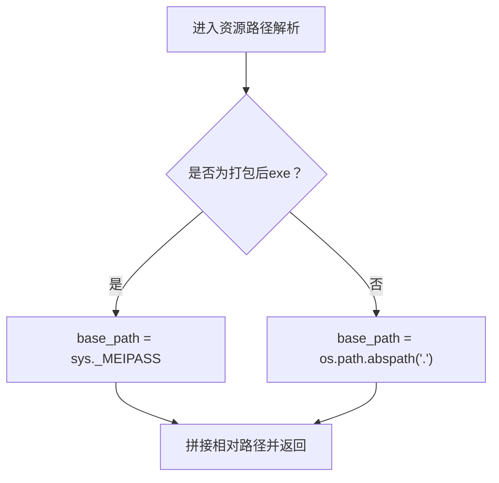
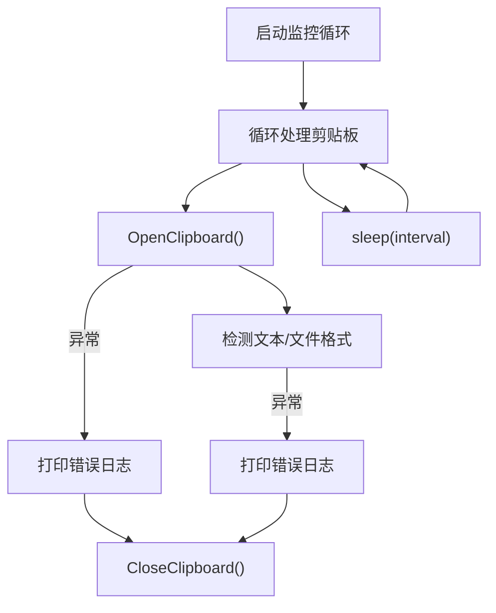
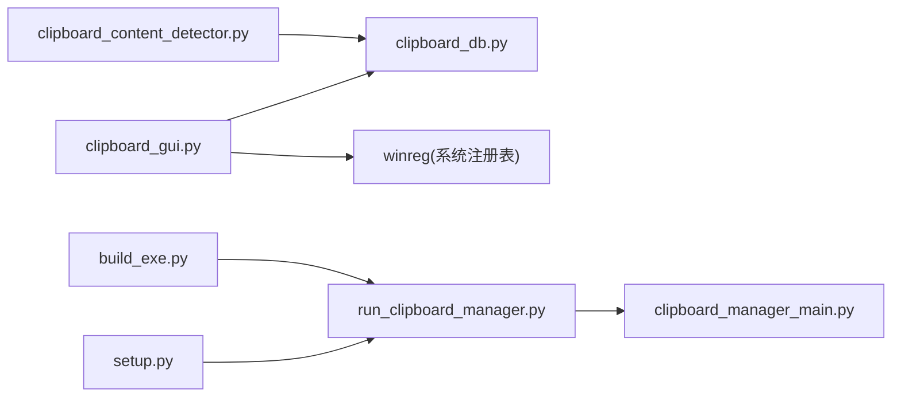

# 错误处理与用户反馈

<cite>
**本文引用的文件**
- [clipboard_manager_main.py](file://clipboard_manager_main.py)
- [clipboard_gui.py](file://clipboard_gui.py)
- [clipboard_db.py](file://clipboard_db.py)
- [run_clipboard_manager.py](file://run_clipboard_manager.py)
- [setup.py](file://setup.py)
- [build_exe.py](file://build_exe.py)
- [clipboard_content_detector.py](file://clipboard_content_detector.py)
</cite>

## 目录
1. [简介](#简介)
2. [项目结构](#项目结构)
3. [核心组件](#核心组件)
4. [架构总览](#架构总览)
5. [详细组件分析](#详细组件分析)
6. [依赖关系分析](#依赖关系分析)
7. [性能考量](#性能考量)
8. [故障排查指南](#故障排查指南)
9. [结论](#结论)

## 简介
本文件聚焦于系统化文档化“开机自启”功能中的错误处理流程，重点覆盖以下方面：
- 注册表操作失败（如权限不足、系统策略限制）时的异常捕获机制
- 程序通过print日志输出错误信息
- GUI层面提供用户可感知的反馈（弹窗提示、界面状态提示）
- 实际错误场景示例：PyInstaller打包后路径解析失败、普通用户权限无法修改注册表等

目标是帮助开发者与最终用户理解错误发生时的行为与修复建议。

## 项目结构
该项目由多个模块组成，围绕剪贴板监控、GUI展示、数据库持久化以及打包配置展开。与“开机自启”相关的逻辑主要集中在GUI模块与打包配置中。

图表来源
- [run_clipboard_manager.py](file://run_clipboard_manager.py#L1-L71)
- [clipboard_gui.py](file://clipboard_gui.py#L1-L200)
- [clipboard_db.py](file://clipboard_db.py#L1-L120)
- [setup.py](file://setup.py#L1-L84)
- [build_exe.py](file://build_exe.py#L1-L59)
- [clipboard_content_detector.py](file://clipboard_content_detector.py#L1-L120)

章节来源
- [run_clipboard_manager.py](file://run_clipboard_manager.py#L1-L71)
- [clipboard_gui.py](file://clipboard_gui.py#L1-L200)
- [clipboard_db.py](file://clipboard_db.py#L1-L120)
- [setup.py](file://setup.py#L1-L84)
- [build_exe.py](file://build_exe.py#L1-L59)
- [clipboard_content_detector.py](file://clipboard_content_detector.py#L1-L120)

## 核心组件
- GUI设置界面与开机自启开关：负责读取/写入设置、调用注册表操作、在GUI中展示提示
- 注册表操作封装：封装HKEY_CURRENT_USER下的开机自启键值设置/删除
- 打包与资源路径：PyInstaller打包后资源路径解析、图标与数据库文件包含
- 日志输出：统一使用print输出错误信息，便于控制台与日志收集
- 异常捕获：广泛采用try/except包裹关键操作，避免崩溃并输出错误信息

章节来源
- [clipboard_gui.py](file://clipboard_gui.py#L1030-L1168)
- [clipboard_db.py](file://clipboard_db.py#L360-L412)
- [setup.py](file://setup.py#L1-L84)
- [build_exe.py](file://build_exe.py#L1-L59)

## 架构总览
开机自启功能涉及的关键交互如下：
- 用户在GUI设置页勾选“允许程序开机自启”
- 程序保存设置到数据库
- 程序调用注册表操作，向HKEY_CURRENT_USER\Software\Microsoft\Windows\CurrentVersion\Run写入或删除键值
- 若注册表操作失败，程序打印错误日志；若用户可见，可通过消息框提示（部分场景）

图表来源
- [clipboard_gui.py](file://clipboard_gui.py#L1030-L1168)
- [clipboard_db.py](file://clipboard_db.py#L387-L412)

## 详细组件分析

### 组件A：开机自启设置与注册表操作
- 功能职责
  - 读取/更新设置项auto_start
  - 通过winreg对HKEY_CURRENT_USER写入或删除开机自启键值
  - 在保存设置时调用set_auto_start
- 关键点
  - 路径解析：区分打包后exe与源码路径，使用sys.executable或当前脚本路径
  - 权限范围：HKEY_CURRENT_USER仅影响当前用户，不受域策略影响较小
  - 异常处理：捕获异常并打印错误日志；删除不存在的值时捕获FileNotFoundError并忽略
  - GUI反馈：保存成功时可能弹出提示；失败时也应考虑弹窗提示（当前实现以print为主）

图表来源
- [clipboard_gui.py](file://clipboard_gui.py#L1131-L1168)

章节来源
- [clipboard_gui.py](file://clipboard_gui.py#L1030-L1168)

### 组件B：设置保存与数据库更新
- 功能职责
  - 保存复制限制、保留天数、开机自启、悬浮图标等设置
  - 调用数据库更新接口，必要时触发过期记录清理
- 错误处理
  - 数值校验失败时弹出错误提示
  - 注册表设置失败时打印错误日志（由set_auto_start负责）

图表来源
- [clipboard_gui.py](file://clipboard_gui.py#L1044-L1130)
- [clipboard_db.py](file://clipboard_db.py#L387-L412)

章节来源
- [clipboard_gui.py](file://clipboard_gui.py#L1044-L1130)
- [clipboard_db.py](file://clipboard_db.py#L387-L412)

### 组件C：打包与资源路径（PyInstaller）
- 资源路径解析
  - 使用sys._MEIPASS定位打包后临时目录
  - fallback至os.path.abspath(".")，保证开发环境可用
- 打包配置
  - 包含图标与数据库文件
  - 包含必要的包与模块，确保运行时可用

图表来源
- [clipboard_gui.py](file://clipboard_gui.py#L27-L36)
- [setup.py](file://setup.py#L1-L84)
- [build_exe.py](file://build_exe.py#L1-L59)

章节来源
- [clipboard_gui.py](file://clipboard_gui.py#L27-L36)
- [setup.py](file://setup.py#L1-L84)
- [build_exe.py](file://build_exe.py#L1-L59)

### 组件D：剪贴板监控与通用错误处理
- 监控循环
  - 启动提示、键盘中断优雅退出
- 通用错误处理
  - 访问剪贴板时的异常捕获与日志输出
  - 文件/文本处理过程中的异常捕获与日志输出

图表来源
- [clipboard_manager_main.py](file://clipboard_manager_main.py#L395-L496)

章节来源
- [clipboard_manager_main.py](file://clipboard_manager_main.py#L395-L496)

### 组件E：运行器与进程互斥
- 进程互斥
  - 使用CreateMutex避免重复启动
  - 已运行时尝试激活已有窗口
- 错误处理
  - 互斥检查异常时打印日志并返回False

图表来源
- [run_clipboard_manager.py](file://run_clipboard_manager.py#L17-L47)

章节来源
- [run_clipboard_manager.py](file://run_clipboard_manager.py#L17-L47)

## 依赖关系分析
- GUI设置界面依赖数据库模块进行设置读写
- 注册表操作依赖winreg模块
- 打包配置依赖cx_Freeze，包含图标与数据库文件
- 剪贴板监控与GUI运行器相互独立但共同构成系统

图表来源
- [clipboard_gui.py](file://clipboard_gui.py#L1-L120)
- [clipboard_db.py](file://clipboard_db.py#L1-L120)
- [setup.py](file://setup.py#L1-L84)
- [build_exe.py](file://build_exe.py#L1-L59)
- [run_clipboard_manager.py](file://run_clipboard_manager.py#L1-L71)
- [clipboard_manager_main.py](file://clipboard_manager_main.py#L1-L120)
- [clipboard_content_detector.py](file://clipboard_content_detector.py#L1-L120)

章节来源
- [clipboard_gui.py](file://clipboard_gui.py#L1-L120)
- [clipboard_db.py](file://clipboard_db.py#L1-L120)
- [setup.py](file://setup.py#L1-L84)
- [build_exe.py](file://build_exe.py#L1-L59)
- [run_clipboard_manager.py](file://run_clipboard_manager.py#L1-L71)
- [clipboard_manager_main.py](file://clipboard_manager_main.py#L1-L120)
- [clipboard_content_detector.py](file://clipboard_content_detector.py#L1-L120)

## 性能考量
- 注册表操作为轻量级I/O，频繁调用成本低
- 打包后资源路径解析仅在首次使用时发生，开销可忽略
- 剪贴板监控循环sleep等待，CPU占用极低
- 数据库操作在设置保存时触发，频率较低

## 故障排查指南

### 场景一：权限不足导致注册表写入失败
- 现象
  - 勾选“允许程序开机自启”后未生效
  - 控制台出现错误日志
- 原因
  - 当前用户策略限制或安全软件拦截
  - HKEY_LOCAL_MACHINE需要管理员权限（本项目使用HKEY_CURRENT_USER，普通用户通常可写）
- 处理建议
  - 切换到管理员账户或提升权限后重试
  - 检查企业策略或安全软件白名单
  - 手动在注册表编辑器中添加键值（HKEY_CURRENT_USER\Software\Microsoft\Windows\CurrentVersion\Run），键名为“ClipboardManager”，值为可执行文件路径
- 相关实现参考
  - [clipboard_gui.py](file://clipboard_gui.py#L1131-L1168)

章节来源
- [clipboard_gui.py](file://clipboard_gui.py#L1131-L1168)

### 场景二：PyInstaller打包后路径解析失败
- 现象
  - 图标或资源文件无法加载
  - GUI启动后缺少图标或悬浮图标不可用
- 原因
  - sys._MEIPASS未正确识别或资源文件未包含
- 处理建议
  - 确认打包配置中包含所需资源文件
  - 使用resource_path函数获取资源绝对路径
  - 检查打包命令与include_files配置
- 相关实现参考
  - [clipboard_gui.py](file://clipboard_gui.py#L27-L36)
  - [setup.py](file://setup.py#L1-L84)
  - [build_exe.py](file://build_exe.py#L1-L59)

章节来源
- [clipboard_gui.py](file://clipboard_gui.py#L27-L36)
- [setup.py](file://setup.py#L1-L84)
- [build_exe.py](file://build_exe.py#L1-L59)

### 场景三：普通用户无法修改注册表
- 现象
  - 注册表操作抛出异常，控制台打印错误日志
- 原因
  - 当前用户策略限制或安全软件阻止
- 处理建议
  - 使用管理员权限运行
  - 检查组策略或终端服务策略
  - 手动在注册表中添加/删除键值
- 相关实现参考
  - [clipboard_gui.py](file://clipboard_gui.py#L1131-L1168)

章节来源
- [clipboard_gui.py](file://clipboard_gui.py#L1131-L1168)

### 场景四：重复启动被阻断
- 现象
  - 再次启动时提示已在运行并激活已有窗口
- 原因
  - 进程互斥锁检测到已运行实例
- 处理建议
  - 无需额外操作，系统会激活已有实例
- 相关实现参考
  - [run_clipboard_manager.py](file://run_clipboard_manager.py#L17-L47)

章节来源
- [run_clipboard_manager.py](file://run_clipboard_manager.py#L17-L47)

### 场景五：剪贴板访问异常
- 现象
  - 访问剪贴板时出现异常日志
- 原因
  - 剪贴板被其他进程占用或权限问题
- 处理建议
  - 等待其他进程释放剪贴板后重试
  - 重启程序或系统
- 相关实现参考
  - [clipboard_manager_main.py](file://clipboard_manager_main.py#L395-L496)

章节来源
- [clipboard_manager_main.py](file://clipboard_manager_main.py#L395-L496)

## 结论
- 本项目的开机自启功能通过GUI设置与注册表操作实现，具备完善的异常捕获与日志输出机制
- 注册表操作针对HKEY_CURRENT_USER，普通用户通常可直接修改；若失败，程序会打印错误日志
- PyInstaller打包后资源路径解析通过sys._MEIPASS与resource_path函数保障，需确保打包配置包含所需资源
- 建议在失败场景下补充GUI弹窗提示，以提升用户体验；当前实现以print日志为主，便于排查