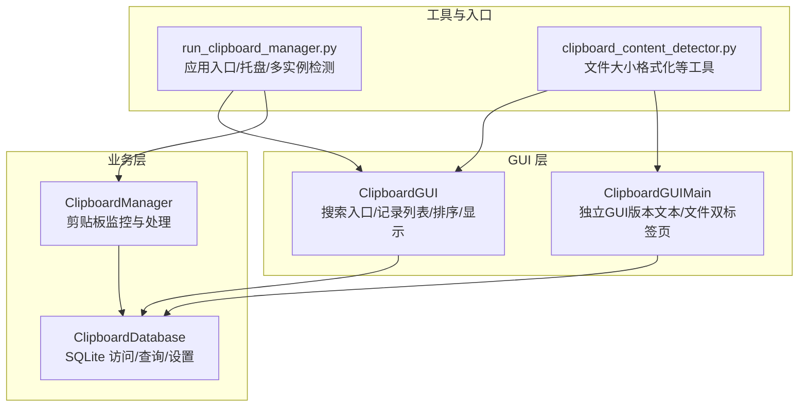
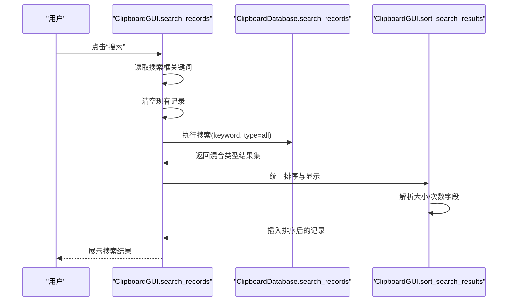
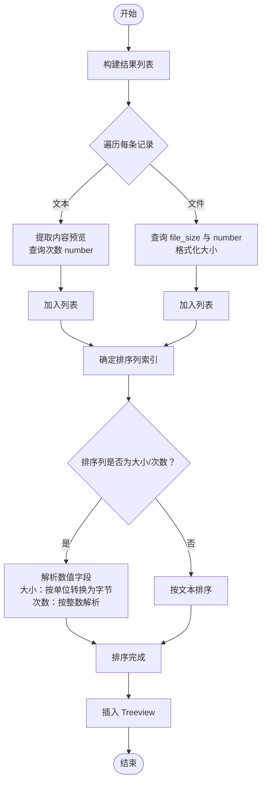
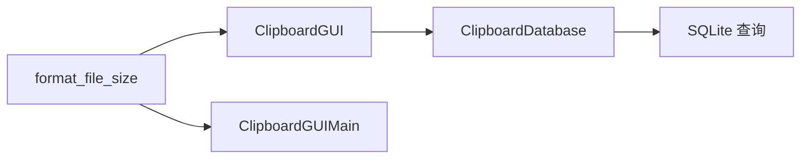

# 搜索功能实现

<cite>
**本文引用的文件**
- [clipboard_gui.py](file://clipboard_gui.py)
- [clipboard_manager_main.py](file://clipboard_manager_main.py)
- [clipboard_db.py](file://clipboard_db.py)
- [clipboard_content_detector.py](file://clipboard_content_detector.py)
- [run_clipboard_manager.py](file://run_clipboard_manager.py)
</cite>

## 目录
1. [简介](#简介)
2. [项目结构](#项目结构)
3. [核心组件](#核心组件)
4. [架构总览](#架构总览)
5. [详细组件分析](#详细组件分析)
6. [依赖关系分析](#依赖关系分析)
7. [性能考量](#性能考量)
8. [故障排查指南](#故障排查指南)
9. [结论](#结论)

## 简介
本文件系统性文档化“搜索记录”方法的完整生命周期，涵盖从搜索入口获取关键词、清空现有记录、调用数据库搜索、对混合类型结果进行统一排序、显示结果等全流程。重点说明：
- 如何通过关键词在文本内容与文件名上执行模糊匹配（LIKE 模式）。
- 如何对混合类型的搜索结果进行统一排序，特别是数值型字段（大小、次数）的特殊解析逻辑。
- 文件大小单位转换（GB/MB/KB/B）在显示与排序中的处理策略。
- 搜索界面与主记录列表之间的切换机制。
- 搜索结果的高亮显示策略（基于现有实现的说明与建议）。

## 项目结构
该项目采用模块化设计，GUI 与业务逻辑分离：
- GUI 层负责用户交互与界面展示，包含搜索入口、记录列表、统计与设置等标签页。
- 数据库层封装 SQLite 访问与查询逻辑，提供搜索、统计、设置等功能。
- 工具与辅助模块提供通用工具函数（如文件大小格式化）。

图表来源
- [clipboard_gui.py](file://clipboard_gui.py#L170-L226)
- [clipboard_manager_main.py](file://clipboard_manager_main.py#L497-L761)
- [clipboard_db.py](file://clipboard_db.py#L280-L314)
- [run_clipboard_manager.py](file://run_clipboard_manager.py#L32-L71)
- [clipboard_content_detector.py](file://clipboard_content_detector.py#L180-L192)

章节来源
- [clipboard_gui.py](file://clipboard_gui.py#L170-L226)
- [clipboard_manager_main.py](file://clipboard_manager_main.py#L497-L761)
- [clipboard_db.py](file://clipboard_db.py#L280-L314)
- [run_clipboard_manager.py](file://run_clipboard_manager.py#L32-L71)
- [clipboard_content_detector.py](file://clipboard_content_detector.py#L180-L192)

## 核心组件
- 搜索入口与生命周期
  - GUI 中的搜索入口位于搜索框架，绑定到搜索按钮，触发 search_records 方法。
  - 该方法会清空现有记录、调用数据库搜索、随后对结果进行统一排序并显示。
- 数据库搜索
  - 支持三种类型：文本、文件、全部（UNION ALL）。使用 LIKE 模糊匹配关键词，分别在文本内容与文件名字段上进行检索。
- 排序与显示
  - 对混合类型结果进行统一排序，数值型字段（大小、次数）采用特殊解析逻辑，非数值字段按文本排序。
  - 文件大小在显示时进行单位转换（GB/MB/KB/B），排序时将字符串大小转换为字节数进行比较。
- 界面切换与高亮
  - 主记录列表与搜索结果在同一 Treeview 上切换显示；当前实现未内置高亮关键词的视觉效果，可通过后续增强实现。

章节来源
- [clipboard_gui.py](file://clipboard_gui.py#L170-L226)
- [clipboard_gui.py](file://clipboard_gui.py#L652-L748)
- [clipboard_db.py](file://clipboard_db.py#L280-L314)

## 架构总览
搜索流程由 GUI 触发，经数据库层完成模糊匹配，再由 GUI 层统一排序与显示。整体调用链如下：

图表来源
- [clipboard_gui.py](file://clipboard_gui.py#L652-L748)
- [clipboard_db.py](file://clipboard_db.py#L280-L314)

## 详细组件分析

### 搜索入口与生命周期（ClipboardGUI.search_records）
- 关键点
  - 从搜索框获取关键词。
  - 清空现有记录（遍历并删除 Treeview 子项）。
  - 调用数据库搜索接口，传入关键词与类型（默认全部）。
  - 调用 sort_search_results 对结果进行统一排序与显示。
- 注意事项
  - 当前未对关键词进行额外清洗或转义，直接拼接为 LIKE 模式。
  - 清空现有记录发生在搜索前，避免与历史记录混杂。

章节来源
- [clipboard_gui.py](file://clipboard_gui.py#L652-L667)

### 数据库搜索（ClipboardDatabase.search_records）
- 关键点
  - 支持 text、file、all 三种类型。
  - 文本搜索在 content 字段使用 LIKE 包含匹配；文件搜索在 filename 字段使用 LIKE 包含匹配。
  - 全部类型使用 UNION ALL 合并两个查询结果，保持时间倒序。
- 性能与限制
  - 使用 LIKE "%keyword%" 会在大表上产生全表扫描，建议在高频场景下考虑建立全文索引或优化策略。

章节来源
- [clipboard_db.py](file://clipboard_db.py#L280-L314)

### 统一排序与显示（ClipboardGUI.sort_search_results）
- 关键点
  - 将混合类型结果统一转换为内部记录元组，包含：名称/内容、类型、大小、时间、次数、标记、ID。
  - 根据当前排序列确定排序索引；当排序列为“大小”或“次数”时，进入数值解析分支。
  - 数值解析逻辑
    - “大小”字段：从第三列字符串解析单位（GB/MB/KB/B），转换为字节数进行比较。
    - “次数”字段：从第五列解析整数。
  - 回退策略：若解析异常，按时间倒序回退。
  - 显示：将排序后的记录插入 Treeview，标签包含记录类型与ID，便于后续查看详情。

图表来源
- [clipboard_gui.py](file://clipboard_gui.py#L668-L748)

章节来源
- [clipboard_gui.py](file://clipboard_gui.py#L668-L748)

### 文件大小单位转换（GB/MB/KB/B）
- 显示阶段
  - 在加载主记录列表与搜索结果展示时，使用统一的格式化函数将字节转换为人类可读的单位（GB/MB/KB/B）。
- 排序阶段
  - 排序时将字符串大小解析为字节数进行数值比较，确保排序正确性。
- 工具函数
  - 该函数在多个模块中复用，保证一致性。

章节来源
- [clipboard_gui.py](file://clipboard_gui.py#L880-L890)
- [clipboard_content_detector.py](file://clipboard_content_detector.py#L180-L192)

### 搜索界面与主记录列表的切换机制
- 切换方式
  - GUI 中的“记录”标签页承载主记录列表与搜索结果的显示，二者共享同一 Treeview。
  - 切换逻辑：清空现有记录 -> 加载/搜索 -> 插入新记录。
- 交互细节
  - 排序列与方向由当前状态决定，搜索结果同样遵循当前排序规则。
  - 双击记录可查看完整内容（文本）或打开文件所在位置（文件）。

章节来源
- [clipboard_gui.py](file://clipboard_gui.py#L581-L626)
- [clipboard_gui.py](file://clipboard_gui.py#L652-L748)

### 搜索结果高亮显示策略
- 现状
  - 当前实现未对关键词在搜索结果中进行高亮显示。
- 建议方案
  - 在显示前对匹配到的内容进行标记（例如在 Treeview 中使用富文本或自定义渲染）。
  - 或者在“查看完整内容”窗口中对关键词进行加粗/着色显示。
  - 若使用第三方控件（如 ttkbootstrap），可利用其提供的富文本能力实现高亮。

[本节为概念性建议，不直接对应具体源码实现]

## 依赖关系分析
- GUI 依赖数据库层提供搜索接口。
- 数据库层依赖 SQLite，使用 LIKE 实现模糊匹配。
- 工具函数（文件大小格式化）在 GUI 与监控模块中复用，保证显示一致性。

图表来源
- [clipboard_gui.py](file://clipboard_gui.py#L652-L748)
- [clipboard_db.py](file://clipboard_db.py#L280-L314)
- [clipboard_content_detector.py](file://clipboard_content_detector.py#L180-L192)

章节来源
- [clipboard_gui.py](file://clipboard_gui.py#L652-L748)
- [clipboard_db.py](file://clipboard_db.py#L280-L314)
- [clipboard_content_detector.py](file://clipboard_content_detector.py#L180-L192)

## 性能考量
- 模糊匹配成本
  - LIKE "%keyword%" 在大表上会产生全表扫描，建议：
    - 为 content 与 filename 建立索引（若业务允许）。
    - 限制搜索范围（如按时间区间过滤）。
- 排序开销
  - 混合类型排序在 Python 层完成，大数据量时应关注内存与 CPU。
- I/O 与连接
  - 排序过程中多次连接数据库查询次数与大小，建议合并查询或使用缓存。

[本节提供通用建议，不直接分析具体文件]

## 故障排查指南
- 搜索无结果
  - 检查关键词是否为空或过短。
  - 确认数据库中是否存在匹配的文本内容或文件名。
- 排序异常
  - 若“大小/次数”字段出现解析错误，将回退到按时间排序。
  - 检查显示的大小字符串格式是否符合预期（GB/MB/KB/B）。
- 文件大小显示不一致
  - 确认使用的格式化函数一致（来自工具模块）。
- 界面卡顿
  - 大数据量搜索时，考虑分页或延迟加载策略。

章节来源
- [clipboard_gui.py](file://clipboard_gui.py#L713-L744)
- [clipboard_content_detector.py](file://clipboard_content_detector.py#L180-L192)

## 结论
本项目的搜索功能以简洁清晰的方式实现了“关键词模糊匹配 + 统一排序 + 显示”的完整闭环。通过将文本与文件两类记录统一转换为内部结构，配合数值型字段的特殊解析与单位转换，确保了排序的准确性与显示的一致性。未来可在高亮显示、索引优化与分页加载等方面进一步增强用户体验与性能表现。