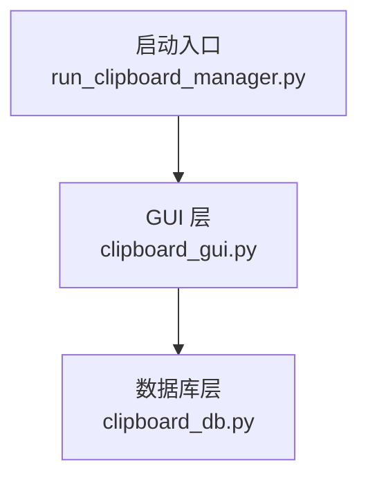
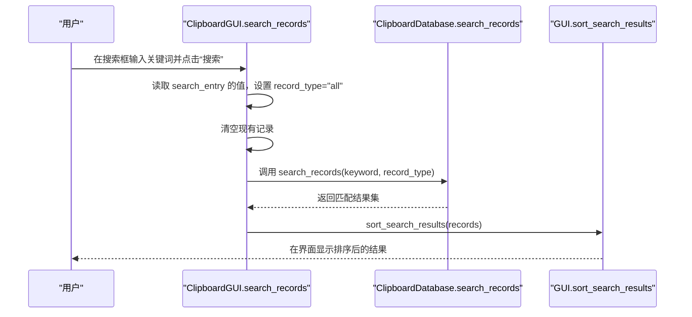
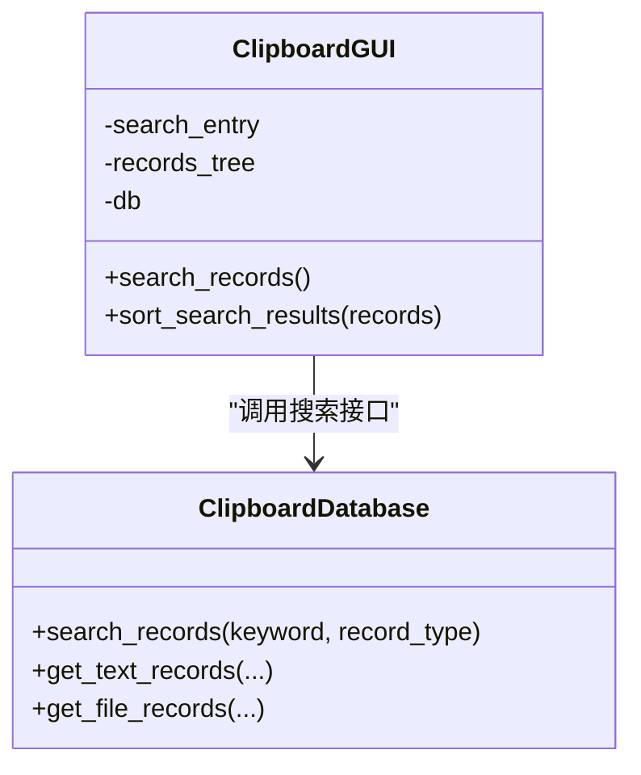

# 搜索查询处理

<cite>
**本文引用的文件**
- [clipboard_gui.py](file://clipboard_gui.py)
- [clipboard_db.py](file://clipboard_db.py)
- [run_clipboard_manager.py](file://run_clipboard_manager.py)
</cite>

## 目录
1. [简介](#简介)
2. [项目结构](#项目结构)
3. [核心组件](#核心组件)
4. [架构总览](#架构总览)
5. [详细组件分析](#详细组件分析)
6. [依赖关系分析](#依赖关系分析)
7. [性能考量](#性能考量)
8. [故障排查指南](#故障排查指南)
9. [结论](#结论)

## 简介
本文档围绕 GUI 层的 search_records 方法，完整梳理从用户在搜索框输入关键词、清空当前记录列表、调用数据库 search_records 接口执行模糊匹配查询，到最终在界面展示排序结果的全流程。重点说明：
- 如何通过 SQL LIKE 实现模糊匹配，支持对文本内容和文件名的双重匹配
- 关键词为空时的行为（返回所有记录）
- GUI 与数据库层之间的参数传递机制
- 常见查询失败场景的排查方法

## 项目结构
本仓库包含 GUI 界面、数据库访问层、以及启动入口等模块。与本次主题最相关的文件如下：
- GUI 层：clipboard_gui.py（负责 UI 交互、调用数据库接口、展示结果）
- 数据库层：clipboard_db.py（封装 SQLite 查询、搜索逻辑）
- 启动入口：run_clipboard_manager.py（进程互斥、启动 GUI）

图表来源
- [clipboard_gui.py](file://clipboard_gui.py#L652-L667)
- [clipboard_db.py](file://clipboard_db.py#L281-L314)
- [run_clipboard_manager.py](file://run_clipboard_manager.py#L32-L66)

章节来源
- [clipboard_gui.py](file://clipboard_gui.py#L172-L219)
- [clipboard_db.py](file://clipboard_db.py#L18-L115)
- [run_clipboard_manager.py](file://run_clipboard_manager.py#L1-L71)

## 核心组件
- GUI 搜索入口：ClipboardGUI.search_records
- 数据库搜索接口：ClipboardDatabase.search_records
- 结果排序与展示：ClipboardGUI.sort_search_results

章节来源
- [clipboard_gui.py](file://clipboard_gui.py#L652-L748)
- [clipboard_db.py](file://clipboard_db.py#L281-L314)

## 架构总览
GUI 与数据库之间的交互采用“参数透传 + SQL LIKE 模糊匹配”的设计：
- GUI 从搜索框获取关键词，构造 record_type 参数（默认 all），调用数据库 search_records
- 数据库层根据 record_type 分支：
  - text：对 text_records.content 执行 LIKE 模糊匹配
  - file：对 file_records.filename 执行 LIKE 模糊匹配
  - all：对 text_records.content 和 file_records.filename 分别 LIKE，再 UNION ALL 合并
- 返回的记录在 GUI 层进行二次整理、排序与展示

图表来源
- [clipboard_gui.py](file://clipboard_gui.py#L652-L667)
- [clipboard_gui.py](file://clipboard_gui.py#L668-L748)
- [clipboard_db.py](file://clipboard_db.py#L281-L314)

## 详细组件分析

### GUI 层：ClipboardGUI.search_records
- 输入来源：从 self.search_entry 获取关键词
- 行为：
  - 清空当前 Treeview 中的所有记录
  - 调用 self.db.search_records(keyword=..., record_type="all")
  - 将返回结果交由 sort_search_results 进行二次整理与排序展示

章节来源
- [clipboard_gui.py](file://clipboard_gui.py#L652-L667)

### GUI 层：ClipboardGUI.sort_search_results
- 功能：
  - 将数据库返回的记录转换为界面显示所需的元组（名称/内容、类型、大小、时间、次数、标记、ID）
  - 对文本记录补充 number 字段（来自 text_records.number）
  - 对文件记录补充 file_size 并格式化显示
  - 根据当前排序列（名称/类型/大小/时间/次数）进行排序
    - 数值字段（大小、次数）按数值排序
    - 文本字段按字符串排序
  - 将排序后的结果插入 Treeview

章节来源
- [clipboard_gui.py](file://clipboard_gui.py#L668-L748)

### 数据库层：ClipboardDatabase.search_records
- 关键点：
  - 使用 SQL LIKE 进行模糊匹配
  - 支持三种 record_type：
    - text：WHERE content LIKE '%keyword%'
    - file：WHERE filename LIKE '%keyword%'
    - all：分别对 text 与 file 执行 LIKE，UNION ALL 合并
  - 返回统一结构的记录集合，便于 GUI 层统一处理

章节来源
- [clipboard_db.py](file://clipboard_db.py#L281-L314)

### 参数传递机制
- GUI -> 数据库
  - 关键词：keyword（字符串）
  - 类型过滤：record_type（"all" | "text" | "file"）
- 数据库 -> GUI
  - 返回记录：每条记录包含 type、id、info（文本内容或文件名）、timestamp
  - GUI 层再补全 number、file_size 等字段并格式化显示

章节来源
- [clipboard_gui.py](file://clipboard_gui.py#L652-L667)
- [clipboard_db.py](file://clipboard_db.py#L281-L314)

### 模糊匹配实现与特殊字符处理
- 匹配机制：SQL LIKE 操作符，使用通配符 % 包裹关键词
- 支持双重匹配：
  - 文本内容：text_records.content
  - 文件名：file_records.filename
- 特殊字符处理：
  - LIKE 的通配符 % 与 _ 在 SQLite 中有特殊含义，但此处通过将关键词包裹在 % 中实现“包含”语义，无需额外转义
  - 若需精确匹配或正则匹配，可在 GUI 层对关键词进行预处理后再传入数据库（当前实现未使用正则表达式）

章节来源
- [clipboard_db.py](file://clipboard_db.py#L281-L314)

### 空关键词行为
- 当 GUI 层传入 keyword="" 时，数据库层会执行 WHERE content LIKE '%' 或 WHERE filename LIKE '%'，这在 SQLite 中等价于“匹配任意字符串”，从而返回所有记录
- 因此，空关键词将返回所有记录（按时间倒序）

章节来源
- [clipboard_gui.py](file://clipboard_gui.py#L652-L667)
- [clipboard_db.py](file://clipboard_db.py#L281-L314)

### 错误处理与异常场景
- 数据库连接异常：数据库层在每个方法内建立连接并关闭，异常通常由上层捕获或由 GUI 层提示
- 排序异常：GUI 层在 sort_search_results 中对数值字段进行解析，若解析失败会回退到按时间排序
- 文件不存在：在查看文件详情时，若文件路径不存在，会弹出警告提示

章节来源
- [clipboard_gui.py](file://clipboard_gui.py#L740-L748)
- [clipboard_gui.py](file://clipboard_gui.py#L789-L794)

## 依赖关系分析

图表来源
- [clipboard_gui.py](file://clipboard_gui.py#L652-L748)
- [clipboard_db.py](file://clipboard_db.py#L281-L314)

章节来源
- [clipboard_gui.py](file://clipboard_gui.py#L652-L748)
- [clipboard_db.py](file://clipboard_db.py#L281-L314)

## 性能考量
- LIKE 模糊匹配：对大表进行前缀/后缀/中间包含匹配时，SQLite 无法使用索引，查询成本较高
- 建议：
  - 优先使用更具体的关键词，减少匹配范围
  - 若数据量增长，可考虑为 content 与 filename 建立 FTS5 全文索引（需额外迁移与维护）
  - GUI 层对结果进行二次排序，注意避免对超大数据集频繁排序

[本节为通用建议，不直接分析具体文件]

## 故障排查指南
- 搜索无结果
  - 检查关键词是否为空（空关键词会返回所有记录）
  - 确认 record_type 是否正确（默认 all）
- 结果排序异常
  - 查看 sort_search_results 中的数值解析逻辑，确认大小/次数字段格式是否符合预期
- 文件详情无法打开
  - 检查 saved_path 是否存在，若不存在会提示“文件不存在”
- 进程冲突
  - 启动入口 run_clipboard_manager.py 使用互斥锁避免重复运行，若出现“已在运行中”，请先激活已有实例

章节来源
- [clipboard_gui.py](file://clipboard_gui.py#L740-L748)
- [clipboard_gui.py](file://clipboard_gui.py#L789-L794)
- [run_clipboard_manager.py](file://run_clipboard_manager.py#L17-L45)

## 结论
search_records 方法通过 GUI 与数据库的清晰职责划分，实现了“从关键词到结果展示”的完整链路。其核心在于：
- GUI 负责输入收集、清空列表与二次排序
- 数据库负责基于 LIKE 的模糊匹配与合并查询
- 空关键词返回所有记录，满足快速浏览需求
- 若未来需要更强的匹配能力（如正则、全文检索），可在 GUI 层预处理关键词并在数据库层引入相应索引或引擎