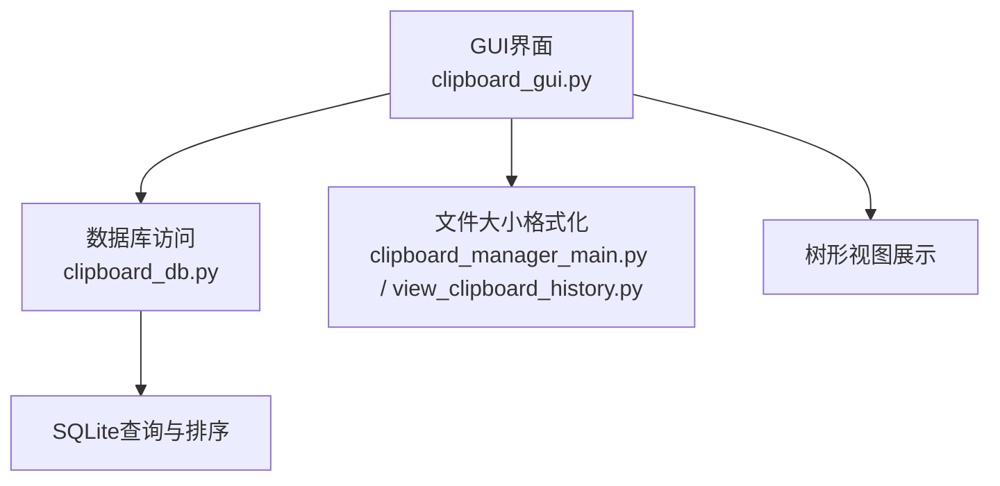
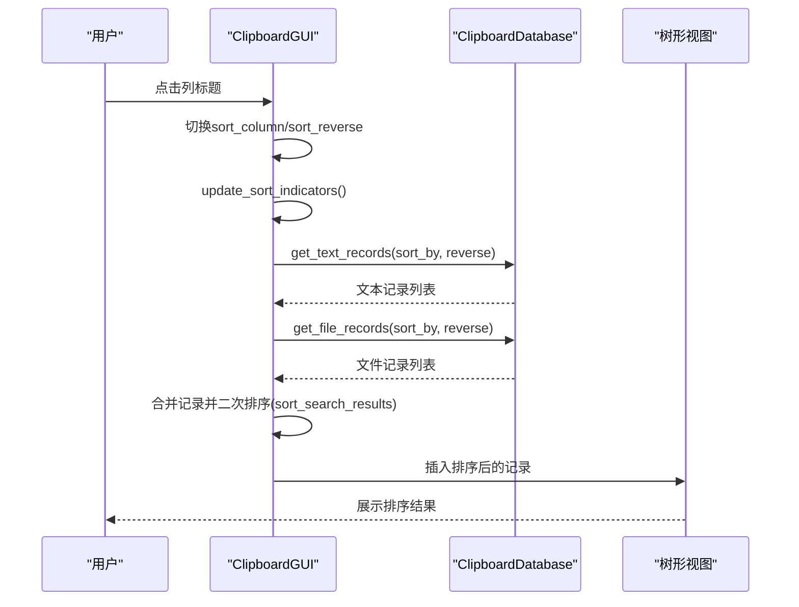
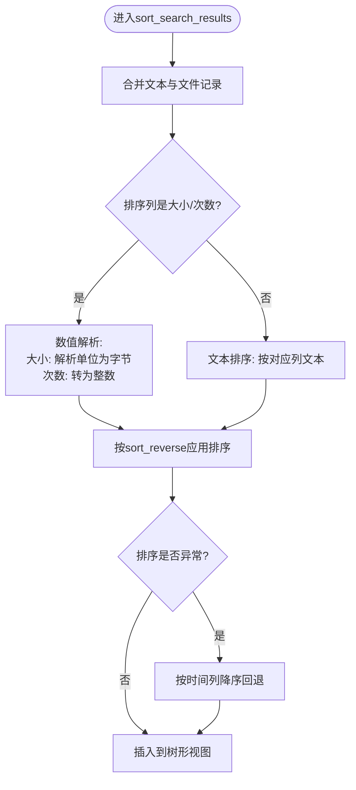
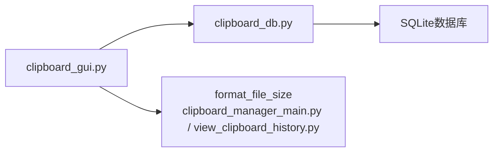

# 搜索结果排序

<cite>
**本文引用的文件**
- [clipboard_gui.py](file://clipboard_gui.py)
- [clipboard_db.py](file://clipboard_db.py)
- [clipboard_manager_main.py](file://clipboard_manager_main.py)
- [view_clipboard_history.py](file://view_clipboard_history.py)
</cite>

## 目录
1. [简介](#简介)
2. [项目结构](#项目结构)
3. [核心组件](#核心组件)
4. [架构总览](#架构总览)
5. [详细组件分析](#详细组件分析)
6. [依赖关系分析](#依赖关系分析)
7. [性能考虑](#性能考虑)
8. [故障排查指南](#故障排查指南)
9. [结论](#结论)

## 简介
本文聚焦于系统中“搜索结果排序”能力，尤其是针对混合类型的记录（文本与文件）在统一界面中进行排序的实现细节。重点说明：
- 当排序字段为“大小”或“次数”时，系统如何解析带单位的文件大小字符串（如1.5MB、2GB），将其转换为数值进行正确排序；
- 如何处理文本记录中“-”占位符的特殊情况；
- 次数字段的整数解析逻辑与异常处理机制；
- 排序算法如何根据当前sort_column与sort_reverse状态动态调整排序规则；
- 在排序失败时的回退策略（按时间倒序）；
- 性能优化建议，避免频繁数据库查询。

## 项目结构
本仓库围绕剪贴板历史记录管理，主要涉及GUI界面、数据库访问与辅助工具。与排序相关的关键文件如下：
- GUI层负责界面交互、列标题点击、排序状态维护与最终展示；
- 数据库层负责检索与排序字段映射；
- 辅助模块提供文件大小格式化工具，便于理解大小字段的显示与比较。

图表来源
- [clipboard_gui.py](file://clipboard_gui.py#L581-L748)
- [clipboard_db.py](file://clipboard_db.py#L185-L314)
- [clipboard_manager_main.py](file://clipboard_manager_main.py#L340-L354)
- [view_clipboard_history.py](file://view_clipboard_history.py#L1-L20)

章节来源
- [clipboard_gui.py](file://clipboard_gui.py#L581-L748)
- [clipboard_db.py](file://clipboard_db.py#L185-L314)

## 核心组件
- 排序入口与状态管理：GUI类维护sort_column与sort_reverse，并在列标题点击时切换排序方向，随后触发记录加载与排序。
- 搜索结果排序：search_records调用数据库搜索接口获取混合类型记录，再在GUI层对结果进行二次排序与展示。
- 数据库排序：get_text_records/get_file_records根据sort_by与reverse参数生成SQL ORDER BY子句，实现数据库侧排序。
- 大小与次数解析：GUI层对“大小”和“次数”列采用数值解析策略，异常时回退为0；“-”占位符在大小解析中视为0。
- 回退策略：若排序过程中出现异常，回退到按时间降序排列，保证界面稳定。

章节来源
- [clipboard_gui.py](file://clipboard_gui.py#L280-L308)
- [clipboard_gui.py](file://clipboard_gui.py#L581-L748)
- [clipboard_db.py](file://clipboard_db.py#L185-L314)

## 架构总览
下面的序列图展示了从用户点击列标题到最终展示排序结果的完整流程，包括数据库侧排序与GUI二次排序的协作。

图表来源
- [clipboard_gui.py](file://clipboard_gui.py#L280-L308)
- [clipboard_gui.py](file://clipboard_gui.py#L581-L748)
- [clipboard_db.py](file://clipboard_db.py#L185-L314)

## 详细组件分析

### 排序入口与状态管理
- 列标题点击事件绑定到sort_by_column，点击同一列则切换sort_reverse，否则将sort_column设为目标列并默认倒序；
- update_sort_indicators根据sort_column与sort_reverse更新列标题显示的箭头；
- load_records与load_all_records会将sort_column映射为数据库字段名，传入reverse参数，实现数据库侧排序。

章节来源
- [clipboard_gui.py](file://clipboard_gui.py#L280-L308)
- [clipboard_gui.py](file://clipboard_gui.py#L581-L637)

### 搜索结果排序（sort_search_results）
该方法负责对搜索结果进行二次排序与展示，其关键点如下：
- 合并阶段：将文本与文件两类记录统一放入all_records，形成统一的二维元组列表；
- 数值解析：
  - “大小”列：从第三列提取字符串，若为“-”，解析为0；否则按单位（GB、MB、KB、B）转换为字节数；
  - “次数”列：从第五列提取字符串并转换为整数；
- 异常处理：解析过程捕获ValueError/TypeError，统一返回0，避免排序中断；
- 排序规则：根据sort_column选择对应列索引；若为“大小/次数”，使用数值解析函数；否则按文本排序；
- 回退策略：若整体排序抛出异常，回退到按时间列降序排列。

图表来源
- [clipboard_gui.py](file://clipboard_gui.py#L668-L748)

章节来源
- [clipboard_gui.py](file://clipboard_gui.py#L668-L748)

### 数据库侧排序（get_text_records / get_file_records）
- 通过get_db_sort_field将界面列名映射为数据库字段名；
- 根据reverse决定ASC/DESC；
- 支持content、timestamp、char_count、number等字段排序；
- 文件记录支持filename、file_size、file_type、number、timestamp排序。

章节来源
- [clipboard_gui.py](file://clipboard_gui.py#L627-L637)
- [clipboard_db.py](file://clipboard_db.py#L185-L314)

### 文件大小解析与显示
- 文件大小在数据库中以字节存储；在GUI层通过format_file_size格式化为人类可读字符串（B、KB、MB、GB）；
- 搜索结果排序时，“大小”列的字符串需解析为数值参与排序；
- “-”占位符在排序前被解析为0，确保空缺值不影响排序稳定性。

章节来源
- [clipboard_gui.py](file://clipboard_gui.py#L609-L616)
- [clipboard_gui.py](file://clipboard_gui.py#L693-L699)
- [clipboard_gui.py](file://clipboard_gui.py#L878-L889)
- [clipboard_manager_main.py](file://clipboard_manager_main.py#L340-L354)
- [view_clipboard_history.py](file://view_clipboard_history.py#L1-L20)

### 次数字段解析与异常处理
- “次数”列来自number字段，排序前从数据库读取并转为整数；
- 解析异常（非整数或None）统一返回0，避免排序失败；
- 若数据库侧未返回number，GUI层默认使用“1”。

章节来源
- [clipboard_gui.py](file://clipboard_gui.py#L676-L684)
- [clipboard_gui.py](file://clipboard_gui.py#L693-L699)

### 回退策略（异常安全）
- 若排序过程发生ValueError/TypeError，系统回退到按时间列降序排列，确保界面始终可用。

章节来源
- [clipboard_gui.py](file://clipboard_gui.py#L741-L744)

## 依赖关系分析
- GUI层依赖数据库层提供的记录查询接口，实现数据库侧排序；
- GUI层在展示前对混合类型记录进行二次排序，满足用户交互体验；
- 文件大小格式化工具在多处被复用，保证显示与比较的一致性。

图表来源
- [clipboard_gui.py](file://clipboard_gui.py#L581-L748)
- [clipboard_db.py](file://clipboard_db.py#L185-L314)
- [clipboard_manager_main.py](file://clipboard_manager_main.py#L340-L354)
- [view_clipboard_history.py](file://view_clipboard_history.py#L1-L20)

章节来源
- [clipboard_gui.py](file://clipboard_gui.py#L581-L748)
- [clipboard_db.py](file://clipboard_db.py#L185-L314)

## 性能考虑
- 避免重复数据库查询：GUI层在load_records中已通过数据库侧排序获取了排序后的文本与文件记录，无需在GUI层再次对每条记录执行额外查询；搜索结果排序仅在search_records中对少量搜索命中记录进行二次排序，开销可控。
- 减少连接开销：sort_search_results中对单条记录的number查询应尽量合并或缓存，避免频繁建立/关闭连接。
- 优化解析成本：大小解析为O(1)字符串处理，次数解析为O(1)整数转换，整体成本低；若记录量增大，可考虑预计算并缓存解析结果。
- 索引建议：若未来需要更复杂的排序或过滤，可在number、file_size、timestamp等字段上评估添加索引以提升查询性能。

## 故障排查指南
- 排序异常导致界面卡顿或空白：
  - 检查sort_search_results中的异常回退逻辑是否生效；
  - 确认“大小”列字符串格式是否符合预期（GB/MB/KB/B或“-”）。
- “次数”列显示异常：
  - 确认数据库number字段是否存在且为整数；
  - 检查GUI层对None或非整数的默认处理逻辑。
- 数据库排序与GUI二次排序冲突：
  - 确认get_db_sort_field映射正确；
  - 检查sort_reverse状态是否与期望一致。

章节来源
- [clipboard_gui.py](file://clipboard_gui.py#L668-L748)
- [clipboard_gui.py](file://clipboard_gui.py#L627-L637)
- [clipboard_db.py](file://clipboard_db.py#L185-L314)

## 结论
本系统在GUI层实现了对混合类型记录的统一排序，通过数据库侧排序与GUI二次排序相结合的方式，在保证性能的同时提供了灵活的用户体验。针对“大小”和“次数”两类数值型字段，系统采用稳健的解析与异常处理策略，并在排序失败时提供时间倒序的回退方案，确保界面稳定可用。建议在未来进一步优化数据库查询与连接管理，减少不必要的IO开销。