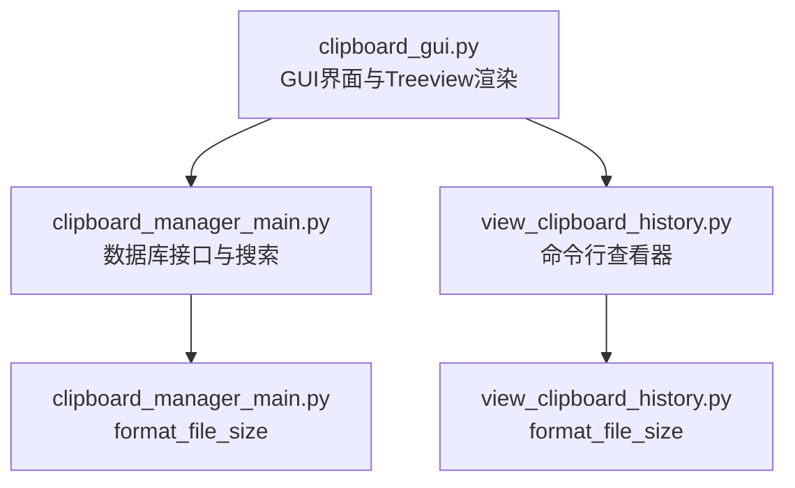
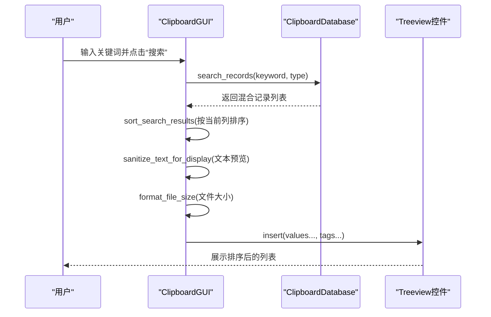
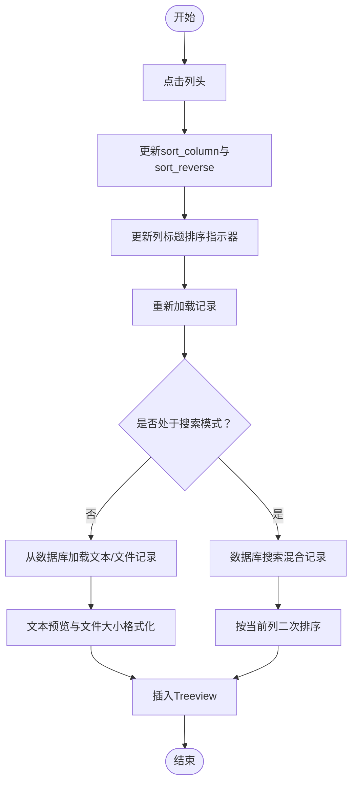
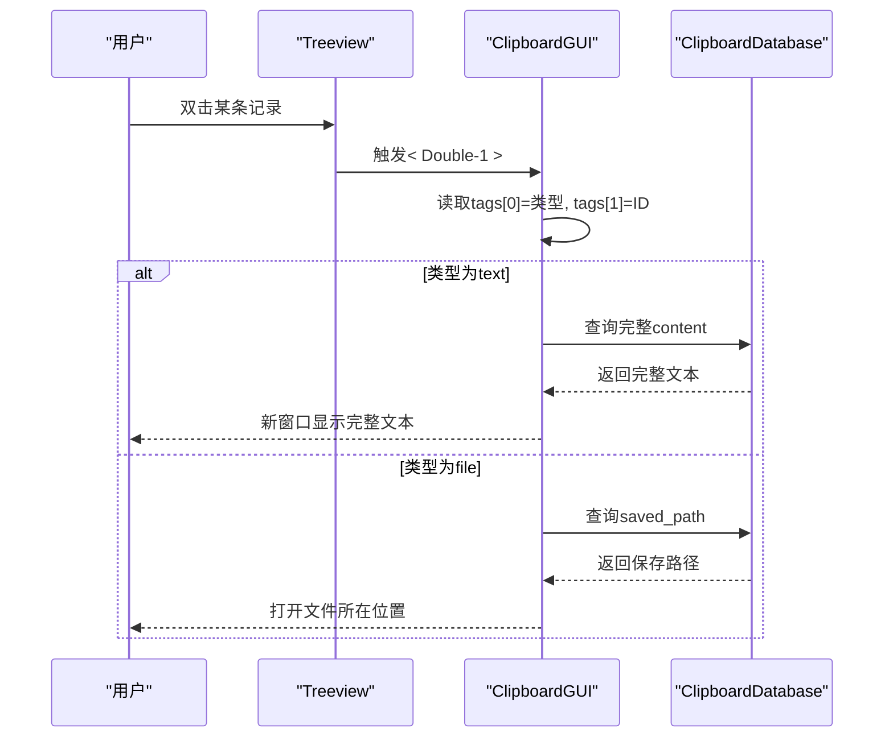
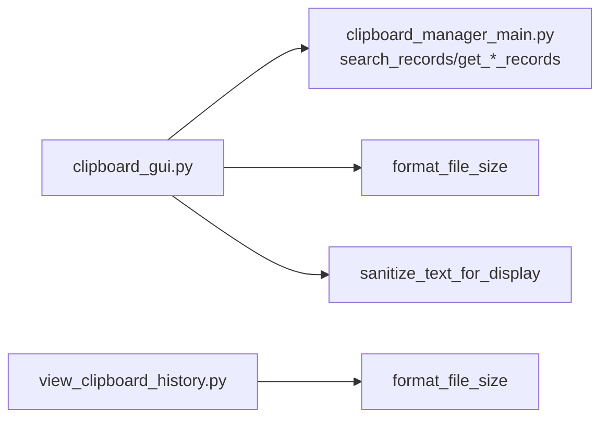

# 搜索结果显示

<cite>
**本文引用的文件**
- [clipboard_gui.py](file://clipboard_gui.py)
- [clipboard_manager_main.py](file://clipboard_manager_main.py)
- [view_clipboard_history.py](file://view_clipboard_history.py)
</cite>

## 目录
1. [简介](#简介)
2. [项目结构](#项目结构)
3. [核心组件](#核心组件)
4. [架构总览](#架构总览)
5. [详细组件分析](#详细组件分析)
6. [依赖关系分析](#依赖关系分析)
7. [性能考量](#性能考量)
8. [故障排查指南](#故障排查指南)
9. [结论](#结论)

## 简介
本文件聚焦“搜索结果显示”在GUI界面中的完整渲染流程，涵盖以下主题：
- 如何将数据库返回的混合记录（文本和文件）转换为Treeview控件可识别的数据格式
- sanitize_text_for_display 方法在内容截断与换行符清理中的作用
- format_file_size 工具函数如何将字节值转换为人类可读的GB/MB/KB/B格式
- 结果高亮显示策略（如有）与双击事件绑定机制
- 搜索界面与主记录列表的切换逻辑，以及排序指示器的同步更新方式

## 项目结构
本仓库包含多个模块，其中与“搜索结果显示”直接相关的文件如下：
- clipboard_gui.py：提供基于ttk.Treeview的记录列表界面，包含搜索、排序、双击查看详情、复制/删除等交互
- clipboard_manager_main.py：提供数据库接口与GUI主界面（另一个版本），包含搜索、排序、格式化等能力
- view_clipboard_history.py：提供命令行下的历史查看器，包含format_file_size工具函数

图表来源
- [clipboard_gui.py](file://clipboard_gui.py#L227-L294)
- [clipboard_manager_main.py](file://clipboard_manager_main.py#L213-L260)
- [view_clipboard_history.py](file://view_clipboard_history.py#L1-L20)

章节来源
- [clipboard_gui.py](file://clipboard_gui.py#L227-L294)
- [clipboard_manager_main.py](file://clipboard_manager_main.py#L213-L260)
- [view_clipboard_history.py](file://view_clipboard_history.py#L1-L20)

## 核心组件
- GUI界面与Treeview渲染（clipboard_gui.py）
  - 记录标签页：Treeview列包括“名称或内容”、“类型”、“大小”、“时间”、“次数”
  - 排序：点击列头触发排序，支持正序/倒序切换，并同步更新列标题的排序指示器
  - 搜索：输入关键词后调用数据库接口进行全文检索，随后对结果进行二次排序并展示
  - 双击：双击某条记录弹窗显示完整文本或打开文件所在位置
  - 数据预处理：文本内容通过sanitize_text_for_display进行换行符清理与长度截断；文件大小通过format_file_size格式化
- 数据库接口与搜索（clipboard_manager_main.py）
  - 提供search_records接口，支持按文本或文件关键词检索，并返回统一结构的结果集
  - 提供format_file_size工具函数，用于将字节值转换为人类可读格式
- 命令行查看器（view_clipboard_history.py）
  - 包含format_file_size工具函数，用于命令行输出

章节来源
- [clipboard_gui.py](file://clipboard_gui.py#L227-L294)
- [clipboard_gui.py](file://clipboard_gui.py#L581-L626)
- [clipboard_gui.py](file://clipboard_gui.py#L652-L748)
- [clipboard_manager_main.py](file://clipboard_manager_main.py#L213-L260)
- [view_clipboard_history.py](file://view_clipboard_history.py#L1-L20)

## 架构总览
下图展示了“搜索结果显示”的端到端流程：用户在搜索框输入关键词，GUI调用数据库接口执行搜索，得到混合记录后进行二次排序与格式化，最终插入Treeview并呈现。

图表来源
- [clipboard_gui.py](file://clipboard_gui.py#L652-L748)
- [clipboard_manager_main.py](file://clipboard_manager_main.py#L213-L260)

## 详细组件分析

### 1) 数据库返回的混合记录到Treeview的数据格式转换
- 混合记录来源
  - 文本记录：来自数据库的文本记录，包含id、content、timestamp、char_count、md5_hash、number
  - 文件记录：来自数据库的文件记录，包含id、original_path、saved_path、filename、file_size、file_type、md5_hash、timestamp、number
- 转换规则
  - 文本记录：提取content进行预览（见sanitize_text_for_display），类型固定为“文本”，大小固定为“-”，时间取timestamp，次数取number，插入时附加tags为("text", record_id)
  - 文件记录：提取filename作为名称，file_type作为类型，file_size经format_file_size格式化为字符串，时间取timestamp，次数取number，插入时附加tags为("file", record_id)
- Treeview插入
  - values顺序为：(名称或内容, 类型, 大小, 时间, 次数)
  - tags用于区分记录类型与ID，便于后续双击、复制、删除等操作

章节来源
- [clipboard_gui.py](file://clipboard_gui.py#L595-L623)
- [clipboard_gui.py](file://clipboard_gui.py#L604-L615)

### 2) sanitize_text_for_display：内容截断与换行符清理
- 功能要点
  - 将换行符替换为空格，避免影响Treeview显示
  - 对过长文本进行截断，防止列宽不足导致显示异常
  - 默认最大长度为100（可在调用处传入不同阈值）
- 调用位置
  - 主记录列表加载时：对文本content进行预览截断
  - 搜索结果加载时：对搜索返回的文本内容进行预览截断

章节来源
- [clipboard_gui.py](file://clipboard_gui.py#L124-L133)
- [clipboard_gui.py](file://clipboard_gui.py#L604-L606)
- [clipboard_gui.py](file://clipboard_gui.py#L675-L677)

### 3) format_file_size：字节到人类可读格式的转换
- 功能要点
  - 小于1024字节：显示为B
  - 小于1024^2字节：显示为KB（保留一位小数）
  - 小于1024^3字节：显示为MB（保留一位小数）
  - 否则：显示为GB（保留一位小数）
- 调用位置
  - 主记录列表加载时：对文件大小进行格式化
  - 搜索结果加载时：对文件大小进行格式化
  - 统计信息展示时：对累计大小进行格式化

章节来源
- [clipboard_gui.py](file://clipboard_gui.py#L879-L889)
- [clipboard_gui.py](file://clipboard_gui.py#L555-L561)
- [clipboard_gui.py](file://clipboard_gui.py#L611-L615)
- [clipboard_gui.py](file://clipboard_gui.py#L694-L696)

### 4) 搜索结果排序与排序指示器同步
- 排序触发
  - 点击任一列头，触发sort_by_column，若点击同一列则切换reverse，否则重置为倒序
  - 更新update_sort_indicators，同步列标题显示“↑/↓”箭头
  - 重新加载记录load_records
- 搜索结果排序
  - 先从数据库获取混合记录，再根据当前sort_column进行二次排序
  - 数值型字段（大小、次数）采用特殊解析逻辑，将“GB/MB/KB/B”字符串转换为数值参与排序
  - 文本型字段（名称或内容、类型、时间）按字典序排序
  - 若排序异常，回退到按时间降序

图表来源
- [clipboard_gui.py](file://clipboard_gui.py#L280-L308)
- [clipboard_gui.py](file://clipboard_gui.py#L581-L626)
- [clipboard_gui.py](file://clipboard_gui.py#L652-L748)

章节来源
- [clipboard_gui.py](file://clipboard_gui.py#L280-L308)
- [clipboard_gui.py](file://clipboard_gui.py#L652-L748)

### 5) 双击事件绑定与“完整内容”展示
- 绑定
  - 在记录标签页的Treeview上绑定"<Double-1>"事件到show_full_record
- 行为
  - 读取选中项的tags，解析记录类型与ID
  - 文本记录：从数据库读取完整content，在新窗口中以ScrolledText展示
  - 文件记录：从数据库读取saved_path，使用系统文件管理器定位文件
- 复制/删除
  - 复制：根据记录类型复制完整文本或文件名
  - 删除：根据记录类型删除对应数据库记录，并尝试删除本地文件（如适用）

图表来源
- [clipboard_gui.py](file://clipboard_gui.py#L269-L270)
- [clipboard_gui.py](file://clipboard_gui.py#L749-L795)
- [clipboard_gui.py](file://clipboard_gui.py#L796-L838)
- [clipboard_gui.py](file://clipboard_gui.py#L839-L877)

章节来源
- [clipboard_gui.py](file://clipboard_gui.py#L269-L270)
- [clipboard_gui.py](file://clipboard_gui.py#L749-L795)
- [clipboard_gui.py](file://clipboard_gui.py#L796-L838)
- [clipboard_gui.py](file://clipboard_gui.py#L839-L877)

### 6) 搜索界面与主记录列表的切换逻辑
- 切换点
  - 主记录列表：默认显示所有记录，支持排序与双击查看详情
  - 搜索界面：在搜索框输入关键词后，清空现有列表，调用数据库搜索接口，将结果按当前排序列二次排序并展示
- 注意事项
  - 搜索模式下仍使用相同的Treeview列结构与数据格式
  - 排序指示器与当前排序列保持一致，保证用户体验一致性

章节来源
- [clipboard_gui.py](file://clipboard_gui.py#L581-L626)
- [clipboard_gui.py](file://clipboard_gui.py#L652-L748)

## 依赖关系分析
- GUI层依赖数据库层提供的search_records与get_*_records接口
- GUI层内部依赖format_file_size与sanitize_text_for_display两个工具函数
- 命令行查看器也提供format_file_size，但与GUI层的实现略有差异（例如保留位数或单位表达）

图表来源
- [clipboard_gui.py](file://clipboard_gui.py#L581-L626)
- [clipboard_gui.py](file://clipboard_gui.py#L652-L748)
- [clipboard_gui.py](file://clipboard_gui.py#L879-L889)
- [clipboard_gui.py](file://clipboard_gui.py#L124-L133)
- [view_clipboard_history.py](file://view_clipboard_history.py#L1-L20)

章节来源
- [clipboard_gui.py](file://clipboard_gui.py#L581-L626)
- [clipboard_gui.py](file://clipboard_gui.py#L652-L748)
- [clipboard_gui.py](file://clipboard_gui.py#L879-L889)
- [clipboard_gui.py](file://clipboard_gui.py#L124-L133)
- [view_clipboard_history.py](file://view_clipboard_history.py#L1-L20)

## 性能考量
- 搜索结果二次排序
  - 当前实现对搜索结果进行内存排序，若结果量较大可能带来额外开销
  - 建议：在数据库层增加排序逻辑，减少Python侧排序成本
- 文本预览与大小格式化
  - 预览与格式化均为O(n)遍历，通常不影响整体性能
- 双击读取完整文本
  - 每次双击都会发起一次数据库查询，建议在高频场景下考虑缓存策略

[本节为通用建议，不直接分析具体文件]

## 故障排查指南
- 搜索结果未按预期排序
  - 检查sort_column与sort_reverse是否正确更新
  - 检查sort_search_results中数值解析逻辑（大小字段的单位字符串）
- 双击无响应
  - 检查Treeview是否绑定了< Double-1 >事件
  - 检查选中项的tags是否包含类型与ID
- 文件记录无法打开位置
  - 检查saved_path是否存在，必要时确认数据库中记录是否正确
- 大小显示异常
  - 检查format_file_size的输入是否为字节数，以及单位字符串是否符合预期

章节来源
- [clipboard_gui.py](file://clipboard_gui.py#L280-L308)
- [clipboard_gui.py](file://clipboard_gui.py#L652-L748)
- [clipboard_gui.py](file://clipboard_gui.py#L749-L795)
- [clipboard_gui.py](file://clipboard_gui.py#L879-L889)

## 结论
- 搜索结果显示流程清晰：输入关键词 -> 数据库搜索 -> 二次排序 -> 格式化 -> Treeview渲染
- sanitize_text_for_display与format_file_size分别承担了内容截断与大小格式化职责，保证了界面的可读性与一致性
- 排序指示器与双击事件完善，提升了交互体验
- 建议在数据库层引入排序与分页，进一步优化大数据量场景下的性能