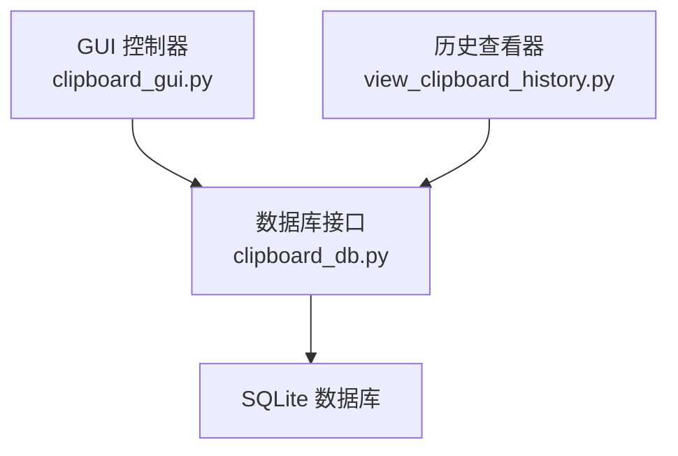
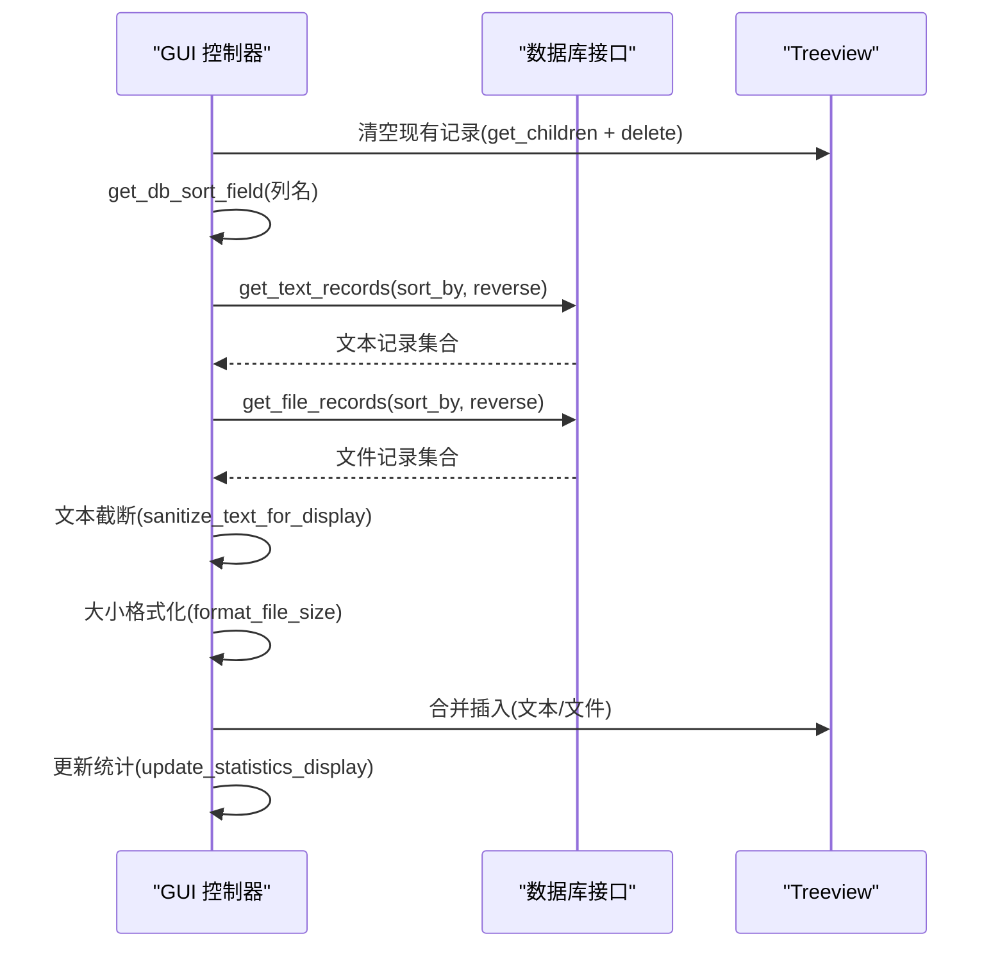
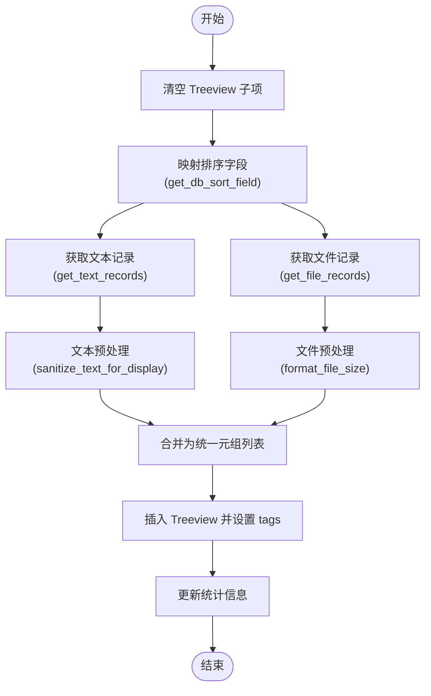
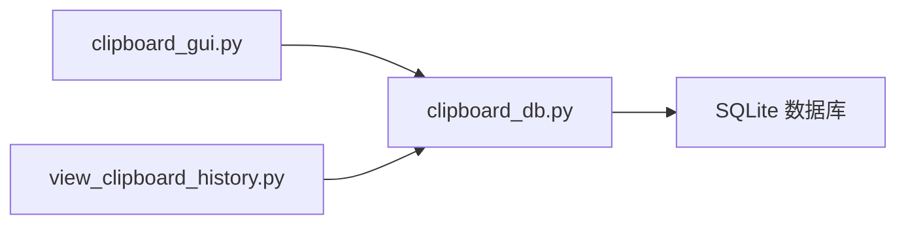

# 数据加载机制

<cite>
**本文引用的文件**
- [clipboard_gui.py](file://clipboard_gui.py)
- [clipboard_db.py](file://clipboard_db.py)
- [view_clipboard_history.py](file://view_clipboard_history.py)
</cite>

## 目录
1. [简介](#简介)
2. [项目结构](#项目结构)
3. [核心组件](#核心组件)
4. [架构总览](#架构总览)
5. [详细组件分析](#详细组件分析)
6. [依赖关系分析](#依赖关系分析)
7. [性能考量](#性能考量)
8. [故障排查指南](#故障排查指南)
9. [结论](#结论)

## 简介
本文聚焦于剪贴板历史管理系统的数据加载机制，围绕以下目标展开：
- 深入分析 load_records 与 load_all_records 方法如何清空现有树形视图记录并从 ClipboardDatabase 获取文本与文件记录，最终合并展示。
- 详解 get_db_sort_field 如何将界面列名映射到数据库字段，以及 sanitize_text_for_display 对长文本的截断处理策略。
- 解释文本记录与文件记录的合并显示逻辑，以及 format_file_size 在大小格式化中的应用。
- 说明 tags 参数在树形视图项目中的使用，实现记录类型(text/file)与记录ID的关联存储。

## 项目结构
本仓库采用“功能模块化 + GUI 控制器”的组织方式：
- 数据层：clipboard_db.py 提供 SQLite 数据库访问接口，负责文本与文件记录的增删改查、统计与设置管理。
- 视图层：clipboard_gui.py 提供 Tkinter GUI，负责界面交互、排序、搜索、复制/删除等操作，并调用数据库层执行数据加载。
- 历史查看工具：view_clipboard_history.py 提供命令行历史查看器，演示 format_file_size 的使用与记录读取。

图表来源
- [clipboard_gui.py](file://clipboard_gui.py#L581-L626)
- [clipboard_db.py](file://clipboard_db.py#L185-L261)
- [view_clipboard_history.py](file://view_clipboard_history.py#L10-L20)

章节来源
- [clipboard_gui.py](file://clipboard_gui.py#L581-L626)
- [clipboard_db.py](file://clipboard_db.py#L185-L261)
- [view_clipboard_history.py](file://view_clipboard_history.py#L10-L20)

## 核心组件
- GUI 控制器 ClipboardGUI：负责界面构建、事件绑定、数据加载与展示、排序与搜索、复制/删除等。
- 数据库接口 ClipboardDatabase：封装 SQLite 表结构、查询与聚合统计，提供文本/文件记录的获取与搜索能力。
- 历史查看器：独立的命令行工具，演示 format_file_size 的使用与记录读取。

章节来源
- [clipboard_gui.py](file://clipboard_gui.py#L581-L626)
- [clipboard_db.py](file://clipboard_db.py#L185-L261)
- [view_clipboard_history.py](file://view_clipboard_history.py#L10-L20)

## 架构总览
GUI 控制器通过 ClipboardDatabase 的 get_text_records 与 get_file_records 获取两类记录，经过统一的预处理（文本截断、大小格式化、排序字段映射），合并后插入到 Treeview 中。tags 字段用于存储记录类型与ID，便于后续复制/删除等操作。

图表来源
- [clipboard_gui.py](file://clipboard_gui.py#L581-L626)
- [clipboard_db.py](file://clipboard_db.py#L185-L261)

章节来源
- [clipboard_gui.py](file://clipboard_gui.py#L581-L626)
- [clipboard_db.py](file://clipboard_db.py#L185-L261)

## 详细组件分析

### load_all_records 方法的数据加载流程
- 清空现有记录：遍历 Treeview 的所有子节点并逐个删除，确保每次加载都是全新视图。
- 排序字段映射：调用 get_db_sort_field 将界面列名映射为数据库字段名，支持 content、file_type、file_size、timestamp、number 等。
- 获取数据：
  - 文本记录：通过 get_text_records 获取，包含 id、content、timestamp、char_count、md5_hash、number。
  - 文件记录：通过 get_file_records 获取，包含 id、original_path、saved_path、filename、file_size、file_type、md5_hash、timestamp、number。
- 预处理与合并：
  - 文本记录：对 content 进行 sanitize_text_for_display 截断，类型固定为“文本”，大小固定为“-”，次数来自 number。
  - 文件记录：对 file_size 调用 format_file_size 格式化，类型取 file_type 或“未知”，次数来自 number。
  - 将两类记录统一为 (名称/内容, 类型, 大小, 时间, 次数, 记录类型, 记录ID) 的元组列表。
- 插入 Treeview：根据记录类型分别插入，同时设置 tags 为 (“text”或“file”, 记录ID)，用于后续复制/删除等操作。
- 更新统计：调用 update_statistics_display 刷新统计信息。

图表来源
- [clipboard_gui.py](file://clipboard_gui.py#L581-L626)
- [clipboard_db.py](file://clipboard_db.py#L185-L261)

章节来源
- [clipboard_gui.py](file://clipboard_gui.py#L581-L626)
- [clipboard_db.py](file://clipboard_db.py#L185-L261)

### load_records 方法的简化流程
- load_records 直接委托给 load_all_records，后者完成完整的清空、获取、预处理、合并与插入流程。

章节来源
- [clipboard_gui.py](file://clipboard_gui.py#L581-L586)

### get_db_sort_field：界面列名到数据库字段的映射
- 输入：界面列名（如“名称或内容”、“类型”、“大小”、“时间”、“次数”）
- 输出：数据库字段名（content、file_type、file_size、timestamp、number）
- 默认：若未命中映射，回退为 timestamp，保证排序可用性。

章节来源
- [clipboard_gui.py](file://clipboard_gui.py#L627-L637)

### sanitize_text_for_display：长文本截断策略
- 功能：移除换行符并将文本替换为空格，随后按阈值截断，超出部分追加省略号。
- 使用场景：在 Treeview 中显示文本预览，避免过长内容影响列宽与可读性。
- 截断阈值：在 load_all_records 中传入 50，确保预览简洁。

章节来源
- [clipboard_gui.py](file://clipboard_gui.py#L124-L133)
- [clipboard_gui.py](file://clipboard_gui.py#L602-L606)

### 文本记录与文件记录的合并显示逻辑
- 文本记录：
  - 名称/内容：content 的截断预览
  - 类型：固定为“文本”
  - 大小：固定为“-”
  - 时间：timestamp
  - 次数：来自 number
  - tags：("text", id)
- 文件记录：
  - 名称/内容：filename
  - 类型：file_type 或“未知”
  - 大小：file_size 格式化后的字符串
  - 时间：timestamp
  - 次数：来自 number
  - tags：("file", id)
- 合并顺序：先插入文本记录，再插入文件记录，最终统一排序由数据库层控制。

章节来源
- [clipboard_gui.py](file://clipboard_gui.py#L601-L623)
- [clipboard_db.py](file://clipboard_db.py#L185-L261)

### format_file_size：大小格式化应用
- 在 GUI 中：用于文件记录的大小列显示，将字节数转换为 B/KB/MB/GB 的人类可读格式。
- 在历史查看器：同名函数用于命令行输出，保持一致性。

章节来源
- [clipboard_gui.py](file://clipboard_gui.py#L879-L889)
- [view_clipboard_history.py](file://view_clipboard_history.py#L10-L20)

### tags 参数在树形视图项目中的使用
- 结构：每个 Treeview 项的 tags 是一个元组，第一个元素为记录类型（"text" 或 "file"），第二个元素为记录ID。
- 作用：在用户操作（复制/删除）时，通过 item("tags") 获取类型与ID，从而执行相应的数据库操作或系统行为（例如打开文件所在目录）。

章节来源
- [clipboard_gui.py](file://clipboard_gui.py#L618-L623)
- [clipboard_gui.py](file://clipboard_gui.py#L754-L760)
- [clipboard_gui.py](file://clipboard_gui.py#L804-L809)

## 依赖关系分析
- GUI 控制器依赖数据库接口提供的查询方法，以获取文本与文件记录。
- 数据库接口依赖 SQLite，提供表结构、索引与查询语句。
- 历史查看器独立于 GUI，但共享相同的大小格式化逻辑，体现跨组件的一致性。

图表来源
- [clipboard_gui.py](file://clipboard_gui.py#L581-L626)
- [clipboard_db.py](file://clipboard_db.py#L185-L261)
- [view_clipboard_history.py](file://view_clipboard_history.py#L10-L20)

章节来源
- [clipboard_gui.py](file://clipboard_gui.py#L581-L626)
- [clipboard_db.py](file://clipboard_db.py#L185-L261)
- [view_clipboard_history.py](file://view_clipboard_history.py#L10-L20)

## 性能考量
- 排序字段映射：通过 get_db_sort_field 将界面列名映射到数据库字段，避免在 Python 层做复杂排序，减少内存压力。
- 预处理与格式化：在插入前完成文本截断与大小格式化，降低 Treeview 的渲染负担。
- 统一清空：每次加载前清空 Treeview 子项，避免累积导致的 UI 卡顿。
- 统计刷新：仅在加载完成后更新统计信息，避免频繁 I/O。

## 故障排查指南
- 排序无效或异常：
  - 检查 get_db_sort_field 是否正确映射到数据库字段。
  - 确认数据库层的排序字段支持（content、file_type、file_size、timestamp、number）。
- 文本显示过长：
  - 调整 sanitize_text_for_display 的阈值或在调用处传入合适的长度。
- 大小显示不一致：
  - 确认 format_file_size 的输入单位与数据库存储一致（字节）。
- 复制/删除失败：
  - 检查 Treeview 项的 tags 是否包含正确的类型与ID。
  - 确认数据库连接与事务提交正常。

章节来源
- [clipboard_gui.py](file://clipboard_gui.py#L627-L637)
- [clipboard_gui.py](file://clipboard_gui.py#L124-L133)
- [clipboard_gui.py](file://clipboard_gui.py#L879-L889)
- [clipboard_gui.py](file://clipboard_gui.py#L754-L760)

## 结论
本系统通过清晰的职责分离与一致的数据处理策略，实现了高效、稳定的记录加载与展示。GUI 控制器负责界面与交互，数据库接口负责数据存取，两者协作确保了排序、截断、格式化与合并显示的顺畅衔接。tags 的使用进一步提升了操作的准确性与可维护性。