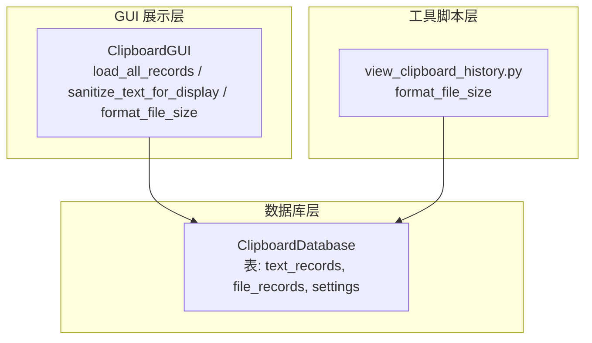
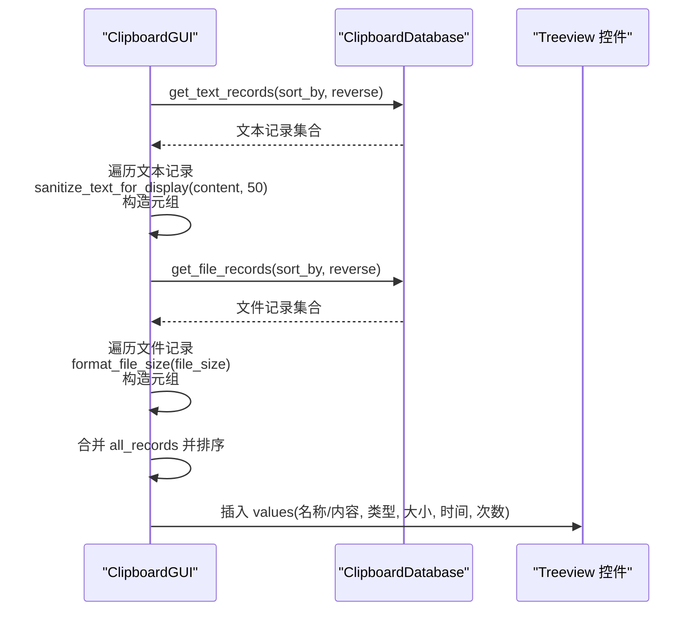
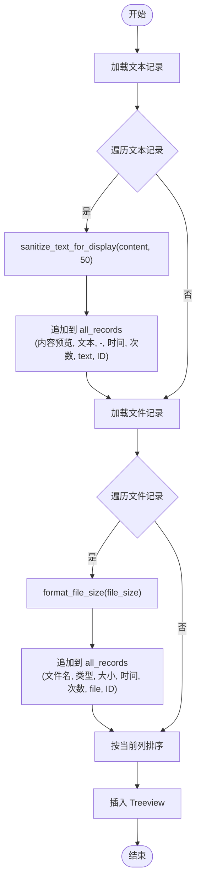
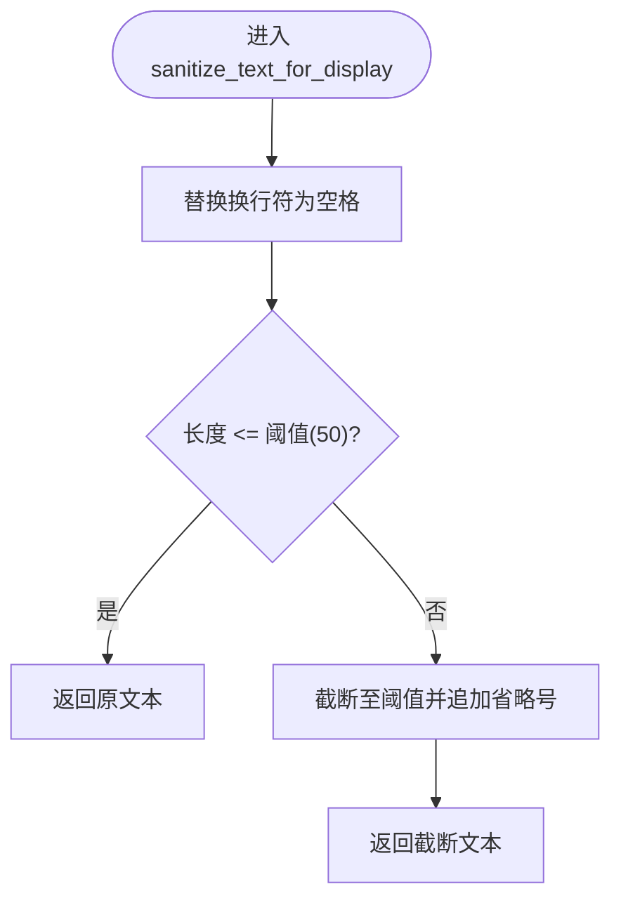
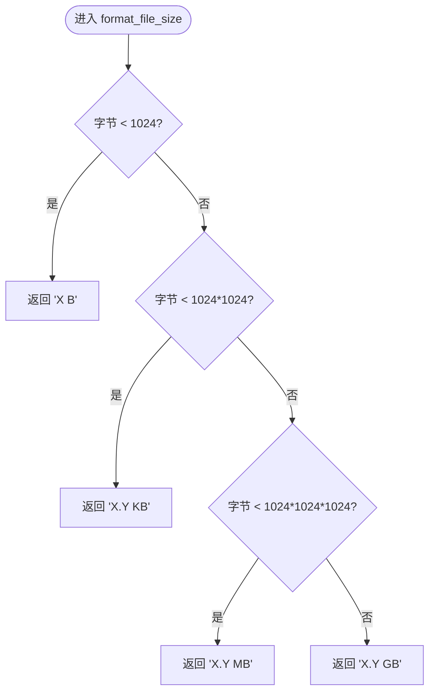
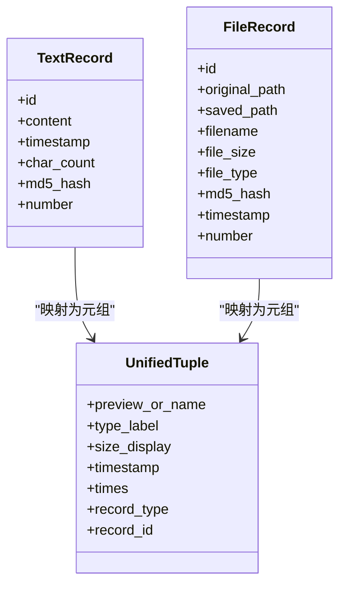
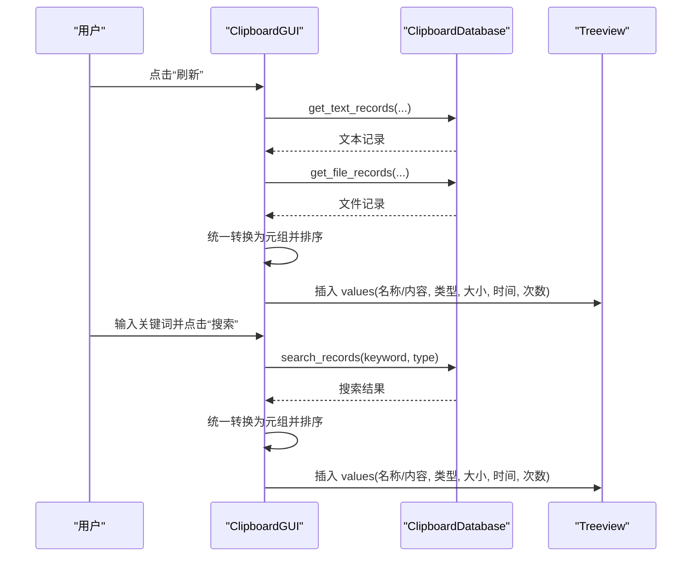
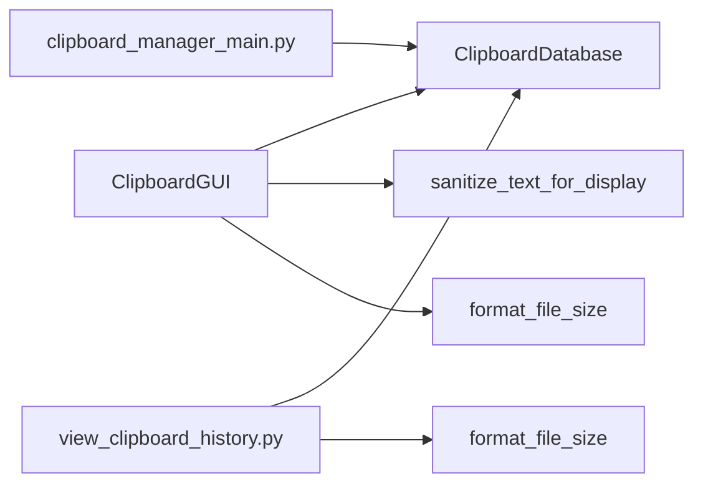

# 数据处理机制

<cite>
**本文引用的文件**
- [clipboard_gui.py](file://clipboard_gui.py)
- [clipboard_db.py](file://clipboard_db.py)
- [clipboard_manager_main.py](file://clipboard_manager_main.py)
- [view_clipboard_history.py](file://view_clipboard_history.py)
</cite>

## 目录
1. [简介](#简介)
2. [项目结构](#项目结构)
3. [核心组件](#核心组件)
4. [架构总览](#架构总览)
5. [详细组件分析](#详细组件分析)
6. [依赖关系分析](#依赖关系分析)
7. [性能考量](#性能考量)
8. [故障排查指南](#故障排查指南)
9. [结论](#结论)

## 简介
本文聚焦于“load_all_records”方法对数据库查询结果的统一处理流程，详细说明：
- 文本记录与文件记录如何被统一转换为包含“预览内容、类型、大小、时间、次数、记录类型标识、ID”的元组结构，并合并到 all_records 列表；
- sanitize_text_for_display 方法如何对文本内容进行换行符替换与长度截断（默认50字符）；
- format_file_size 方法如何将字节大小转换为可读的 KB/MB/GB 格式；
- GUI 中“记录”标签页如何展示这些统一后的记录。

## 项目结构
本仓库围绕剪贴板历史记录管理，主要涉及数据库层、GUI 展示层与工具脚本层：
- 数据库层：负责表结构、查询、统计与设置维护
- GUI 展示层：负责记录加载、搜索、排序与展示
- 工具脚本层：提供命令行查看历史记录的功能

图表来源
- [clipboard_gui.py](file://clipboard_gui.py#L585-L623)
- [clipboard_db.py](file://clipboard_db.py#L263-L314)
- [view_clipboard_history.py](file://view_clipboard_history.py#L1-L75)

章节来源
- [clipboard_gui.py](file://clipboard_gui.py#L585-L623)
- [clipboard_db.py](file://clipboard_db.py#L263-L314)
- [view_clipboard_history.py](file://view_clipboard_history.py#L1-L75)

## 核心组件
- ClipboardDatabase：提供 get_text_records、get_file_records、search_records、get_statistics 等接口，支撑 GUI 的数据加载与搜索。
- ClipboardGUI：负责将数据库查询结果统一转换为 GUI 展示所需的元组结构，并调用 sanitize_text_for_display 与 format_file_size 进行文本与大小处理。
- view_clipboard_history.py：提供命令行查看历史记录的能力，其中也包含 format_file_size 的实现。

章节来源
- [clipboard_db.py](file://clipboard_db.py#L263-L314)
- [clipboard_gui.py](file://clipboard_gui.py#L585-L623)
- [view_clipboard_history.py](file://view_clipboard_history.py#L1-L75)

## 架构总览
GUI 的“记录”标签页通过 load_all_records 从数据库加载文本与文件两类记录，分别进行预处理后统一放入 all_records，再按列排序与展示。

图表来源
- [clipboard_gui.py](file://clipboard_gui.py#L585-L623)
- [clipboard_db.py](file://clipboard_db.py#L185-L261)

## 详细组件分析

### load_all_records 的数据处理逻辑
- 输入：分别从数据库获取文本记录与文件记录（支持按列排序与倒序）。
- 处理：
  - 文本记录：对 content 调用 sanitize_text_for_display(50)，构造元组 (content_preview, "文本", "-", timestamp, number, "text", record_id)。
  - 文件记录：对 file_size 调用 format_file_size，构造元组 (filename, file_type, size_str, timestamp, number, "file", record_id)。
- 输出：将两类元组合并到 all_records，随后按当前排序列进行排序并插入 Treeview。

图表来源
- [clipboard_gui.py](file://clipboard_gui.py#L585-L623)

章节来源
- [clipboard_gui.py](file://clipboard_gui.py#L585-L623)

### sanitize_text_for_display 的文本预处理
- 功能：将换行符替换为空格，并对过长内容进行截断（默认长度为50）。该方法在 load_all_records 中用于生成“内容预览”，避免长文本导致 UI 卡顿与列宽溢出。
- 关键点：
  - 替换换行符：将 \n 与 \r 替换为空格，保证单行显示。
  - 截断策略：当长度超过阈值时，截断并追加省略号，确保 UI 表格列宽稳定。

图表来源
- [clipboard_gui.py](file://clipboard_gui.py#L124-L133)

章节来源
- [clipboard_gui.py](file://clipboard_gui.py#L124-L133)

### format_file_size 的大小格式化
- 功能：将字节数转换为人类可读的单位格式（B、KB、MB、GB），保留一位小数。
- 关键点：
  - 以 1024 为进制，区分 B、KB、MB、GB 四档。
  - 在 GUI 的“记录”标签页中用于显示文件大小；在命令行工具中同样用于输出统计信息。

图表来源
- [clipboard_gui.py](file://clipboard_gui.py#L879-L889)
- [view_clipboard_history.py](file://view_clipboard_history.py#L10-L20)

章节来源
- [clipboard_gui.py](file://clipboard_gui.py#L879-L889)
- [view_clipboard_history.py](file://view_clipboard_history.py#L10-L20)

### 文本记录与文件记录的统一结构
- 文本记录元组结构：(内容预览, "文本", "-", 时间, 次数, "text", ID)
- 文件记录元组结构：(文件名, 类型, 大小, 时间, 次数, "file", ID)
- 合并策略：先处理文本记录，再处理文件记录，最后统一排序并插入 Treeview。

图表来源
- [clipboard_gui.py](file://clipboard_gui.py#L585-L623)
- [clipboard_db.py](file://clipboard_db.py#L185-L261)

章节来源
- [clipboard_gui.py](file://clipboard_gui.py#L585-L623)
- [clipboard_db.py](file://clipboard_db.py#L185-L261)

### GUI 展示与搜索流程
- 加载记录：load_all_records -> 合并 all_records -> 排序 -> 插入 Treeview。
- 搜索记录：search_records -> 对搜索结果进行排序 -> 插入 Treeview。
- 双击查看详情：文本记录弹窗显示完整内容；文件记录打开文件所在目录。

图表来源
- [clipboard_gui.py](file://clipboard_gui.py#L585-L748)
- [clipboard_db.py](file://clipboard_db.py#L281-L314)

章节来源
- [clipboard_gui.py](file://clipboard_gui.py#L585-L748)
- [clipboard_db.py](file://clipboard_db.py#L281-L314)

## 依赖关系分析
- ClipboardGUI 依赖 ClipboardDatabase 提供的数据接口，负责数据清洗与统一结构化。
- view_clipboard_history.py 与 clipboard_manager_main.py 中的 format_file_size 实现独立，但语义一致，均用于人类可读的文件大小展示。

图表来源
- [clipboard_gui.py](file://clipboard_gui.py#L585-L623)
- [clipboard_db.py](file://clipboard_db.py#L263-L314)
- [view_clipboard_history.py](file://view_clipboard_history.py#L1-L75)
- [clipboard_manager_main.py](file://clipboard_manager_main.py#L343-L354)

章节来源
- [clipboard_gui.py](file://clipboard_gui.py#L585-L623)
- [clipboard_db.py](file://clipboard_db.py#L263-L314)
- [view_clipboard_history.py](file://view_clipboard_history.py#L1-L75)
- [clipboard_manager_main.py](file://clipboard_manager_main.py#L343-L354)

## 性能考量
- 文本预处理：对每条文本记录执行 sanitize_text_for_display，复杂度 O(n)，n 为内容长度。默认阈值 50，通常开销较小。
- 大小格式化：format_file_size 为常数时间操作，开销极低。
- 排序策略：GUI 中对“大小”“次数”采用数值解析排序，若解析失败会回退到按时间排序，避免异常中断。
- 数据量增长：随着记录增多，合并与排序成本上升。建议：
  - 优先使用数据库侧排序（已通过 get_text_records/get_file_records 的 sort_by 参数实现）；
  - 避免一次性加载过多记录，必要时引入分页或延迟加载；
  - 对频繁使用的字段建立索引（如 timestamp、file_type、file_size、number）以提升查询效率。

## 故障排查指南
- 文本内容显示异常
  - 现象：表格中出现换行或列宽异常。
  - 排查：确认是否调用了 sanitize_text_for_display 进行换行符替换与截断。
  - 参考路径：[sanitize_text_for_display](file://clipboard_gui.py#L124-L133)
- 文件大小显示不正确
  - 现象：显示为“-”或单位不正确。
  - 排查：确认 format_file_size 是否被调用；检查 file_size 字段是否为有效整数。
  - 参考路径：[format_file_size](file://clipboard_gui.py#L879-L889)
- 记录排序异常
  - 现象：按“大小”“次数”排序时出现乱序或报错。
  - 排查：检查数值解析逻辑；若解析失败会回退到按时间排序。
  - 参考路径：[sort_search_results 数值解析](file://clipboard_gui.py#L700-L744)
- 搜索结果缺失
  - 现象：搜索不到预期记录。
  - 排查：确认 search_records 的 SQL 查询条件与参数绑定是否正确。
  - 参考路径：[search_records](file://clipboard_db.py#L281-L314)

章节来源
- [clipboard_gui.py](file://clipboard_gui.py#L700-L744)
- [clipboard_db.py](file://clipboard_db.py#L281-L314)

## 结论
- load_all_records 将文本与文件两类记录统一转换为固定结构的元组，并通过 sanitize_text_for_display 与 format_file_size 实现稳定的 UI 展示。
- GUI 层在排序与展示上提供了良好的用户体验，同时保留了对数值字段的健壮排序策略。
- 建议在数据量较大时结合数据库侧排序与索引优化，以进一步提升性能与稳定性。