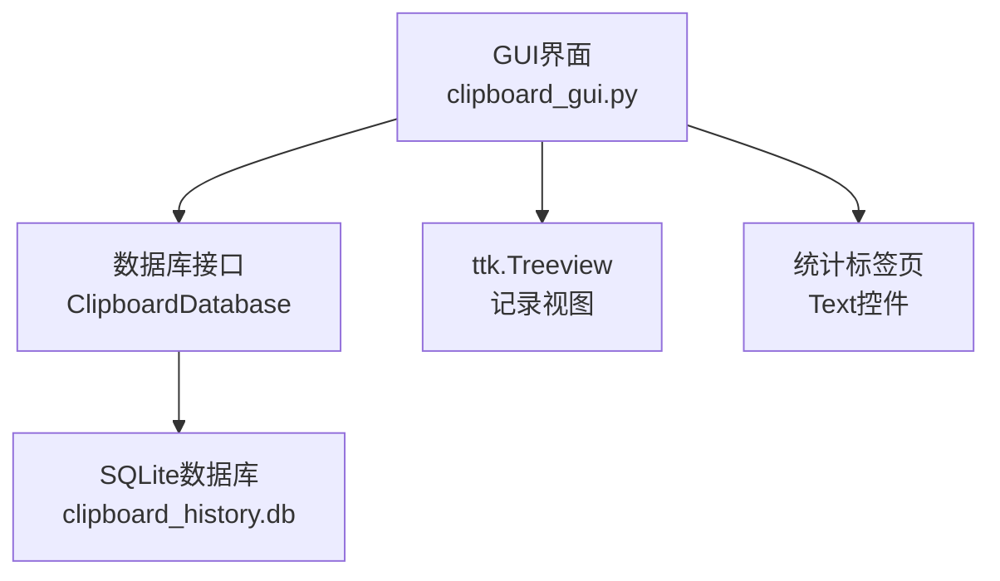
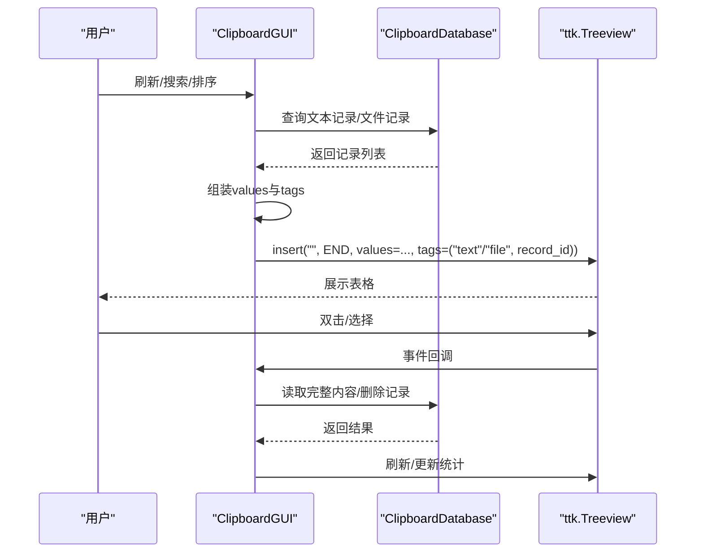
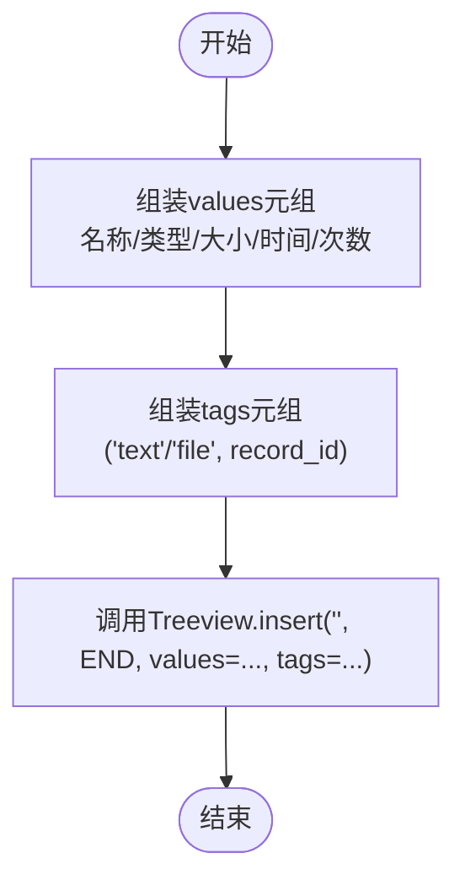
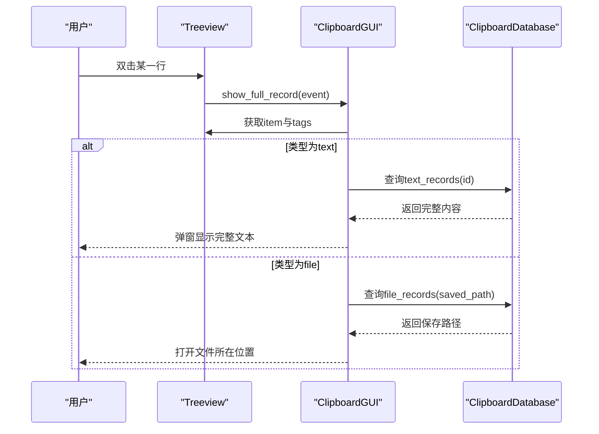
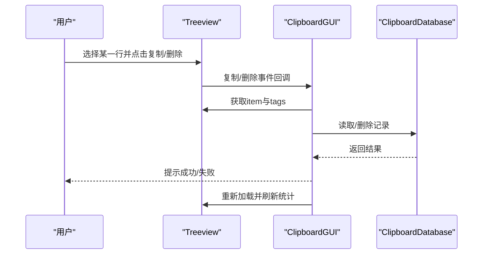
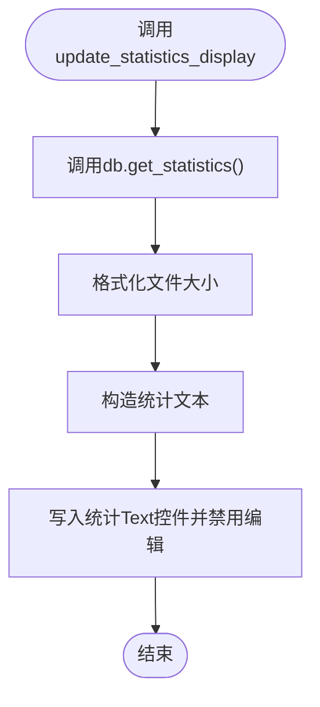
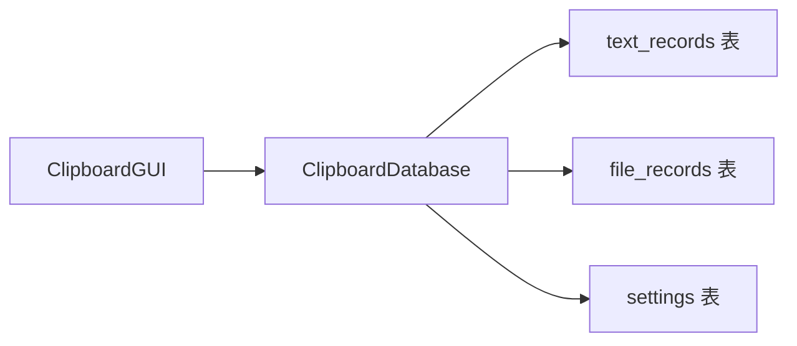

# 数据显示机制

<cite>
**本文引用的文件**
- [clipboard_gui.py](file://clipboard_gui.py)
- [clipboard_manager_main.py](file://clipboard_manager_main.py)
- [clipboard_db.py](file://clipboard_db.py)
- [view_clipboard_history.py](file://view_clipboard_history.py)
</cite>

## 目录
1. [简介](#简介)
2. [项目结构](#项目结构)
3. [核心组件](#核心组件)
4. [架构总览](#架构总览)
5. [详细组件分析](#详细组件分析)
6. [依赖分析](#依赖分析)
7. [性能考虑](#性能考虑)
8. [故障排查指南](#故障排查指南)
9. [结论](#结论)

## 简介
本文围绕“将处理后的记录数据在ttk.Treeview中显示”的实现细节展开，重点说明：
- 如何通过insert方法将每条记录插入树形视图；
- tags参数的双重用途：使用'text'或'file'标签区分记录类型，同时将record_id作为数据关联存储，为后续的双击查看完整内容、复制和删除操作提供依据；
- values参数与树形视图列定义（名称或内容、类型、大小、时间、次数）的对应关系；
- 如何通过update_statistics_display方法在加载记录后同步更新统计标签页信息。

## 项目结构
本仓库包含多个模块，其中与数据显示直接相关的模块如下：
- GUI层：clipboard_gui.py，负责构建界面、绑定事件、调用数据库接口并展示数据；
- 数据库层：clipboard_manager_main.py中的ClipboardDatabase类，提供查询、统计、删除等数据库操作；
- 其他辅助：clipboard_db.py（旧版数据库模块）、view_clipboard_history.py（命令行查看器）。

图表来源
- [clipboard_gui.py](file://clipboard_gui.py#L238-L279)
- [clipboard_manager_main.py](file://clipboard_manager_main.py#L56-L111)

章节来源
- [clipboard_gui.py](file://clipboard_gui.py#L173-L279)
- [clipboard_manager_main.py](file://clipboard_manager_main.py#L56-L111)

## 核心组件
- 记录标签页的Treeview：定义了列（名称或内容、类型、大小、时间、次数），并绑定双击、选择、滚轮等事件。
- 数据加载与排序：从数据库获取文本与文件两类记录，拼装values元组，调用insert插入，同时维护排序状态。
- tags参数：第一个元素为'text'/'file'用于区分记录类型，第二个元素为record_id用于后续操作。
- 统计标签页：通过update_statistics_display读取数据库统计信息并展示。

章节来源
- [clipboard_gui.py](file://clipboard_gui.py#L238-L279)
- [clipboard_gui.py](file://clipboard_gui.py#L581-L626)
- [clipboard_gui.py](file://clipboard_gui.py#L555-L580)

## 架构总览
GUI层负责用户交互与数据展示，数据库层提供数据访问能力。数据流向为：数据库查询 -> 组装values/tggs -> Treeview.insert -> 视图呈现 -> 用户操作触发事件回调 -> 数据库更新/文件系统操作。

图表来源
- [clipboard_gui.py](file://clipboard_gui.py#L581-L626)
- [clipboard_gui.py](file://clipboard_gui.py#L749-L795)
- [clipboard_gui.py](file://clipboard_gui.py#L796-L878)
- [clipboard_manager_main.py](file://clipboard_manager_main.py#L262-L278)

## 详细组件分析

### Treeview列定义与values映射
- 列定义：名称或内容、类型、大小、时间、次数。
- values与列的对应关系：
  - 第1列：名称或内容（文本记录为内容预览；文件记录为文件名）
  - 第2列：类型（文本记录显示“文本”；文件记录显示文件类型）
  - 第3列：大小（文本记录显示“-”；文件记录显示格式化后的文件大小）
  - 第4列：时间（记录的时间戳）
  - 第5列：次数（记录的出现次数number）

章节来源
- [clipboard_gui.py](file://clipboard_gui.py#L238-L253)
- [clipboard_gui.py](file://clipboard_gui.py#L601-L616)

### insert方法与tags参数的双重用途
- insert调用位置：
  - 加载全部记录时：对每个记录调用insert，values为(名称或内容, 类型, 大小, 时间, 次数)，tags为("text"/"file", record_id)。
  - 搜索结果展示时：同样调用insert，values与tags构造逻辑一致。
- tags的双重用途：
  - 类型区分：tags[0]为'text'或'file'，用于后续判断是文本还是文件记录。
  - 数据关联：tags[1]为record_id，用于后续双击查看完整内容、复制、删除等操作定位具体记录。

图表来源
- [clipboard_gui.py](file://clipboard_gui.py#L601-L616)
- [clipboard_gui.py](file://clipboard_gui.py#L618-L623)
- [clipboard_gui.py](file://clipboard_gui.py#L668-L748)

章节来源
- [clipboard_gui.py](file://clipboard_gui.py#L601-L623)
- [clipboard_gui.py](file://clipboard_gui.py#L668-L748)

### 双击查看完整内容的工作流
- 事件绑定：Treeview绑定双击事件到show_full_record。
- 回调流程：
  - 获取选中项的tags；
  - 若tags长度足够，取tags[0]为类型，tags[1]为record_id；
  - 若为文本类型：从数据库读取完整内容并弹窗显示；
  - 若为文件类型：从数据库读取保存路径，使用系统工具打开所在位置。

图表来源
- [clipboard_gui.py](file://clipboard_gui.py#L270-L271)
- [clipboard_gui.py](file://clipboard_gui.py#L749-L795)

章节来源
- [clipboard_gui.py](file://clipboard_gui.py#L749-L795)

### 复制与删除操作的数据关联
- 复制：
  - 从选中项tags中取出record_id；
  - 文本记录：从数据库读取完整内容复制到剪贴板；
  - 文件记录：复制文件名到剪贴板。
- 删除：
  - 从选中项tags中取出record_id；
  - 文本记录：直接删除；
  - 文件记录：删除数据库记录并尝试删除本地文件（若不再被引用）。

图表来源
- [clipboard_gui.py](file://clipboard_gui.py#L796-L878)

章节来源
- [clipboard_gui.py](file://clipboard_gui.py#L796-L878)

### 排序与搜索的values/tggs构造
- 排序：
  - 根据当前列名映射到数据库字段，决定排序字段与方向；
  - 加载记录时统一构造values/tggs并插入。
- 搜索：
  - 搜索结果同样构造values/tggs并插入；
  - 对数值型字段（大小、次数）进行特殊数值排序处理，其他字段按文本排序。

章节来源
- [clipboard_gui.py](file://clipboard_gui.py#L280-L308)
- [clipboard_gui.py](file://clipboard_gui.py#L627-L637)
- [clipboard_gui.py](file://clipboard_gui.py#L668-L748)

### 统计标签页信息的更新
- update_statistics_display：
  - 调用数据库get_statistics获取文本记录数、文件记录数与文件总大小；
  - 格式化文件大小；
  - 将统计信息写入统计标签页的Text控件并禁用编辑。

图表来源
- [clipboard_gui.py](file://clipboard_gui.py#L555-L580)
- [clipboard_manager_main.py](file://clipboard_manager_main.py#L262-L278)

章节来源
- [clipboard_gui.py](file://clipboard_gui.py#L555-L580)
- [clipboard_manager_main.py](file://clipboard_manager_main.py#L262-L278)

## 依赖分析
- GUI依赖数据库接口：
  - 加载记录依赖get_text_records/get_file_records；
  - 统计依赖get_statistics；
  - 删除依赖delete_text_record/delete_file_record；
  - 搜索依赖search_records。
- 数据库层提供：
  - 表结构：text_records、file_records、settings；
  - 查询与聚合：COUNT、SUM、ORDER BY、LIMIT；
  - 更新与删除：按id删除。

图表来源
- [clipboard_manager_main.py](file://clipboard_manager_main.py#L56-L111)
- [clipboard_manager_main.py](file://clipboard_manager_main.py#L262-L278)
- [clipboard_manager_main.py](file://clipboard_manager_main.py#L280-L295)

章节来源
- [clipboard_manager_main.py](file://clipboard_manager_main.py#L56-L111)
- [clipboard_manager_main.py](file://clipboard_manager_main.py#L262-L295)

## 性能考虑
- 数据库查询：
  - 加载记录时对两类表分别查询并合并，建议保持LIMIT合理范围，避免一次性加载过多数据导致界面卡顿。
- 排序：
  - 数值型字段（大小、次数）采用字符串解析与数值转换，建议在数据库侧建立合适索引以提升排序效率。
- UI刷新：
  - 批量插入前清空现有项，插入后再刷新统计，减少不必要的重绘。
- 文件路径：
  - 删除文件记录时尝试删除本地文件，注意I/O开销与权限控制。

## 故障排查指南
- 双击无响应：
  - 检查Treeview是否绑定了双击事件；
  - 检查选中项是否存在tags且至少包含两个元素；
  - 检查数据库连接与查询是否成功。
- 复制失败：
  - 确认选中项的tags[0]类型正确；
  - 确认数据库中对应记录存在且可读。
- 删除异常：
  - 确认删除确认对话框已触发；
  - 检查文件记录对应的saved_path是否存在，删除后需重新加载视图。
- 统计不更新：
  - 确认update_statistics_display被调用；
  - 检查数据库统计查询是否返回预期结果。

章节来源
- [clipboard_gui.py](file://clipboard_gui.py#L749-L795)
- [clipboard_gui.py](file://clipboard_gui.py#L796-L878)
- [clipboard_gui.py](file://clipboard_gui.py#L555-L580)

## 结论
本数据显示机制通过Treeview的insert方法将处理后的记录以values与tags的形式展示，其中tags的第一个元素承担“类型标记”，第二个元素承载“记录ID”，为后续的双击查看、复制与删除提供了可靠的数据关联基础。values与列定义一一对应，保证了界面展示的一致性。加载记录后，通过update_statistics_display同步更新统计信息，形成完整的数据浏览与管理闭环。