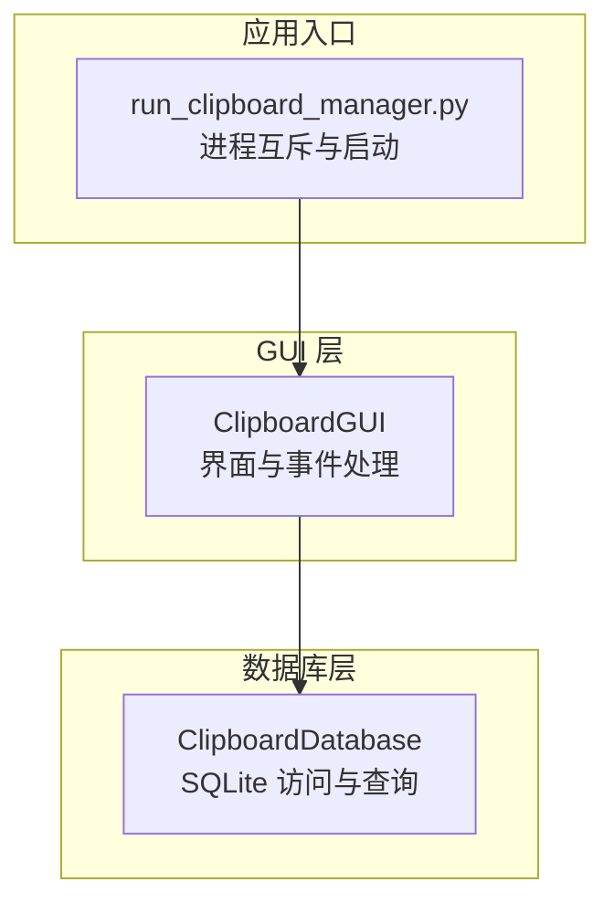
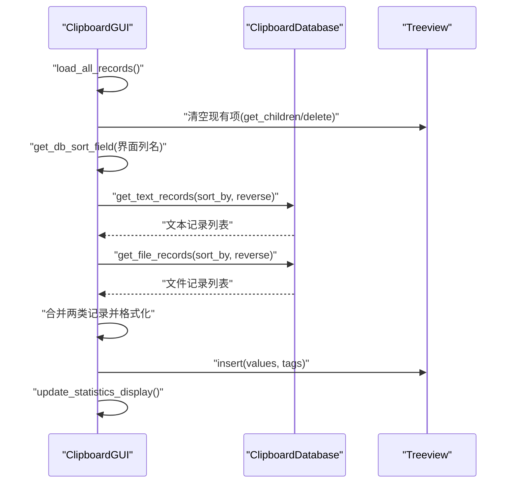
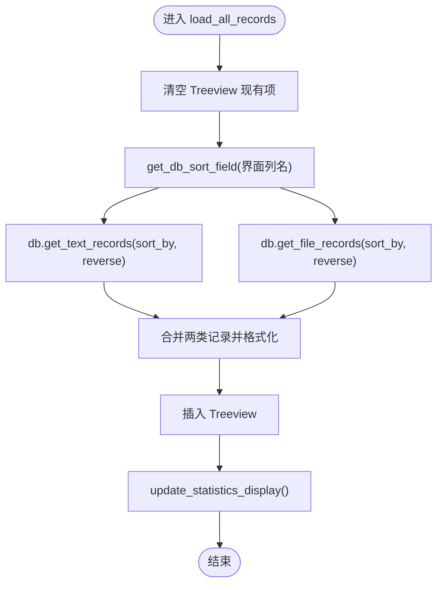
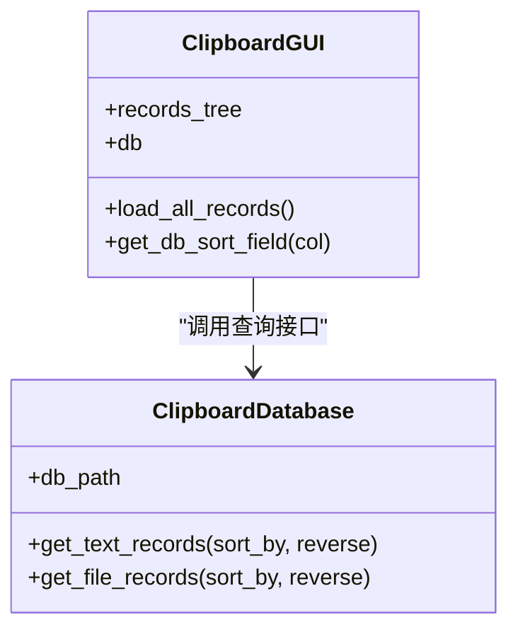

# 数据获取机制

<cite>
**本文引用的文件**
- [clipboard_gui.py](file://clipboard_gui.py)
- [clipboard_db.py](file://clipboard_db.py)
- [clipboard_manager_main.py](file://clipboard_manager_main.py)
- [run_clipboard_manager.py](file://run_clipboard_manager.py)
</cite>

## 目录
1. [简介](#简介)
2. [项目结构](#项目结构)
3. [核心组件](#核心组件)
4. [架构总览](#架构总览)
5. [详细组件分析](#详细组件分析)
6. [依赖关系分析](#依赖关系分析)
7. [性能考量](#性能考量)
8. [故障排查指南](#故障排查指南)
9. [结论](#结论)

## 简介
本文围绕 GUI 层的 load_all_records 方法展开，深入解析其如何通过 ClipboardDatabase 实例获取文本与文件两类记录，并说明：
- get_text_records 与 get_file_records 的调用参数（排序字段映射与排序方向传递）
- 在数据查询前清空树形视图现有项的必要性
- 数据库连接的管理方式与查询结果的数据结构

## 项目结构
本仓库采用“功能分层 + 模块化”的组织方式：
- GUI 层负责界面交互与数据展示（clipboard_gui.py）
- 数据库层封装 SQLite 访问与业务查询（clipboard_db.py）
- 主程序与监控器（clipboard_manager_main.py）
- 启动入口与进程互斥控制（run_clipboard_manager.py）

图表来源
- [clipboard_gui.py](file://clipboard_gui.py#L584-L636)
- [clipboard_db.py](file://clipboard_db.py#L185-L261)
- [run_clipboard_manager.py](file://run_clipboard_manager.py#L32-L66)

章节来源
- [clipboard_gui.py](file://clipboard_gui.py#L584-L636)
- [clipboard_db.py](file://clipboard_db.py#L185-L261)
- [run_clipboard_manager.py](file://run_clipboard_manager.py#L32-L66)

## 核心组件
- ClipboardGUI：提供树形视图、排序、搜索、复制/删除等交互；负责调用数据库层接口并渲染结果。
- ClipboardDatabase：封装 SQLite 表结构、增删改查、统计、过期清理等能力；提供 get_text_records/get_file_records 等查询方法。

章节来源
- [clipboard_gui.py](file://clipboard_gui.py#L584-L636)
- [clipboard_db.py](file://clipboard_db.py#L185-L261)

## 架构总览
GUI 层通过 ClipboardDatabase 的查询接口获取两类记录：
- 文本记录：包含 id、content、timestamp、char_count、md5_hash、number
- 文件记录：包含 id、original_path、saved_path、filename、file_size、file_type、md5_hash、timestamp、number

随后 GUI 层将两类记录统一整理为树形视图的显示元组，插入 Treeview 并更新统计信息。

图表来源
- [clipboard_gui.py](file://clipboard_gui.py#L584-L636)
- [clipboard_db.py](file://clipboard_db.py#L185-L261)

## 详细组件分析

### load_all_records 方法流程与参数映射
- 清空现有项：在每次加载前，遍历并删除 Treeview 中的所有子项，避免旧数据残留与重复叠加。
- 排序字段映射：通过 get_db_sort_field 将界面列名映射为数据库字段名：
  - “名称或内容” → content
  - “类型” → file_type
  - “大小” → file_size
  - “时间” → timestamp
  - “次数” → number
- 排序方向传递：sort_reverse 控制升序/降序，传入两个 get_text_records/get_file_records 调用。
- 查询执行：分别获取文本与文件两类记录，然后统一组装为显示元组，插入 Treeview。
- 统计更新：加载完成后更新统计信息显示。

图表来源
- [clipboard_gui.py](file://clipboard_gui.py#L584-L636)
- [clipboard_db.py](file://clipboard_db.py#L185-L261)

章节来源
- [clipboard_gui.py](file://clipboard_gui.py#L584-L636)
- [clipboard_db.py](file://clipboard_db.py#L185-L261)

### get_text_records 与 get_file_records 的调用参数
- 参数来源：load_all_records 中直接传入
  - sort_by：由 get_db_sort_field 将界面列名转换为数据库字段
  - reverse：由 sort_reverse 决定
- 返回结构：
  - 文本记录：(id, content, timestamp, char_count, md5_hash, number)
  - 文件记录：(id, original_path, saved_path, filename, file_size, file_type, md5_hash, timestamp, number)

章节来源
- [clipboard_gui.py](file://clipboard_gui.py#L584-L636)
- [clipboard_db.py](file://clipboard_db.py#L185-L261)

### 排序字段映射规则
- 列名到数据库字段的映射：
  - “名称或内容” → content
  - “类型” → file_type
  - “大小” → file_size
  - “时间” → timestamp
  - “次数” → number
- 默认回退：若未命中映射，回退到 timestamp

章节来源
- [clipboard_gui.py](file://clipboard_gui.py#L627-L636)
- [clipboard_db.py](file://clipboard_db.py#L194-L201)

### 数据库连接管理方式
- 查询方法内部：
  - 每次查询均新建 sqlite3 连接，执行 SQL 后立即 close，避免连接泄漏。
- GUI 层个别场景：
  - 在搜索结果排序与“显示完整内容/打开文件位置”等少量操作中，也采用“连接-查询-关闭”的短生命周期模式。
- 主程序版本（clipboard_manager_main.py）：
  - 同样遵循“连接-查询-关闭”的模式，保证线程安全与资源释放。

章节来源
- [clipboard_db.py](file://clipboard_db.py#L185-L261)
- [clipboard_gui.py](file://clipboard_gui.py#L678-L783)
- [clipboard_manager_main.py](file://clipboard_manager_main.py#L180-L211)

### 查询结果的数据结构
- 文本记录字段顺序：id, content, timestamp, char_count, md5_hash, number
- 文件记录字段顺序：id, original_path, saved_path, filename, file_size, file_type, md5_hash, timestamp, number
- GUI 层在插入 Treeview 前会将两类记录统一为显示元组：
  - 文本：(content_preview, "文本", "-", timestamp, str(number), "text", record_id)
  - 文件：(filename, file_type, size_str, timestamp, str(number), "file", record_id)

章节来源
- [clipboard_gui.py](file://clipboard_gui.py#L601-L623)
- [clipboard_db.py](file://clipboard_db.py#L185-L261)

### 清空树形视图现有项的必要性
- 避免重复：防止多次点击“刷新/排序”导致重复插入旧数据。
- 一致性：确保 Treeview 内容与当前查询结果严格一致。
- 性能：减少不必要的 UI 更新与内存占用。

章节来源
- [clipboard_gui.py](file://clipboard_gui.py#L587-L590)

## 依赖关系分析
- ClipboardGUI 依赖 ClipboardDatabase 提供的查询接口。
- GUI 层通过 get_db_sort_field 将界面列名与数据库字段解耦，便于后续扩展。
- GUI 层在少数场景下直接使用 sqlite3 连接数据库，但多数查询通过 ClipboardDatabase 统一封装。

图表来源
- [clipboard_gui.py](file://clipboard_gui.py#L584-L636)
- [clipboard_db.py](file://clipboard_db.py#L185-L261)

章节来源
- [clipboard_gui.py](file://clipboard_gui.py#L584-L636)
- [clipboard_db.py](file://clipboard_db.py#L185-L261)

## 性能考量
- 连接开销：每次查询都新建/关闭连接，简单可靠；若未来记录量增大，可考虑连接池或批量查询策略。
- 排序策略：GUI 层对两类记录分别查询后合并，再统一排序；对于大数据量，建议在数据库层完成合并排序，减少 Python 层处理。
- UI 更新：一次性清空并插入，避免频繁局部更新带来的闪烁与卡顿。

## 故障排查指南
- 排序无效或异常：
  - 检查 get_db_sort_field 是否正确映射到数据库字段。
  - 确认 sort_reverse 与界面排序方向一致。
- 数据未刷新：
  - 确认 load_all_records 是否被调用（例如点击“刷新”或“排序列”）。
  - 确认 Treeview 清空逻辑是否执行。
- 数据库连接问题：
  - 若出现连接异常，检查 db_path 是否有效，以及数据库文件权限。
- 搜索结果排序：
  - 搜索场景下 GUI 层会在 Python 层再次排序，注意数值字段解析（如大小、次数）可能因格式差异导致排序异常。

章节来源
- [clipboard_gui.py](file://clipboard_gui.py#L584-L748)
- [clipboard_db.py](file://clipboard_db.py#L185-L314)

## 结论
- load_all_records 通过 ClipboardDatabase 获取文本与文件两类记录，并将界面列名映射为数据库字段，同时传递排序方向，最终统一格式化并插入 Treeview。
- 清空现有项是保证显示一致性的关键步骤。
- 数据库连接采用“短生命周期”模式，简洁可靠；未来可考虑在查询层进一步优化以提升性能。
- GUI 层与数据库层职责清晰，耦合度低，便于维护与扩展。