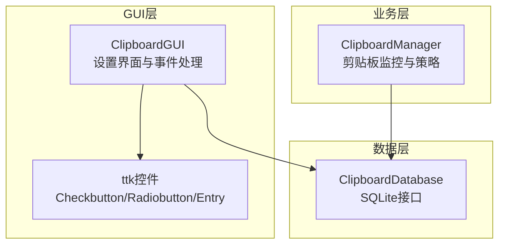
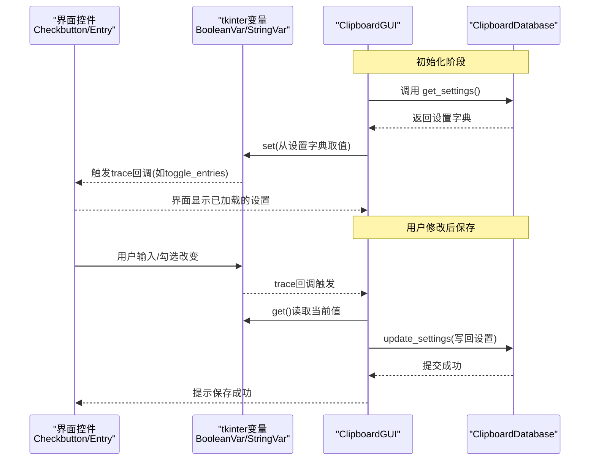
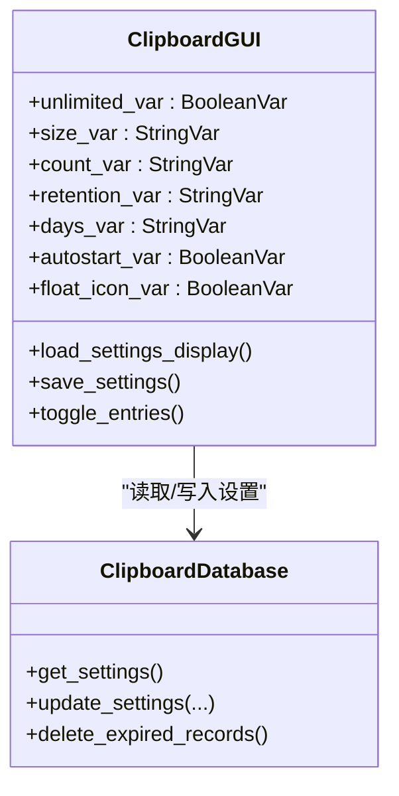
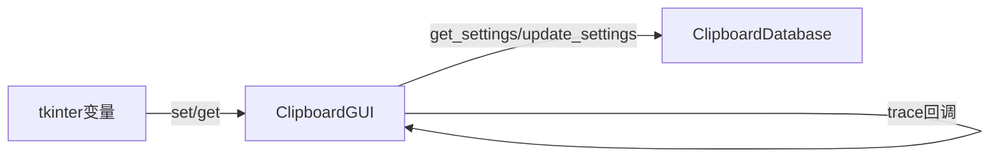

# Tkinter变量同步机制

<cite>
**本文引用的文件**
- [clipboard_gui.py](file://clipboard_gui.py)
- [clipboard_manager_main.py](file://clipboard_manager_main.py)
- [clipboard_db.py](file://clipboard_db.py)
</cite>

## 目录
1. [简介](#简介)
2. [项目结构](#项目结构)
3. [核心组件](#核心组件)
4. [架构总览](#架构总览)
5. [详细组件分析](#详细组件分析)
6. [依赖关系分析](#依赖关系分析)
7. [性能考量](#性能考量)
8. [故障排查指南](#故障排查指南)
9. [结论](#结论)

## 简介
本文件聚焦于tkinter变量在界面与数据模型之间的双向同步机制，重点说明BooleanVar与StringVar如何绑定到复选框与输入框，并通过trace机制监听值变化，从而实现“界面—数据库”的实时联动。文档将以unlimited_var、size_var、count_var等变量为例，解释它们在load_settings_display中从数据库加载值，在save_settings中写回数据库的完整流程，并提供可定位到源码的路径指引，帮助读者快速理解与实践。

## 项目结构
该项目采用“GUI层 + 数据库层”的分层设计：
- GUI层负责界面交互与用户输入收集，使用tkinter变量承载界面状态
- 数据库层封装SQLite访问，提供设置与历史记录的读写接口
- 主程序负责剪贴板监控与GUI启动，GUI层通过数据库接口读写设置

图表来源
- [clipboard_gui.py](file://clipboard_gui.py#L329-L533)
- [clipboard_manager_main.py](file://clipboard_manager_main.py#L355-L496)
- [clipboard_db.py](file://clipboard_db.py#L359-L412)

章节来源
- [clipboard_gui.py](file://clipboard_gui.py#L329-L533)
- [clipboard_manager_main.py](file://clipboard_manager_main.py#L355-L496)
- [clipboard_db.py](file://clipboard_db.py#L359-L412)

## 核心组件
- 界面变量与绑定
  - BooleanVar：用于复选框（如无限模式、开机自启、悬浮图标）
  - StringVar：用于输入框（如最大复制大小、最大数量、保存天数）
- 变量与控件绑定
  - 通过ttk.Checkbutton/Entry的variable参数将控件与tkinter变量绑定
- 值变更监听
  - 使用变量的trace("w", callback)监听写入事件，触发界面状态切换或联动逻辑
- 数据加载与保存
  - load_settings_display：从数据库读取设置并填充界面变量
  - save_settings/update_settings：从界面变量读取并写回数据库

章节来源
- [clipboard_gui.py](file://clipboard_gui.py#L344-L413)
- [clipboard_gui.py](file://clipboard_gui.py#L439-L533)
- [clipboard_db.py](file://clipboard_db.py#L359-L412)

## 架构总览
下面的序列图展示了“界面—数据库”双向同步的关键流程：从界面加载设置到数据库，再到用户修改界面后保存回数据库。

图表来源
- [clipboard_gui.py](file://clipboard_gui.py#L439-L533)
- [clipboard_db.py](file://clipboard_db.py#L359-L412)

## 详细组件分析

### 界面变量声明与绑定
- 复选框绑定BooleanVar
  - 无限模式：unlimited_var
  - 开机自启：autostart_var
  - 悬浮图标：float_icon_var
- 输入框绑定StringVar
  - 最大大小：size_var（单位MB）
  - 最大数量：count_var（个）
  - 保存天数：days_var（天）
- 单选框绑定StringVar
  - 保存策略：retention_var（permanent/custom）

章节来源
- [clipboard_gui.py](file://clipboard_gui.py#L344-L413)
- [clipboard_gui.py](file://clipboard_gui.py#L376-L393)

### 值变更监听（trace）
- 无限模式复选框
  - 通过unlimited_var.trace("w", ...)监听写入事件，回调中切换其他输入框的状态（启用/禁用）
- 保存天数单选框
  - 通过retention_var.trace("w", ...)监听写入事件，动态启用/禁用“自定义天数”输入框

章节来源
- [clipboard_gui.py](file://clipboard_gui.py#L436-L438)
- [clipboard_gui.py](file://clipboard_gui.py#L1022-L1029)

### 从数据库加载值（load_settings_display）
- 从数据库读取设置字典
- 将字典中的值set到对应tkinter变量
- 根据retention_days控制days_entry的可用状态
- 调用toggle_entries应用初始状态

章节来源
- [clipboard_gui.py](file://clipboard_gui.py#L439-L462)

### 写回数据库（save_settings）
- 从界面变量读取当前值
- 若非无限模式，校验并转换单位（MB→Bytes）
- 调用update_settings写回数据库
- 根据retention_days决定是否删除过期记录
- 更新开机自启与悬浮图标等系统级设置

章节来源
- [clipboard_gui.py](file://clipboard_gui.py#L477-L533)
- [clipboard_db.py](file://clipboard_db.py#L387-L412)

### 实际代码示例路径（变量声明、绑定与值同步）
- 复选框与输入框变量声明与绑定
  - [变量声明与绑定位置](file://clipboard_gui.py#L344-L413)
- 值变更监听（trace）
  - [无限模式trace回调](file://clipboard_gui.py#L436-L438)
  - [保存天数trace回调](file://clipboard_gui.py#L1022-L1029)
- 从数据库加载值
  - [load_settings_display实现](file://clipboard_gui.py#L439-L462)
- 写回数据库
  - [save_settings实现](file://clipboard_gui.py#L477-L533)
  - [update_settings实现](file://clipboard_db.py#L387-L412)

章节来源
- [clipboard_gui.py](file://clipboard_gui.py#L344-L413)
- [clipboard_gui.py](file://clipboard_gui.py#L436-L438)
- [clipboard_gui.py](file://clipboard_gui.py#L439-L462)
- [clipboard_gui.py](file://clipboard_gui.py#L477-L533)
- [clipboard_db.py](file://clipboard_db.py#L387-L412)

### 类关系与数据流（代码级）

图表来源
- [clipboard_gui.py](file://clipboard_gui.py#L344-L533)
- [clipboard_db.py](file://clipboard_db.py#L359-L412)

## 依赖关系分析
- GUI层依赖数据库层提供的设置读写接口
- 界面变量与控件之间通过variable参数建立强绑定
- trace回调用于驱动界面状态联动（如启用/禁用输入框）
- 数据库层负责持久化与一致性（如retention_days为0表示永久保存）

图表来源
- [clipboard_gui.py](file://clipboard_gui.py#L439-L533)
- [clipboard_db.py](file://clipboard_db.py#L359-L412)

章节来源
- [clipboard_gui.py](file://clipboard_gui.py#L439-L533)
- [clipboard_db.py](file://clipboard_db.py#L359-L412)

## 性能考量
- trace回调应保持轻量，避免在回调中执行耗时操作
- 批量写入设置时，尽量合并update_settings调用，减少数据库往返
- 界面状态切换（启用/禁用）应在trace回调中即时完成，避免用户感知延迟

## 故障排查指南
- 无效数字输入
  - 现象：保存设置时报错“请输入有效的数字”
  - 排查：确认size_var/count_var/days_var的输入是否为合法数值
  - 参考路径：[异常处理位置](file://clipboard_gui.py#L531-L533)
- 无限模式与输入框状态不一致
  - 现象：切换无限模式后输入框未按预期启用/禁用
  - 排查：确认unlimited_var.trace回调是否触发，toggle_entries是否正确遍历控件
  - 参考路径：[trace回调与状态切换](file://clipboard_gui.py#L436-L438), [toggle_entries实现](file://clipboard_gui.py#L463-L476)
- 保存天数未生效
  - 现象：选择了“永久保存”，但界面仍显示自定义天数输入框
  - 排查：确认retention_var.trace回调是否正确设置days_entry状态
  - 参考路径：[retention_var.trace回调](file://clipboard_gui.py#L1022-L1029)

章节来源
- [clipboard_gui.py](file://clipboard_gui.py#L531-L533)
- [clipboard_gui.py](file://clipboard_gui.py#L436-L438)
- [clipboard_gui.py](file://clipboard_gui.py#L463-L476)
- [clipboard_gui.py](file://clipboard_gui.py#L1022-L1029)

## 结论
本项目通过tkinter变量与ttk控件的强绑定，配合trace机制实现了界面与数据库的高效双向同步。BooleanVar与StringVar分别承担布尔与字符串类配置项的承载，load_settings_display与save_settings形成完整的读写闭环。通过合理使用trace回调，界面状态得以即时联动，用户体验流畅。建议在后续扩展中继续沿用该模式，确保界面与数据的一致性与可维护性。