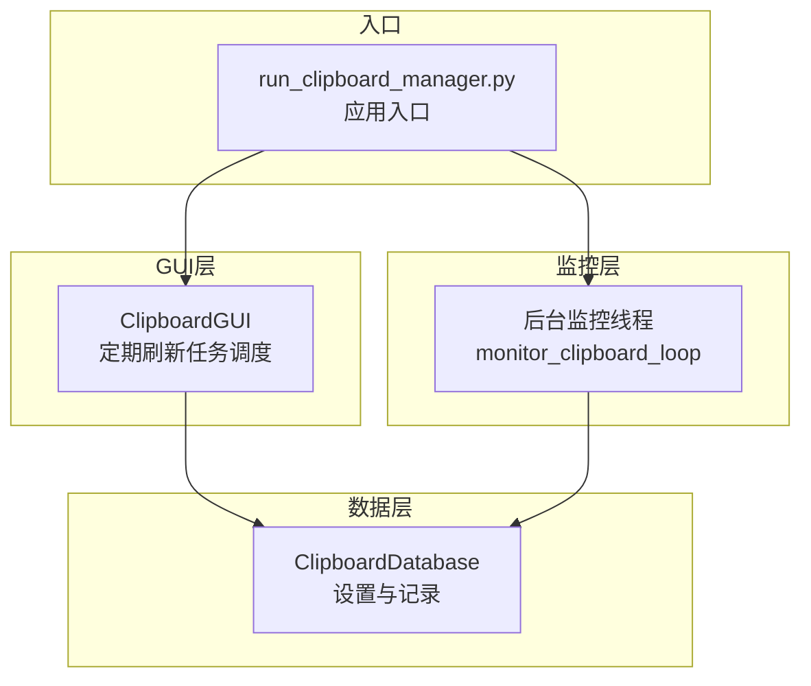
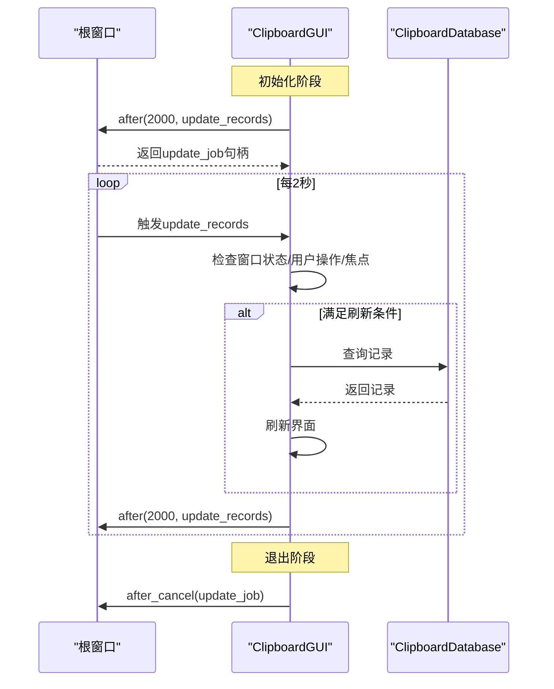
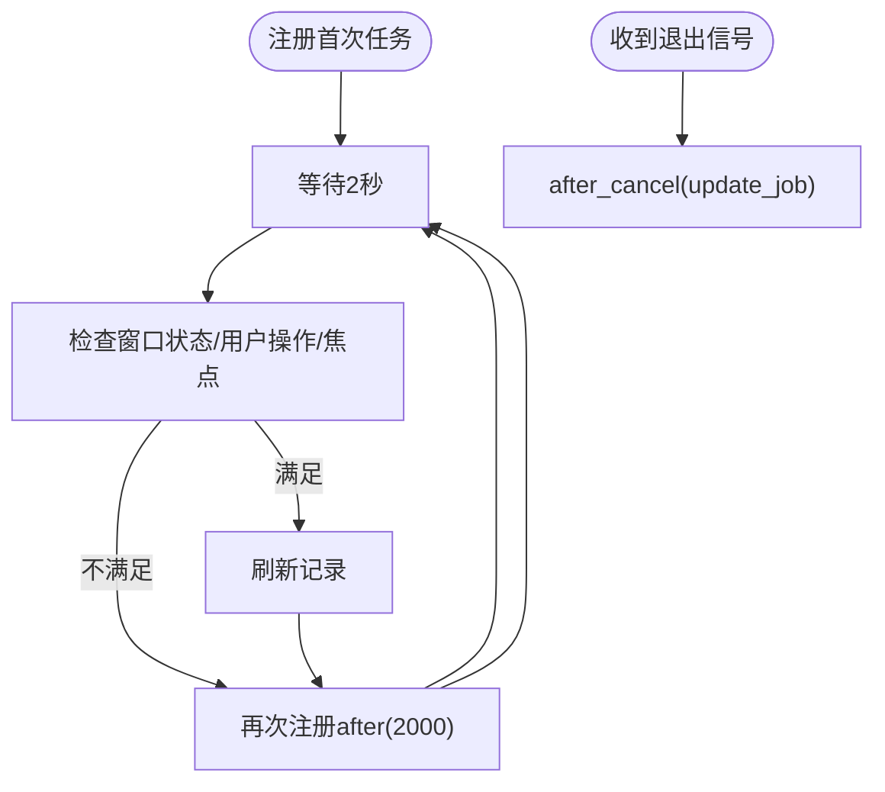
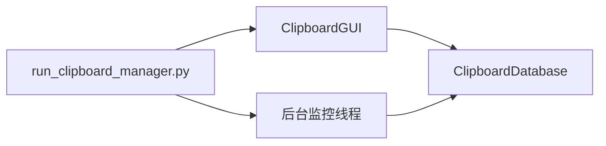

# 定期更新任务调度

<cite>
**本文引用的文件**
- [clipboard_gui.py](file://clipboard_gui.py)
- [clipboard_manager_main.py](file://clipboard_manager_main.py)
- [run_clipboard_manager.py](file://run_clipboard_manager.py)
- [clipboard_db.py](file://clipboard_db.py)
</cite>

## 目录
1. [简介](#简介)
2. [项目结构](#项目结构)
3. [核心组件](#核心组件)
4. [架构总览](#架构总览)
5. [详细组件分析](#详细组件分析)
6. [依赖关系分析](#依赖关系分析)
7. [性能考量](#性能考量)
8. [故障排查指南](#故障排查指南)
9. [结论](#结论)

## 简介
本文件聚焦于“定期刷新任务”在GUI界面中的调度机制，围绕update_job属性、start_auto_update与stop_auto_update方法，解释tkinter的after机制如何周期性调度更新任务，并说明任务调度间隔的配置方式及对系统资源消耗的影响。文档还提供任务注册、执行与取消的完整生命周期管理示例路径，帮助读者快速定位实现细节。

## 项目结构
该项目由GUI界面、剪贴板监控与数据库模块组成，其中GUI负责定期刷新记录展示，监控线程负责后台采集剪贴板内容，数据库负责持久化与设置管理。

图表来源
- [run_clipboard_manager.py](file://run_clipboard_manager.py#L32-L66)
- [clipboard_gui.py](file://clipboard_gui.py#L1676-L1708)
- [clipboard_manager_main.py](file://clipboard_manager_main.py#L717-L759)
- [clipboard_db.py](file://clipboard_db.py#L77-L120)

章节来源
- [run_clipboard_manager.py](file://run_clipboard_manager.py#L32-L66)
- [clipboard_gui.py](file://clipboard_gui.py#L1676-L1708)
- [clipboard_manager_main.py](file://clipboard_manager_main.py#L717-L759)

## 核心组件
- ClipboardGUI：负责GUI界面与定期刷新任务的调度，核心字段与方法：
  - update_job：存储tkinter.after返回的定时器句柄，用于后续取消
  - start_auto_update：注册每2秒执行一次的更新任务
  - stop_auto_update：取消已注册的更新任务
  - update_records：实际执行记录刷新逻辑，并在末尾再次注册下一次任务
- ClipboardDatabase：提供设置读写与记录查询能力，影响刷新策略的触发条件
- run_clipboard_manager.py：应用入口，创建GUI并默认隐藏主窗口，仅保留系统托盘

章节来源
- [clipboard_gui.py](file://clipboard_gui.py#L40-L50)
- [clipboard_gui.py](file://clipboard_gui.py#L1676-L1708)
- [clipboard_db.py](file://clipboard_db.py#L77-L120)
- [run_clipboard_manager.py](file://run_clipboard_manager.py#L32-L66)

## 架构总览
GUI通过tkinter.after以固定间隔调用update_records，后者在满足条件时刷新记录列表，并再次注册下一次after任务，形成闭环。stop_auto_update在退出时取消该任务，避免资源泄漏。

图表来源
- [clipboard_gui.py](file://clipboard_gui.py#L1676-L1708)
- [clipboard_db.py](file://clipboard_db.py#L181-L211)

## 详细组件分析

### 定时器调度与生命周期
- 任务注册
  - 在GUI初始化完成后，立即注册首次定时任务：after(2000, update_records)
  - update_job保存该任务句柄，便于后续取消
  - 参考路径：[clipboard_gui.py](file://clipboard_gui.py#L1676-L1679)
- 任务执行
  - update_records在每次触发时检查窗口状态、用户操作与焦点状态
  - 若满足条件（未隐藏、无用户操作、无焦点），则刷新记录
  - 执行完毕后再次注册下一次after(2000, update_records)，形成循环
  - 参考路径：[clipboard_gui.py](file://clipboard_gui.py#L1686-L1696)
- 任务取消
  - stop_auto_update在退出时调用after_cancel取消update_job
  - 参考路径：[clipboard_gui.py](file://clipboard_gui.py#L1680-L1685)
- 退出流程
  - quit_application在退出前调用stop_auto_update，确保清理
  - 参考路径：[clipboard_gui.py](file://clipboard_gui.py#L1709-L1715)

图表来源
- [clipboard_gui.py](file://clipboard_gui.py#L1676-L1708)

章节来源
- [clipboard_gui.py](file://clipboard_gui.py#L1676-L1708)

### 调度间隔配置与资源影响
- 固定间隔
  - 当前实现中，调度间隔为2000毫秒（2秒），在start_auto_update与update_records中均体现
  - 参考路径：[clipboard_gui.py](file://clipboard_gui.py#L1676-L1679)、[clipboard_gui.py](file://clipboard_gui.py#L1694-L1696)
- 资源消耗控制
  - update_records在以下条件下跳过刷新，降低CPU与I/O压力：
    - 窗口处于隐藏状态（is_hidden为True）
    - 存在用户操作进行中（user_action_in_progress为True）
    - 窗口具有焦点（has_focus为True）
  - 参考路径：[clipboard_gui.py](file://clipboard_gui.py#L1686-L1693)
- 设置项对刷新策略的影响
  - GUI侧设置项（如开机自启、悬浮图标等）通过ClipboardDatabase更新，但不会直接影响定时器间隔
  - 刷新频率受update_job调度逻辑控制，不受设置项直接改变
  - 参考路径：[clipboard_db.py](file://clipboard_db.py#L77-L120)

章节来源
- [clipboard_gui.py](file://clipboard_gui.py#L1676-L1708)
- [clipboard_db.py](file://clipboard_db.py#L77-L120)

### 任务注册、执行与取消的完整生命周期
- 注册
  - GUI初始化后注册首次定时任务
  - 参考路径：[clipboard_gui.py](file://clipboard_gui.py#L1676-L1679)
- 执行
  - 每2秒触发一次update_records，满足条件时刷新记录
  - 参考路径：[clipboard_gui.py](file://clipboard_gui.py#L1686-L1696)
- 取消
  - 退出时调用after_cancel取消update_job
  - 参考路径：[clipboard_gui.py](file://clipboard_gui.py#L1680-L1685)

章节来源
- [clipboard_gui.py](file://clipboard_gui.py#L1676-L1708)

## 依赖关系分析
- GUI依赖数据库进行记录查询与统计展示，刷新逻辑依赖数据库接口
- 入口脚本负责创建GUI与后台监控线程，GUI与监控线程相互独立，互不影响定时器调度

图表来源
- [clipboard_gui.py](file://clipboard_gui.py#L1676-L1708)
- [clipboard_manager_main.py](file://clipboard_manager_main.py#L717-L759)
- [run_clipboard_manager.py](file://run_clipboard_manager.py#L32-L66)

章节来源
- [clipboard_gui.py](file://clipboard_gui.py#L1676-L1708)
- [clipboard_manager_main.py](file://clipboard_manager_main.py#L717-L759)
- [run_clipboard_manager.py](file://run_clipboard_manager.py#L32-L66)

## 性能考量
- 刷新频率与资源占用
  - 2秒的刷新间隔在保证实时性的同时，显著降低了CPU与数据库查询压力
  - 通过条件判断避免在用户交互或窗口隐藏时刷新，进一步减少无效开销
- 数据库访问
  - 刷新时仅进行轻量级查询与界面更新，避免长时间阻塞主线程
- 线程与事件循环
  - 定时器基于tkinter事件循环，不会阻塞其他UI交互
- 可扩展性
  - 若需调整刷新频率，可在start_auto_update与update_records中统一修改间隔参数

[本节为通用指导，不直接分析具体文件]

## 故障排查指南
- 定时器未停止导致内存泄漏
  - 确认在退出流程中调用了stop_auto_update
  - 参考路径：[clipboard_gui.py](file://clipboard_gui.py#L1709-L1715)
- 刷新不生效
  - 检查窗口是否隐藏（is_hidden）、是否存在用户操作（user_action_in_progress）、窗口是否具有焦点（has_focus）
  - 参考路径：[clipboard_gui.py](file://clipboard_gui.py#L1686-L1693)
- 刷新频率不符合预期
  - 确认start_auto_update与update_records中的间隔参数一致
  - 参考路径：[clipboard_gui.py](file://clipboard_gui.py#L1676-L1679)、[clipboard_gui.py](file://clipboard_gui.py#L1694-L1696)

章节来源
- [clipboard_gui.py](file://clipboard_gui.py#L1676-L1708)

## 结论
本项目通过tkinter.after实现了稳定的定期刷新任务调度：start_auto_update负责注册任务，update_records负责执行与续期，stop_auto_update负责清理。当前实现采用2秒间隔，并结合窗口状态与用户操作状态进行资源优化。若需调整刷新频率，可在start_auto_update与update_records中统一修改间隔参数，即可实现灵活的调度配置。