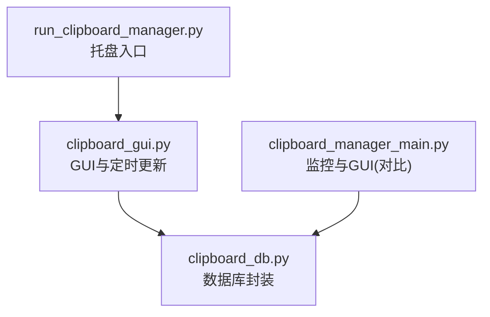
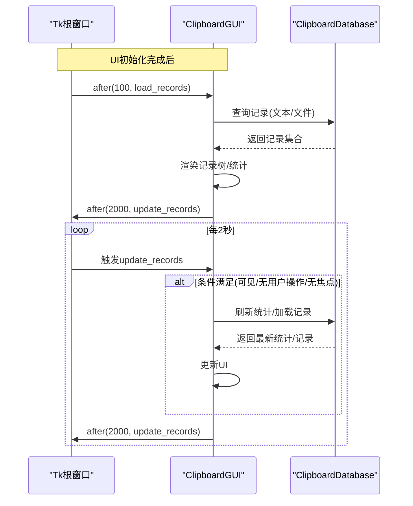
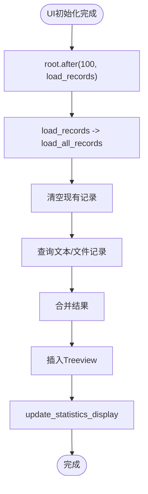
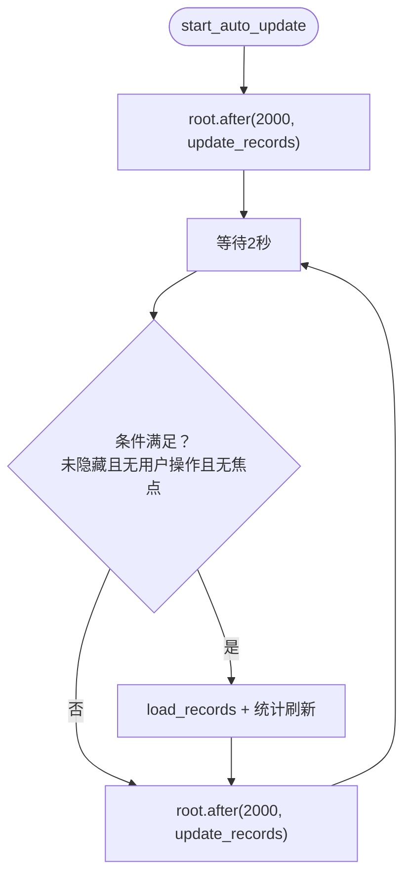
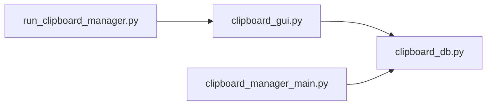

# 延迟加载与定时更新机制

<cite>
**本文引用的文件**
- [clipboard_gui.py](file://clipboard_gui.py)
- [clipboard_manager_main.py](file://clipboard_manager_main.py)
- [run_clipboard_manager.py](file://run_clipboard_manager.py)
- [clipboard_db.py](file://clipboard_db.py)
</cite>

## 目录
1. [简介](#简介)
2. [项目结构](#项目结构)
3. [核心组件](#核心组件)
4. [架构总览](#架构总览)
5. [详细组件分析](#详细组件分析)
6. [依赖关系分析](#依赖关系分析)
7. [性能考量](#性能考量)
8. [故障排查指南](#故障排查指南)
9. [结论](#结论)

## 简介
本文件聚焦于通过 Tkinter 的 after 方法实现的“延迟加载”和“定时更新”机制，解释以下要点：
- UI 初始化完成后使用 after(100, load_records) 延迟加载数据，避免界面卡顿。
- start_auto_update 如何设置周期性任务（默认每2秒）自动刷新记录和统计信息。
- 延迟时间和更新间隔的优化策略。
- 如何通过 stop_auto_update 及时释放资源，避免资源泄漏。

## 项目结构
围绕 GUI 与数据库交互的关键文件如下：
- clipboard_gui.py：GUI 主体，负责 UI 初始化、延迟加载、定时更新、统计展示等。
- clipboard_manager_main.py：剪贴板监控与 GUI 主界面（另一个 GUI 实现），用于对比理解。
- run_clipboard_manager.py：系统托盘运行入口，负责启动监控线程与 GUI。
- clipboard_db.py：数据库封装，提供记录查询、统计、设置读写等。

图表来源
- [clipboard_gui.py](file://clipboard_gui.py#L50-L75)
- [run_clipboard_manager.py](file://run_clipboard_manager.py#L47-L66)
- [clipboard_manager_main.py](file://clipboard_manager_main.py#L731-L761)
- [clipboard_db.py](file://clipboard_db.py#L1-L40)

章节来源
- [clipboard_gui.py](file://clipboard_gui.py#L50-L75)
- [run_clipboard_manager.py](file://run_clipboard_manager.py#L47-L66)
- [clipboard_manager_main.py](file://clipboard_manager_main.py#L731-L761)
- [clipboard_db.py](file://clipboard_db.py#L1-L40)

## 核心组件
- GUI 初始化与延迟加载
  - UI 创建完成后，调用 after(100, load_records)，在主线程空闲时执行数据加载，避免阻塞界面绘制。
- 定时更新
  - start_auto_update 设置周期性任务，每2秒触发一次 update_records。
  - update_records 在满足条件（窗口可见、无用户操作、无焦点）时刷新记录，并继续安排下一次任务。
  - stop_auto_update 取消已安排的任务，防止资源泄漏。
- 统计信息展示
  - update_statistics_display 从数据库获取统计信息并更新 UI。

章节来源
- [clipboard_gui.py](file://clipboard_gui.py#L50-L75)
- [clipboard_gui.py](file://clipboard_gui.py#L554-L626)
- [clipboard_gui.py](file://clipboard_gui.py#L1676-L1696)
- [clipboard_gui.py](file://clipboard_gui.py#L1680-L1685)

## 架构总览
GUI 通过 Tkinter 的 after 机制实现“延迟加载”和“定时更新”，数据库由 ClipboardDatabase 提供统一接口。

图表来源
- [clipboard_gui.py](file://clipboard_gui.py#L50-L75)
- [clipboard_gui.py](file://clipboard_gui.py#L554-L626)
- [clipboard_gui.py](file://clipboard_gui.py#L1676-L1696)

## 详细组件分析

### 延迟加载（after(100, load_records)）
- 时机：UI 创建完毕后立即安排 100ms 后执行 load_records。
- 目的：让 Tkinter 先完成窗口绘制与布局，再进行数据加载，避免界面卡顿。
- 执行流程：
  - 清空现有记录
  - 依据当前排序列映射数据库字段，分别查询文本与文件记录
  - 合并结果并插入 Treeview
  - 调用 update_statistics_display 更新统计信息

图表来源
- [clipboard_gui.py](file://clipboard_gui.py#L50-L75)
- [clipboard_gui.py](file://clipboard_gui.py#L581-L626)
- [clipboard_gui.py](file://clipboard_gui.py#L554-L580)

章节来源
- [clipboard_gui.py](file://clipboard_gui.py#L50-L75)
- [clipboard_gui.py](file://clipboard_gui.py#L581-L626)
- [clipboard_gui.py](file://clipboard_gui.py#L554-L580)

### 定时更新（start_auto_update 与 update_records）
- 启动：start_auto_update 安排第一次任务（2000ms 后）。
- 循环：update_records 在满足条件时刷新数据，然后再次安排下一次任务。
- 条件控制：
  - is_hidden：窗口是否隐藏
  - user_action_in_progress：是否存在用户操作
  - has_focus：窗口是否有焦点
- 停止：stop_auto_update 取消当前任务，避免后续重复刷新。

图表来源
- [clipboard_gui.py](file://clipboard_gui.py#L1676-L1696)
- [clipboard_gui.py](file://clipboard_gui.py#L1680-L1685)

章节来源
- [clipboard_gui.py](file://clipboard_gui.py#L1676-L1696)
- [clipboard_gui.py](file://clipboard_gui.py#L1680-L1685)

### 统计信息展示（update_statistics_display）
- 从数据库获取文本记录数、文件记录数与文件总大小。
- 格式化输出到统计文本控件。
- 该方法在 load_all_records 结束后被调用，保证统计与数据一致。

章节来源
- [clipboard_gui.py](file://clipboard_gui.py#L554-L580)
- [clipboard_db.py](file://clipboard_db.py#L316-L332)

### 资源释放（stop_auto_update 与退出）
- stop_auto_update：取消当前计划任务，防止后续重复刷新。
- 退出流程：quit_application 调用 stop_auto_update，停止托盘图标，退出主循环。

章节来源
- [clipboard_gui.py](file://clipboard_gui.py#L1680-L1685)
- [clipboard_gui.py](file://clipboard_gui.py#L1709-L1715)

## 依赖关系分析
- GUI 依赖数据库接口进行数据查询与统计。
- 运行入口 run_clipboard_manager.py 负责启动监控线程与 GUI，GUI 通过 after 机制进行 UI 侧的延迟与定时刷新。
- clipboard_manager_main.py 提供另一种 GUI 实现，便于对比理解不同实现下的定时更新策略。

图表来源
- [run_clipboard_manager.py](file://run_clipboard_manager.py#L47-L66)
- [clipboard_gui.py](file://clipboard_gui.py#L50-L75)
- [clipboard_manager_main.py](file://clipboard_manager_main.py#L731-L761)
- [clipboard_db.py](file://clipboard_db.py#L1-L40)

章节来源
- [run_clipboard_manager.py](file://run_clipboard_manager.py#L47-L66)
- [clipboard_gui.py](file://clipboard_gui.py#L50-L75)
- [clipboard_manager_main.py](file://clipboard_manager_main.py#L731-L761)
- [clipboard_db.py](file://clipboard_db.py#L1-L40)

## 性能考量
- 延迟加载（100ms）的合理性
  - 100ms 足以让 Tkinter 完成窗口绘制与布局，随后再加载数据，避免界面卡顿。
  - 若数据量较大，可考虑进一步增大延迟或采用分页/懒加载策略。
- 定时更新间隔（2000ms）
  - 2 秒间隔对桌面应用较为友好，避免频繁数据库查询与 UI 刷新。
  - 若希望更实时，可降低间隔，但需评估 CPU 与 IO 压力。
- 条件控制
  - 仅在窗口可见、无用户操作、无焦点时刷新，减少对用户操作的干扰。
- 数据库查询
  - load_all_records 中对文本与文件记录分别查询并合并，建议保持查询范围合理，避免一次性加载过多数据。
- 统计刷新
  - 统计信息通常开销较小，可在刷新记录时一并更新，保证一致性。

[本节为通用性能建议，不直接分析具体文件]

## 故障排查指南
- 界面卡顿
  - 检查是否在 UI 初始化前进行了大量数据加载。应确保使用 after 延迟加载。
- 定时更新无效
  - 确认 start_auto_update 是否被调用，以及 stop_auto_update 是否在退出时被调用。
  - 检查 update_records 的条件判断（is_hidden、user_action_in_progress、has_focus）是否导致未刷新。
- 资源泄漏
  - 退出时务必调用 stop_auto_update，确保取消所有 after 任务。
- 统计信息不更新
  - 确保 load_all_records 结束后调用了 update_statistics_display。

章节来源
- [clipboard_gui.py](file://clipboard_gui.py#L50-L75)
- [clipboard_gui.py](file://clipboard_gui.py#L554-L626)
- [clipboard_gui.py](file://clipboard_gui.py#L1676-L1696)
- [clipboard_gui.py](file://clipboard_gui.py#L1680-L1685)
- [clipboard_gui.py](file://clipboard_gui.py#L1709-L1715)

## 结论
- 通过 after(100, load_records) 实现的延迟加载有效避免了 UI 初始化阶段的数据加载卡顿。
- start_auto_update 与 update_records 的组合提供了稳定的定时刷新机制，配合条件控制避免对用户操作造成干扰。
- stop_auto_update 在退出时及时取消任务，有助于资源释放与稳定性。
- 延迟时间与更新间隔可根据实际数据规模与用户反馈进行优化调整。