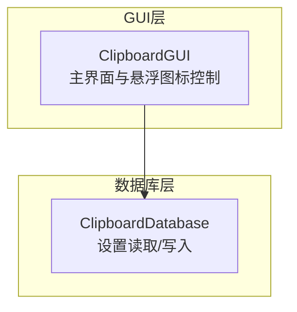
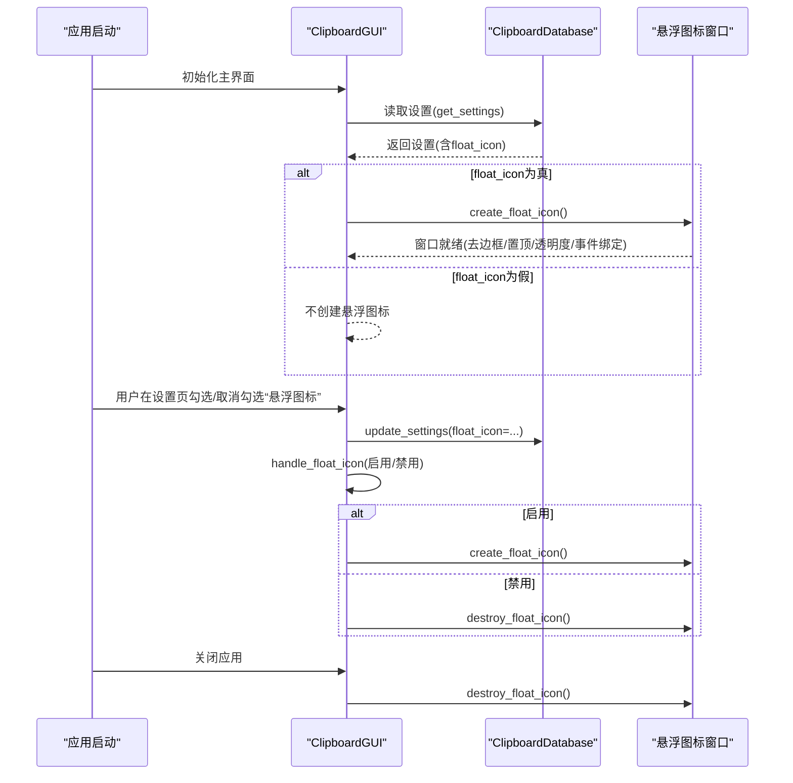
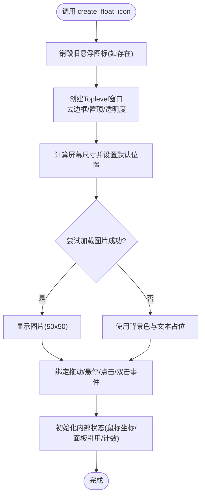
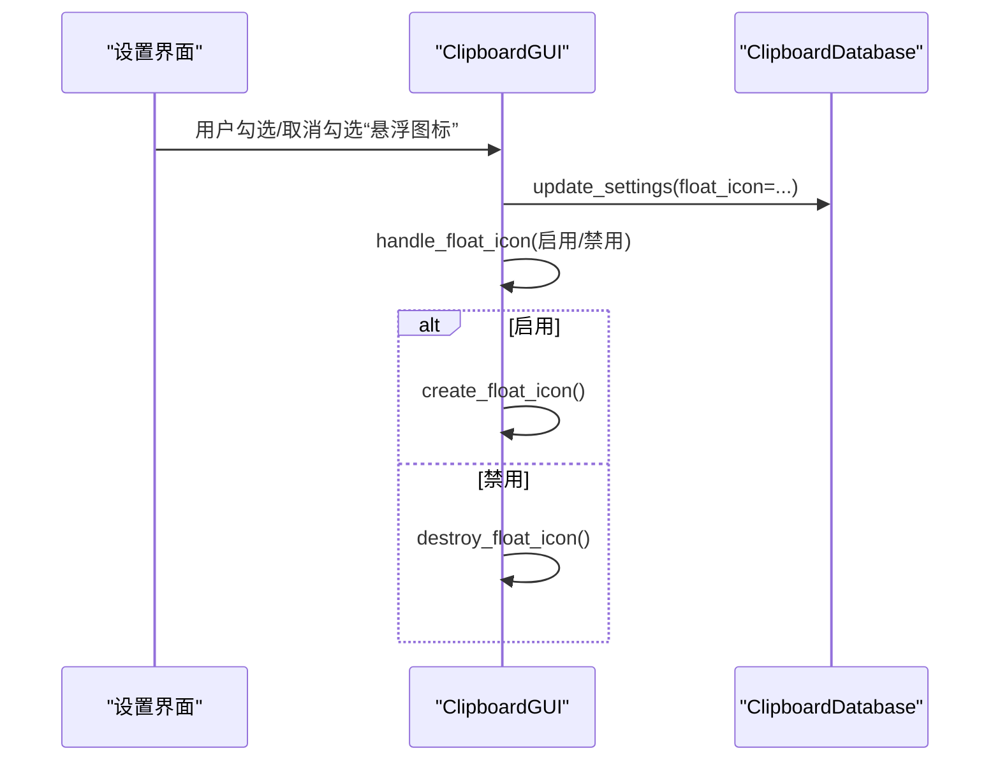
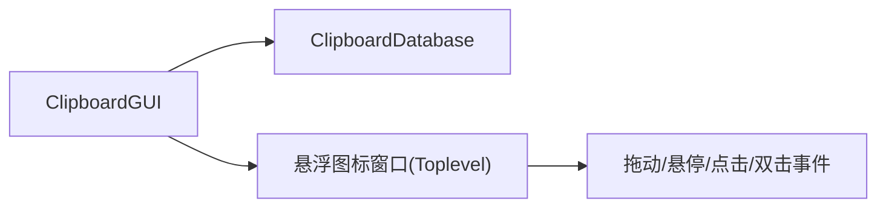

# 悬浮窗口生命周期管理

<cite>
**本文引用的文件**
- [clipboard_gui.py](file://clipboard_gui.py)
- [clipboard_db.py](file://clipboard_db.py)
</cite>

## 目录
1. [简介](#简介)
2. [项目结构](#项目结构)
3. [核心组件](#核心组件)
4. [架构总览](#架构总览)
5. [详细组件分析](#详细组件分析)
6. [依赖关系分析](#依赖关系分析)
7. [性能考量](#性能考量)
8. [故障排查指南](#故障排查指南)
9. [结论](#结论)

## 简介
本文件聚焦于“float_window”悬浮窗口的生命周期管理机制，围绕以下目标展开：
- 说明 create_float_icon 方法如何创建悬浮图标窗口
- 解释 handle_float_icon 如何根据设置启用或销毁该窗口
- 阐述悬浮窗口的UI特性（50×50大小、15%透明度、可拖动）及其事件绑定（点击显示主界面）
- 总结该窗口在程序启动、设置变更和关闭时的创建与销毁逻辑

## 项目结构
悬浮窗口相关逻辑集中在 GUI 主类中，数据库模块提供设置项的持久化能力。关键文件如下：
- GUI 主类：负责界面、悬浮图标创建与事件绑定、面板显示与隐藏等
- 数据库模块：负责设置项的读取与写入，包括 float_icon 开关

图表来源
- [clipboard_gui.py](file://clipboard_gui.py#L37-L120)
- [clipboard_db.py](file://clipboard_db.py#L359-L412)

章节来源
- [clipboard_gui.py](file://clipboard_gui.py#L37-L120)
- [clipboard_db.py](file://clipboard_db.py#L359-L412)

## 核心组件
- 悬浮图标窗口对象：由 create_float_icon 创建，使用 Toplevel 实现，具备去边框、置顶、透明度等属性
- 事件绑定：支持拖动（按下/拖动）、悬停显示面板、点击显示主界面、双击显示主界面
- 生命周期控制：handle_float_icon 根据设置启用/销毁；destroy_float_icon 提供显式销毁；check_float_icon 在启动时依据设置创建

章节来源
- [clipboard_gui.py](file://clipboard_gui.py#L1163-L1269)
- [clipboard_gui.py](file://clipboard_gui.py#L1633-L1669)

## 架构总览
悬浮窗口生命周期贯穿应用启动、设置变更与退出三个阶段，形成闭环管理。

图表来源
- [clipboard_gui.py](file://clipboard_gui.py#L60-L90)
- [clipboard_gui.py](file://clipboard_gui.py#L80-L90)
- [clipboard_gui.py](file://clipboard_gui.py#L508-L533)
- [clipboard_gui.py](file://clipboard_gui.py#L1163-L1269)
- [clipboard_gui.py](file://clipboard_gui.py#L1633-L1669)
- [clipboard_db.py](file://clipboard_db.py#L359-L412)

## 详细组件分析

### 悬浮图标创建流程（create_float_icon）
- 先行销毁旧实例：若已存在悬浮图标，先调用 destroy_float_icon 确保幂等
- 创建窗口：使用 Toplevel 作为悬浮图标容器，设置标题、几何尺寸、去边框、置顶、透明度
- 默认位置：基于屏幕宽高计算，右下角偏移，保证可见性
- 图像/占位：优先加载图片并缩放至 50×50；失败则使用背景色与文本占位
- 事件绑定：鼠标按下开始拖动、鼠标拖动移动、悬停显示面板、离开检查隐藏、点击显示面板、双击显示主界面
- 内部状态：记录鼠标按下坐标、面板引用、点击计数等

图表来源
- [clipboard_gui.py](file://clipboard_gui.py#L1173-L1234)

章节来源
- [clipboard_gui.py](file://clipboard_gui.py#L1173-L1234)

### 启用/禁用控制（handle_float_icon）
- 接收布尔参数 enable
- 启用：调用 create_float_icon
- 禁用：调用 destroy_float_icon

章节来源
- [clipboard_gui.py](file://clipboard_gui.py#L1163-L1172)

### 设置驱动的创建/销毁（check_float_icon 与 save_settings）
- 启动时检查：应用初始化后读取设置，若开启则创建悬浮图标
- 设置变更：用户在设置页勾选/取消勾选“悬浮图标”，保存设置后调用 handle_float_icon
- 数据持久化：设置项 float_icon 存储于数据库 settings 表中

图表来源
- [clipboard_gui.py](file://clipboard_gui.py#L408-L429)
- [clipboard_gui.py](file://clipboard_gui.py#L441-L462)
- [clipboard_gui.py](file://clipboard_gui.py#L508-L533)
- [clipboard_gui.py](file://clipboard_gui.py#L1163-L1172)
- [clipboard_db.py](file://clipboard_db.py#L359-L412)

章节来源
- [clipboard_gui.py](file://clipboard_gui.py#L408-L429)
- [clipboard_gui.py](file://clipboard_gui.py#L441-L462)
- [clipboard_gui.py](file://clipboard_gui.py#L508-L533)
- [clipboard_gui.py](file://clipboard_gui.py#L1163-L1172)
- [clipboard_db.py](file://clipboard_db.py#L359-L412)

### UI特性与事件绑定
- 尺寸与透明度：窗口几何尺寸为 50×50，透明度通过属性设置
- 置顶与去边框：置顶显示，去除窗口边框，便于悬浮展示
- 可拖动：按下与拖动事件配合，实现窗口自由拖动
- 交互事件：
  - 悬停显示面板
  - 点击显示面板
  - 双击显示主界面
  - 离开检查隐藏面板

章节来源
- [clipboard_gui.py](file://clipboard_gui.py#L1179-L1228)

### 销毁与退出
- 显式销毁：destroy_float_icon 负责安全销毁悬浮图标窗口
- 应用退出：退出时停止自动更新并销毁托盘图标，同时销毁悬浮图标，确保资源释放

章节来源
- [clipboard_gui.py](file://clipboard_gui.py#L1633-L1669)
- [clipboard_gui.py](file://clipboard_gui.py#L1697-L1715)

## 依赖关系分析
- GUI 依赖数据库模块读取/写入设置
- 悬浮图标窗口为 GUI 的子窗口，受 GUI 生命周期控制
- 事件绑定与面板显示逻辑位于 GUI 类内部，耦合度低，便于维护

图表来源
- [clipboard_gui.py](file://clipboard_gui.py#L37-L120)
- [clipboard_gui.py](file://clipboard_gui.py#L1163-L1269)
- [clipboard_db.py](file://clipboard_db.py#L359-L412)

章节来源
- [clipboard_gui.py](file://clipboard_gui.py#L37-L120)
- [clipboard_gui.py](file://clipboard_gui.py#L1163-L1269)
- [clipboard_db.py](file://clipboard_db.py#L359-L412)

## 性能考量
- 悬浮图标窗口为轻量级子窗口，透明度与置顶不会带来显著性能负担
- 拖动过程仅更新窗口几何位置，开销极小
- 面板显示采用延迟隐藏策略，避免频繁创建/销毁面板带来的抖动

## 故障排查指南
- 悬浮图标未显示
  - 检查设置项 float_icon 是否为真
  - 确认 create_float_icon 是否被调用
  - 检查图片加载路径与资源是否存在
- 悬浮图标无法拖动
  - 确认鼠标按下/拖动事件绑定是否生效
  - 检查边界检查逻辑是否阻止了移动
- 面板不出现或闪烁
  - 检查悬停/离开事件绑定与延迟隐藏逻辑
  - 确认面板位置计算在屏幕范围内

章节来源
- [clipboard_gui.py](file://clipboard_gui.py#L1173-L1269)
- [clipboard_gui.py](file://clipboard_gui.py#L1453-L1558)
- [clipboard_gui.py](file://clipboard_gui.py#L1559-L1632)

## 结论
悬浮窗口的生命周期管理通过“设置驱动 + 显式控制”的方式实现，具备良好的可维护性与用户体验：
- 启动时依据设置创建
- 设置变更即时生效
- 交互事件完善，拖动与面板显示自然流畅
- 销毁与退出路径清晰，避免资源泄漏