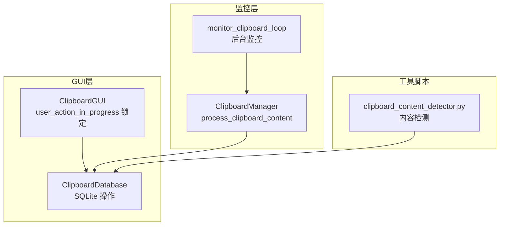
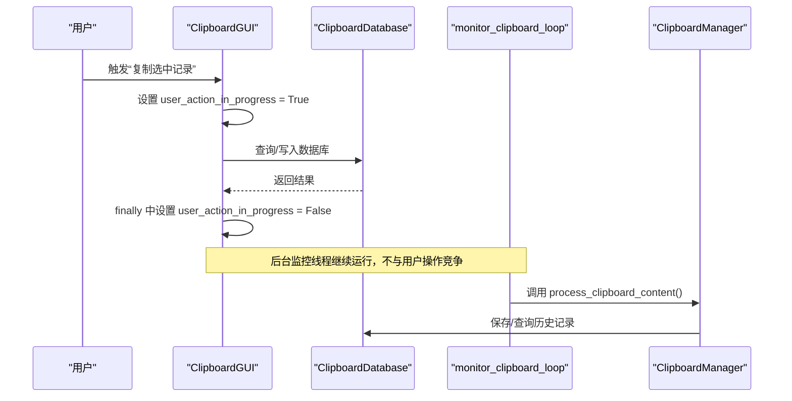
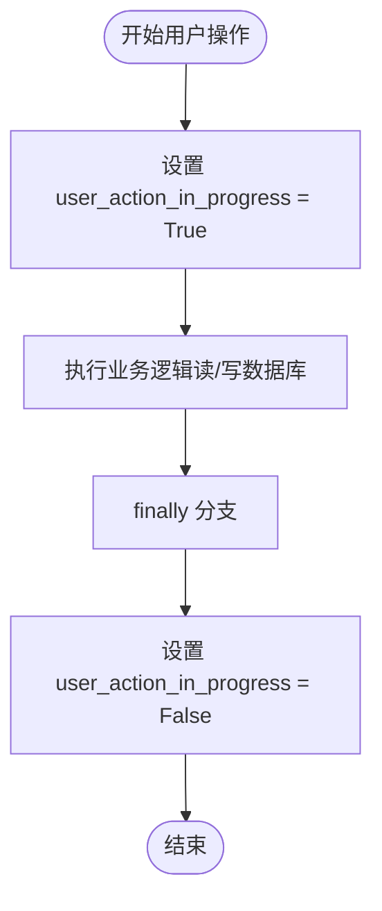
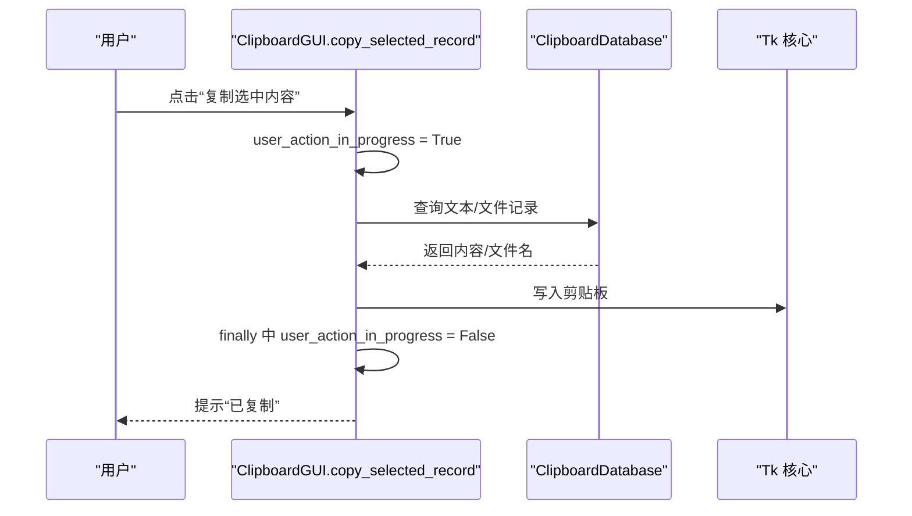
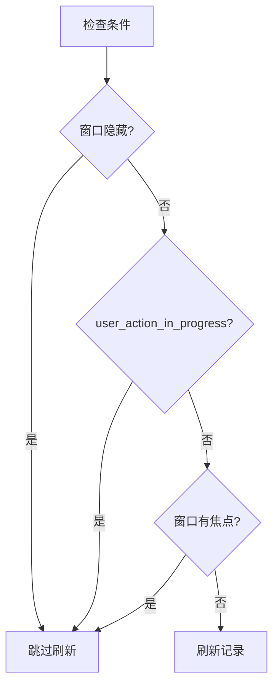
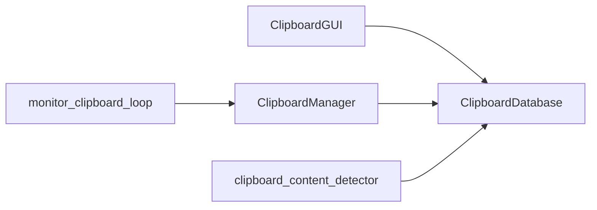

# 用户操作锁定机制

<cite>
**本文引用的文件**
- [clipboard_gui.py](file://clipboard_gui.py)
- [clipboard_manager_main.py](file://clipboard_manager_main.py)
- [clipboard_db.py](file://clipboard_db.py)
- [clipboard_content_detector.py](file://clipboard_content_detector.py)
</cite>

## 目录
1. [简介](#简介)
2. [项目结构](#项目结构)
3. [核心组件](#核心组件)
4. [架构总览](#架构总览)
5. [详细组件分析](#详细组件分析)
6. [依赖关系分析](#依赖关系分析)
7. [性能考量](#性能考量)
8. [故障排查指南](#故障排查指南)
9. [结论](#结论)

## 简介
本文件聚焦于用户操作期间的“锁定”机制，即 user_action_in_progress 标志的作用与实现。该标志用于在用户执行复制选中记录、删除记录、重置记录、打开设置等操作时，标记“当前有用户操作正在进行”。通过在操作开始时将其置为 True，在 finally 分支中重置为 False，系统能够：
- 防止并发的数据修改与资源竞争
- 避免在数据读取或写入过程中被其他事件中断
- 确保操作的原子性与数据一致性
- 防止重复触发与误判

同时，该标志还被用于 GUI 的自动更新控制，避免在用户操作期间频繁刷新界面，从而减少资源消耗与交互干扰。

## 项目结构
本仓库围绕剪贴板历史管理展开，主要文件职责如下：
- clipboard_manager_main.py：剪贴板监控与内容处理（文本/文件），提供 GUI 主界面与后台监控线程
- clipboard_gui.py：GUI 界面与用户交互，包含 user_action_in_progress 锁定机制
- clipboard_db.py：数据库模型与 CRUD 操作
- clipboard_content_detector.py：独立的剪贴板内容检测脚本（与 GUI 互补）

图表来源
- [clipboard_gui.py](file://clipboard_gui.py#L43-L46)
- [clipboard_manager_main.py](file://clipboard_manager_main.py#L717-L761)
- [clipboard_db.py](file://clipboard_db.py#L1-L120)
- [clipboard_content_detector.py](file://clipboard_content_detector.py#L1-L120)

章节来源
- [clipboard_gui.py](file://clipboard_gui.py#L43-L46)
- [clipboard_manager_main.py](file://clipboard_manager_main.py#L717-L761)
- [clipboard_db.py](file://clipboard_db.py#L1-L120)
- [clipboard_content_detector.py](file://clipboard_content_detector.py#L1-L120)

## 核心组件
- ClipboardGUI：负责用户界面与交互，维护 user_action_in_progress 标志，控制自动更新与用户操作的原子性
- ClipboardManager：负责剪贴板内容的读取、去重与保存，配合数据库层
- ClipboardDatabase：封装 SQLite 数据库操作，提供增删改查与统计
- clipboard_content_detector：独立的剪贴板检测脚本，展示内容识别与限制检查流程

章节来源
- [clipboard_gui.py](file://clipboard_gui.py#L795-L994)
- [clipboard_manager_main.py](file://clipboard_manager_main.py#L355-L496)
- [clipboard_db.py](file://clipboard_db.py#L116-L183)

## 架构总览
用户操作锁定机制贯穿 GUI 与监控层：
- GUI 中的用户操作（复制选中记录、删除记录、重置记录、打开设置）均在开始时设置 user_action_in_progress = True，结束时 finally 中重置为 False
- GUI 的自动更新逻辑会检查该标志，若为 True 则暂停刷新，避免与用户操作冲突
- 监控层的后台线程持续扫描剪贴板，但不会与用户操作产生资源竞争，因为用户操作本身是短时阻塞的

图表来源
- [clipboard_gui.py](file://clipboard_gui.py#L795-L838)
- [clipboard_manager_main.py](file://clipboard_manager_main.py#L717-L761)
- [clipboard_db.py](file://clipboard_db.py#L116-L183)

## 详细组件分析

### user_action_in_progress 标志的生命周期
- 设置时机：在每个用户操作入口处设置为 True，如复制选中记录、删除记录、重置记录、打开设置等
- 重置时机：在每个操作的 finally 分支中重置为 False，保证即使发生异常也会释放锁
- 控制点：GUI 的自动更新逻辑会在 user_action_in_progress 为 True 时暂停刷新，避免干扰用户操作

图表来源
- [clipboard_gui.py](file://clipboard_gui.py#L795-L838)
- [clipboard_gui.py](file://clipboard_gui.py#L840-L877)
- [clipboard_gui.py](file://clipboard_gui.py#L890-L948)
- [clipboard_gui.py](file://clipboard_gui.py#L950-L1089)

章节来源
- [clipboard_gui.py](file://clipboard_gui.py#L795-L838)
- [clipboard_gui.py](file://clipboard_gui.py#L840-L877)
- [clipboard_gui.py](file://clipboard_gui.py#L890-L948)
- [clipboard_gui.py](file://clipboard_gui.py#L950-L1089)

### 复制选中记录（copy_selected_record）的锁定流程
- 入口：用户点击“复制选中内容”，触发 copy_selected_record
- 锁定：在方法开头设置 user_action_in_progress = True
- 业务：根据选中记录类型（文本/文件）从数据库读取内容或从列表读取文件名，写入剪贴板
- 释放：无论成功与否，finally 中重置 user_action_in_progress = False
- 效果：在此期间 GUI 自动更新被抑制，避免刷新导致的界面抖动与数据竞争

图表来源
- [clipboard_gui.py](file://clipboard_gui.py#L795-L838)
- [clipboard_db.py](file://clipboard_db.py#L116-L183)

章节来源
- [clipboard_gui.py](file://clipboard_gui.py#L795-L838)
- [clipboard_db.py](file://clipboard_db.py#L116-L183)

### 删除记录与重置记录的锁定流程
- 删除记录：在删除前设置 user_action_in_progress = True，删除后 finally 中重置
- 重置记录：弹窗确认后设置 user_action_in_progress = True，清空数据库与缓存文件，最后重置
- 效果：避免在删除/重置过程中出现界面刷新与数据不一致

章节来源
- [clipboard_gui.py](file://clipboard_gui.py#L840-L877)
- [clipboard_gui.py](file://clipboard_gui.py#L890-L948)

### 打开设置的锁定流程
- 打开设置：在设置窗口创建与保存设置前后设置 user_action_in_progress = True/False
- 效果：避免设置变更过程中的界面刷新与潜在的并发写入

章节来源
- [clipboard_gui.py](file://clipboard_gui.py#L950-L1089)

### GUI 自动更新与 user_action_in_progress 的协同
- 自动更新条件：当窗口未隐藏、无用户操作、且无焦点时，定时刷新记录
- 协同机制：user_action_in_progress 为 True 时，暂停刷新，避免与用户操作冲突
- 资源优化：减少不必要的数据库查询与界面重绘

图表来源
- [clipboard_gui.py](file://clipboard_gui.py#L1686-L1696)

章节来源
- [clipboard_gui.py](file://clipboard_gui.py#L1686-L1696)

### 监控层与用户操作的隔离
- 后台监控线程独立运行，周期性调用 ClipboardManager.process_clipboard_content
- 该方法内部对剪贴板进行读取与保存，与 GUI 的 user_action_in_progress 无直接耦合
- 由于用户操作通常在主线程中执行且持续时间较短，监控线程不会与之产生资源竞争

章节来源
- [clipboard_manager_main.py](file://clipboard_manager_main.py#L717-L761)
- [clipboard_manager_main.py](file://clipboard_manager_main.py#L355-L496)

## 依赖关系分析
- ClipboardGUI 依赖 ClipboardDatabase 进行数据读写
- ClipboardManager 依赖 ClipboardDatabase 进行历史记录的保存与查询
- clipboard_content_detector 独立脚本，提供内容识别与限制检查能力，与 GUI 互补
- GUI 的 user_action_in_progress 仅影响界面行为，不改变数据层的事务语义

图表来源
- [clipboard_gui.py](file://clipboard_gui.py#L43-L46)
- [clipboard_manager_main.py](file://clipboard_manager_main.py#L717-L761)
- [clipboard_db.py](file://clipboard_db.py#L1-L120)
- [clipboard_content_detector.py](file://clipboard_content_detector.py#L1-L120)

章节来源
- [clipboard_gui.py](file://clipboard_gui.py#L43-L46)
- [clipboard_manager_main.py](file://clipboard_manager_main.py#L717-L761)
- [clipboard_db.py](file://clipboard_db.py#L1-L120)
- [clipboard_content_detector.py](file://clipboard_content_detector.py#L1-L120)

## 性能考量
- user_action_in_progress 的存在避免了在用户操作期间的频繁刷新，降低 CPU 与 I/O 压力
- 数据库操作在 GUI 线程中执行，建议在长耗时操作中考虑异步化，以进一步提升响应性
- 监控线程与 GUI 操作解耦，避免相互阻塞

[本节为通用指导，不直接分析具体文件]

## 故障排查指南
- 症状：界面长时间不刷新
  - 排查：检查 user_action_in_progress 是否长期为 True
  - 处理：确认对应操作是否正确进入 finally 分支，或是否存在死锁/异常未捕获
- 症状：复制/删除/重置操作卡住
  - 排查：检查数据库连接是否超时或被其他进程占用
  - 处理：适当增加超时与重试策略，避免阻塞 GUI 线程
- 症状：监控线程与 GUI 操作冲突
  - 排查：确认 GUI 操作是否在后台线程中执行（如需）
  - 处理：将耗时操作迁移至后台线程，保持 GUI 响应

章节来源
- [clipboard_gui.py](file://clipboard_gui.py#L795-L838)
- [clipboard_gui.py](file://clipboard_gui.py#L840-L877)
- [clipboard_gui.py](file://clipboard_gui.py#L890-L948)
- [clipboard_db.py](file://clipboard_db.py#L116-L183)

## 结论
user_action_in_progress 标志通过“开始即锁、finally 释放”的模式，有效避免了用户操作期间的并发数据修改与资源竞争。它与 GUI 自动更新逻辑协同，既保证了操作的原子性与数据一致性，又提升了用户体验与系统稳定性。建议在后续版本中：
- 将长耗时操作异步化，进一步缩短 GUI 线程阻塞时间
- 在数据库层引入更细粒度的锁或事务隔离，增强并发安全性
- 对异常路径进行更完善的日志与告警，便于定位问题