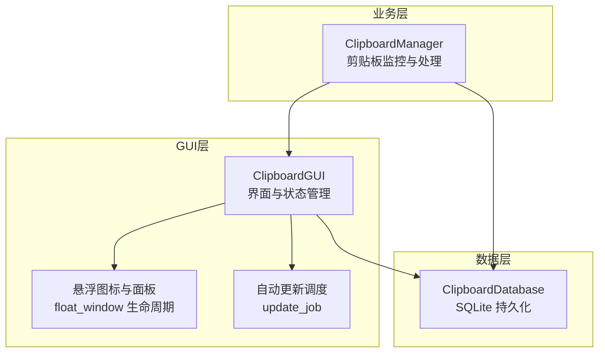
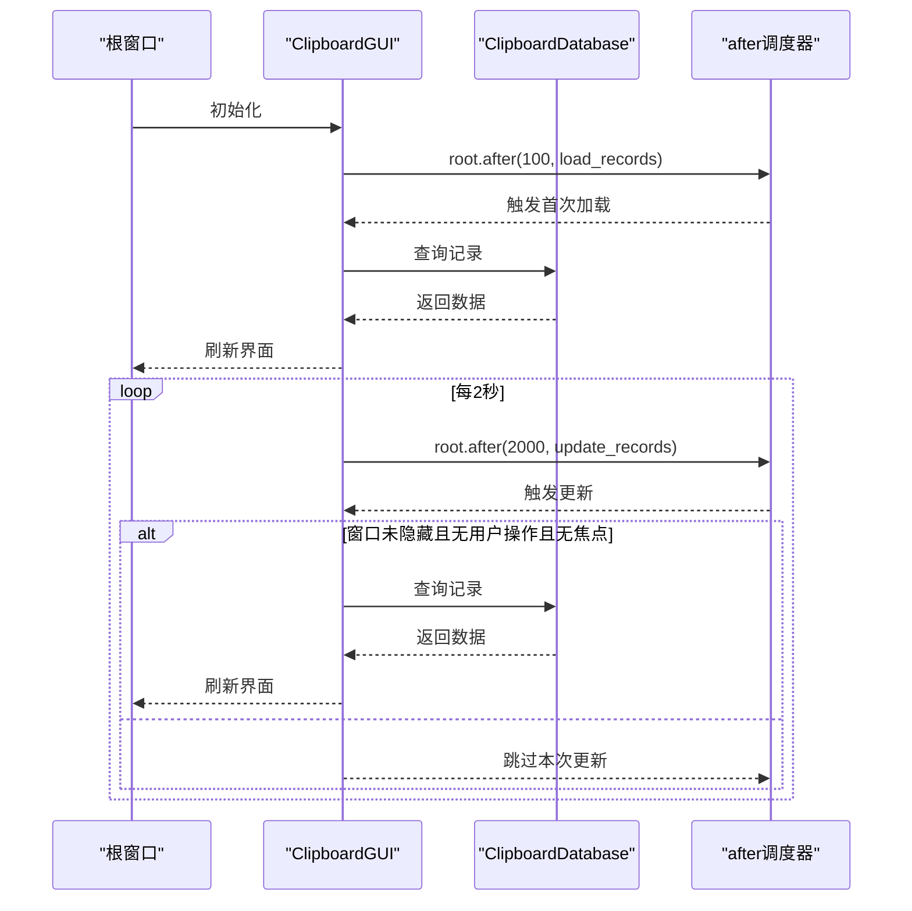
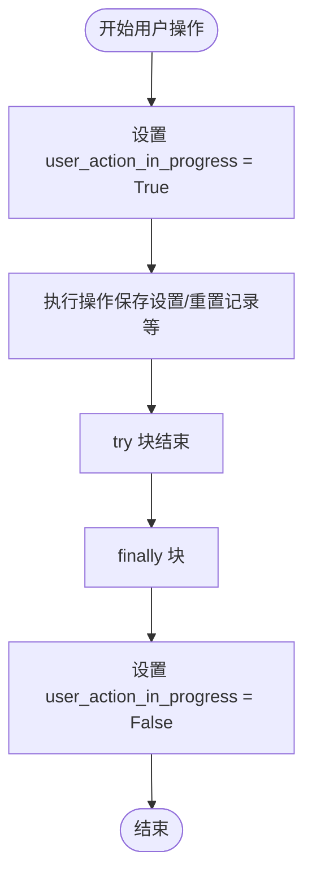
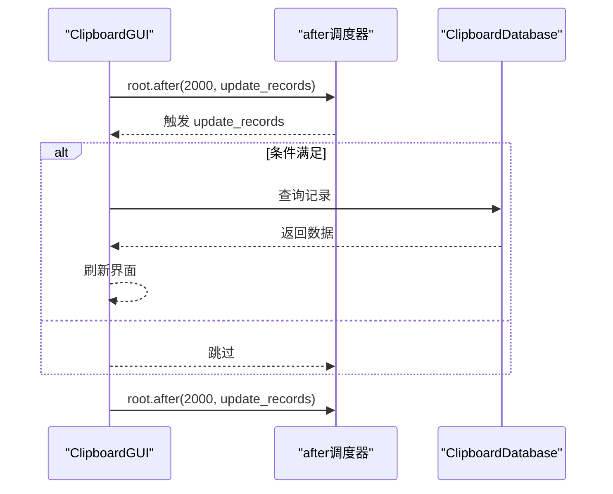
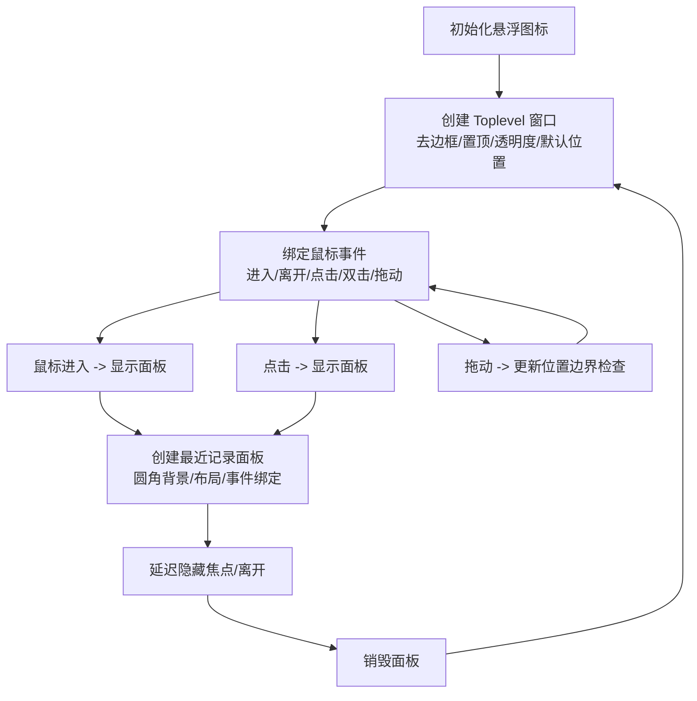
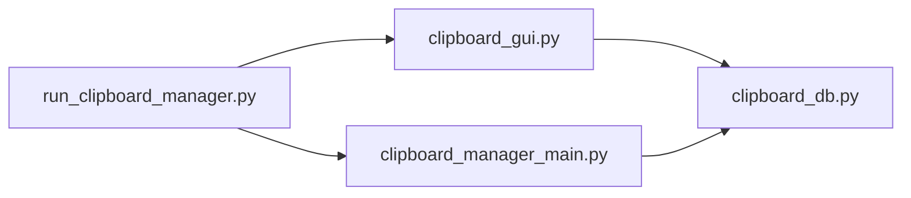

# 界面状态管理

<cite>
**本文引用的文件**
- [clipboard_gui.py](file://clipboard_gui.py)
- [clipboard_manager_main.py](file://clipboard_manager_main.py)
- [clipboard_db.py](file://clipboard_db.py)
- [run_clipboard_manager.py](file://run_clipboard_manager.py)
</cite>

## 目录
1. [简介](#简介)
2. [项目结构](#项目结构)
3. [核心组件](#核心组件)
4. [架构总览](#架构总览)
5. [详细组件分析](#详细组件分析)
6. [依赖关系分析](#依赖关系分析)
7. [性能考量](#性能考量)
8. [故障排查指南](#故障排查指南)
9. [结论](#结论)

## 简介
本文件聚焦于界面状态管理机制，围绕以下关键点展开：
- user_action_in_progress 标志在用户操作期间的锁定作用，防止并发的数据修改与刷新冲突
- has_focus 标志如何跟踪窗口焦点状态，并影响自动更新行为
- update_job 属性在定期刷新任务中的调度与取消
- float_window 悬浮窗口引用的生命周期管理（创建、移动、显示面板、销毁）
- 各类 tkinter 变量（tk.BooleanVar、tk.StringVar）在界面与数据模型同步中的应用
- 通过 after 方法实现的延迟加载（load_records 的首次调用）与定时更新（start_auto_update）

## 项目结构
该项目采用“GUI + 数据库 + 监控器”的分层设计：
- GUI 层负责用户交互、状态展示与定时刷新调度
- 数据库层提供持久化与查询能力
- 监控器负责后台剪贴板变更检测与数据写入

图表来源
- [clipboard_gui.py](file://clipboard_gui.py#L37-L79)
- [clipboard_manager_main.py](file://clipboard_manager_main.py#L355-L761)
- [clipboard_db.py](file://clipboard_db.py#L1-L120)

章节来源
- [clipboard_gui.py](file://clipboard_gui.py#L37-L79)
- [clipboard_manager_main.py](file://clipboard_manager_main.py#L355-L761)
- [clipboard_db.py](file://clipboard_db.py#L1-L120)

## 核心组件
- ClipboardGUI：主界面控制器，维护用户操作锁定、焦点跟踪、自动更新调度与悬浮窗口生命周期
- ClipboardDatabase：数据库访问与设置管理
- ClipboardManager：后台监控剪贴板变化并写入数据库

章节来源
- [clipboard_gui.py](file://clipboard_gui.py#L37-L79)
- [clipboard_db.py](file://clipboard_db.py#L1-L120)
- [clipboard_manager_main.py](file://clipboard_manager_main.py#L355-L761)

## 架构总览
GUI 层通过 after 机制进行延迟加载与定时刷新；当窗口处于隐藏状态、用户操作进行中或拥有焦点时，自动刷新会被跳过，从而避免并发修改与干扰用户操作。悬浮图标与面板的创建、移动与销毁由独立的状态机管理，保证用户体验与资源占用的平衡。

图表来源
- [clipboard_gui.py](file://clipboard_gui.py#L56-L79)
- [clipboard_gui.py](file://clipboard_gui.py#L1676-L1696)
- [clipboard_db.py](file://clipboard_db.py#L185-L261)

## 详细组件分析

### 用户操作锁定：user_action_in_progress
- 作用：标记用户正在进行的操作（如打开设置、重置记录等），在自动更新周期中被检查，避免并发刷新与用户操作冲突
- 设置时机：
  - 打开设置窗口前设置为 True
  - 执行重置记录前设置为 True
- 结束时机：在 try/finally 中最终将标志重置为 False，确保异常情况下也能释放锁

图表来源
- [clipboard_gui.py](file://clipboard_gui.py#L940-L949)
- [clipboard_gui.py](file://clipboard_gui.py#L950-L1076)

章节来源
- [clipboard_gui.py](file://clipboard_gui.py#L940-L949)
- [clipboard_gui.py](file://clipboard_gui.py#L950-L1076)

### 焦点状态跟踪：has_focus
- 作用：记录窗口是否获得焦点，用于自动更新策略判断
- 更新：
  - FocusIn 事件：has_focus = True
  - FocusOut 事件：仅当事件目标为根窗口时，has_focus = False
- 影响：当 has_focus 为 True 时，自动更新会跳过，避免干扰用户输入

章节来源
- [clipboard_gui.py](file://clipboard_gui.py#L134-L143)
- [clipboard_gui.py](file://clipboard_gui.py#L1686-L1696)

### 定时刷新调度：update_job
- 初始化：构造函数中启动定时器，每 2 秒触发一次 update_records
- 运行条件：仅在窗口未隐藏、无用户操作、无焦点时才执行刷新
- 取消：quit_application 中调用 stop_auto_update，取消调度任务

图表来源
- [clipboard_gui.py](file://clipboard_gui.py#L1676-L1696)
- [clipboard_gui.py](file://clipboard_gui.py#L1697-L1715)

章节来源
- [clipboard_gui.py](file://clipboard_gui.py#L1676-L1696)
- [clipboard_gui.py](file://clipboard_gui.py#L1697-L1715)

### 悬浮窗口生命周期：float_window
- 创建：根据设置启用悬浮图标时创建 Toplevel，去除边框、置顶、设置透明度与默认位置
- 移动：绑定鼠标事件，支持拖动并进行屏幕边界检查
- 面板显示：悬浮图标进入或点击时显示最近记录面板，面板位置根据图标位置与屏幕范围进行边界调整
- 隐藏：面板或图标离开时延迟隐藏，避免焦点切换导致误触
- 销毁：禁用悬浮图标或退出应用时销毁窗口

图表来源
- [clipboard_gui.py](file://clipboard_gui.py#L1173-L1234)
- [clipboard_gui.py](file://clipboard_gui.py#L1246-L1379)
- [clipboard_gui.py](file://clipboard_gui.py#L1380-L1401)
- [clipboard_gui.py](file://clipboard_gui.py#L1453-L1558)
- [clipboard_gui.py](file://clipboard_gui.py#L1560-L1632)
- [clipboard_gui.py](file://clipboard_gui.py#L1633-L1669)

章节来源
- [clipboard_gui.py](file://clipboard_gui.py#L1173-L1234)
- [clipboard_gui.py](file://clipboard_gui.py#L1246-L1379)
- [clipboard_gui.py](file://clipboard_gui.py#L1380-L1401)
- [clipboard_gui.py](file://clipboard_gui.py#L1453-L1558)
- [clipboard_gui.py](file://clipboard_gui.py#L1560-L1632)
- [clipboard_gui.py](file://clipboard_gui.py#L1633-L1669)

### 界面与数据模型同步：tkinter 变量
- BooleanVar：用于复选框绑定（无限模式、开机自启、悬浮图标）
- StringVar：用于输入框绑定（最大复制大小、最大复制数量、保存天数）
- 同步流程：
  - 初始化：从数据库读取设置，填充各变量
  - 保存：用户修改后，从变量读取并调用数据库更新接口
  - 状态联动：例如“无限模式”勾选时禁用相关输入框

章节来源
- [clipboard_gui.py](file://clipboard_gui.py#L345-L413)
- [clipboard_gui.py](file://clipboard_gui.py#L376-L393)
- [clipboard_gui.py](file://clipboard_gui.py#L400-L413)
- [clipboard_gui.py](file://clipboard_gui.py#L439-L462)
- [clipboard_gui.py](file://clipboard_gui.py#L477-L533)
- [clipboard_db.py](file://clipboard_db.py#L359-L412)

### 延迟加载与定时更新：after 机制
- 延迟加载：UI 构建完成后，通过 root.after(100, load_records) 实现首次记录加载，避免阻塞界面初始化
- 定时更新：root.after(2000, update_records) 每 2 秒刷新一次，受 has_focus 与 user_action_in_progress 共同控制

章节来源
- [clipboard_gui.py](file://clipboard_gui.py#L56-L79)
- [clipboard_gui.py](file://clipboard_gui.py#L1676-L1696)

## 依赖关系分析
- ClipboardGUI 依赖 ClipboardDatabase 进行数据查询与设置更新
- ClipboardManager 与 ClipboardDatabase 协作，负责后台监控与写入
- run_clipboard_manager 控制进程唯一性与 GUI 启动

图表来源
- [run_clipboard_manager.py](file://run_clipboard_manager.py#L32-L70)
- [clipboard_gui.py](file://clipboard_gui.py#L37-L79)
- [clipboard_manager_main.py](file://clipboard_manager_main.py#L355-L761)
- [clipboard_db.py](file://clipboard_db.py#L1-L120)

章节来源
- [run_clipboard_manager.py](file://run_clipboard_manager.py#L32-L70)
- [clipboard_gui.py](file://clipboard_gui.py#L37-L79)
- [clipboard_manager_main.py](file://clipboard_manager_main.py#L355-L761)
- [clipboard_db.py](file://clipboard_db.py#L1-L120)

## 性能考量
- 自动更新节流：通过 has_focus 与 user_action_in_progress 双重过滤，避免在用户交互时刷新，降低 UI 抖动与数据库压力
- 定时器粒度：2 秒一次的刷新频率适中，兼顾实时性与资源占用
- 首次加载延迟：100ms 的延迟让 UI 初始化优先完成，改善首屏体验
- 悬浮面板延迟隐藏：减少频繁创建/销毁带来的开销

## 故障排查指南
- 自动更新不生效
  - 检查窗口是否隐藏（is_hidden）或是否处于焦点（has_focus）
  - 确认 user_action_in_progress 是否长时间为 True（例如设置窗口未关闭）
- 悬浮图标无法拖动或面板不显示
  - 检查设置中悬浮图标是否启用
  - 确认鼠标事件绑定是否正常（进入/离开/点击/双击/拖动）
- 数据不同步
  - 确认 save_settings 流程是否正确读取 StringVar/BooleanVar 并调用数据库更新
  - 检查数据库字段是否存在（retention_days/auto_start/float_icon）

章节来源
- [clipboard_gui.py](file://clipboard_gui.py#L1676-L1696)
- [clipboard_gui.py](file://clipboard_gui.py#L1173-L1234)
- [clipboard_gui.py](file://clipboard_gui.py#L477-L533)
- [clipboard_db.py](file://clipboard_db.py#L359-L412)

## 结论
本项目通过 user_action_in_progress、has_focus 与 update_job 的协同，实现了稳健的界面状态管理与定时刷新控制；通过 after 机制实现延迟加载与定时更新；通过 tkinter 变量实现界面与数据模型的双向同步；通过 float_window 生命周期管理提升用户体验。上述机制共同保障了在后台监控与前台交互之间取得良好平衡。