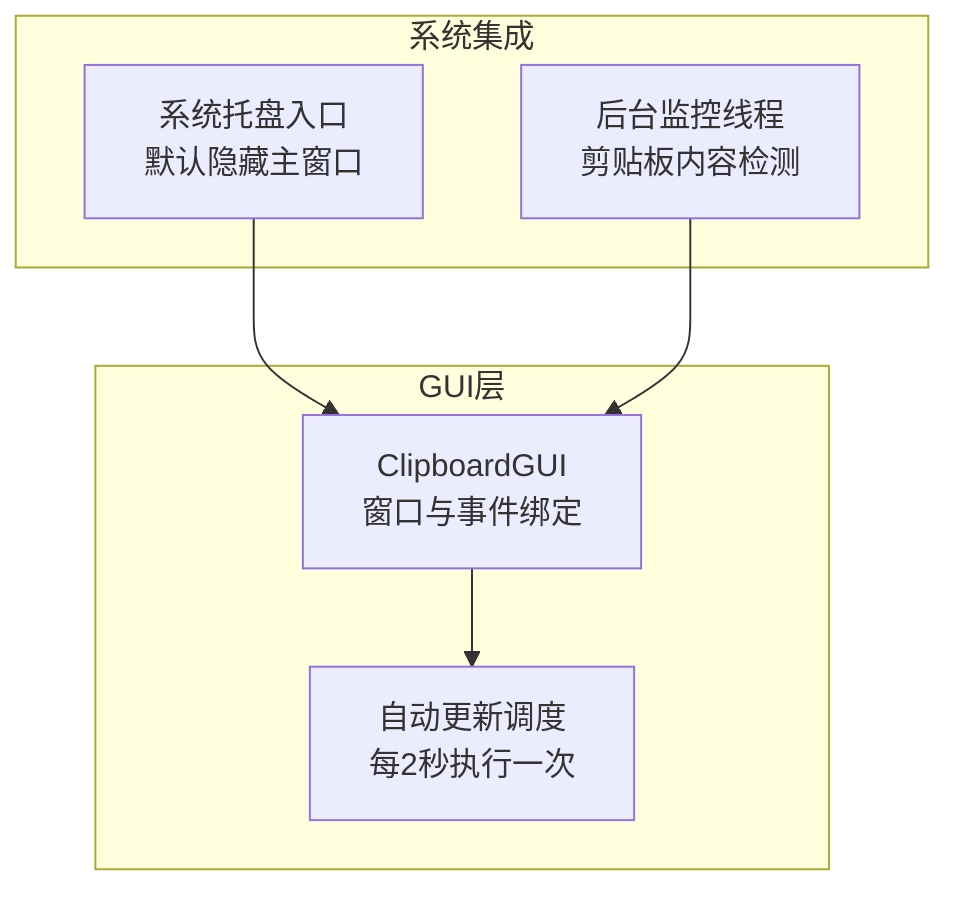
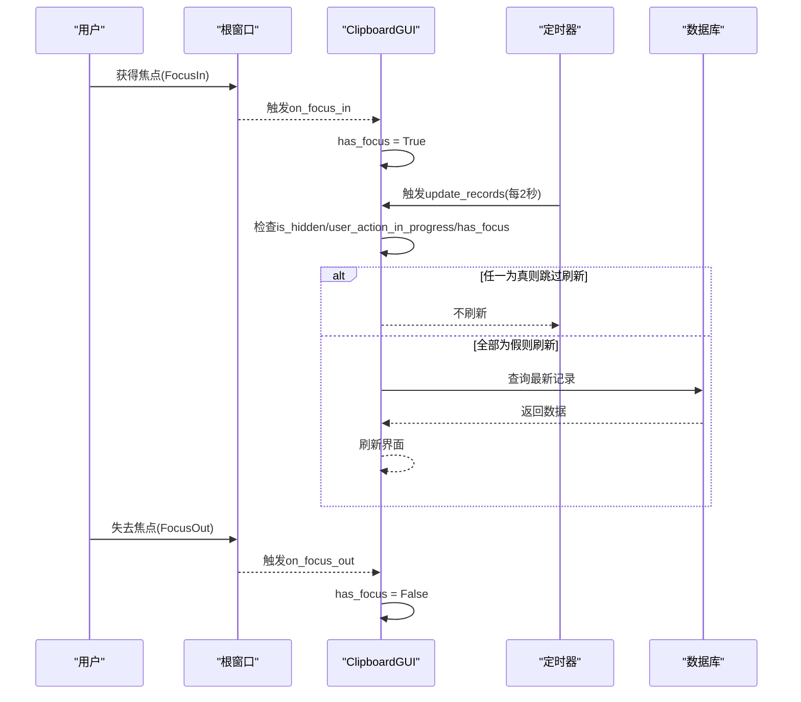
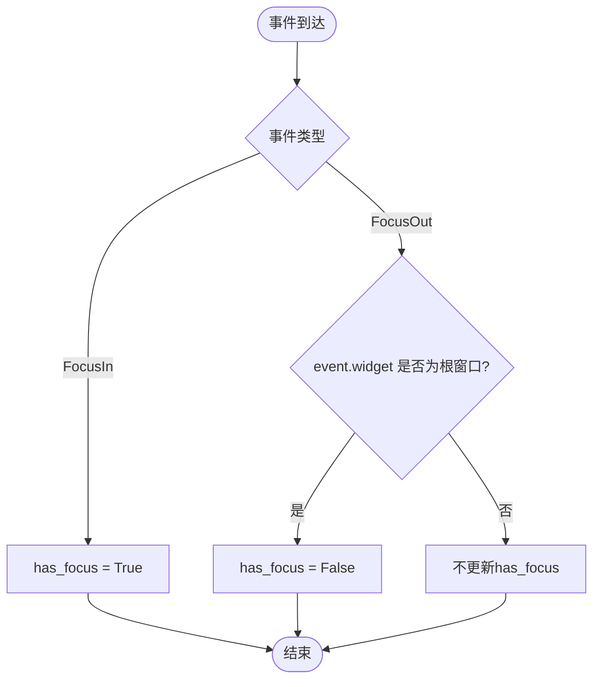
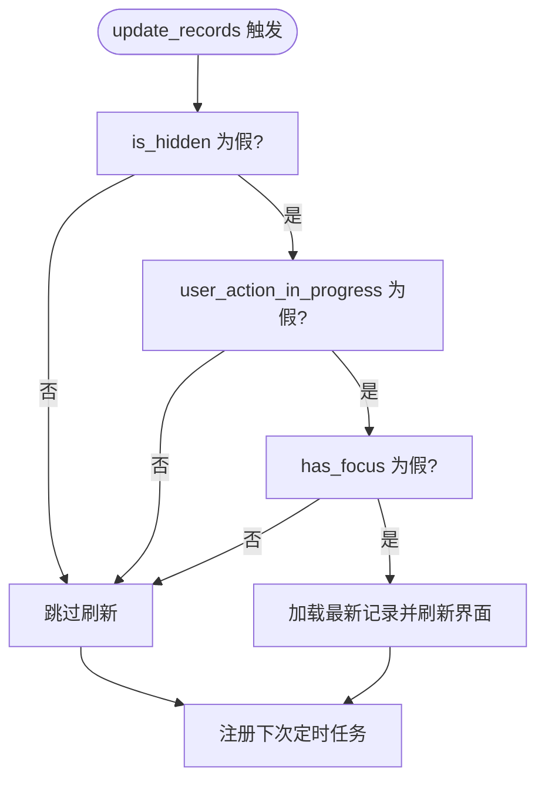
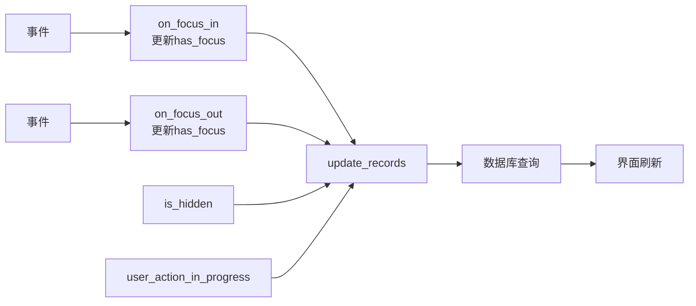

# 窗口焦点状态管理

<cite>
**本文引用的文件**
- [clipboard_gui.py](file://clipboard_gui.py)
- [run_clipboard_manager.py](file://run_clipboard_manager.py)
- [clipboard_manager_main.py](file://clipboard_manager_main.py)
</cite>

## 目录
1. [简介](#简介)
2. [项目结构](#项目结构)
3. [核心组件](#核心组件)
4. [架构总览](#架构总览)
5. [详细组件分析](#详细组件分析)
6. [依赖关系分析](#依赖关系分析)
7. [性能考量](#性能考量)
8. [故障排查指南](#故障排查指南)
9. [结论](#结论)

## 简介
本文件围绕“has_focus 标志如何通过绑定 <FocusIn>/<FocusOut> 事件来跟踪窗口焦点状态”展开，重点解释：
- on_focus_in 与 on_focus_out 方法如何更新 has_focus；
- has_focus 如何影响自动更新行为（update_records）；
- 窗口获得/失去焦点时的数据刷新策略与资源节省逻辑；
- 结合用户交互场景，说明该机制如何优化性能并提升用户体验。

## 项目结构
本仓库与焦点状态管理直接相关的模块如下：
- GUI 主体：clipboard_gui.py（负责窗口、事件绑定、自动更新调度）
- 启动入口：run_clipboard_manager.py（默认隐藏主窗口，提供托盘入口）
- 剪贴板监控：clipboard_manager_main.py（后台线程持续监控剪贴板）

图表来源
- [clipboard_gui.py](file://clipboard_gui.py#L44-L75)
- [clipboard_gui.py](file://clipboard_gui.py#L1675-L1696)
- [run_clipboard_manager.py](file://run_clipboard_manager.py#L55-L66)
- [clipboard_manager_main.py](file://clipboard_manager_main.py#L717-L730)

章节来源
- [clipboard_gui.py](file://clipboard_gui.py#L44-L75)
- [run_clipboard_manager.py](file://run_clipboard_manager.py#L55-L66)
- [clipboard_manager_main.py](file://clipboard_manager_main.py#L717-L730)

## 核心组件
- ClipboardGUI：负责窗口生命周期、事件绑定、自动更新调度、用户操作标记等。
- has_focus：布尔标志，用于表示当前窗口是否处于焦点状态。
- update_records：定时任务，按条件决定是否刷新界面数据。
- start_auto_update/stop_auto_update：控制自动更新的启停。

章节来源
- [clipboard_gui.py](file://clipboard_gui.py#L44-L75)
- [clipboard_gui.py](file://clipboard_gui.py#L133-L143)
- [clipboard_gui.py](file://clipboard_gui.py#L1675-L1696)

## 架构总览
焦点状态管理与自动更新的关系如下：
- 窗口创建时绑定 <FocusIn>/<FocusOut> 事件；
- on_focus_in/on_focus_out 更新 has_focus；
- update_records 在每次定时触发时检查：
  - 是否隐藏（is_hidden）
  - 是否有用户操作进行中（user_action_in_progress）
  - 是否有焦点（has_focus）
- 仅当上述三个条件都满足时才执行数据刷新，避免干扰用户操作与资源浪费。

图表来源
- [clipboard_gui.py](file://clipboard_gui.py#L72-L75)
- [clipboard_gui.py](file://clipboard_gui.py#L133-L143)
- [clipboard_gui.py](file://clipboard_gui.py#L1675-L1696)

## 详细组件分析

### 焦点事件绑定与标志更新
- 绑定事件：在窗口初始化时绑定 <FocusIn> 与 <FocusOut>，分别调用 on_focus_in 与 on_focus_out。
- 更新逻辑：
  - on_focus_in：将 has_focus 设为 True；
  - on_focus_out：仅当事件来源为根窗口本身时，将 has_focus 设为 False（避免切换到子窗口导致误判）。

图表来源
- [clipboard_gui.py](file://clipboard_gui.py#L72-L75)
- [clipboard_gui.py](file://clipboard_gui.py#L133-L143)

章节来源
- [clipboard_gui.py](file://clipboard_gui.py#L72-L75)
- [clipboard_gui.py](file://clipboard_gui.py#L133-L143)

### 自动更新与焦点状态的协同
- 定时器：start_auto_update 启动后，每 2 秒触发一次 update_records。
- 刷新条件：update_records 中仅在以下条件全为假时才刷新：
  - is_hidden（窗口未隐藏）
  - user_action_in_progress（无用户操作进行中）
  - has_focus（无焦点）
- 一旦条件满足，update_records 会拉取最新数据并刷新界面，然后继续下一次定时调度。

图表来源
- [clipboard_gui.py](file://clipboard_gui.py#L1675-L1696)

章节来源
- [clipboard_gui.py](file://clipboard_gui.py#L1675-L1696)

### 用户交互场景与体验优化
- 场景一：用户正在编辑或选择内容
  - 若用户操作期间窗口获得焦点，has_focus 为真，update_records 会跳过刷新，避免打断用户输入或选择。
- 场景二：用户切换到其他应用
  - 窗口失去焦点但仍在前台显示，update_records 仍会按需刷新，保证界面数据新鲜度。
- 场景三：窗口被隐藏（托盘模式）
  - is_hidden 为真时，update_records 直接跳过刷新，减少后台开销。
- 场景四：用户进行批量操作（如删除、复制）
  - user_action_in_progress 为真时，即使窗口无焦点也会跳过刷新，避免频繁刷新造成卡顿。

章节来源
- [clipboard_gui.py](file://clipboard_gui.py#L1675-L1696)

### 启动与托盘模式下的焦点行为
- 启动脚本默认隐藏主窗口，仅保留托盘入口，用户通过托盘或快捷键切换显示。
- 焦点行为与自动更新逻辑一致：无论窗口是否可见，只要 is_hidden 为真，就不会刷新；当窗口显示且无用户操作、无焦点时，才会刷新。

章节来源
- [run_clipboard_manager.py](file://run_clipboard_manager.py#L55-L66)
- [clipboard_gui.py](file://clipboard_gui.py#L1697-L1708)

## 依赖关系分析
- ClipboardGUI 依赖：
  - Tkinter 根窗口事件系统（<FocusIn>/<FocusOut>）
  - 数据库接口（用于加载记录）
  - 后台监控线程（由 run_clipboard_manager.py 启动）
- 关键耦合点：
  - has_focus 与 update_records 的耦合，确保在合适时机刷新；
  - is_hidden 与 update_records 的耦合，避免在隐藏状态下浪费资源；
  - user_action_in_progress 与 update_records 的耦合，避免在用户操作期间频繁刷新。

图表来源
- [clipboard_gui.py](file://clipboard_gui.py#L72-L75)
- [clipboard_gui.py](file://clipboard_gui.py#L133-L143)
- [clipboard_gui.py](file://clipboard_gui.py#L1675-L1696)

章节来源
- [clipboard_gui.py](file://clipboard_gui.py#L72-L75)
- [clipboard_gui.py](file://clipboard_gui.py#L133-L143)
- [clipboard_gui.py](file://clipboard_gui.py#L1675-L1696)

## 性能考量
- 资源节省
  - 通过 is_hidden 与 has_focus 两个条件过滤，避免在隐藏或有焦点时刷新，降低数据库与界面刷新频率。
  - 通过 user_action_in_progress 过滤，避免在用户操作期间刷新，减少 UI 抖动与 CPU 占用。
- 刷新频率
  - update_records 每 2 秒执行一次，折中考虑了实时性与性能。
- 后台监控
  - 剪贴板监控在独立线程中运行，不影响 GUI 主循环，但注意不要在高频刷新时叠加大量 I/O。

[本节为通用性能建议，不直接分析具体文件]

## 故障排查指南
- 焦点状态异常
  - 现象：窗口获得焦点后仍不刷新，或失去焦点后频繁刷新。
  - 排查：确认 <FocusIn>/<FocusOut> 是否正确绑定；检查 on_focus_in/on_focus_out 是否被调用；确认 has_focus 的值是否按预期变化。
- 自动刷新无效
  - 现象：窗口显示但界面不更新。
  - 排查：确认 is_hidden 是否为假；确认 user_action_in_progress 是否为假；确认 has_focus 是否为假；检查 update_job 是否仍在调度。
- 托盘模式下无响应
  - 现象：托盘显示但主窗口不刷新。
  - 排查：确认 is_hidden 为真时 update_records 会跳过刷新；当用户显示窗口时，应立即调用刷新逻辑。

章节来源
- [clipboard_gui.py](file://clipboard_gui.py#L72-L75)
- [clipboard_gui.py](file://clipboard_gui.py#L133-L143)
- [clipboard_gui.py](file://clipboard_gui.py#L1675-L1696)
- [clipboard_gui.py](file://clipboard_gui.py#L1697-L1708)

## 结论
has_focus 标志通过 <FocusIn>/<FocusOut> 事件与 ClipboardGUI 的 on_focus_in/on_focus_out 方法实现精准的焦点跟踪。该标志与 is_hidden、user_action_in_progress 共同构成 update_records 的决策条件，使得：
- 在用户操作期间避免刷新，提升交互流畅度；
- 在窗口隐藏或有焦点时避免刷新，节省系统资源；
- 在窗口显示且无用户操作、无焦点时按固定节奏刷新，兼顾实时性与性能。

这一机制在托盘模式与全屏模式下均适用，既优化了性能，也提升了用户体验。