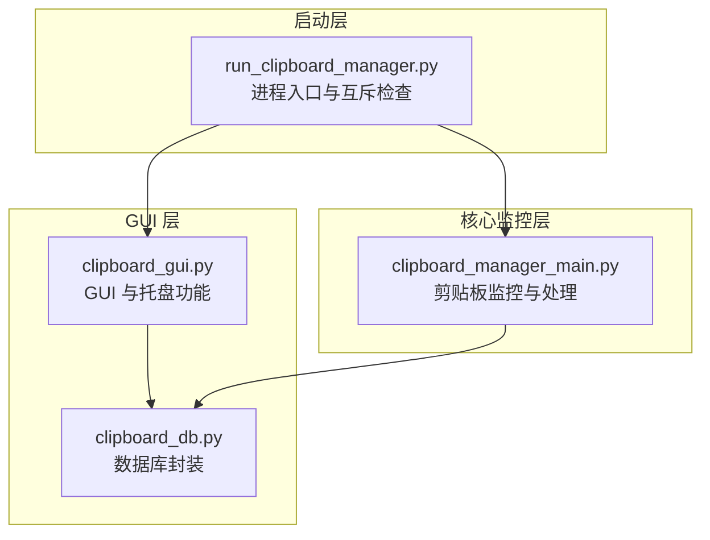
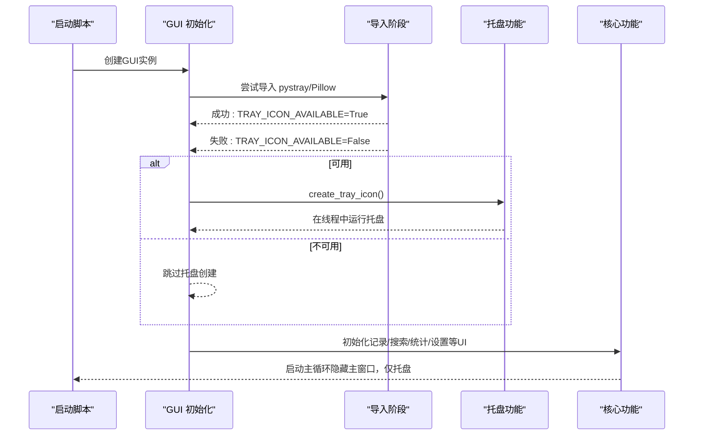
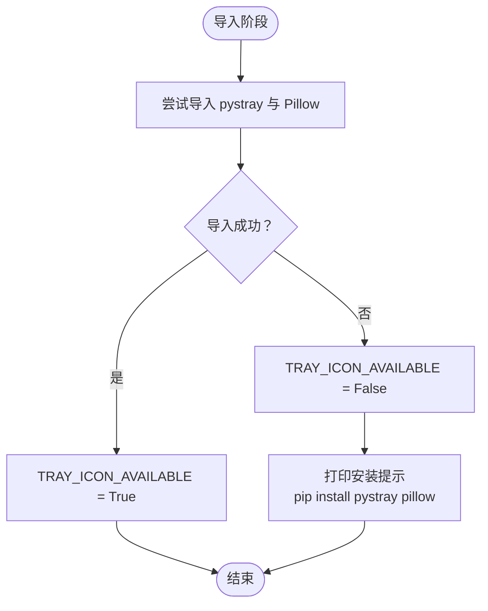
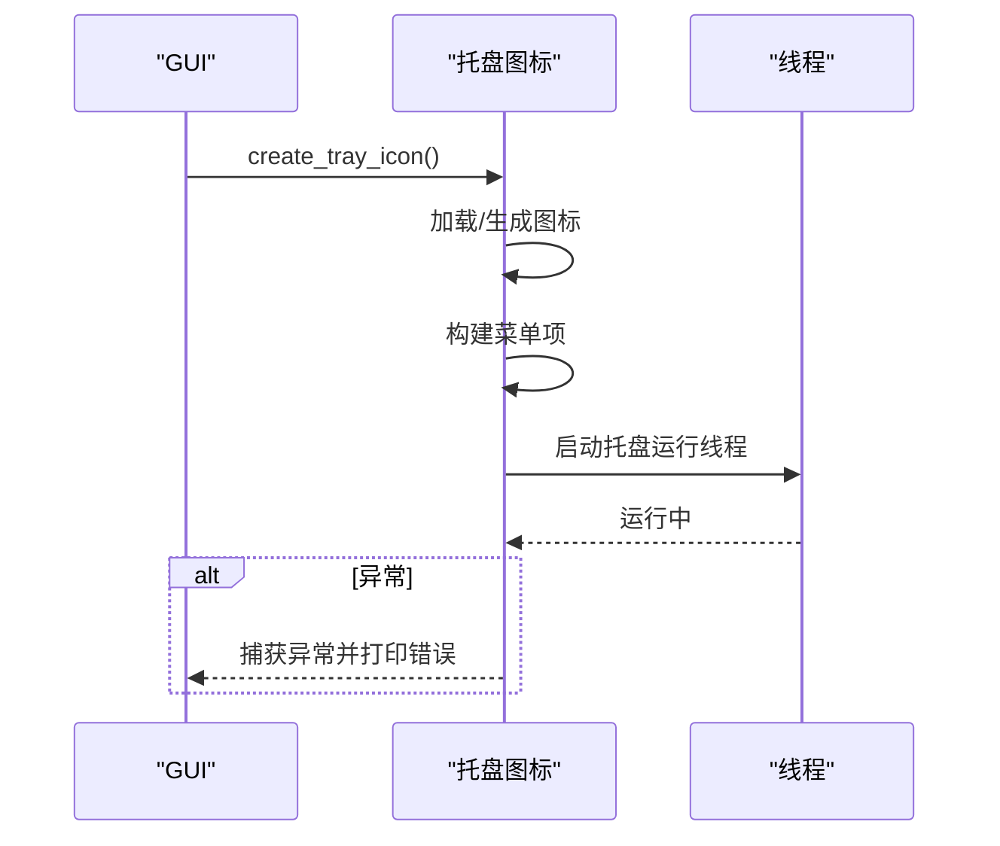
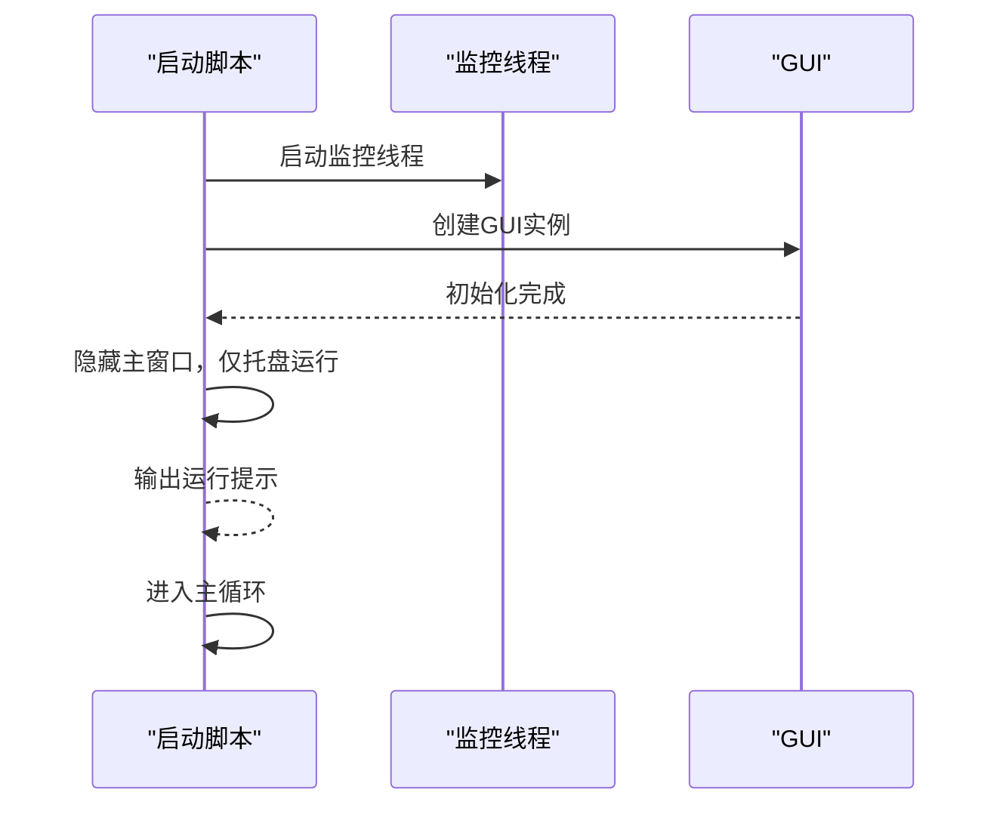
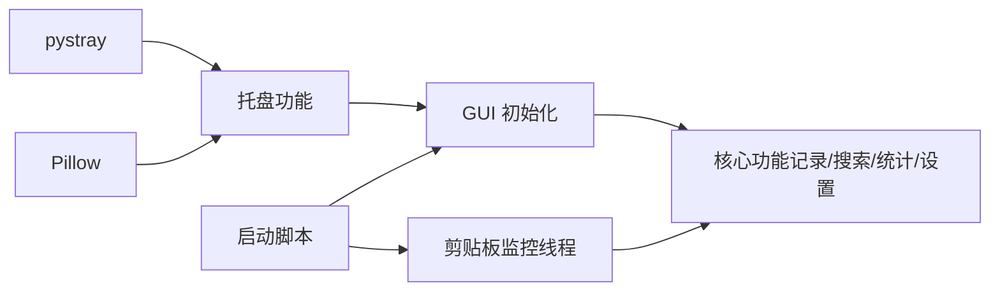

# 托盘功能降级处理

<cite>
**本文引用的文件**
- [clipboard_gui.py](file://clipboard_gui.py)
- [run_clipboard_manager.py](file://run_clipboard_manager.py)
- [clipboard_manager_main.py](file://clipboard_manager_main.py)
- [clipboard_db.py](file://clipboard_db.py)
</cite>

## 目录
1. [简介](#简介)
2. [项目结构](#项目结构)
3. [核心组件](#核心组件)
4. [架构总览](#架构总览)
5. [详细组件分析](#详细组件分析)
6. [依赖关系分析](#依赖关系分析)
7. [性能考虑](#性能考虑)
8. [故障排查指南](#故障排查指南)
9. [结论](#结论)

## 简介
本文件聚焦于系统托盘功能在依赖缺失（pystray 或 Pillow）时的异常捕获与优雅降级策略。当导入失败时，系统通过全局标志位 TRAY_ICON_AVAILABLE 控制托盘功能的启用，并在控制台输出清晰的安装提示信息，同时保证主程序其他核心功能（剪贴板监控、GUI 查询、数据库操作等）不受影响地继续运行。

## 项目结构
- GUI 与托盘相关逻辑集中在 GUI 模块中，采用“导入即判定”的方式决定是否启用托盘功能。
- 启动脚本负责创建监控线程与 GUI 实例，并默认隐藏主窗口，仅保留托盘图标。
- 主程序负责剪贴板监控与数据库交互，与 GUI 的托盘功能解耦。

图表来源
- [run_clipboard_manager.py](file://run_clipboard_manager.py#L32-L69)
- [clipboard_gui.py](file://clipboard_gui.py#L17-L26)
- [clipboard_manager_main.py](file://clipboard_manager_main.py#L717-L761)
- [clipboard_db.py](file://clipboard_db.py#L13-L115)

章节来源
- [run_clipboard_manager.py](file://run_clipboard_manager.py#L32-L69)
- [clipboard_gui.py](file://clipboard_gui.py#L17-L26)
- [clipboard_manager_main.py](file://clipboard_manager_main.py#L717-L761)
- [clipboard_db.py](file://clipboard_db.py#L13-L115)

## 核心组件
- TRAY_ICON_AVAILABLE 标志位：在导入阶段通过 try/except 判定托盘依赖可用性，赋值布尔值并控制后续托盘功能分支。
- create_tray_icon 方法：在依赖可用时创建托盘图标与菜单，并在线程中运行；依赖不可用时跳过。
- 控制台提示：在导入失败时打印安装建议（pip install pystray pillow），便于用户快速修复。
- 启动流程：启动脚本创建监控线程与 GUI，隐藏主窗口，仅保留托盘图标，不影响其他功能。

章节来源
- [clipboard_gui.py](file://clipboard_gui.py#L17-L26)
- [clipboard_gui.py](file://clipboard_gui.py#L144-L171)
- [run_clipboard_manager.py](file://run_clipboard_manager.py#L32-L69)

## 架构总览
托盘功能的启用/降级完全由导入阶段的异常捕获决定，形成“导入即判定”的轻量级策略。GUI 初始化时依据 TRAY_ICON_AVAILABLE 决定是否创建托盘图标；若不可用，则继续执行其余 UI 功能（记录加载、搜索、统计、设置等），保证主程序核心能力不受影响。

图表来源
- [clipboard_gui.py](file://clipboard_gui.py#L17-L26)
- [clipboard_gui.py](file://clipboard_gui.py#L144-L171)
- [run_clipboard_manager.py](file://run_clipboard_manager.py#L55-L69)

## 详细组件分析

### 组件A：托盘导入与降级策略
- 导入阶段：在模块顶部使用 try/except 包裹对 pystray 与 Pillow 的导入，成功则设置 TRAY_ICON_AVAILABLE 为 True，失败则设置为 False 并打印安装提示。
- 启用条件：GUI 初始化时判断 TRAY_ICON_AVAILABLE，仅在 True 时调用 create_tray_icon。
- 降级表现：未创建托盘图标，但其余 UI 功能保持不变，用户仍可通过托盘菜单显示界面或退出。

图表来源
- [clipboard_gui.py](file://clipboard_gui.py#L17-L26)

章节来源
- [clipboard_gui.py](file://clipboard_gui.py#L17-L26)

### 组件B：托盘图标创建与异常处理
- 创建流程：在 create_tray_icon 中，优先使用资源文件图标，若不存在则动态绘制；构建托盘菜单项（显示界面、退出）；在独立线程中运行托盘图标。
- 异常处理：若创建过程中出现异常，会捕获并打印错误信息，避免影响主程序其他部分。
- 降级策略：即使托盘创建失败，也不会阻断 GUI 的其他功能。

图表来源
- [clipboard_gui.py](file://clipboard_gui.py#L144-L171)

章节来源
- [clipboard_gui.py](file://clipboard_gui.py#L144-L171)

### 组件C：启动脚本与托盘可见性
- 启动脚本负责：
  - 检查进程互斥，避免重复运行；
  - 启动剪贴板监控线程；
  - 创建 GUI 实例并默认隐藏主窗口，仅保留托盘图标；
  - 输出运行提示（托盘运行、快捷键等）。
- 与托盘降级的关系：无论托盘是否可用，启动脚本都会隐藏主窗口并进入主循环，确保用户体验一致。

图表来源
- [run_clipboard_manager.py](file://run_clipboard_manager.py#L32-L69)

章节来源
- [run_clipboard_manager.py](file://run_clipboard_manager.py#L32-L69)

### 组件D：核心功能与托盘解耦
- 剪贴板监控与处理：在主程序中独立运行，不依赖托盘功能，保证核心能力持续可用。
- 数据库封装：提供统一的数据访问接口，与 GUI 的托盘功能无直接耦合。
- 降级影响面：仅托盘功能不可用，其余功能（记录查询、搜索、统计、设置、开机自启、悬浮图标等）均不受影响。

章节来源
- [clipboard_manager_main.py](file://clipboard_manager_main.py#L717-L761)
- [clipboard_db.py](file://clipboard_db.py#L13-L115)

## 依赖关系分析
- 导入依赖：托盘功能依赖 pystray 与 Pillow；导入失败即降级。
- 运行依赖：托盘运行依赖系统托盘环境；若环境不支持，托盘创建失败但不影响其他功能。
- 启动依赖：启动脚本依赖 Tkinter 与 Windows API（互斥检查），与托盘功能解耦。

图表来源
- [clipboard_gui.py](file://clipboard_gui.py#L17-L26)
- [run_clipboard_manager.py](file://run_clipboard_manager.py#L32-L69)
- [clipboard_manager_main.py](file://clipboard_manager_main.py#L717-L761)

章节来源
- [clipboard_gui.py](file://clipboard_gui.py#L17-L26)
- [run_clipboard_manager.py](file://run_clipboard_manager.py#L32-L69)
- [clipboard_manager_main.py](file://clipboard_manager_main.py#L717-L761)

## 性能考虑
- 导入阶段的异常捕获成本极低，仅在模块加载时执行一次。
- 托盘线程为守护线程，不影响主程序退出；即使托盘不可用，也不会产生额外线程开销。
- 核心监控线程与 GUI 线程分离，互不影响，降低耦合度与潜在冲突风险。

## 故障排查指南
- 症状：托盘图标未显示
  - 可能原因：缺少 pystray 或 Pillow
  - 处理步骤：
    - 查看控制台输出的安装提示，按提示执行安装命令；
    - 重启应用，确认导入成功后托盘图标应可正常使用。
- 症状：托盘图标创建失败
  - 可能原因：系统托盘环境异常或图标资源缺失
  - 处理步骤：
    - 检查系统托盘服务状态；
    - 确认资源文件是否存在或允许动态生成备用图标；
    - 查看控制台错误信息定位具体异常。
- 症状：主程序功能异常
  - 可能原因：与托盘无关的其他异常
  - 处理步骤：
    - 检查数据库连接与权限；
    - 检查文件路径与磁盘空间；
    - 查看相关模块的异常捕获与错误输出。

章节来源
- [clipboard_gui.py](file://clipboard_gui.py#L17-L26)
- [clipboard_gui.py](file://clipboard_gui.py#L144-L171)
- [clipboard_db.py](file://clipboard_db.py#L413-L455)

## 结论
系统通过“导入即判定”的方式实现了托盘功能的优雅降级：当 pystray 或 Pillow 缺失时，立即设置 TRAY_ICON_AVAILABLE 为 False，并在控制台输出清晰的安装提示；同时，GUI 的其他功能与核心监控线程保持独立运行，确保主程序在依赖缺失场景下仍能稳定提供核心能力。该策略简单可靠、易于维护，且对用户友好，满足不同环境下的部署需求。