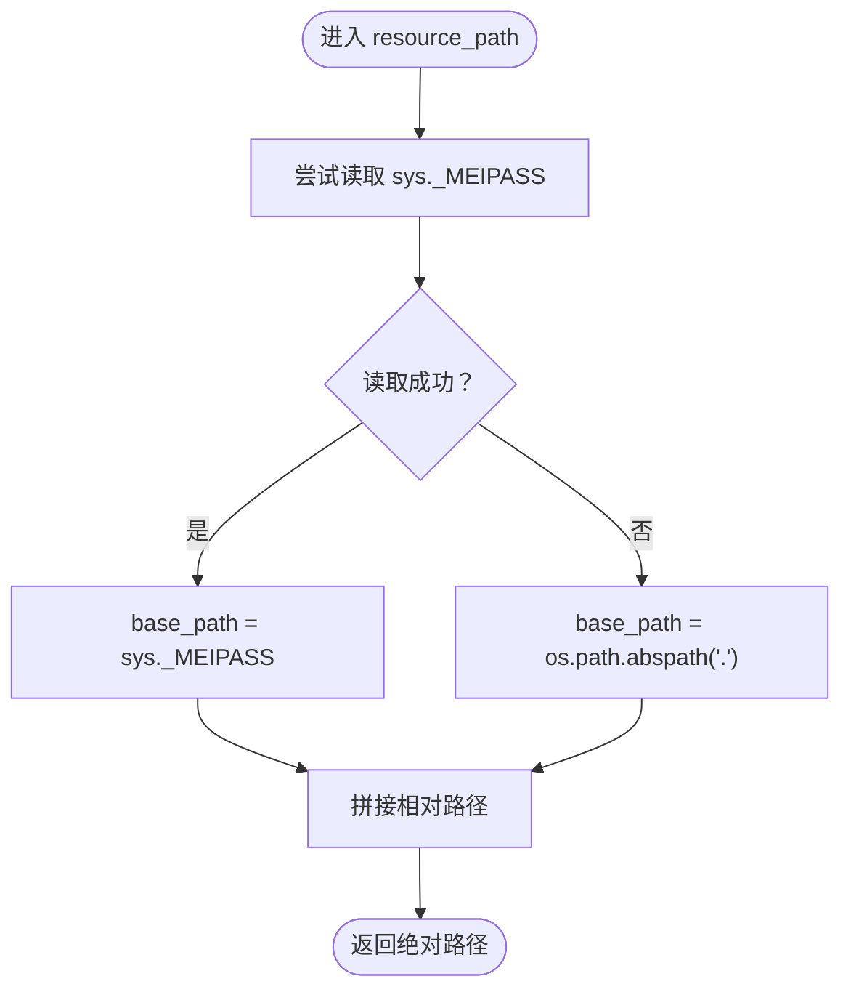

# 托盘图标加载机制

<cite>
**本文引用的文件**
- [clipboard_gui.py](file://clipboard_gui.py)
- [setup.py](file://setup.py)
- [build_exe.py](file://build_exe.py)
- [convert_to_ico.py](file://convert_to_ico.py)
- [2.ico](file://2.ico)
- [icon.ico](file://icon.ico)
</cite>

## 目录
1. [简介](#简介)
2. [项目结构](#项目结构)
3. [核心组件](#核心组件)
4. [架构总览](#架构总览)
5. [详细组件分析](#详细组件分析)
6. [依赖关系分析](#依赖关系分析)
7. [性能考量](#性能考量)
8. [故障排查指南](#故障排查指南)
9. [结论](#结论)

## 简介
本文聚焦于两个关键点：
- resource_path 函数如何在 PyInstaller 打包后正确解析资源路径，确保图标等静态资源在打包前后都能被稳定定位。
- create_tray_icon 方法如何从 2.ico 文件加载托盘图标，并在图标文件缺失时通过 PIL 动态创建备用图标，绘制“C”字符，同时提供对文件系统访问失败的容错处理。

## 项目结构
围绕托盘图标加载与资源路径的关键文件如下：
- clipboard_gui.py：包含 resource_path、create_tray_icon、create_float_icon 等与图标相关的实现。
- setup.py/build_exe.py：定义打包配置，将 2.ico、icon.ico、clipboard_history.db 等资源文件包含进最终可执行文件。
- convert_to_ico.py：提供将 JPG 图片转换为 ICO 的工具，便于生成 2.ico/icon.ico。
- 2.ico、icon.ico：打包时包含的图标文件。

图表来源
- [clipboard_gui.py](file://clipboard_gui.py#L27-L36)
- [setup.py](file://setup.py#L15-L19)
- [build_exe.py](file://build_exe.py#L14-L19)
- [convert_to_ico.py](file://convert_to_ico.py#L1-L48)

章节来源
- [clipboard_gui.py](file://clipboard_gui.py#L27-L36)
- [setup.py](file://setup.py#L15-L19)
- [build_exe.py](file://build_exe.py#L14-L19)
- [convert_to_ico.py](file://convert_to_ico.py#L1-L48)

## 核心组件
- resource_path：跨平台资源路径解析函数，兼容 PyInstaller 打包环境与开发环境。
- create_tray_icon：托盘图标创建流程，优先使用 2.ico，若不存在则使用 PIL 动态创建备用图标。
- create_float_icon：悬浮图标创建流程，同样演示了资源路径解析与降级策略。
- 打包配置：setup.py/build_exe.py 将 2.ico/icon.ico 等资源文件打包进可执行文件。

章节来源
- [clipboard_gui.py](file://clipboard_gui.py#L27-L36)
- [clipboard_gui.py](file://clipboard_gui.py#L144-L171)
- [clipboard_gui.py](file://clipboard_gui.py#L1173-L1217)
- [setup.py](file://setup.py#L15-L19)
- [build_exe.py](file://build_exe.py#L14-L19)

## 架构总览
托盘图标加载的整体流程如下：

图表来源
- [clipboard_gui.py](file://clipboard_gui.py#L27-L36)
- [clipboard_gui.py](file://clipboard_gui.py#L144-L171)

## 详细组件分析

### resource_path 函数：PyInstaller 打包后的资源路径解析
- 设计目标
  - 在开发环境中，相对路径直接拼接到当前工作目录。
  - 在 PyInstaller 打包后，使用 sys._MEIPASS 获取临时解压目录，再拼接相对路径，保证资源文件可被正确访问。
- 关键逻辑
  - 优先尝试读取 sys._MEIPASS，若不可用则回退到 os.path.abspath(".")。
  - 返回 os.path.join(base_path, relative_path)，确保路径在不同平台上正确拼接。
- 兼容性
  - 该函数被 create_tray_icon 与 create_float_icon 广泛调用，用于定位 2.ico 与 2.jpg 等资源文件。

图表来源
- [clipboard_gui.py](file://clipboard_gui.py#L27-L36)

章节来源
- [clipboard_gui.py](file://clipboard_gui.py#L27-L36)

### create_tray_icon 方法：从 2.ico 加载图标与降级策略
- 资源路径构建
  - 使用 resource_path("2.ico") 获取图标绝对路径。
- 文件存在性判断
  - 若文件存在，使用 PIL.Image 打开图标。
  - 若文件不存在，使用 PIL.Image.new 创建一张 RGB 图像，绘制白色圆形背景与黑色“C”字符作为备用图标。
- 托盘图标创建
  - 使用 pystray.Icon 创建托盘图标实例，并在独立线程中运行，避免阻塞主线程。
- 异常处理
  - 整个创建过程包裹在 try-except 中，捕获异常并打印错误信息，保证应用稳定性。

图表来源
- [clipboard_gui.py](file://clipboard_gui.py#L144-L171)

章节来源
- [clipboard_gui.py](file://clipboard_gui.py#L144-L171)

### 动态创建备用图标：PIL 绘制“C”
- 当 2.ico 不存在时，采用以下步骤：
  - 创建 RGB 图像，尺寸为 64x64。
  - 使用 ImageDraw 在图像上绘制一个白色圆形作为背景。
  - 在中心位置绘制黑色“C”字符。
- 该策略确保即使图标文件缺失，也能提供可识别的托盘图标。

章节来源
- [clipboard_gui.py](file://clipboard_gui.py#L144-L171)

### 文件系统访问失败的容错处理
- 托盘图标创建
  - 外层 try-except 捕获异常，打印错误信息，避免崩溃。
- 悬浮图标创建
  - 同样采用 try-except 包裹资源加载与图片处理逻辑，若 2.jpg 无法加载，则回退到纯色背景与文本“C”的方案。
- 资源路径解析
  - resource_path 本身不抛出异常，但其返回的路径可能指向不存在的文件；调用方需自行判断文件存在性并做降级处理。

章节来源
- [clipboard_gui.py](file://clipboard_gui.py#L144-L171)
- [clipboard_gui.py](file://clipboard_gui.py#L1173-L1217)

### 图标路径构建逻辑与打包集成
- 打包配置
  - setup.py 与 build_exe.py 将 2.ico、icon.ico、clipboard_history.db 等文件包含到构建产物中，确保运行时可找到这些资源。
- 资源路径解析
  - resource_path 返回的路径在打包后指向 sys._MEIPASS 下的实际文件，从而保证图标能被正确加载。
- 转换工具
  - convert_to_ico.py 提供将 JPG 转换为 ICO 的能力，便于生成 2.ico/icon.ico。

图表来源
- [setup.py](file://setup.py#L15-L19)
- [build_exe.py](file://build_exe.py#L14-L19)
- [convert_to_ico.py](file://convert_to_ico.py#L1-L48)
- [clipboard_gui.py](file://clipboard_gui.py#L27-L36)
- [clipboard_gui.py](file://clipboard_gui.py#L144-L171)

章节来源
- [setup.py](file://setup.py#L15-L19)
- [build_exe.py](file://build_exe.py#L14-L19)
- [convert_to_ico.py](file://convert_to_ico.py#L1-L48)
- [clipboard_gui.py](file://clipboard_gui.py#L27-L36)
- [clipboard_gui.py](file://clipboard_gui.py#L144-L171)

## 依赖关系分析
- 模块内依赖
  - create_tray_icon 依赖 resource_path、os、PIL.Image、pystray。
  - create_float_icon 依赖 resource_path、os、PIL.Image、ImageTk。
- 打包依赖
  - setup.py/build_exe.py 通过 include_files 将 2.ico/icon.ico 等资源打包。
- 资源文件
  - 2.ico、icon.ico 由打包配置与转换工具共同保障。

图表来源
- [clipboard_gui.py](file://clipboard_gui.py#L27-L36)
- [clipboard_gui.py](file://clipboard_gui.py#L144-L171)
- [clipboard_gui.py](file://clipboard_gui.py#L1173-L1217)
- [setup.py](file://setup.py#L15-L19)
- [build_exe.py](file://build_exe.py#L14-L19)
- [convert_to_ico.py](file://convert_to_ico.py#L1-L48)

章节来源
- [clipboard_gui.py](file://clipboard_gui.py#L27-L36)
- [clipboard_gui.py](file://clipboard_gui.py#L144-L171)
- [clipboard_gui.py](file://clipboard_gui.py#L1173-L1217)
- [setup.py](file://setup.py#L15-L19)
- [build_exe.py](file://build_exe.py#L14-L19)
- [convert_to_ico.py](file://convert_to_ico.py#L1-L48)

## 性能考量
- 资源路径解析成本极低，主要为字符串拼接与一次 os.path.join 调用，开销可忽略。
- PIL 图像加载与动态创建均为轻量操作，且仅在托盘图标初始化时执行一次。
- 独立线程运行托盘图标，避免阻塞 GUI 主循环。
- 若资源文件缺失，动态创建图标的时间复杂度与空间复杂度均较低，适合在异常分支中使用。

## 故障排查指南
- 托盘图标未显示
  - 检查 2.ico 是否存在于打包产物中（参考打包配置 include_files）。
  - 确认 resource_path 返回的路径是否正确（可在调试时输出路径进行核验）。
  - 若仍失败，确认异常被捕获并打印了错误信息（外层 try-except）。
- 动态图标未出现
  - 确认 PIL 与 pystray 已正确安装并可用。
  - 检查 PIL.Image.new/ImageDraw 的调用是否正常。
- 悬浮图标未显示
  - 检查 2.jpg 是否存在，若不存在会回退到纯色背景与文本“C”。

章节来源
- [clipboard_gui.py](file://clipboard_gui.py#L144-L171)
- [clipboard_gui.py](file://clipboard_gui.py#L1173-L1217)
- [setup.py](file://setup.py#L15-L19)
- [build_exe.py](file://build_exe.py#L14-L19)

## 结论
- resource_path 通过兼容 sys._MEIPASS 与绝对路径的方式，确保在开发与打包环境下均能正确解析资源路径。
- create_tray_icon 采用“优先外部图标、降级动态图标”的策略，结合外层异常捕获，提供了稳健的托盘图标加载机制。
- 打包配置与转换工具共同保障了图标资源的可用性，形成从构建到运行的闭环。