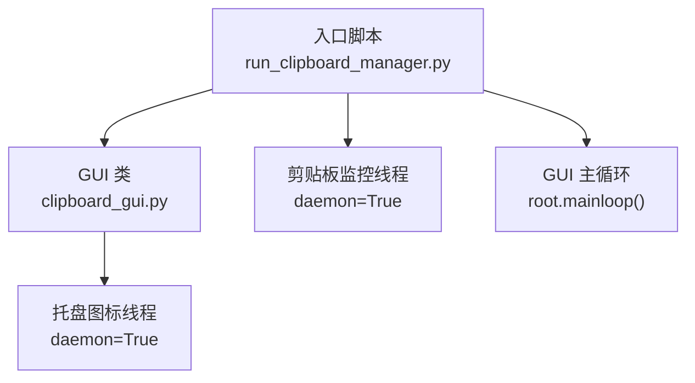
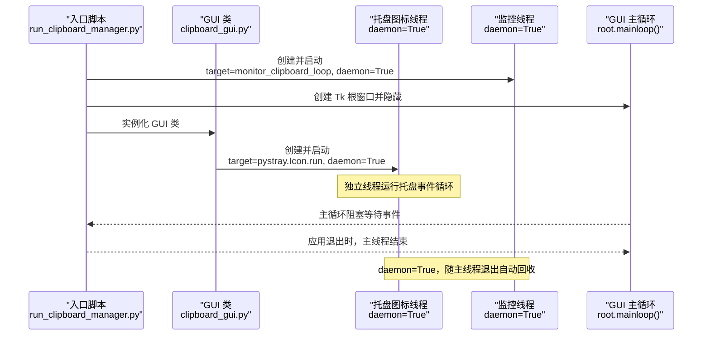
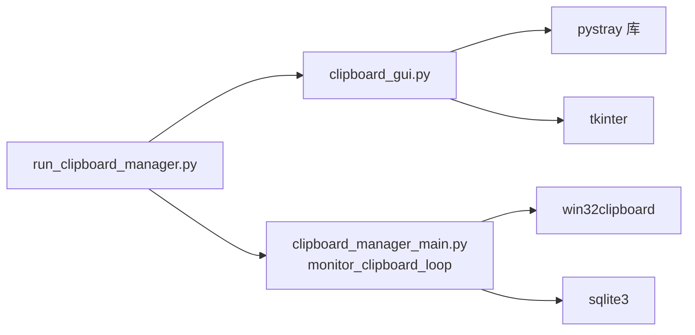

# 托盘线程管理

<cite>
**本文引用的文件**
- [clipboard_gui.py](file://clipboard_gui.py)
- [run_clipboard_manager.py](file://run_clipboard_manager.py)
- [clipboard_manager_main.py](file://clipboard_manager_main.py)
</cite>

## 目录
1. [简介](#简介)
2. [项目结构](#项目结构)
3. [核心组件](#核心组件)
4. [架构总览](#架构总览)
5. [详细组件分析](#详细组件分析)
6. [依赖关系分析](#依赖关系分析)
7. [性能考量](#性能考量)
8. [故障排查指南](#故障排查指南)
9. [结论](#结论)

## 简介
本文件围绕“在独立后台线程（daemon=True）中运行 pystray.Icon.run 方法”的多线程策略展开，系统性说明：
- 线程隔离如何保障 GUI 主线程稳定
- daemon 属性如何确保子线程随主程序退出而退出
- 线程启动流程、异常捕获机制与资源清理策略
- 与托盘图标生命周期、GUI 主循环的关系

## 项目结构
本仓库采用“入口脚本 + GUI 模块 + 独立监控模块”的组织方式：
- 入口脚本负责进程级互斥、后台监控线程与 GUI 主循环的协调
- GUI 模块负责托盘图标创建、菜单项绑定、窗口显示/隐藏等
- 独立监控模块提供剪贴板监控循环，可在独立线程中运行

图表来源
- [run_clipboard_manager.py](file://run_clipboard_manager.py#L32-L71)
- [clipboard_gui.py](file://clipboard_gui.py#L144-L171)

章节来源
- [run_clipboard_manager.py](file://run_clipboard_manager.py#L32-L71)
- [clipboard_gui.py](file://clipboard_gui.py#L144-L171)

## 核心组件
- 托盘图标与菜单：由 GUI 类创建 pystray.Icon，并在独立线程中调用其 run 方法，daemon=True
- 剪贴板监控线程：在入口脚本中创建独立线程运行监控循环，daemon=True
- GUI 主循环：通过 root.mainloop() 驱动 Tkinter 事件循环，隐藏主窗口仅显示托盘图标

章节来源
- [clipboard_gui.py](file://clipboard_gui.py#L144-L171)
- [run_clipboard_manager.py](file://run_clipboard_manager.py#L50-L66)

## 架构总览
下图展示托盘线程与 GUI 主循环之间的关系，以及 daemon 策略如何保证进程退出时线程安全回收。

图表来源
- [run_clipboard_manager.py](file://run_clipboard_manager.py#L50-L66)
- [clipboard_gui.py](file://clipboard_gui.py#L144-L171)

## 详细组件分析

### 托盘图标线程策略（daemon=True）
- 线程创建与启动
  - GUI 类在创建 pystray.Icon 后，使用 threading.Thread(target=self.tray_icon.run, daemon=True) 启动托盘线程
  - 该线程独立于 GUI 主线程，专门处理托盘菜单交互与事件循环
- 线程隔离对 GUI 主线程稳定性的影响
  - 托盘事件循环在独立线程中运行，避免阻塞 GUI 主线程的消息泵
  - GUI 主线程仍由 root.mainloop() 驱动，保持响应性
- daemon 属性的作用
  - daemon=True 表示后台守护线程，当主线程（root.mainloop）退出时，该线程会随主线程自动结束，无需显式 join 或 stop
  - 避免僵尸线程导致进程无法正常退出

章节来源
- [clipboard_gui.py](file://clipboard_gui.py#L144-L171)

### 剪贴板监控线程策略（daemon=True）
- 线程创建与启动
  - 入口脚本在创建 ClipboardManager 后，使用 threading.Thread(target=monitor_clipboard_loop, args=(manager, 1), daemon=True) 启动监控线程
- 线程隔离对 GUI 主线程稳定性的影响
  - 监控循环在独立线程中执行，避免频繁的剪贴板检测阻塞 GUI 主线程
- daemon 属性的作用
  - 随主线程退出自动回收，无需额外的停止信号或 join

章节来源
- [run_clipboard_manager.py](file://run_clipboard_manager.py#L50-L53)
- [clipboard_manager_main.py](file://clipboard_manager_main.py#L717-L730)

### GUI 主循环与托盘图标生命周期
- GUI 主循环
  - 入口脚本创建 Tk 根窗口并调用 root.mainloop() 驱动事件循环
  - 通过 root.withdraw() 隐藏主窗口，仅显示托盘图标
- 托盘图标生命周期
  - GUI 类在创建托盘图标后启动独立线程
  - 退出时调用 tray_icon.stop()，随后 root.quit() 结束主循环
  - 因 daemon=True，托盘线程随主线程退出而自动结束

章节来源
- [run_clipboard_manager.py](file://run_clipboard_manager.py#L55-L66)
- [clipboard_gui.py](file://clipboard_gui.py#L1697-L1715)

### 异常捕获机制
- 托盘图标创建与运行
  - GUI 类在创建托盘图标时使用 try-except 包裹，捕获异常并打印错误信息，避免影响主流程
- 剪贴板监控
  - 监控循环内部使用 try-except 包裹，捕获 KeyboardInterrupt 并优雅退出
- GUI 侧异常
  - GUI 类中多处使用 try-except 包裹可能抛出异常的操作，如设置开机自启、悬浮图标等，避免异常中断主流程

章节来源
- [clipboard_gui.py](file://clipboard_gui.py#L144-L171)
- [clipboard_manager_main.py](file://clipboard_manager_main.py#L717-L730)

### 资源清理策略
- 托盘图标停止
  - 退出时调用 tray_icon.stop()，通知托盘事件循环退出
- GUI 主循环退出
  - 调用 root.quit() 结束主循环
- 线程回收
  - 托盘线程与监控线程均设置 daemon=True，随主线程退出自动回收，无需 join

章节来源
- [clipboard_gui.py](file://clipboard_gui.py#L1709-L1715)
- [run_clipboard_manager.py](file://run_clipboard_manager.py#L66-L68)

## 依赖关系分析
- 入口脚本依赖 GUI 类创建托盘图标与启动监控线程
- GUI 类依赖 pystray 库创建托盘图标与菜单
- 监控线程依赖剪贴板接口与数据库操作

图表来源
- [run_clipboard_manager.py](file://run_clipboard_manager.py#L32-L71)
- [clipboard_gui.py](file://clipboard_gui.py#L144-L171)
- [clipboard_manager_main.py](file://clipboard_manager_main.py#L717-L730)

章节来源
- [run_clipboard_manager.py](file://run_clipboard_manager.py#L32-L71)
- [clipboard_gui.py](file://clipboard_gui.py#L144-L171)
- [clipboard_manager_main.py](file://clipboard_manager_main.py#L717-L730)

## 性能考量
- 独立线程避免阻塞 GUI 主线程，提升交互响应性
- daemon 线程无需 join，减少资源等待与死锁风险
- 监控线程采用 sleep 控制频率，降低 CPU 占用
- GUI 主循环仅驱动托盘图标与菜单，不承担繁重任务

## 故障排查指南
- 托盘图标不可用
  - 检查是否成功导入 pystray 与 Pillow；若导入失败，GUI 类会打印提示并跳过托盘创建
  - 确认托盘线程已启动且未抛出异常
- 程序无法退出
  - 确认主线程调用了 root.quit()，托盘线程设置为 daemon=True
  - 若自定义了 stop 流程，请确保 tray_icon.stop() 被调用
- 监控线程未工作
  - 检查入口脚本是否正确创建并启动监控线程
  - 确认 monitor_clipboard_loop 的异常处理逻辑未吞掉关键错误

章节来源
- [clipboard_gui.py](file://clipboard_gui.py#L144-L171)
- [run_clipboard_manager.py](file://run_clipboard_manager.py#L50-L66)
- [clipboard_manager_main.py](file://clipboard_manager_main.py#L717-L730)

## 结论
通过在独立后台线程中运行 pystray.Icon.run，并结合 daemon=True 的线程策略，本项目实现了：
- 线程隔离：托盘事件循环与 GUI 主线程互不阻塞
- 稳定退出：daemon 线程随主线程自动回收，避免僵尸线程
- 易于维护：异常捕获与资源清理流程清晰，便于扩展与调试