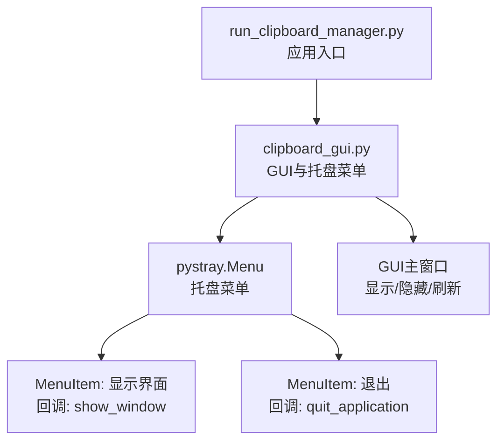
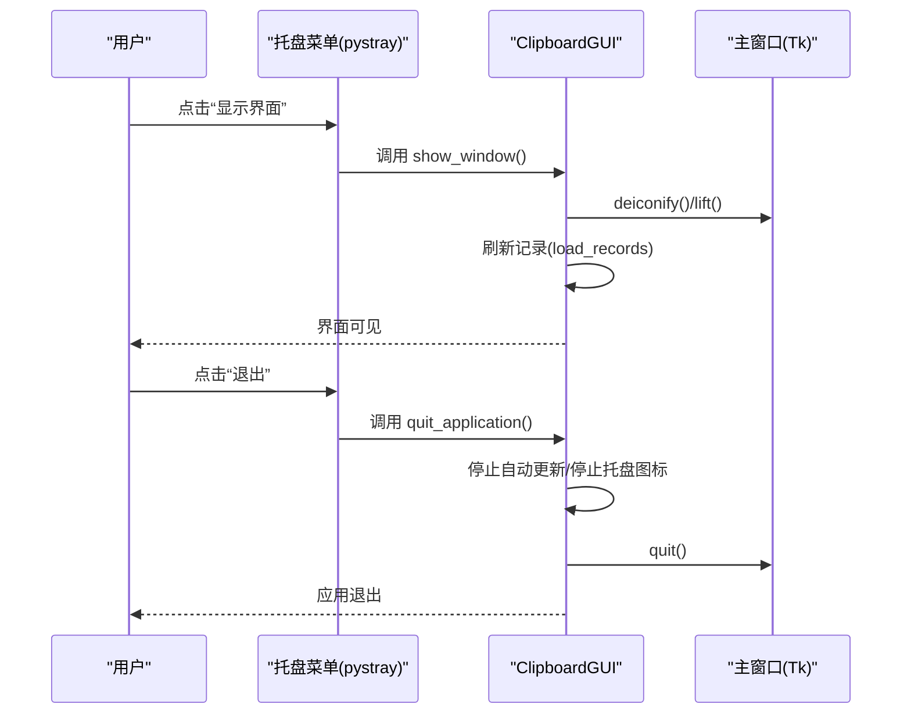
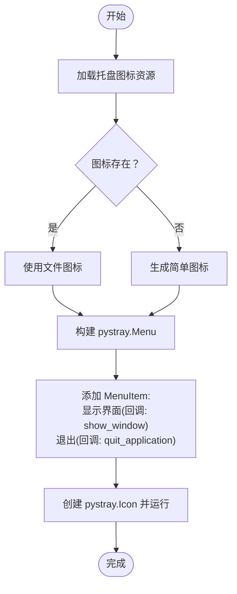
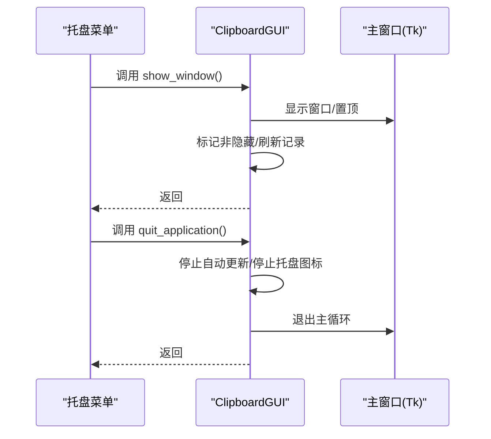
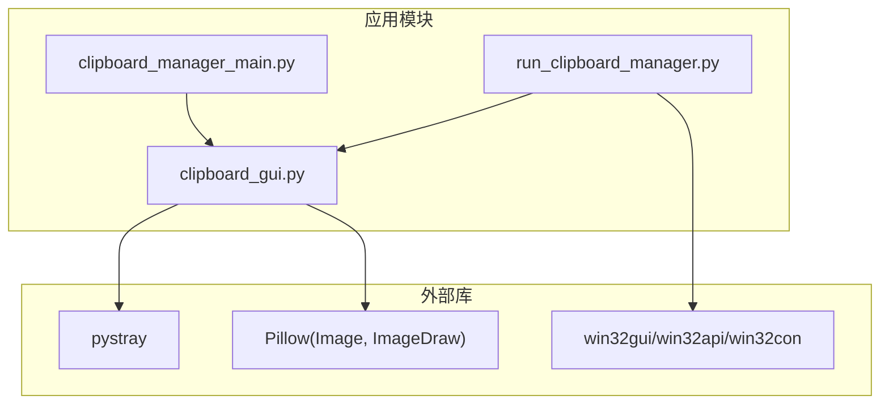

# 托盘菜单配置

<cite>
**本文引用的文件**
- [clipboard_gui.py](file://clipboard_gui.py)
- [run_clipboard_manager.py](file://run_clipboard_manager.py)
- [clipboard_manager_main.py](file://clipboard_manager_main.py)
</cite>

## 目录
1. [简介](#简介)
2. [项目结构](#项目结构)
3. [核心组件](#核心组件)
4. [架构总览](#架构总览)
5. [详细组件分析](#详细组件分析)
6. [依赖分析](#依赖分析)
7. [性能考虑](#性能考虑)
8. [故障排查指南](#故障排查指南)
9. [结论](#结论)

## 简介
本文件聚焦于系统托盘菜单的构建与交互，围绕 pystray.Menu 的创建流程展开，详细说明：
- MenuItem 的创建与回调函数绑定（显示主窗口与退出应用）
- default=True 参数的作用与平台差异
- 菜单项文本的本地化与功能映射
- 事件触发机制与 GUI 主窗口的交互关系
- 菜单结构设计原则与可维护性建议

## 项目结构
与托盘菜单直接相关的文件与职责如下：
- clipboard_gui.py：负责 GUI 界面、托盘图标创建、菜单项与回调绑定、窗口显示/隐藏等
- run_clipboard_manager.py：应用入口，控制 GUI 启动与托盘运行模式
- clipboard_manager_main.py：提供数据库与剪贴板监控能力（与托盘菜单无直接耦合）

图表来源
- [run_clipboard_manager.py](file://run_clipboard_manager.py#L32-L66)
- [clipboard_gui.py](file://clipboard_gui.py#L144-L171)
- [clipboard_gui.py](file://clipboard_gui.py#L1701-L1715)

章节来源
- [run_clipboard_manager.py](file://run_clipboard_manager.py#L32-L66)
- [clipboard_gui.py](file://clipboard_gui.py#L144-L171)

## 核心组件
- 托盘菜单构建者：ClipboardGUI.create_tray_icon
- 菜单项与回调：
  - “显示界面” -> 回调：ClipboardGUI.show_window
  - “退出” -> 回调：ClipboardGUI.quit_application
- default=True 的作用：在支持的平台上作为“默认动作”呈现（例如右键菜单中优先显示或高亮）

章节来源
- [clipboard_gui.py](file://clipboard_gui.py#L144-L171)
- [clipboard_gui.py](file://clipboard_gui.py#L1701-L1715)

## 架构总览
托盘菜单与 GUI 的交互关系：
- 应用启动后，若支持系统托盘，将在独立线程中运行 pystray.Icon
- 用户通过托盘菜单触发回调，回调函数控制 GUI 主窗口的显示/隐藏与退出
- 菜单项文本来自本地化字符串（中文），功能映射到具体方法

图表来源
- [clipboard_gui.py](file://clipboard_gui.py#L144-L171)
- [clipboard_gui.py](file://clipboard_gui.py#L1701-L1715)

## 详细组件分析

### 托盘菜单构建流程
- 图标准备：优先使用资源文件 2.ico，不存在时生成简单图标
- 菜单创建：使用 pystray.Menu 构建，包含两个 MenuItem
- 菜单实例：pystray.Icon 包裹菜单并在线程中运行

图表来源
- [clipboard_gui.py](file://clipboard_gui.py#L144-L171)

章节来源
- [clipboard_gui.py](file://clipboard_gui.py#L144-L171)

### MenuItem 的创建与回调绑定
- “显示界面”菜单项绑定到 ClipboardGUI.show_window
- “退出”菜单项绑定到 ClipboardGUI.quit_application
- 回调函数在托盘线程上下文中被调用，但内部通过 Tkinter 控制主窗口状态

章节来源
- [clipboard_gui.py](file://clipboard_gui.py#L144-L171)
- [clipboard_gui.py](file://clipboard_gui.py#L1701-L1715)

### default=True 参数的作用
- 在 pystray 中，default=True 的 MenuItem 通常作为“默认动作”呈现
- 具体表现因平台而异：某些系统可能将其显示为默认项或高亮
- 本项目中，“显示界面”使用 default=True，便于用户快速执行常用操作

章节来源
- [clipboard_gui.py](file://clipboard_gui.py#L159-L162)

### 菜单项文本本地化与功能映射
- 文本采用中文本地化（“显示界面”、“退出”）
- 功能映射：
  - “显示界面” -> 切换主窗口显示状态，并刷新记录
  - “退出” -> 停止自动更新、停止托盘图标、退出主循环

章节来源
- [clipboard_gui.py](file://clipboard_gui.py#L144-L171)
- [clipboard_gui.py](file://clipboard_gui.py#L1701-L1715)

### 事件触发机制与 GUI 主窗口交互
- 触发源：托盘菜单项点击
- 触发路径：pystray 调用绑定的回调函数 -> ClipboardGUI 方法 -> Tk 主窗口状态变更
- 关键点：
  - show_window：显示窗口、置顶、标记非隐藏、刷新记录
  - quit_application：停止自动更新、停止托盘图标、退出主循环

图表来源
- [clipboard_gui.py](file://clipboard_gui.py#L1701-L1715)

### 菜单结构设计原则
- 简洁明确：仅包含“显示界面”和“退出”，降低认知负担
- 语义清晰：文本与功能一一对应
- 平台兼容：default=True 适配不同系统的默认动作展示
- 线程隔离：托盘运行在独立线程，避免阻塞 GUI 主循环

章节来源
- [clipboard_gui.py](file://clipboard_gui.py#L144-L171)

## 依赖分析
- 外部库依赖：pystray、Pillow（Image/ImageDraw）
- 运行环境：Windows（通过 win32gui/win32api/win32con 实现互斥与前台窗口激活）
- 与 GUI 的耦合：托盘菜单回调直接操作 Tk 主窗口状态

图表来源
- [run_clipboard_manager.py](file://run_clipboard_manager.py#L1-L71)
- [clipboard_gui.py](file://clipboard_gui.py#L1-L36)
- [clipboard_manager_main.py](file://clipboard_manager_main.py#L1-L30)

章节来源
- [run_clipboard_manager.py](file://run_clipboard_manager.py#L1-L71)
- [clipboard_gui.py](file://clipboard_gui.py#L1-L36)
- [clipboard_manager_main.py](file://clipboard_manager_main.py#L1-L30)

## 性能考虑
- 托盘线程与 GUI 主线程分离，避免阻塞
- 自动更新在窗口隐藏或有用户操作时暂停，减少资源消耗
- 菜单项数量少、逻辑简单，开销极低

章节来源
- [clipboard_gui.py](file://clipboard_gui.py#L1677-L1696)
- [clipboard_gui.py](file://clipboard_gui.py#L1701-L1715)

## 故障排查指南
- 托盘不可用
  - 现象：提示缺少 pystray/Pillow
  - 排查：确认安装命令是否执行
  - 参考：导入异常分支与提示信息
- 菜单不响应
  - 现象：点击菜单无反应
  - 排查：确认回调函数未被覆盖；确认托盘线程正常运行
- 窗口无法显示
  - 现象：点击“显示界面”无效
  - 排查：检查 show_window 是否被其他逻辑覆盖；确认主窗口未被其他线程阻塞

章节来源
- [clipboard_gui.py](file://clipboard_gui.py#L17-L26)
- [clipboard_gui.py](file://clipboard_gui.py#L144-L171)
- [clipboard_gui.py](file://clipboard_gui.py#L1701-L1715)

## 结论
- 本项目通过简洁的托盘菜单实现了对 GUI 的快速访问与退出控制
- default=True 的使用提升了用户体验的一致性
- 回调函数与 GUI 主窗口的交互清晰、解耦良好
- 建议后续可引入更完善的本地化方案（如翻译文件），并保持菜单项数量与职责边界清晰