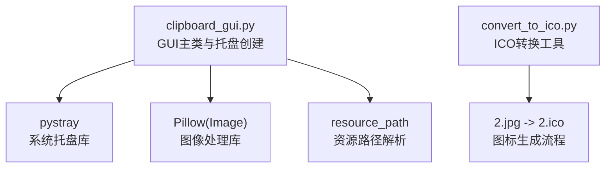
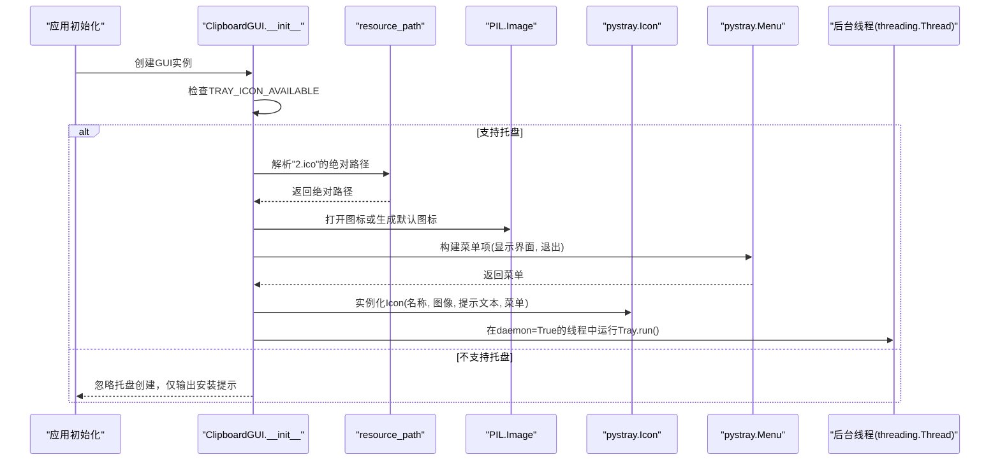
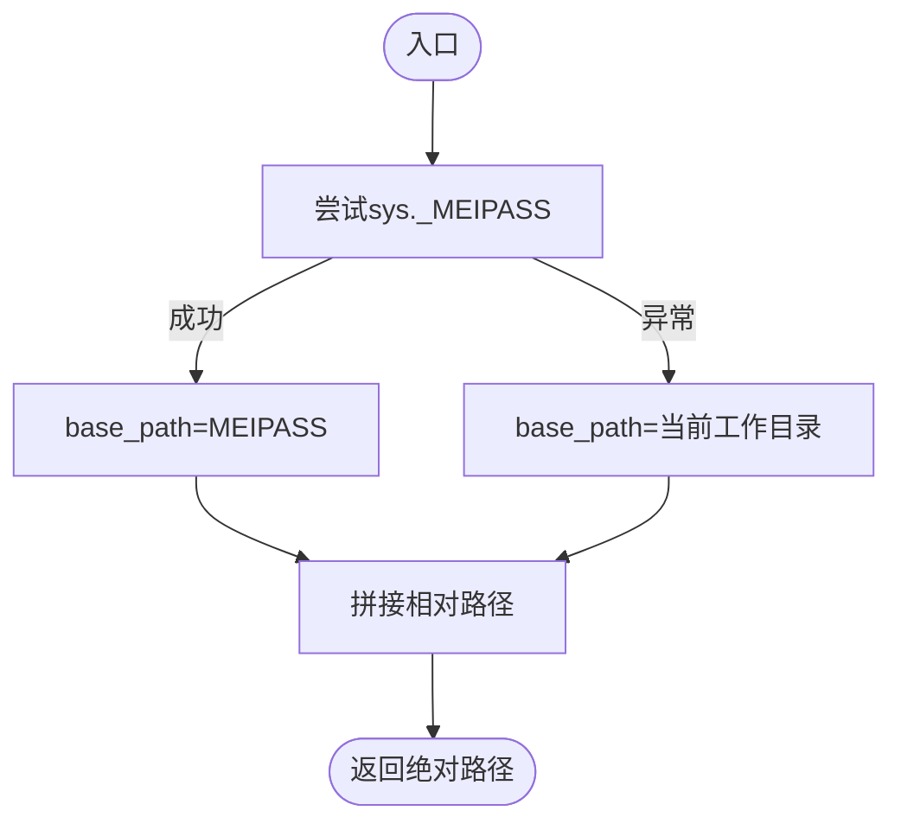
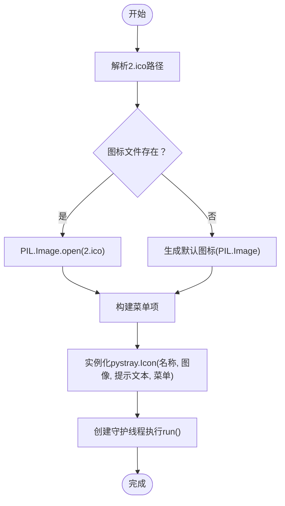
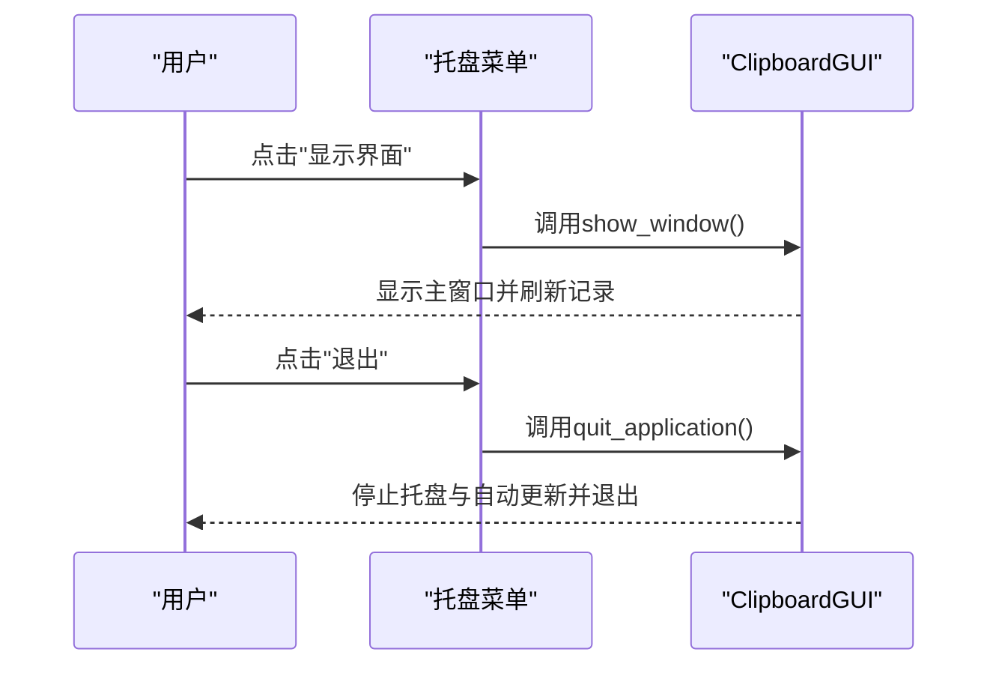
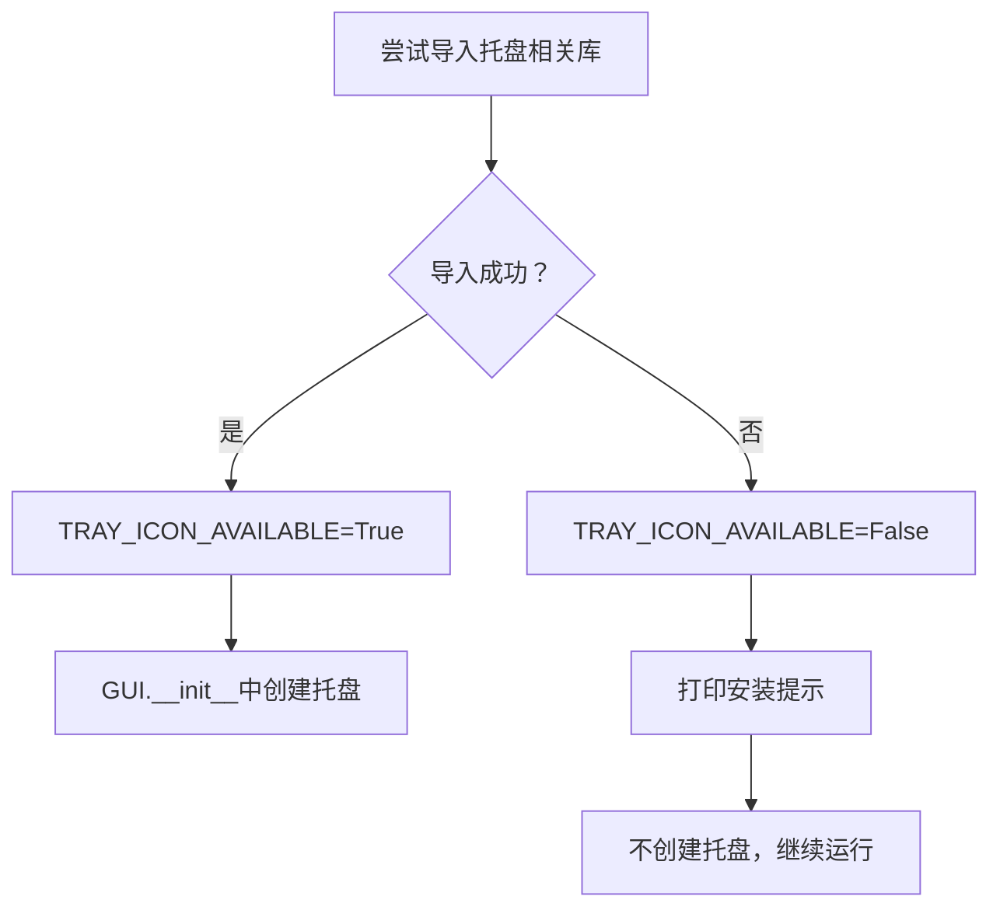
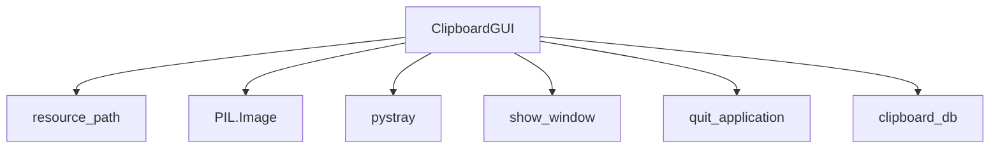

# 系统托盘集成

<cite>
**本文引用的文件**
- [clipboard_gui.py](file://clipboard_gui.py)
- [convert_to_ico.py](file://convert_to_ico.py)
</cite>

## 目录
1. [简介](#简介)
2. [项目结构](#项目结构)
3. [核心组件](#核心组件)
4. [架构总览](#架构总览)
5. [详细组件分析](#详细组件分析)
6. [依赖分析](#依赖分析)
7. [性能考虑](#性能考虑)
8. [故障排查指南](#故障排查指南)
9. [结论](#结论)

## 简介
本文档围绕系统托盘集成展开，重点说明 create_tray_icon 方法的实现细节，包括：
- 资源路径 resource_path 如何在打包与开发环境下定位 2.ico 图标文件
- pystray.Icon 的创建参数：名称、PIL.Image 对象、提示文本与菜单项配置
- pystray.MenuItem 的回调函数绑定 show_window 与 quit_application，以及默认菜单项设置
- 在独立后台线程（daemon=True）中运行托盘图标的多线程管理策略
- TRAY_ICON_AVAILABLE 标志在依赖缺失时的优雅降级处理，以及安装提示信息输出机制

## 项目结构
本仓库与系统托盘相关的核心文件如下：
- clipboard_gui.py：包含 GUI 主类、系统托盘创建逻辑、资源路径解析、菜单项回调等
- convert_to_ico.py：提供将 JPG 转换为 ICO 的工具函数，便于生成 2.ico

图表来源
- [clipboard_gui.py](file://clipboard_gui.py#L1-L80)
- [convert_to_ico.py](file://convert_to_ico.py#L1-L48)

章节来源
- [clipboard_gui.py](file://clipboard_gui.py#L1-L80)
- [convert_to_ico.py](file://convert_to_ico.py#L1-L48)

## 核心组件
- 资源路径解析：resource_path 函数在开发环境返回相对路径，在 PyInstaller 打包后通过 sys._MEIPASS 获取临时目录，最终拼接相对路径得到绝对路径
- 托盘图标创建：create_tray_icon 方法负责加载 2.ico 或回退生成简单图标，构建菜单项，实例化 pystray.Icon，并在守护线程中启动
- 回调函数：MenuItem 绑定 show_window 与 quit_application，分别用于显示主窗口与退出应用
- 依赖检测与降级：TRAY_ICON_AVAILABLE 标志控制托盘功能启用与否；缺失依赖时打印安装提示

章节来源
- [clipboard_gui.py](file://clipboard_gui.py#L17-L26)
- [clipboard_gui.py](file://clipboard_gui.py#L144-L171)
- [clipboard_gui.py](file://clipboard_gui.py#L1701-L1713)

## 架构总览
系统托盘集成的整体流程如下：

图表来源
- [clipboard_gui.py](file://clipboard_gui.py#L17-L26)
- [clipboard_gui.py](file://clipboard_gui.py#L144-L171)

## 详细组件分析

### 资源路径处理：resource_path
- 设计目标：在开发环境与 PyInstaller 打包后均能正确解析资源文件路径
- 实现要点：
  - 优先尝试 sys._MEIPASS 获取打包后的临时目录
  - 若不可用则使用 os.path.abspath(".") 获取当前工作目录
  - 将相对路径与基础路径拼接，返回绝对路径
- 使用场景：create_tray_icon 中通过 resource_path("2.ico") 获取图标文件路径

图表来源
- [clipboard_gui.py](file://clipboard_gui.py#L27-L36)

章节来源
- [clipboard_gui.py](file://clipboard_gui.py#L27-L36)

### 托盘图标创建：create_tray_icon
- 图标加载策略：
  - 先尝试加载 2.ico；若存在则使用 PIL.Image 打开
  - 若不存在则生成一个 RGB 图像并绘制简单图形作为回退图标
- 菜单项配置：
  - 显示界面：绑定到 show_window，标记为默认项
  - 退出：绑定到 quit_application
- Icon 实例化参数：
  - 名称："clipboard_manager"
  - 图像：PIL.Image 对象
  - 提示文本："剪贴板管理器"
  - 菜单：pystray.Menu 包含上述两项
- 运行策略：
  - 在独立线程中执行 tray_icon.run()
  - 线程设置为守护线程（daemon=True），随主线程退出而结束

图表来源
- [clipboard_gui.py](file://clipboard_gui.py#L144-L171)

章节来源
- [clipboard_gui.py](file://clipboard_gui.py#L144-L171)

### 回调函数绑定与默认菜单项
- 显示界面回调：pystray.MenuItem("显示界面", self.show_window, default=True)
  - 触发后调用 ClipboardGUI.show_window，恢复主窗口显示并刷新记录
- 退出回调：pystray.MenuItem("退出", self.quit_application)
  - 触发后调用 ClipboardGUI.quit_application，停止自动更新、停止托盘图标、退出主循环
- 默认菜单项：default=True 表示该菜单项在某些平台上作为默认动作

图表来源
- [clipboard_gui.py](file://clipboard_gui.py#L159-L162)
- [clipboard_gui.py](file://clipboard_gui.py#L1701-L1713)

章节来源
- [clipboard_gui.py](file://clipboard_gui.py#L159-L162)
- [clipboard_gui.py](file://clipboard_gui.py#L1701-L1713)

### 多线程管理策略：daemon=True
- 线程创建：threading.Thread(target=self.tray_icon.run, daemon=True)
- 设计意图：
  - 将托盘运行逻辑放入后台线程，避免阻塞 GUI 主线程
  - daemon=True 保证应用退出时线程随主线程自然终止，无需额外 join
- 注意事项：
  - 守护线程在应用退出时可能不会执行清理逻辑，因此在 quit_application 中显式调用 tray_icon.stop() 以确保托盘优雅停止

章节来源
- [clipboard_gui.py](file://clipboard_gui.py#L166-L168)
- [clipboard_gui.py](file://clipboard_gui.py#L1708-L1713)

### 依赖缺失的优雅降级与安装提示
- 依赖检测：尝试导入 PIL.Image、ImageTk、ImageDraw 与 pystray
- 成功分支：TRAY_ICON_AVAILABLE = True，随后在 __init__ 中调用 create_tray_icon
- 失败分支：TRAY_ICON_AVAILABLE = False，并输出安装提示信息（建议安装 pystray 与 Pillow）
- 影响范围：当 TRAY_ICON_AVAILABLE 为 False 时，跳过托盘创建，不影响其他功能

图表来源
- [clipboard_gui.py](file://clipboard_gui.py#L17-L26)
- [clipboard_gui.py](file://clipboard_gui.py#L76-L79)

章节来源
- [clipboard_gui.py](file://clipboard_gui.py#L17-L26)
- [clipboard_gui.py](file://clipboard_gui.py#L76-L79)

### 图标生成与转换辅助
- convert_to_ico.py 提供将 JPG 转换为 ICO 的工具函数，可将 2.jpg 转换为 2.ico，同时支持生成不同尺寸的 ICO
- 在 create_tray_icon 中若 2.ico 存在则直接使用，否则回退生成默认图标

章节来源
- [convert_to_ico.py](file://convert_to_ico.py#L1-L48)
- [clipboard_gui.py](file://clipboard_gui.py#L144-L171)

## 依赖分析
- 外部库依赖：
  - pystray：系统托盘图标与菜单
  - Pillow：图像加载与生成
- 内部模块依赖：
  - clipboard_gui.py 依赖 clipboard_db（数据库访问）
  - GUI 类内部通过 resource_path 解析资源路径
- 关键耦合点：
  - create_tray_icon 依赖 PIL.Image 与 pystray
  - 回调函数 show_window/quit_application 依赖 GUI 状态与托盘实例

图表来源
- [clipboard_gui.py](file://clipboard_gui.py#L1-L80)
- [clipboard_gui.py](file://clipboard_gui.py#L144-L171)

章节来源
- [clipboard_gui.py](file://clipboard_gui.py#L1-L80)
- [clipboard_gui.py](file://clipboard_gui.py#L144-L171)

## 性能考虑
- 图标加载：尽量使用已存在的 2.ico，避免在运行时频繁生成默认图标
- 线程模型：守护线程避免阻塞主线程，但需注意退出时的清理顺序
- 资源路径：PyInstaller 下通过 sys._MEIPASS 获取路径，减少磁盘 IO 与路径拼接错误

## 故障排查指南
- 托盘未出现
  - 检查是否安装 pystray 与 Pillow；如未安装会输出安装提示
  - 确认 2.ico 是否存在于打包后的资源目录
- 回调无效
  - 确认 show_window 与 quit_application 方法未被覆盖或屏蔽
  - 检查托盘线程是否正常运行（daemon=True）
- 退出异常
  - 确保在 quit_application 中调用了 tray_icon.stop()

章节来源
- [clipboard_gui.py](file://clipboard_gui.py#L17-L26)
- [clipboard_gui.py](file://clipboard_gui.py#L144-L171)
- [clipboard_gui.py](file://clipboard_gui.py#L1708-L1713)

## 结论
本实现通过 resource_path 在开发与打包环境下统一解析图标路径，利用 PIL.Image 与 pystray 构建托盘图标与菜单，并在守护线程中运行，确保 GUI 主线程不受影响。通过 TRAY_ICON_AVAILABLE 标志实现依赖缺失时的优雅降级，并提供清晰的安装提示。MenuItem 的回调函数将托盘交互与 GUI 状态管理解耦，形成简洁可靠的系统托盘集成方案。